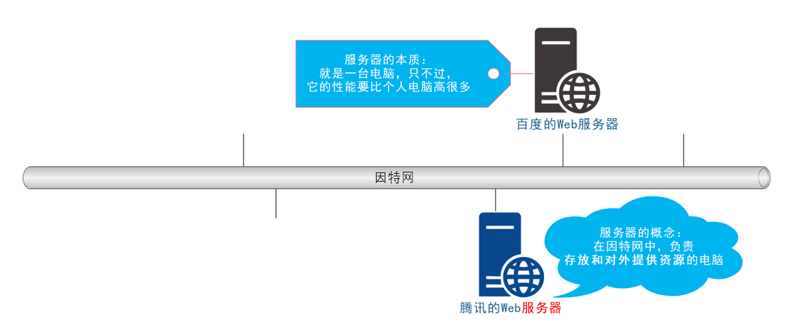
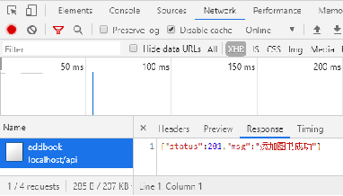
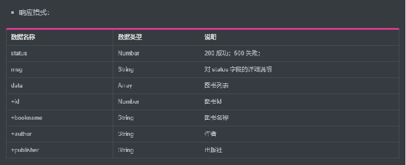

# 服务器的基本概念与初识Ajax

## 目标

- [ ] 能够知道和服务器相关的基本概念
- [ ] 能够知道客户端和服务器通信的过程
- [ ] 能够知道数据也是一种资源
- [ ] 能够说出什么是Ajax以及应用场景
- [ ] 能够使用jQuery中的Ajax函数请求数据
- [ ] 能够知道接口和接口文档的概念

## 一、客户端与服务器

### 1.1 服务器

上网过程中，负责存放和对外提供资源的电脑，叫做服务器。



### 1.2 客户端

上网过程中，负责获取和消费资源的电脑，叫做客户端。


## 二、URL地址

### 2.1 URL地址的概念

URL（全称是UniformResourceLocator）中文叫**统一资源定位符**，用于标识互联网上每个资源的唯一存放位置。浏览器只有通过URL地址，才能正确定位资源的存放位置，从而成功访问到对应的资源。

常见的URL举例：

- http://www.baidu.com
- http://www.taobao.com
- https://www.cnblogs.com/MissingGZ/p/17109977.html

### 2.2 URL地址的组成部分

URL地址一般由三部组成：

1. 客户端与服务器之间的通信协议
2. 存有该资源的服务器名称
3. 资源在服务器上具体的存放位置


## 三、客户端与服务器的通信过程

### 3.1 图解客户端与服务器的通信过程


注意：

- 客户端与服务器之间的通信过程，分为 请求 – 处理 – 响应 三个步骤。
- 网页中的每一个资源，都是通过 请求 – 处理 – 响应 的方式从服务器获取回来的。

### 3.2 基于浏览器的开发者工具分析通信过程

1. 打开 Chrome 浏览器
2. Ctrl+Shift+I 打开 Chrome 的开发者工具
3. 切换到 Network 面板
4. 选中 Doc 页签
5. 刷新页面，分析客户端与服务器的通信过程


## 四、服务器对外提供了哪些资源

### 4.1 例举网页中常见的资源


### 4.2 数据也是资源

网页中的数据，也是服务器对外提供的一种资源。例如股票数据、各行业排行榜等。


### 4.3 数据是网页的灵魂


 

HTML是网页的骨架，CSS是网页的颜值，Javascript是网页的行为。数据，则是网页的灵魂
骨架、颜值、行为皆为数据服务。数据，在网页中无处不在

### 4.4 网页中如何请求数据

数据，也是服务器对外提供的一种资源。只要是资源，必然要通过 请求 – 处理 – 响应 的方式进行获取。


如果要在网页中请求服务器上的数据资源，则需要用到 `XMLHttpRequest` 对象。
`XMLHttpRequest`（简称 xhr）是浏览器提供的 js 成员，通过它，可以请求服务器上的数据资源。
最简单的用法 `var xhrObj = new XMLHttpRequest()`

### 4.5 资源的请求方式

客户端请求服务器时，请求的方式有很多种，最常见的两种请求方式分别为 get 和 post 请求。

**get 请求通常用于获取服务端资源（向服务器要资源）**

例如：根据 URL 地址，从服务器获取 HTML 文件、css 文件、js文件、图片文件、数据资源等

**post 请求通常用于向服务器提交数据（往服务器发送资源）**

例如：登录时向服务器提交的登录信息、注册时向服务器提交的注册信息、添加用户时向服务器提交的用户信息等各种数据提交操作

## 五、Ajax

### 5.1 什么是Ajax

Ajax 的全称是 Asynchronous Javascript And XML（异步 JavaScript 和 XML）。

通俗的理解：在网页中利用 XMLHttpRequest 对象和服务器进行数据交互的方式，就是Ajax。

### 5.2 为什么要学Ajax

之前所学的技术，只能把网页做的更美观漂亮，或添加一些动画效果，但是，Ajax能让我们轻松实现网页与服务器之间的数据交互。


### 5.3 Ajax的典型应用场景

用户名检测：注册用户时，通过 ajax 的形式，动态检测用户名是否被占用


搜索提示：当输入搜索关键字时，通过 ajax 的形式，动态加载搜索提示列表


数据分页显示：当点击页码值的时候，通过 ajax 的形式，根据页码值动态刷新表格的数据


数据的增删改查：数据的添加、删除、修改、查询操作，都需要通过 ajax 的形式，来实现数据的交互


## 六、jQuery中的Ajax

### 6.1 了解jQuery中的Ajax

浏览器中提供的 XMLHttpRequest 用法比较复杂，所以 jQuery 对 XMLHttpRequest 进行了封装，提供了一系列 Ajax 相关的函数，极大地降低了 Ajax 的使用难度。

jQuery 中发起 Ajax 请求最常用的三个方法如下：

- $.get()
- $.post()
- $.ajax()

### 6.2 $.get()函数的语法

jQuery 中 $.get() 函数的功能单一，专门用来发起 get 请求，从而将服务器上的资源请求到客户端来进行使用。

$.get() 函数的语法如下：

```js
$.get(url, [data], [callback])
```

- url 要请求的资源地址
- data 请求资源期间要携带的参数
- callback 请求成功时的回调函数

**$.get()发起不带参数的请求**

使用 $.get() 函数发起不带参数的请求时，直接提供请求的 URL 地址和请求成功之后的回调函数即可，示例代码如下：

```js
$.get('http://localhost:3000/api/getbooks', function(res) {
    console.log(res) // 这里的 res 是服务器返回的数据
})
```


**$.get()发起带参数的请求**

使用 $.get() 函数发起带参数的请求时，示例代码如下：

```js
$.get('http://localhost:3000/api/getbooks', { id: 1 }, function(res) {
    console.log(res)
})
```


### 6.3 $.post()函数的语法

jQuery 中 $.post() 函数的功能单一，专门用来发起 post 请求，从而向服务器提交数据。

$.post() 函数的语法如下：

```js
$.post(url, [data], [callback])
```

- url 提交数据的地址
- data 要提交的数据
- callback 数据提交成功时的回调函数

**$.post()向服务器提交数据**

使用 $post() 向服务器提交数据的示例代码如下：

```js
$.post(
   'http://localhost:3000/api/addbook', // 请求的URL地址
   { bookname: '水浒传', author: '施耐庵', publisher: '上海图书出版社' }, // 提交的数据
   function(res) { // 回调函数
      console.log(res)
   }
)
```



### 6.4 $.ajax()函数的语法

相比于 $.get() 和 $.post() 函数，jQuery 中提供的 $.ajax() 函数，是一个功能比较综合的函数，它允许我们对 Ajax 请求进行更详细的配置。
$.ajax() 函数的基本语法如下：

```js
$.ajax({
   type: '', // 请求的方式，例如 GET 或 POST
   url: '',  // 请求的 URL 地址
   data: { },// 这次请求要携带的数据
   success: function(res) { } // 请求成功之后的回调函数
})
```

**使用$.ajax()发起GET请求**

使用 $.ajax() 发起 GET 请求时，只需要将 type 属性的值设置为 'GET' 即可：

```js
$.ajax({
   type: 'GET', // 请求的方式
   url: 'http://localhost:3000/api/getbooks',  // 请求的 URL 地址
   data: { id: 1 },// 这次请求要携带的数据
   success: function(res) { // 请求成功之后的回调函数
       console.log(res)
   }
})
```

**使用$.ajax()发起POST请求**

使用 $.ajax() 发起 POST 请求时，只需要将 type 属性的值设置为 'POST' 即可：

```js
$.ajax({
   type: 'POST', // 请求的方式
   url: 'http://localhost:3000/api/addbook',  // 请求的 URL 地址
   data: { // 要提交给服务器的数据
      bookname: '水浒传',
      author: '施耐庵',
      publisher: '上海图书出版社'
    },
   success: function(res) { // 请求成功之后的回调函数
       console.log(res)
   }
})
```

## 七、接口

### 7.1 接口的概念

使用 Ajax 请求数据时，被请求的 URL 地址，就叫做数据接口（简称接口）。同时，每个接口必须有请求方式。

例如：

- http://localhost:3000/api/getbooks  获取图书列表的接口(GET请求)
- http://localhost:3000/api/addbook   添加图书的接口（POST请求）

### 7.2 分析接口的请求过程

1. 通过GET方式请求接口的过程


2. 通过POST方式请求接口的过程


### 7.3 接口文档

**什么是接口文档**

接口文档，顾名思义就是接口的说明文档，它是我们调用接口的依据。好的接口文档包含了对接口URL，参数以及输出内容的说明，我们参照接口文档就能方便的知道接口的作用，以及接口如何进行调用。

**接口文档的组成部分**

接口文档可以包含很多信息，也可以按需进行精简，不过，一个合格的接口文档，应该包含以下6项内容，从而为接口的调用提供依据：

- 接口名称：用来标识各个接口的简单说明，如登录接口，获取图书列表接口等。
- 接口URL：接口的调用地址。
- 调用方式：接口的调用方式，如 GET 或 POST。
- 参数格式：接口需要传递的参数，每个参数必须包含参数名称、参数类型、是否必选、参数说明这4项内容。
- 响应格式：接口的返回值的详细描述，一般包含数据名称、数据类型、说明3项内容。
- 返回示例（可选）：通过对象的形式，例举服务器返回数据的结构。

**接口文档示例**





## 案例 - 图书管理


**渲染图书列表（核心代码）**

```js
function getBookList() {
    // 1. 发起 ajax 请求获取图书列表数据
    $.get('http://localhost:3000/api/getbooks', function(res) {
        // 2. 获取列表数据是否成功
        if (res.status !== 200) return alert('获取图书列表失败！')
        // 3. 渲染页面结构
        var rows = []
        $.each(res.data, function(i, item) { // 4. 循环拼接字符串
            rows.push('<tr><td>' + item.id + '</td><td>' + item.bookname + '</td><td>' + item.author + '</td><td>' + item.publisher + '</td><td><a href="javascript:;">删除</a></td></tr>')
        })
        $('#bookBody').empty().append(rows.join('')) // 5. 渲染表格结构
    })
}
```

**删除图书（核心代码）**

```js
// 1. 为按钮绑定点击事件处理函数
$('tbody').on('click', '.del', function() {
    // 2. 获取要删除的图书的 Id
    var id = $(this).attr('data-id')
    $.ajax({ // 3. 发起 ajax 请求，根据 id 删除对应的图书
        type: 'GET',
        url: 'http://localhost:3000/api/delbook',
        data: { id: id },
        success: function(res) {
            if (res.status !== 200) return alert('删除图书失败！') 
            getBookList() // 4. 删除成功后，重新加载图书列表
        }
    })
})
```

**添加图书（核心代码）**

```js
// 1. 检测内容是否为空
var bookname = $('#bookname').val()
var author = $('#author').val()
var publisher = $('#publisher').val()
if (bookname === '' || author === '' || publisher === '') {
    return alert('请完整填写图书信息！')
}
// 2. 发起 ajax 请求，添加图书信息
$.post(
    'http://localhost:3000/api/addbook',
    { bookname: bookname, author: author, publisher: publisher },
    function(res) {
        // 3. 判断是否添加成功
        if (res.status !== 201) return alert('添加图书失败！')
        getBookList() // 4. 添加成功后，刷新图书列表
        $('input:text').val('') // 5. 清空文本框内容
    }
)
```

