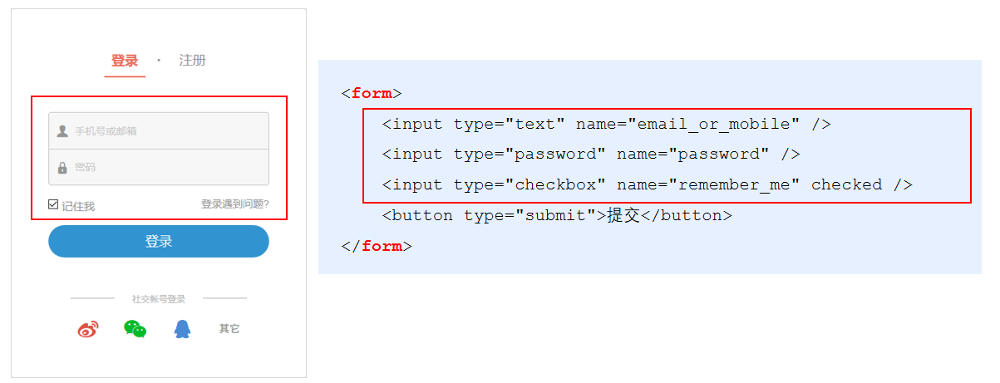
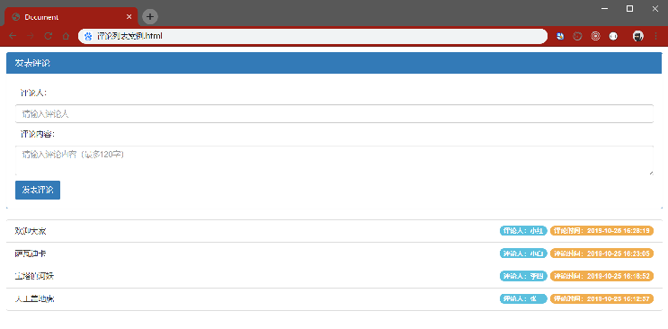
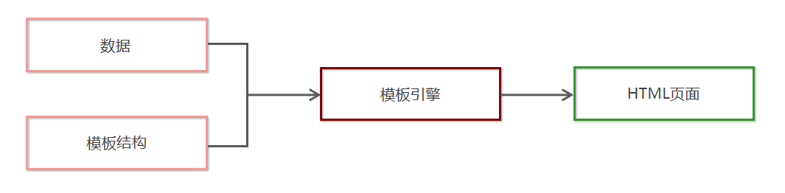
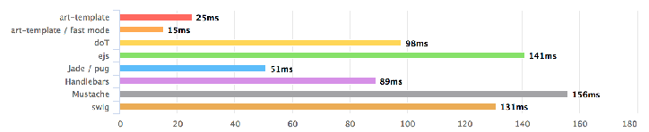
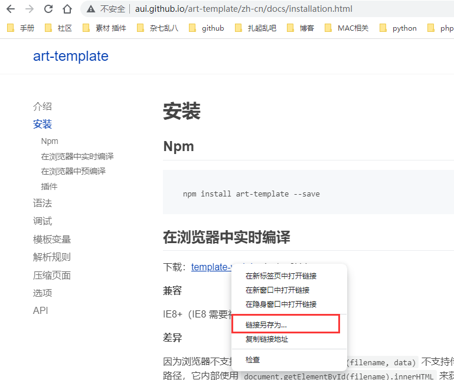
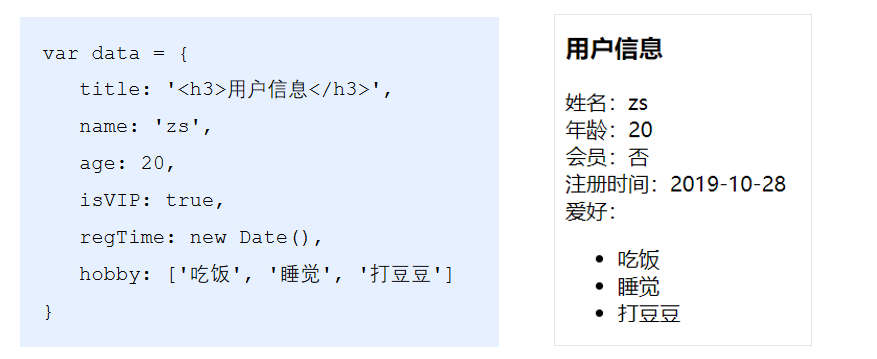
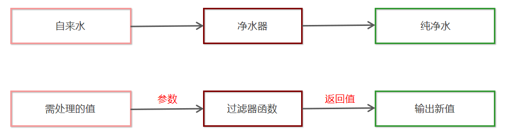

# form 表单与模板引擎

## 目标

- [ ] 能够说出form表单的常用属性
- [ ] 能够知道如何阻止表单的默认提交行为
- [ ] 能够知道如何使用jQuery快速获取表单数据
- [ ] 能够知道如何安装和使用模板引擎
- [ ] 能够知道模板引擎的实现原理

## 一、form表单的基本使用

### 1.1 什么是表单

表单在网页中主要负责数据采集功能。HTML中的`<form>`标签，就是用于采集用户输入的信息，并通过`<form>`标签的提交操作，把采集到的信息提交到服务器端进行处理。



### 1.2 表单的组成部分

表单由三个基本部分组成：

- 表单标签
- 表单域 ： 包含了文本框、密码框、隐藏域、多行文本框、复选框、单选框、下拉选择框和文件上传框等
- 表单按钮

### 1.3 `<form>`标签的属性

`<form>`标签用来采集数据，`<form>`标签的属性则是用来规定**如何把采集到的数据发送到服务器**。

| 属性    | 值                                                           | 描述                                      |
| ------- | ------------------------------------------------------------ | ----------------------------------------- |
| action  | URL地址   | 规定当提交表单时，向何处发送表单数据      |
| method  | get或post  | 规定以何种方式把表单数据提交到 action URL |
| enctype | `application/x-www-form-urlencoded` `multipart/form-data` `text/plain` | 规定在发送表单数据之前如何对其进行编码    |
| target  | `_blank` `_self` `_parent` `_top` `framename`       | 规定在何处打开 action URL                 |

**1. action**

action 属性用来规定当提交表单时，向何处发送表单数据。
action 属性的值应该是后端提供的一个 URL 地址，这个 URL 地址专门负责接收表单提交过来的数据。
当 `<form>` 表单在未指定 action 属性值的情况下，action 的默认值为当前页面的 URL 地址。

> 注意：当提交表单后，页面会立即跳转到 action 属性指定的 URL 地址

**2. target**

target 属性用来规定在何处打开 action URL。
它的可选值有5个，默认情况下，target 的值是 _self，表示在相同的框架中打开 action URL。

- _blank   在新窗口中打开。
- _self    默认。在相同的框架中打开。
- _parent  在父框架集中打开。（很少用）
- _top   在整个窗口中打开。（很少用）
- framename  定的框架中打开。（很少用）

**3. method**

method 属性用来规定以何种方式把表单数据提交到 action URL。
它的可选值有两个，分别是 get 和 post。
默认情况下，method 的值为 get，表示通过URL地址的形式，把表单数据提交到 action URL。

> 注意：
> get 方式适合用来提交少量的、简单的数据。
> post 方式适合用来提交大量的、复杂的、或包含文件上传的数据。

**4. enctype**

enctype 属性用来规定在发送表单数据之前如何对数据进行编码。
它的可选值有三个，默认情况下，enctype 的值为 application/x-www-form-urlencoded，表示在发送前编码所有的字符。

| 值                                | 描述                     |
| --------------------------------- | ------------------------------------------------------------ |
| application/x-www-form-urlencoded | 在发送前编码所有字符（默认）      |
| multipart/form-data               | 不对字符编码。在使用包含文件上传控件的表单时，必须使用该值。 |
| text/plain                        | 空格转换为 “+” 加号，但不对特殊字符编码。（很少用）          |

> 注意：
> 在涉及到文件上传的操作时，必须将 enctype 的值设置为 multipart/form-data
> 如果表单的提交不涉及到文件上传操作，则直接将 enctype 的值设置为 application/x-www-form-urlencoded 即可！

### **1.4 表单的同步提交及缺点**

**1.  什么是表单的同步提交**

通过点击 submit 按钮，触发表单提交的操作，从而使页面跳转到 action URL 的行为，叫做表单的同步提交。

**2. 表单同步提交的缺点**

`<form>`表单同步提交后，整个页面会发生跳转，跳转到 action URL 所指向的地址，用户体验很差。
`<form>`表单同步提交后，页面之前的状态和数据会丢失。

解决方案：**表单只负责采集数据，Ajax 负责将数据提交到服务器。**

## **二、 通过Ajax提交表单数据**

### 2.1 监听表单提交事件

在 jQuery 中，可以使用如下两种方式，监听到表单的提交事件：

```js
$('#form1').submit(function(e) {
   alert('监听到了表单的提交事件')
})

$('#form1').on('submit', function(e) {
   alert('监听到了表单的提交事件')
})
```

### 2.2 阻止表单默认提交行为

当监听到表单的提交事件以后，可以调用事件对象的 `event.preventDefault()` 函数，来阻止表单的提交和页面的跳转，示例代码如下：

```js
$('#form1').submit(function(e) {
   // 阻止表单的提交和页面的跳转
   e.preventDefault()
    
})

$('#form1').on('submit', function(e) {
   // 阻止表单的提交和页面的跳转
   e.preventDefault()
})
```

### 2.3 快速获取表单中的数据

**serialize()函数**

为了简化表单中数据的获取操作，jQuery 提供了 serialize() 函数，其语法格式如下：

```js
$(selector).serialize()
```

serialize() 函数的好处：可以一次性获取到表单中的所有的数据。

**实例**

```js
<form id="form1">
    <input type="text" name="username" />
    <input type="password" name="password" />
    <button type="submit">提交</button>
</form>
$('#form1').serialize()
// 调用的结果：
// username=用户名的值&password=密码的值

```

> 注意：在使用 serialize() 函数快速获取表单数据时，必须为每个表单元素添加 name 属性！

## 三、案例 - 评论列表



### 3.2 获取评论列表

```js
function getCmtList() {
    $.get('http://localhost:3000/getcmtlist', function (res) {  
      if(res.status !== 200) {
        return alert('获取评论列表失败！')
      }
      var rows = []
      $.each(res.data, function (i, item) { // 循环拼接字符串
        rows.push('<li class="list-group-item">'+ item.content +'<span class="badge cmt-date">评论时间：'+ item.time +'</span><span class="badge cmt-person">评论人：'+ item.username +'</span></li>')
      })
      $('#cmt-list').empty().append(rows.join('')) // 渲染列表的UI结构
    })
  }

```

### 3.3 发表评论

```js
 $('#formAddCmt').submit(function(e) {
    e.preventDefault() // 阻止表单的默认提交行为
    // 快速得到表单中的数据
    var data = $(this).serialize()
    $.post('http://localhost:3000/addcmt', data, function(res) {
      if (res.status !== 201) {
        return alert('发表评论失败！')
      }
      // 刷新评论列表
      getCmtList()
      // 快速清空表单内容
      $('#formAddCmt')[0].reset()
    })
  })
```

## 四、模板引擎

### 4.1 渲染UI结构时遇到的问题

```js
var rows = []
$.each(res.data, function (i, item) { // 循环拼接字符串
    rows.push('<li class="list-group-item">'+ item.content +'<span class="badge cmt-date">评论时间：'+ item.time +'</span><span class="badge cmt-person">评论人：'+ item.username +'</span></li>')
})
$('#cmt-list').empty().append(rows.join('')) // 渲染列表的UI结构

```

上述代码是通过字符串拼接的形式，来渲染UI结构。
如果UI结构比较复杂，则拼接字符串的时候需要格外注意引号之前的嵌套。且一旦需求发生变化，修改起来也非常麻烦。

### 4.2 什么是模板引擎

模板引擎，顾名思义，它可以根据程序员指定的模板结构和数据，自动生成一个完整的HTML页面。



**模板引擎的好处**

- 减少了字符串的拼接操作
- 使代码结构更清晰
- 使代码更易于阅读与维护

## 五、art-template模板引擎

### 5.1 art-template简介

art-template 是一个简约、超快的模板引擎。中文官网首页为 http://aui.github.io/art-template/zh-cn/index.html



### 5.2 art-template的安装

在浏览器中访问 http://aui.github.io/art-template/zh-cn/docs/installation.html 页面，找到下载链接后，鼠标右键，选择“链接另存为”，将 art-template 下载到本地，然后，通过 `<script>` 标签加载到网页上进行使用。



### 5.3 art-template模板引擎的基本使用

**1. 使用传统方式渲染UI结构**

```js
var data = {
    title: ' <h3>用户信息</h3>' ,
    name: 'ZS',
    age: 20,
    isVIP: true ,
    regTime: new Date() ,
    hobby: [ '吃饭','睡觉', '打豆豆']
}
```




**2. art-template的使用步骤**

- 导入 art-template
- 定义数据
- 定义模板，必须要定义到script标签中
- 调用 template 函数
- 渲染HTML结构

### 5.4 art-template标准语法

**1. 什么是标准语法**

art-template 提供了 {{ }} 这种语法格式，在 {{ }} 内可以进行变量输出，或循环数组等操作，这种 {{ }} 语法在 art-template 中被称为标准语法。

**2. 标准语法 - 输出**

```js
{{value}}
{{obj.key}}
{{obj['key']}}
{{a ? b : c}}
{{a || b}}
{{a + b}}
在 {{ }} 语法中，可以进行变量的输出、对象属性的输出、三元表达式输出、逻辑或输出、加减乘除等表达式输出。
```

**3. 标准语法 – 原文输出**

```js
{{@ value }}
```

如果要输出的 value 值中，包含了 HTML 标签结构，则需要使用原文输出语法，才能保证 HTML 标签被正常渲染。 

**4. 标准语法 – 条件输出**

如果要实现条件输出，则可以在 {{ }} 中使用 if … else if … /if 的方式，进行按需输出。

```js
{{if value}} 按需输出的内容 {{/if}}

{{if v1}} 按需输出的内容 {{else if v2}} 按需输出的内容 {{/if}}
```

**5. 标准语法 – 循环输出**

如果要实现循环输出，则可以在 {{ }} 内，通过 each 语法循环数组，当前循环的索引使用 $index 进行访问，当前的循环项使用 $value 进行访问。

```js
{{each arr}}
    {{$index}} {{$value}}
{{/each}}
```

**6. 标准语法 – 过滤器**



过滤器的本质，就是一个 function 处理函数。

```js
{{value | filterName}}
```

过滤器语法类似管道操作符，它的上一个输出作为下一个输入。

定义过滤器的基本语法如下：

```js
template.defaults.imports.filterName = function(value){ /*return处理的结果*/ }
```

**示例**

```js
<div>注册时间：{{regTime | dateFormat}}</div>
```

定义一个格式化时间的过滤器 dateFormat 如下：

```js
template.defaults.imports.dateFormat = function(date) {
    var y = date.getFullYear()
    var m = date.getMonth() + 1
    var d = date.getDate()

    return y + '-' + m + '-' + d // 注意，过滤器最后一定要 return 一个值
 }
```

### 5.5 案例 – 新闻列表


**实现步骤**

1. 获取新闻数据
2. 定义 template 模板
3. 编译模板
4. 定义时间过滤器
5. 定义补零函数

**核心代码**

```html
  <div id="news-list"></div>

  <!-- 定义模板 -->
  <script type="text/html" id="tpl-news">
      {{each data}}
      <div class="news-item">
        
        <div class="right-box">
          <h1 class="title">{{$value.title}}</h1>
          <div class="tags">
            {{each $value.tags}}
            <span>{{$value}}</span>
            {{/each}}
          </div>
          <div class="footer">
            <div>
              <span>{{$value.source}}</span>&nbsp;&nbsp;
              <span>{{$value.time | dateFormat}}</span>
            </div>
            <span>评论数：{{$value.cmtcount}}</span>
          </div>
        </div>
      </div>
      {{/each}}
    </script>
```

## 六、模板引擎的实现原理

### 6.1 正则与字符串操作

**1. 基本语法**

exec() 函数用于检索字符串中的正则表达式的匹配。
如果字符串中有匹配的值，则返回该匹配值，否则返回 null。

```js
RegExpObject.exec(string)
```

示例代码如下：

```js
var str = 'hello'
var pattern = /o/
// 输出的结果["o", index: 4, input: "hello", groups: undefined]
console.log(pattern.exec(str)) 
```

**2. 分组**

正则表达式中 ( ) 包起来的内容表示一个分组，可以通过分组来提取自己想要的内容，示例代码如下：

```js
 var str = '<div>我是{{name}}</div>'
 var pattern = /{{([a-zA-Z]+)}}/

 var patternResult = pattern.exec(str)
 console.log(patternResult)
 // 得到 name 相关的分组信息
 // ["{{name}}", "name", index: 7, input: "<div>我是{{name}}</div>", groups: undefined]

```

**3. 字符串的replace函数**

replace() 函数用于在字符串中用一些字符替换另一些字符，语法格式如下：

```js
var result = '123456'.replace('123', 'abc') // 得到的 result 的值为字符串 'abc456'
```

示例代码如下：

```js
var str = '<div>我是{{name}}</div>'
var pattern = /{{([a-zA-Z]+)}}/

var patternResult = pattern.exec(str)
str = str.replace(patternResult[0], patternResult[1]) // replace 函数返回值为替换后的新字符串
// 输出的内容是：<div>我是name</div>
console.log(str)
```

**4. 多次replace**

```js
var str = '<div>{{name}}今年{{ age }}岁了</div>'
var pattern = /{{\s*([a-zA-Z]+)\s*}}/

var patternResult = pattern.exec(str)
str = str.replace(patternResult[0], patternResult[1])
console.log(str) // 输出 <div>name今年{{ age }}岁了</div>

patternResult = pattern.exec(str)
str = str.replace(patternResult[0], patternResult[1])
console.log(str) // 输出 <div>name今年age岁了</div>

patternResult = pattern.exec(str)
console.log(patternResult) // 输出 null
```

**5. 使用while循环replace**

```js
var str = '<div>{{name}}今年{{ age }}岁了</div>'
var pattern = /{{\s*([a-zA-Z]+)\s*}}/

var patternResult = null
while(patternResult = pattern.exec(str)) {
   str = str.replace(patternResult[0], patternResult[1])
}
console.log(str) // 输出 <div>name今年age岁了</div>

```

**6. replace替换为真值**

```js
var data = { name: '张三', age: 20 }
var str = '<div>{{name}}今年{{ age }}岁了</div>'
var pattern = /{{\s*([a-zA-Z]+)\s*}}/

var patternResult = null
while ((patternResult = pattern.exec(str))) {
   str = str.replace(patternResult[0], data[patternResult[1]])
}
console.log(str)

```

### 6.2 实现简易的模板引擎

**步骤**

- 定义模板结构
- 预调用模板引擎
- 封装 template 函数
- 导入并使用自定义的模板引擎

**1.定义模板结构**

```js
<!-- 定义模板结构 -->
<script type="text/html" id="tpl-user">
   <div>姓名：{{name}}</div>
   <div>年龄：{{ age }}</div>
   <div>性别：{{  gender}}</div>
   <div>住址：{{address  }}</div>
</script>
```

**2.预调用模板引擎**

```js
<script>
   // 定义数据
   var data = { name: 'zs', age: 28, gender: '男', address: 'hbsi' }
   // 调用模板函数
   var htmlStr = template('tpl-user', data)
   // 渲染HTML结构
   document.getElementById('user-box').innerHTML = htmlStr
</script>

```

**3.封装template函数**

```js
function template(id, data) {
  var str = document.getElementById(id).innerHTML
  var pattern = /{{\s*([a-zA-Z]+)\s*}}/
  var pattResult = null
  while ((pattResult = pattern.exec(str))) {
    str = str.replace(pattResult[0], data[pattResult[1]])
  }
  return str
}

```

**4.导入并使用自定义的模板引擎**

```js
<head>
    <meta charset="UTF-8" />
    <meta name="viewport" content="width=device-width, initial-scale=1.0" />
    <meta http-equiv="X-UA-Compatible" content="ie=edge" />
    <title>自定义模板引擎</title>
    <!-- 导入自定义的模板引擎 -->
    <script src="./js/template.js"></script>
</head>
```

