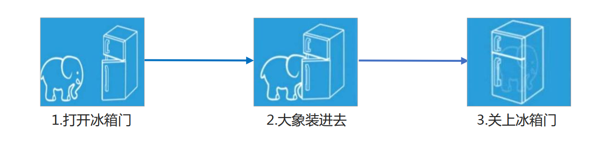

# 面向对象编程

## 目标

- [ ] 掌握面向对象与面向过程的区别
- [ ] 掌握面向对象思想
- [ ] 掌握对象与类的区别
- [ ] 掌握对象与类的创建方式

## 1.面向过程与面向对象

两大编程思想 

- 面向过程

- 面向对象

### 1.1面向过程程 POP(Process-oriented programming）

- 面向过程就是分析出解决问题所需要的步骤，然后用函数把这些步骤一步一步实现，使用的时候再一个一个的依次调用就可以了。

  举个栗子：将大象装进冰箱，面向过程做法。

  

  面向过程，就是按照我们分析好了的步骤，按照步骤解决问题。

### 1.2面向对象OOP (Object Oriented Programming）

- 面向对象是把事务分解成为一个个对象，然后由对象之间分工与合作。 

  举个栗子：将大象装进冰箱，面向对象做法。 

  先找出对象，并写出这些对象的功能：

  1. 大象对象

     进去 

  2.  冰箱对象 

     打开 

     关闭 

  3. 使用大象和冰箱的功能

     **面向对象是以对象功能来划分问题，而不是步骤。**

### 1.3面向过程与面向对象对比

在面向对象程序开发思想中，每一个对象都是功能中心，具有明确分工。 面向对象编程具有灵活、代码可复用、容易维护和开发的优点，更适合多人合作的大型软件项目。

面向对象的特性： 

- 封装性
- 继承性
- 多态性


|      | 面向过程                                    | 面向对象                                     |
| ---- | --------------------------------------- | ---------------------------------------- |
| 优点   | 性能比面向对象高，适合跟硬件联系很紧密的东西，例如单片机就采用的面向过程编程。 | 易维护、易复用、易扩展，由于面向对象有封装、继承、多态性的特性，可以设计出低耦合的系统，使系统 更加灵活、更加易于维护 |
| 缺点   | 不易维护、不易复用、不易扩展                          | 性能比面向过程低                                 |

用面向过程的方法写出来的程序是一份蛋炒饭，而用面向对象写出来的程序是一份盖浇饭。

## 2.ES6中的对象与类

面向对象更贴近我们的实际生活, 可以使用面向对象描述现实世界事物. 但是事物分为具体的事物和抽象的事物      

 手机 抽象的(泛指的)

oppo手机 具体的(特指的)

面向对象的思维特点:  

1. 抽取（抽象）对象共用的属性和行为组织（封装）成一个类（模板）
2. 对类进行实例化， 获取类的对象 

面向对象编程我们考虑的是有哪些对象，按照面向对象的思维特点,不断的创建对象,使用对象,指挥对象做事情.

### 2.1 对象

现实生活中：万物皆对象，对象是一个具体的事物，看得见摸得着的实物。例如，一本书、一辆汽车、一个人 可以是“对象”，一个数据库、一张网页、一个与远程服务器的连接也可以是“对象”。

在 JavaScript 中，对象是一组无序的相关属性和方法的集合，所有的事物都是对象，例如字符串、数值、数组、函数等。

对象是由属性和方法组成的：是一个无序键值对的集合,指的是一个具体的事物

- 属性：事物的特征，在对象中用属性来表示（常用名词）
- 方法：事物的行为，在对象中用方法来表示（常用动词）

#### 2.1.1创建对象

```js
//以下代码是对对象的复习
//字面量创建对象
var ldh = {
    name: '刘德华',
    age: 18
}
console.log(ldh);

//构造函数创建对象
  function Star(name, age) {
    this.name = name;
    this.age = age;
 }
var ldh = new Star('刘德华', 18)//实例化对象
console.log(ldh);	
```

如上两行代码运行结果为:

### 2.2 类 class

在 ES6 中新增加了类的概念，可以使用 class 关键字声明一个类，之后以这个类来实例化对象。

类抽象了对象的公共部分，它泛指某一大类（class） 

对象特指某一个，通过类实例化一个具体的对象 


#### 2.2.1创建类

1. 语法:

```js
//步骤1 使用class关键字
class name {
  // class body
}     
//步骤2使用定义的类创建实例  注意new关键字
var xx = new name();    
注意： 类必须使用 new 实例化对象

```

#### 2.2.2类 constructor 构造函数

constructor() 方法是类的构造函数(默认方法)，用于传递参数,返回实例对象，通过 new 命令生成对象实例时 ，自动调用该方法。如果没有显示定义, 类内部会自动给我们创建一个constructor()

语法：

```js
 // 1. 创建类 class  创建一个 明星类
 class Star {
   // 类的共有属性放到 constructor 里面
   constructor(name, age) {
   this.name = name;
   this.age = age;
   }
 }
   // 2. 利用类创建对象 new
   var ldh = new Star('刘德华', 18);
   console.log(ldh);
```

以上代码运行结果: 


通过结果我们可以看出,运行结果和使用构造函数方式一样

#### 2.2.3类创建添加属性和方法

语法：

```js
 // 1. 创建类 class  创建一个类
class Star {
    // 类的共有属性放到 constructor 里面 constructor是 构造器或者构造函数
    constructor(uname, age) {
      this.uname = uname;
      this.age = age;
    }//------------------------------------------->注意,方法与方法之间不需要添加逗号
    sing(song) {
      console.log(this.uname + '唱' + song);
    }
}
// 2. 利用类创建对象 new
var ldh = new Star('刘德华', 18);
console.log(ldh); // Star {uname: "刘德华", age: 18}
ldh.sing('冰雨'); // 刘德华唱冰雨
```

 以上代码运行结果:


**注意哟:**

1. 通过class 关键字创建类, 类名我们还是习惯性定义首字母大写
2. 类里面有个constructor 函数,可以接受传递过来的参数,同时返回实例对象
3. constructor 函数 只要 new 生成实例时,就会自动调用这个函数, 如果我们不写这个函数,类也会自动生成这个函数
4. 多个函数方法之间不需要添加逗号分隔
5. 生成实例 new 不能省略
6. 语法规范, 创建类 类名后面不要加小括号,生成实例 类名后面加小括号, 构造函数不需要加function


#### 2.2.4类的继承

现实中的继承：子承父业，比如我们都继承了父亲的姓。 

程序中的继承：子类可以继承父类的一些属性和方法。

1. 语法

```js
// 父类
class Father{   
} 

// 子类继承父类
class  Son  extends Father {  
}       
```

2. 示例

```js
class Father {
      constructor(surname) {
        this.surname= surname;
      }
      say() {
        console.log('你的姓是' + this.surname);
       }
}

class Son extends Father{  // 这样子类就继承了父类的属性和方法
}
var damao= new Son('刘');
damao.say();      //结果为 你的姓是刘
```

以上代码运行结果:


**注意**

1. 继承中,如果实例化子类输出一个方法,先看子类有没有这个方法,如果有就先执行子类的

2. 继承中,如果子类里面没有,就去查找父类有没有这个方法,如果有,就执行父类的这个方法(就近原则)

#### 2.2.5 super 关键字

- 子类使用super关键字访问父类的方法，super 关键字用于访问和调用对象父类上的函数，可以调用父类的构造函数，也可以调用父类的普通函数

  语法：

  ```js
  //定义了父类
  class Father {
     constructor(x, y) {
     this.x = x;
     this.y = y;
     }
     sum() {
     console.log(this.x + this.y);
  	}
   }
  //子元素继承父类
      class Son extends Father {
     		 constructor(x, y) {
      		super(x, y); //使用super调用了父类中的构造函数
      	}
      }
      var son = new Son(1, 2);
      son.sum(); //结果为3
  ```
  
  注意：
  
  1. 如果子类想要继承父类的方法,同时在自己内部扩展自己的方法,利用super 调用父类的构造函数,super 必须在子类this之前调用

     ```js
      // 父类有加法方法
      class Father {
        constructor(x, y) {
        this.x = x;
        this.y = y;
        }
        sum() {
        console.log(this.x + this.y);
        }
      }
      // 子类继承父类加法方法 同时 扩展减法方法
      class Son extends Father {
        constructor(x, y) {
        // 利用super 调用父类的构造函数 super 必须在子类this之前调用,放到this之后会报错
        super(x, y);
        this.x = x;
        this.y = y;
     
       }
       subtract() {
       console.log(this.x - this.y);
       }
     }
     var son = new Son(5, 3);
     son.subtract(); //2
     son.sum();//8
     ```
     以上代码运行结果为:
  
     
  
     **注意**

     this的指向问题

     1. constructor中的this指向的是new出来的实例对象 
     2. 自定义的方法,一般也指向的new出来的实例对象
     3. 绑定事件之后this指向的就是触发事件的事件源
     4. 在 ES6 中类没有变量提升，所以必须先定义类，才能通过类实例化对象
     5. 类里面的共有的属性和方法一定要加this使用

## 3.面向对象版tab 栏切换

### 3.1功能需求

1. 点击 tab栏,可以切换效果.
2. 点击 + 号, 可以添加 tab 项和内容项.
3. 点击 x 号, 可以删除当前的tab项和内容项.
4. 双击tab项文字或者内容项文字可以修改里面的文字内容

一、面向对象版 tab 栏切换 

抽象对象: Tab 对象 

1. 该对象具有切换功能 
2.  该对象具有添加功能 
3. 该对象具有删除功能 
4. 该对象具有修改功能

二、面向对象版 tab 栏切换 添加功能 

1. 点击 + 可以实现添加新的选项卡和内容 
2. 第一步: 创建新的选项卡li 和 新的 内容 section 
3. 第二步: 把创建的两个元素追加到对应的父元素中. 
4. 以前的做法: 动态创建元素 createElement , 但是元素里面内容较多, 需要innerHTML赋值,在 appendChild 追加到父元素里面. 
5. 现在高级做法: 利用 insertAdjacentHTML() 可以直接把字符串格式元素添加到父元素中
6.   appendChild 不支持追加字符串的子元素, insertAdjacentHTML 支持追加字符串的元素 
7.  insertAdjacentHTML(追加的位置,‘要追加的字符串元素’)  
8.  追加的位置有: beforeend 插入元素内部的最后一个子节点之后 
9. 该方法地址: https://developer.mozilla.org/zh-CN/docs/Web/API/Element/insertAdjacentHTML

三、面向对象版 tab 栏切换 删除功能 

1. 点击 × 可以删除当前的li选项卡和当前的section 
2. .X是没有索引号的, 但是它的父亲li 有索引号, 这个索引号正是我们想要的索引号 
3. 所以核心思路是: 点击 x 号可以删除这个索引号对应的 li 和 section 
4.  但是,当我们动态删除新的li和索引号时,也需要重新获取 x 这个元素. 需要调用init 方法

四、面向对象版 tab 栏切换 编辑功能 

1. 双击选项卡li或者 section里面的文字,可以实现修改功能 
2. 双击事件是: ondblclick 
3. 如果双击文字,会默认选定文字,此时需要双击禁止选中文字 
4. window.getSelection ? window.getSelection().removeAllRanges() : document.selection.empty(); 
5. 核心思路: 双击文字的时候, 在 里面生成一个文本框, 当失去焦点或者按下回车然后把文本框输入的值给原先 元素即可

### 3.2案例准备

1. 获取到标题元素
2. 获取到内容元素
3. 获取到删除的小按钮 x号
4. 新建js文件,定义类,添加需要的属性方法(切换,删除,增加,修改)
5. 时刻注意this的指向问题

### 3.3切换

- 为获取到的标题绑定点击事件,展示对应的内容区域,存储对应的索引

  ```js
   this.lis[i].index = i;
   this.lis[i].onclick = this.toggleTab;
  ```

- 使用排他,实现只有一个元素的显示

  ```js
   toggleTab() {
     //将所有的标题与内容类样式全部移除
       for (var i = 0; i < this.lis.length; i++) {
       this.lis[i].className = '';
       this.sections[i].className = '';
       }
     //为当前的标题添加激活样式
       this.className = 'liactive';
      //为当前的内容添加激活样式
       that.sections[this.index].className = 'conactive';
    }
  ```

### 3.4添加

- 为添加按钮+ 绑定点击事件 

  ```js
   this.add.onclick = this.addTab;
  ```

- 实现标题与内容的添加,做好排他处理

  ```js
  addTab() {
      that.clearClass();
      // (1) 创建li元素和section元素 
      var random = Math.random();
      var li = '<li class="liactive"><span>新选项卡</span><span class="iconfont icon-guanbi">				</span></li>';
      var section = '<section class="conactive">测试 ' + random + '</section>';
      // (2) 把这两个元素追加到对应的父元素里面
      that.ul.insertAdjacentHTML('beforeend', li);
      that.fsection.insertAdjacentHTML('beforeend', section);
      that.init();
      }
  ```

### 3.5删除

- 为元素的删除按钮x绑定点击事件

  ```js
   this.remove[i].onclick = this.removeTab;
  ```

- 获取到点击的删除按钮的所在的父元素的所有,删除对应的标题与内容

  ```js
   removeTab(e) {
       e.stopPropagation(); // 阻止冒泡 防止触发li 的切换点击事件
       var index = this.parentNode.index;
       console.log(index);
       // 根据索引号删除对应的li 和section   remove()方法可以直接删除指定的元素
       that.lis[index].remove();
       that.sections[index].remove();
       that.init();
       // 当我们删除的不是选中状态的li 的时候,原来的选中状态li保持不变
       if (document.querySelector('.liactive')) return;
       // 当我们删除了选中状态的这个li 的时候, 让它的前一个li 处于选定状态
       index--;
       // 手动调用我们的点击事件  不需要鼠标触发
       that.lis[index] && that.lis[index].click();
   }
  ```

### 3.6编辑

- 为元素(标题与内容)绑定双击事件

  ```js
   this.spans[i].ondblclick = this.editTab;
   this.sections[i].ondblclick = this.editTab;
  ```

- 在双击事件处理文本选中状态,修改内部DOM节点,实现新旧value值的传递

  ```js
  editTab() {
      var str = this.innerHTML;
      // 双击禁止选定文字
      window.getSelection ? window.getSelection().removeAllRanges() : document.selection.empty();
      // alert(11);
        this.innerHTML = '<input type="text" />';
        var input = this.children[0];
        input.value = str;
        input.select(); // 文本框里面的文字处于选定状态
        // 当我们离开文本框就把文本框里面的值给span 
        input.onblur = function() {
        this.parentNode.innerHTML = this.value;
        };
        // 按下回车也可以把文本框里面的值给span
        input.onkeyup = function(e) {
        if (e.keyCode === 13) {
        // 手动调用表单失去焦点事件  不需要鼠标离开操作
        this.blur();
        }
      }
  }
  ```

  

