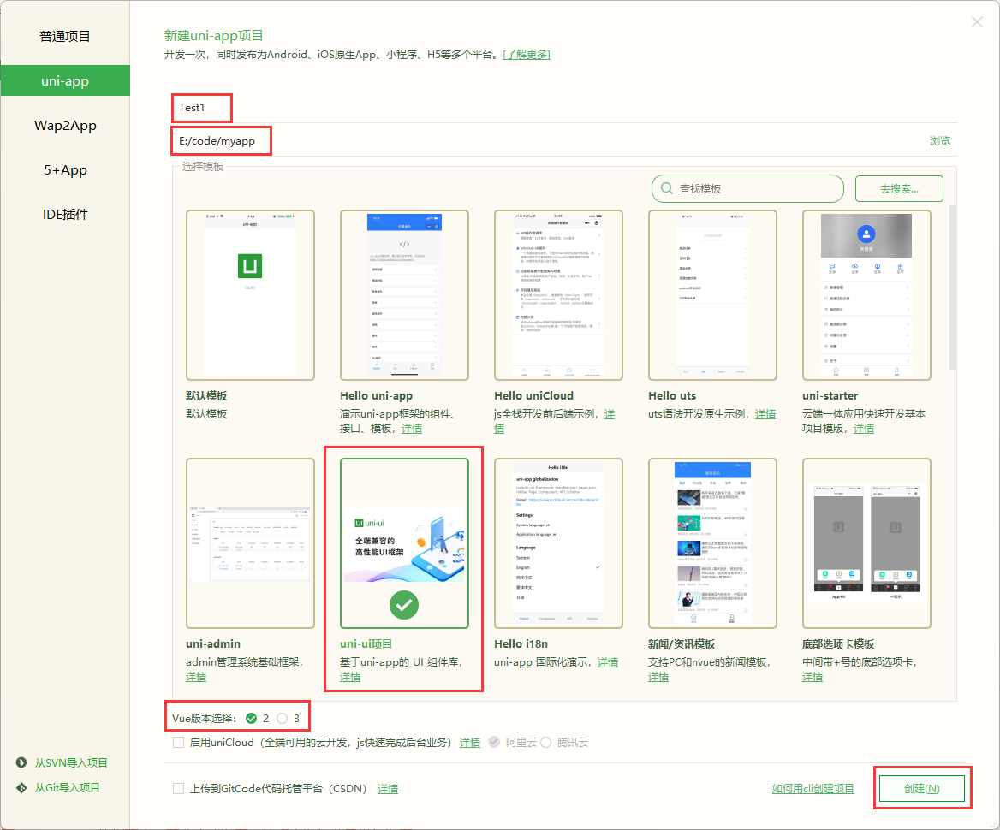
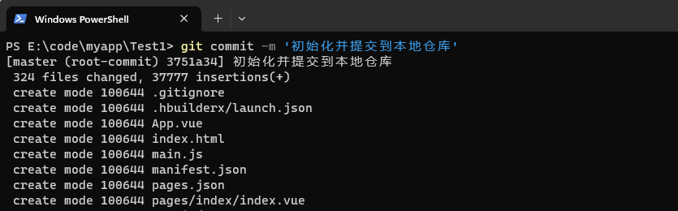

## 一、项目环境搭建

### 1.1 项目介绍

本项目是基于uni-app开发的超市到家类微信小程序。包含网络请求、数据渲染、页面跳转、组件的使用、状态的共享、以及项目中常用的业务逻辑，小程序发布等知识点。


### 1.2 uni-app 介绍

[官网](https://uniapp.dcloud.io/README)

`uni-app` 是一个使用 [Vue.js](https://vuejs.org/) 开发所有前端应用的框架，开发者编写一套代码，可发布到iOS、Android、Web（响应式）、以及各种小程序（微信/支付宝/百度/头条/飞书/QQ/快手/钉钉/淘宝）、快应用等多个平台。

### 1.3 创建项目

#### 1.3.1 创建项目

打开HbuilderX编辑器，操作如下，创建一个uniapp项目。

1. 菜单栏 文件 -> 新建 -> 项目
2. 输入项目名称
3. 选择项目路径（路径注意是英文）
4. 选择 uni-ui 项目
5. Vue2 版本



**项目目录如下**

```js
┌─Project
├─pages                    业务页面文件存放的目录
│  ├─index
│      └─index.vue       index页面
├─static                 存放应用引用的本地静态资源（如图片、视频等）的目录，注意：静态资源只能存放于此
├─uni_modules           存放[uni_module](/uni_modules)。
├─unpackage             非工程代码，一般存放运行或发行的编译结果
├─main.js               Vue初始化入口文件
├─App.vue               应用配置，用来配置App全局样式以及监听 应用生命周期
├─index.html            在构建过程中，资源链接会被自动注入到此
├─manifest.json         配置应用名称、appid、logo、版本等打包信息，详见
├─pages.json            配置页面路由、导航条、选项卡等页面类信息，详见
└─uni.scss              这里是uni-app内置的常用样式变量
```

#### 1.3.2 配置manifest.json

点击 manifest.json 选择 微信小程序配置，将小程序的AppID填写到此处


#### 1.3.3 配置运行配置

1. 点击菜单栏选择 运行 -> 运行到小程序模拟器 -> 运行设置


2. 选择微信开发者工具所在目录


#### 1.3.4 打开微信开发者工具的服务端

在微信开发者工具菜单栏选择工具 -> 安全设置


选择安全，打开服务端口


#### 1.3.5 安装sass插件

uniapp项目使用的是sass语法，在第一次打开的时候会提示你安装sass插件，你自己按照提示安装即可。注意安装好重启Hbuilderx编辑器。

#### 1.3.6 运行

打开Hbuilderx菜单，选择运行--运行到小程序模拟器--微信开发者工具，就可以把uni-app项目在微信开发者工具上面做调试了。


#### 1.3.7 配置是否被索引

小程序根目录下的sitemap.json文件用于配置小程序及其页面是否允许被微信索引，文件内容为一个 JSON对象，如果没有sitemap.json则默认为所有页面都允许被索引。


### 1.4 git 委托项目

1. 定义忽略文件

   在Hbuilderx打开的项目根目录下面创建.gitignore文件，添加如下：

   

> 创建时选择自定义文件

这样是为了上传git的时候，这两个文件夹不会上传，因为第一个目录是依赖的包，第一个文件夹是自动生成的项目目录

2. 定义跟踪文件

   在unpackage文件夹下面新建.gitkeep文件，是为了保证git也要跟踪这个文件夹，否则就不会识别此文件夹了。

   

   > .gitkeep文件中不用写内容

3. 把项目提交到本地仓库

   ```
   git init
   git add .
   git commit -m '注释'
   ```

   打开项目根目录，按住 shift + 鼠标右键




4. 把本地项目推送到码云

   - 注册码云账号并登录
   - 配置ssh公钥
   - 配置用户名和邮箱
   - 新建空白仓库（[gitee](https://gitee.com/)）
   - 推送到远程仓库

   之前做过前三步，可以直接做四、五步


执行 "已有仓库？" 下的代码


此时可以查看gitee的仓库，代码已经上传。

## 二、tabBar操作

### 2.1 创建分支

我们创建一个新的分支作为我们的工作目录，tabBar部分完成之后再和master分支进行合并，代码如下：

```
git checkout -b tabbar 创建并切换到tabbar分支
git branch 检查当前分支是否是tabbar
```


### 2.2 创建四个页面

#### 2.2.1 创建页面

将默认的pages下的index目录删除。在pages目录上点击鼠标右键，选择创建页面，依次创建home（首页）、cate（分类页）、shop（购物车）、my（我的）


其它三个页面操作方法一致，创建出即可。


将pages.json中的index相关配置删除。


编译后效果


#### 2.2.2 准备静态资源文件

将素材中的图片放到static目录中

#### 2.2.3 修改pages.json

添加tabbar配置

```json
{
	"pages": [{
		"path": "pages/home/home",
		"style": {
			"navigationBarTitleText": "",
			"enablePullDownRefresh": false
		}

	}, {
		"path": "pages/cate/cate",
		"style": {
			"navigationBarTitleText": "",
			"enablePullDownRefresh": false
		}

	}, {
		"path": "pages/shop/shop",
		"style": {
			"navigationBarTitleText": "",
			"enablePullDownRefresh": false
		}

	}, {
		"path": "pages/my/my",
		"style": {
			"navigationBarTitleText": "",
			"enablePullDownRefresh": false
		}

	}],
	"tabBar": {
		"selectedColor": "#43D33",
		"list": [{
				"pagePath": "pages/home/home",
				"text": "首页",
				"iconPath": "static/tab_icons/home.png",
				"selectedIconPath": "static/tab_icons/home-active.png"
			},
			{
				"pagePath": "pages/cate/cate",
				"text": "分类",
				"iconPath": "static/tab_icons/cate.png",
				"selectedIconPath": "static/tab_icons/cate-active.png"
			},
			{
				"pagePath": "pages/shop/shop",
				"text": "购物车",
				"iconPath": "static/tab_icons/cart.png",
				"selectedIconPath": "static/tab_icons/cart-active.png"
			},
			{
				"pagePath": "pages/my/my",
				"text": "我的",
				"iconPath": "static/tab_icons/my.png",
				"selectedIconPath": "static/tab_icons/my-active.png"
			}
		]
	},
	。。。。。。
}

```

页面显示效果如下


> 如果小程序的底部不显示，点击预览或者编译一下即可。

### 2.3 配置全局头部导航

修改pages.json文件如下：

```json
{
	"pages": [
	    。。。	
    ],
	"tabBar":{
		。。。
	},
	"globalStyle": {
		"navigationBarTextStyle": "white",
		"navigationBarTitleText": "惠友到家",
		"navigationBarBackgroundColor": "#E43D33",
    。。。。
	}
}
```

样式如下


上图白框中的"惠友到家"没有显示，是因为pages.json中pages节点下的home中将标题设置了为空，在此处添加标题或者将此配置删除即可。

```json
{
	"pages": [{
		"path": "pages/home/home",
		"style": {
			"navigationBarTitleText": "惠友到家",
			"enablePullDownRefresh": false
	。。。。。。。。
```

此处的优先级比global的配置要高，所以没有显示。


### 2.4 tabBar部分代码推送到码云

```json
git branch 查看所在分支
git add . 把代码添加到暂存区（如果在tabbar分支上这样操作）
git commit -m 'xx' 把代码添加到本地仓库
git push -u origin tabbar 把本地tabbar的代码推送到远程tabbar分支上面
git checkout master 切换到master主分支
git merge tabbar 把tabbar和主分支代码合并
git push 把本地master代码推送到远程master分支
git branch -d tabbar 把本地tabbar分支删除
```


此时刷新gitee查看是否有两个分支且有刚上传的代码即可。

## 三、首页布局

### 3.1 创建home分支

关于首页的功能在此分支进行开发

```
git branch 查看当前所在的分支
git checkout -b home 新建并切换到home分支
在home分支上面进行开发
```


### 3.2 实现数据网络化请求

微信中的`wx.request`可以请求后端数据，但是如果想实现请求拦截的功能（登录的时候得用请求拦截），我们可以自己二次封装，或者借用一个第三方包（@escook/request-miniprogram），具体使用哪种方式，自己决定即可。

使用步骤参考如下或者github（github有的时候打不开，但是讲解比较官方）

[github参考链接](https://github.com/liulongbin1314/request-miniprogram)
[其他参考链接](https://blog.csdn.net/weixin_39411655/article/details/115565689)

**使用步骤**

- npm init -y 项目根目录下面初始化一个 package.json 文件
- npm install @escook/request-miniprogram 安装这个第三方包
- main.js 中导入这个包并配置


```js
// main.js
import Vue from 'vue'
import App from './App'

// 配置网络请求
import {
	$http
} from '@escook/request-miniprogram'

// 在 uni-app 项目中，可以把 $http 挂载到 uni 顶级对象之上，方便全局调用
uni.$http = $http

// 配置请求的根路径
$http.baseUrl = "https://dev.usemock.com/6641c530424954b7e1819200"

// 请求拦截器
$http.beforeRequest = function(options) {
	wx.showLoading({
		title: '数据加载中...'
	})
}
// 响应拦截器 就是响应完成之后做一些事
$http.afterRequest = function() {
	wx.hideLoading()
}
```

> 注意我们上面配置的项目请求跟地址是我们自己设置的fastmock的根地址或者自己设置你的服务器的根地址

### 3.3 实现轮播图

#### 3.3.1 模拟轮博图数据

fastmock请求轮博图接口地址如下：

```
https://dev.usemock.com/6641c530424954b7e1819200/bannerlist
```

请求方式：GET

返回数据格式如下：

```json
{
  "status": "200",
  "data": {
    "list": [
      {
        "id": 0,
        "picUrl": "http://b.appsimg.com/upload/momin/2022/02/17/189/1645086388242.jpg"
      },
      {
        "id": 1,
        "picUrl": "http://b.appsimg.com/upload/momin/2022/02/17/111/1645082161234.jpg"
      },
      {
        "id": 2,
        "picUrl": "http://b.appsimg.com/upload/momin/2022/02/17/189/1645086388242.jpg"
      },
      {
        "id": 3,
        "picUrl": "http://b.appsimg.com/upload/momin/2022/02/17/111/1645082161234.jpg"
      }
    ]
  }
}
```

#### 3.3.2 请求轮博图数据

在home.vue中编写如下代码：

```js
	export default {
		data() {
			return {
				bannerList: []
			};
		},
		methods: {
			async getBannerList() {
				const {
					data: res
				} = await uni.$http.get('/bannerlist')
				if (res.status != 200) {
					return uni.showToast({
						title: '数据加载失败',
						icon: 'none',
						duration: 1000
					})
				}
				this.bannerList = res.data.list
			}
		},
		onLoad() {
			// 页面加载调用getBannerList方法来获取数据
			this.getBannerList()
		}
	}
```

此时打开微信开发者工具调试器的appData部分如果可以看到数据代表赋值成功。


#### 3.3.3 渲染数据

视图代码如下：

```vue
<template>
	<view>
		<swiper class="swiper-home" indicator-dots="true" autoplay="true" interval="2000"
		circular="true" indicator-color="#000" indicator-active-color="#FF0000">
			<swiper-item v-for="(item,index) in bannerList" :key="index">
				<image :src="item.picUrl"></image>
			</swiper-item>
		</swiper>
	</view>
</template>
```

SCSS代码如下：

```scss
.swiper-home{
	width:100%;
	background-color: #E43D33;
	swiper-item{
		width:100%;
		image{
			width:100%;
			height:300rpx;
		}
	}
}
```

效果图如下：


#### 3.3.4 分包配置

小程序要求体量不能太大，所以一般是把主页和tabbar页面设置成主包，其他的页面需要的时候再进行下载，设置成分包，方便管理。

- 项目根目录创建subpkg文件夹（文件夹名随便起）
- pages.json 配置如下：

```json
{
。。。
	"globalStyle": {
		。。。
	},
	"subPackages":[
		{
			"root":"subpkg",
			"pages":[]
		}
	]
}
```

- subpkg文件夹中新建商品详情页（goods-detail）


- pages.json文件中自动生成下面的配置

```json
{
    	"subPackages": [{
		"root": "subpkg",
		"pages": [{
                    "path" : "goods-detail/goods-detail",
                    "style" :                                                                                    
                {
                    "navigationBarTitleText": "",
                    "enablePullDownRefresh": false
                }
                
                }
            ]
	}]
}
```

#### 3.3.5 跳转到详情页

要求点击轮博图的任意一张图都能跳转到详情页面，所以在home.vue页面更改如下：

```vue
。。。
	<navigator :url="'/subpkg/goods-detail/goods-detail?goodid='+item.id">
		<image :src="item.picUrl"></image>
	</navigator>
。。。
```

此时点击轮播图的图片能跳转到详情页并且能传递过去商品id

### 3.4 实现分类展示

#### 3.4.1 模拟分类数据

fastmock上的分类接口地址如下：

```
https://dev.usemock.com/6641c530424954b7e1819200/cates
```

请求方式：GET

返回数据格式如下：

```json
{
  "status": 200,
  "data": {
    "cateList": [
      {
        "cateId": 0,
        "catePic": "http://m15.360buyimg.com/mobilecms/jfs/t1/175540/24/19329/6842/60ec0b0aEf35f7384/ec560dbf9b82b90b.png!q70.jpg",
        "cateName": "分类",
        "children": [
          {
            "pid": "0",
            "cate_pid": 0,
            "pname": "属于一级分类商品",
            "price": "7.56",
            "picUrl": "//m.360buyimg.com/babel/jfs/t1/6004/27/21264/150125/620e1e4dE13de3494/bc12859a7054d0ec.png.webp"
          },
          {
            "pid": "1",
            "cate_pid": 0,
            "pname": "属于一级分类商品",
            "price": "8.56",
            "picUrl": "//m.360buyimg.com/babel/jfs/t1/207709/34/17600/60469/620e1f1fE1b734c3d/5bdbaa8fcc4b8ad6.png.webp"
          }
。。。。。。。。
。。。。。。。。
```

#### 3.4.2 请求分类数据

home.vue的js中定义空数据组cateList，请求fastmock接口获取数据并给cateList赋值。

```js
	export default {
		data() {
			return {
				// banner
				bannerList: [],
				// 分类列表
				cateList: [],
			};
		},
		methods: {
			// 获取banner
			async getBannerList() {
				const {
					data: res
				} = await uni.$http.get('/bannerlist')
				if (res.status != 200) {
					return uni.showToast({
						title: '数据加载失败',
						icon: 'none',
						duration: 1000
					})
				}
				this.bannerList = res.data.list
			},
			// 获取分类列表
			async getCateList() {
				const {
					data: res
				} = await uni.$http.get('/cates')
				if (res.status != 200) {
					return uni.showToast({
						title: '数据加载失败',
						icon: 'none',
						duration: 1000
					})
				}
				this.cateList = res.data.cateList
			}
		},
		onLoad() {
            // 页面加载调用getBannerList()获取Banner数据
			this.getBannerList()
            // 页面加载调用getCateList()获取分类数据
			this.getCateList()
		}
	}
```

打开微信开发者工具如果appData中的cateList有数据，代表获取信息成功。


#### 3.4.3 渲染页面结构

home.vue渲染视图如下：

```vue
<!-- 商品分类 -->
		<view class="cates">
			<view class="cate-item" v-for="(cateItem,cateIndex) in cateList" :key="cateIndex"
				@click="gotoCate(cateItem)">
				<image :src="cateItem.catePic"></image>
				<text>{{cateItem.cateName}}</text>
			</view>
		</view>
```

SCSS样式如下：

```scss
.cates{
	width:100%;
	height:320rpx;
	border-bottom:1rpx solid #C7C7C7;
	display: flex;
	flex-wrap: wrap;
	justify-content: space-around;
	align-content: center;
	.cate-item{
		width:20%;
		height:150rpx;
		display: flex;
		flex-direction: column;
		justify-content: space-around;
		align-items: center;
		image{
			width:78rpx;
			height:78rpx;
		}
	}
}
```

显示效果如下：


#### 3.4.4 点击导航跳转到分类页

home.vue的分类导航部分添加事件

```vue
<view class="cates">
	<view class="cate-item" v-for="(cateItem,cateIndex) in cateList" :key="cateIndex" @click="goToCate(cateItem)">
		<image :src="cateItem.catePic"></image>
		<text>{{cateItem.cateName}}</text>
	</view>
</view>
```

处理跳转事件：

```js
// 跳转到分类页处理方法
			gotoCate(cateItem) {
				if (cateItem.cateName == "分类") {
					uni.switchTab({
						url: '/pages/cate/cate'
					})
				}
			}
```

### 3.5 首页楼层处理

#### 3.5.1 模拟分类数据

fastmock的楼层接口地址：

```
https://dev.usemock.com/6641c530424954b7e1819200/floors
```

请求方式：GET

请求数据格式：

```json
{
  "status": 200,
  "data": {
    "floorList": [
      {
        "floor_title": "精选好物",
        "floor_con": [
          {
            "name": "儿童百科全书",
            "price": "4.56",
            "imgPic": "//img11.360buyimg.com/n7/s150x150_jfs/t28795/275/590443672/272628/57150652/5bf7bed0N2d64ad9d.jpg.dpg"
          },
          {
            "name": "怡宝矿泉水",
            "price": "6.56",
            "imgPic": "//img11.360buyimg.com/n7/s150x150_jfs/t1/121538/37/23001/92684/61f200d7Edd8706cb/6e318971b64738f6.jpg.dpg"
          },
          {
            "name": "法兰绒四件套",
            "price": "54.56",
            "imgPic": "//img10.360buyimg.com/mobilecms/s360x360_jfs/t1/197637/2/13199/462823/6167f85cEf49f0b49/d873328dc0ea95fb.jpg!q70.dpg.webp"
          },
          {
            "name": "雪地靴",
            "price": "35",
            "imgPic": "//img10.360buyimg.com/mobilecms/s360x360_jfs/t1/212417/17/3013/219451/6182ab2dE54144736/d929ab42296acf4f.jpg!q70.dpg.webp"
          }
        ]
      },
 。。。。。。。。。。。。。。
```

#### 3.5.2 获取楼层数据

home.vue 的 data 中定义空数组 floorList，把请求的 fastmock 的数据赋值给 floorList 数组中。

```js
	export default {
		data() {
			return {
			    。。。
				floorList:[]
			};
		},
		methods:{
		    。。。
			// 获取楼层列表数据
			async getFloorList() {
				const {
					data: res
				} = await uni.$http.get('/floors')
				if (res.status != 200) {
					return uni.showToast({
						title: '数据加载失败',
						icon: 'none',
						duration: 1000
					})
				}
				this.floorList = res.data.floorList
			}
		},
		onLoad(){
			。。。
            // 页面加载调用 getFloorList 方法获取数据
			this.getFloorList()
		}
	}
```

打开微信开发者工具查看appData中有数据代表成功。

#### 3.5.3 渲染页面结构

home.vue的视图结构如下：

```vue
<!-- 楼层部分的页面结构 -->
		<view class="floor-list">
			<view v-for="(floorItem,floorIndex) in floorList" :key="floorIndex" class="floor-item">
				<view class="floor-title">{{floorItem.floor_title}}</view>
				<view class="floor-con">
					<view v-for="(floorSubItem,floorSubIndex) in floorItem.floor_con" class="sub-item">
						<image :src="floorSubItem.imgPic"></image>
						<view class="proname">{{floorSubItem.name}}</view>
						<view class="proprice">{{floorSubItem.price}}</view>
					</view>
				</view>
			</view>
		</view>
```

home.vue添加样式如下：

```scss
.floor-list{
	width:100%;
	.floor-item{
		width:100%;
		height:840rpx;
		background-color: #fff;
		.floor-title{
			height:60rpx;
			line-height: 60rpx;
			font-weight: 900;
            padding-left: 6rpx;
		}
		.floor-con{
			width:100%;
			height:400rpx;
			display: flex;
			flex-wrap: wrap;
			justify-content: space-around;
			align-items: center;
			.sub-item{
				width:50%;
				height:400rpx;
				display: flex;
				flex-direction: column;
				justify-content: space-around;
				align-items: center;
				image{
					width:220rpx;
					height:220rpx;
				}
			}	
		}
		
	}
}
```

页面显示效果如下：


#### 3.5.4 点击楼层图片跳转商品列表页面

1. 在subpkg文件夹中创建goods-list商品列表页面

   

2. 给每个商品信息项添加一个自定义数据url

   ```js
   // 获取楼层方法
   			async getFloorList() {
   				const {
   					data: res
   				} = await uni.$http.get('/floors')
   				if (res.status != 200) {
   					return uni.showToast({
   						title: '数据加载失败',
   						icon: 'none',
   						duration: 1000
   					})
   				} else {
   					// 将获取到的楼层中的每个商品添加自定义url属性，用来进行页面跳转
   					res.data.floorList.forEach(product => {
   						product.floor_con.forEach(subProduct => {
   							subProduct.url = "/subpkg/goods-list/goods-list?name=" + subProduct.name
   						})
   					})
   					this.floorList = res.data.floorList
   				}
   
   			}
   ```

   > url属性可以用js动态添加，也可以自己修改模拟数据，手动添加

3. 页面添加navigator标签

   ```vue
   。。。
   <navigator :url="floorSubItem.url">
       <image :src="floorSubItem.imgPic"></image>
       <view class="proname">{{floorSubItem.name}}</view>
       <view class="proprice">{{floorSubItem.price}}</view>
   </navigator>
   。。。
   ```

此时点击每一个商品都能跳转到商品列表页面。

### 3.6 分支合并

```
git add .
git commit -m '完成了首页'
git push -u origin home 远程创建home分支
git checkout master 切换到主分支
git merge home 和home分支合并
git push 推送到远程master分支
git branch -d home
```


查看gitee是否推送成功