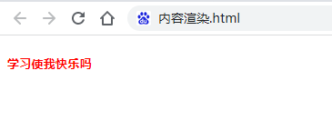

# Vue介绍、指令、过滤器

## 目标

- [ ] 能够知道 vue 的基本使用步骤  
- [ ] 掌握 vue 中常见指令的基本用法  
- [ ] 掌握 vue 中过滤器的基本用法  

## 一、Vue 简介

### 1.1 什么是 Vue

官方给出的概念：Vue (读音 /vjuː/，类似于 view) 是一套**用于构建用户界面的**前端**框架**。  


1. 构建用户界面
   - 用 vue 往 html 页面中填充数据，非常的方便

2. 框架
   - 框架是一套现成的解决方案，程序员只能遵守框架的规范，去编写自己的业务功能
   - 要学习 vue，就是在学习 vue 框架中规定的用法
   - vue 的指令、组件（是对 UI 结构的复用）、路由、Vuex、vue 组件库

### 1.2 vue 的特性  

vue 框架的特性，主要体现在如下两方面：  

- 数据驱动视图  
- 双向数据绑定  

**1. 数据驱动视图**  

在使用了 vue 的页面中，vue 会**监听数据的变化**，从而**自动**重新渲染页面的结构。示意图如下：  


好处：当页面数据发生变化时，页面会自动重新渲染！  

> 注意：数据驱动视图是单向的数据绑定。  

**2. 双向数据绑定**

在填写表单时，双向数据绑定可以辅助开发者在不操作 DOM 的前提下，自动把用户填写的内容同步到数据源中。示意图如下：


好处：开发者不再需要手动操作 DOM 元素，来获取表单元素最新的值！  

**3. MVVM**

**MVVM** 是 vue 实现**数据驱动视图**和**双向数据绑定**的核心原理。MVVM 指的是 **M**odel、**V**iew 和 **V**iew**M**odel，它把每个 HTML 页面都拆分成了这三个部分，如图所示：  


在 MVVM 概念中：

- **Model** 表示当前页面渲染时所依赖的数据源。
- **View** 表示当前页面所渲染的 DOM 结构。
- **ViewModel** 表示 vue 的实例，它是 MVVM 的核心。  

**4. MVVM 的工作原理**

**ViewModel 作为 MVVM 的核心**，是它把当前页面的**数据源**（Model）和**页面的结构**（View）连接在了一起。  


当**数据源发生变化**时，会被 ViewModel 监听到，VM 会根据最新的数据源自动更新页面的结构

当**表单元素的值发生变化**时，也会被 VM 监听到，VM 会把变化过后最新的值自动同步到 Model 数据源中  

### 1.3 vue 的版本  

当前，vue 共有 3 个大版本，其中：

- 2.x 版本的 vue ，已在23年12月31日停止维护。
- 3.x 版本的 vue 于 2020-09-19 发布，逐渐成为主流。

## 二、vue 的基本使用

### 2.1 基本使用步骤

1. 导入 vue.js 的 script 脚本文件  
2. 在页面中声明一个将要被 vue 所控制的 DOM 区域  
3. 创建 vm 实例对象（vue 实例对象）  

```html
<body>
    <!-- 2. 在页面中声明一个将要被 vue 所控制的 DOM 区域 -->
    <div id="app">{{ username }}</div>
    <!-- 1. 导入vue的script脚本文件 -->
    <script src="https://cdn.jsdelivr.net/npm/vue@2/dist/vue.js"></script>
    <script>
        // 3. 创建 vm 实例对象（vue实例对象）
        const vm = new Vue({
            // 指定当前vm实例要控制页面的哪个区域
            el: '#app',
            // 指定 Model数据源
            data: {
                username: '张三'
            }
        })
    </script>
</body>
```

### 2.2 基本代码与 MVVM 的对应关系  


## 三、vue 的调试工具

### 3.1 安装 vue-devtools 调试工具  

vue 官方提供的 vue-devtools 调试工具，能够方便开发者对 vue 项目进行调试与开发。  

Chrome 浏览器在线安装 vue-devtools ：  

https://chrome.google.com/webstore/detail/vuejs-devtools/nhdogjmejiglipccpnnnanhbledajbpd?hl=zh-CN

FireFox 浏览器在线安装 vue-devtools ：  

https://addons.mozilla.org/zh-CN/firefox/addon/vue-js-devtools/

### 3.2 配置 Chrome 浏览器中的 vue-devtools  

点击 Chrome 浏览器右上角的 按钮，选择更多工具 -> 扩展程序 -> Vue.js devtools 详细信息，并勾选如下的两个选项：  


### 3.3 使用 vue-devtools 调试 vue 页面  

在浏览器中访问一个使用了 vue 的页面，打开浏览器的开发者工具，切换到 Vue 面板，即可使用 vue-devtools 调试当前的页面。  


## 四、vue 的指令与过滤器  

### 4.1 vue 的指令  

指令（Directives）是 vue 为开发者提供的模板语法，用于辅助开发者渲染页面的基本结构。  

vue 中的指令按照不同的用途可以分为如下 6 大类：  

- 内容渲染指令  
- 属性绑定指令  
- 事件绑定指令  
- 双向绑定指令  
- 条件渲染指令  
- 列表渲染指令  

> 注意：指令是 vue 开发中最基础、最常用、最简单的知识点。  

**1. 内容渲染指令**  

内容渲染指令用来辅助开发者渲染 DOM 元素的文本内容。常用的内容渲染指令有如下 3 个：  

- v-text  
- {{ }}  
- v-html  

**v-text**  语法

用法示例：  

```js
<body>
    <div id="app">
        <!-- 把username对应的值，渲染到第一个p标签中 -->
        <p v-text="username"></p>
        <!-- 把gender对应的值，渲染到第二个p标签中 -->
        <!-- 第二个p标签中默认的文本 会被替换掉 -->
        <p v-text="gender">性别：</p>
    </div>
    <script src="https://cdn.jsdelivr.net/npm/vue@2/dist/vue.js"></script>
    <script>
        const vm = new Vue({
            el: "#app",
            data: {
                username: "张三",
                gender: "女",
            },
        });
    </script>
</body>
```

> 注意：v-text 指令会覆盖元素内默认的值。  

**{{ }} 语法**  

vue 提供的 **{{ }}** 语法，专门用来解决 v-text 会覆盖默认文本内容的问题。这种 {{ }} 语法的专业名称是**插值表达式**（英文名为：Mustache）。  

用法示例：

```html
<div id="app">
    <!-- 使用 {{ }} 插值表达式，将对应的值渲染到元素的内容节点中，同时保留元素自身的默认值 -->
    <p>姓名：{{ username }}</p>
    <p>性别：{{ gender }}</p>
</div>
<script src="https://cdn.jsdelivr.net/npm/vue@2/dist/vue.js"></script>
<script>
    const vm = new Vue({
        el: "#app",
        data: {
            username: "张三",
            gender: "女",
        },
    });
</script>
```

> 注意：相对于 v-text 指令来说，插值表达式在开发中更常用一些！因为它不会覆盖元素中默认的文本内容。  

**v-html 语法**  

v-text 指令和插值表达式只能渲染纯文本内容。如果要把包含 HTML 标签的字符串渲染为页面的 HTML 元素，则需要用到 v-html 这个指令：  

```html
<body>
    <div id="app">
        <p v-html="discription"></p>
    </div>
    <script src="https://cdn.jsdelivr.net/npm/vue@2/dist/vue.js"></script>
    <script>
        const vm = new Vue({
            el: "#app",
            data: {
                discription: '<h5 style="color:red;">学习使我快乐吗</h5>'
            },
        });
    </script>
</body>
```



#### 4.1.2 属性绑定指令

如果需要为**元素的属性**动态绑定**属性值**，则需要用到 **v-bind** 属性绑定指令。用法示例如下：  

```html
<div id="app">
    <!-- 使用 v-bind指令，为 input 的 placeholder动态绑定属性值-->
    <input type="text" v-bind:placeholder="inputValue">
    <!-- 使用 v-bind指令，为 input 的 src 动态绑定属性值-->
    
</div>
<script src="https://cdn.jsdelivr.net/npm/vue@2/dist/vue.js"></script>
<script>
    const vm = new Vue({
        el: '#app',
        data: {
            inputValue: '请输入内容',
            imgSrc: 'https://v2.cn.vuejs.org/images/logo.svg'
        }
    })
</script>
```

**属性绑定指令的简写形式**  

由于 v-bind 指令在开发中使用频率非常高，因此，vue 官方为其提供了简写形式（简写为英文的冒号 **:** ）。  

```html
<div id="app">
    <input type="text" :placeholder="inputValue">
    
</div>
```

**使用 Javascript 表达式**  

在 vue 提供的模板渲染语法中，除了支持**绑定简单的数据值**之外，还**支持 Javascript 表达式**的运算，例如：  

```html
<body>
    <div id="app">
        {{ number + 1 }}

        {{ ok ? 'ok' : 'no'}}

        {{ message.split('').reverse().join('') }}

        <div v-bind:id="'list' + id"></div>
    </div>
    <script src="https://cdn.jsdelivr.net/npm/vue@2/dist/vue.js"></script>
    <script>
        const vm = new Vue({
            el: '#app',
            data: {
                number: 2,
                ok: true,
                message: 'hbsi',
                id: 1
            }
        })
    </script>
</body>
```


#### 4.1.3 事件绑定指令

vue 提供了 **v-on 事件绑定**指令，用来辅助程序员为 DOM 元素绑定事件监听。语法格式如下：  

```html
<div id="app">
    <h3>count 的值为：{{ count }}</h3>
    <!-- 语法格式为 v-on:事件名称="事件处理函数名称" -->
    <button v-on:click="addCount">+1</button>
</div>
```

注意：原生 DOM 对象有 onclick、oninput、onkeyup 等原生事件，替换为 vue 的事件绑定形式后，分别为：v-on:click、v-on:input、v-on:keyup  

**事件绑定指令**  

通过 v-on 绑定的事件处理函数，需要在 **methods 节点**中进行声明：  

```js
const vm = new Vue({
    el: '#app',
    data: {
        count: 0
    },
    methods: { // v-on 绑定的事件处理函数，需要声明在methods节点中
        addCount() { // 事件处理函数的名字
            // this 表示当前 new 出来的 vm 实例对象
            // 通过 this 可以访问到 data 中的数据
            this.count += 1
        }
    }
})
```

**事件绑定的简写形式**  

由于 **v-on 指令**在开发中使用频率非常高，因此，vue 官方为其提供了简写形式（简写为英文的 **@** ）。  

```html
<div id="app">
    <h3>count 的值为：{{ count }}</h3>
    <!-- 完整写法 -->
    <button v-on:click="addCount">+1</button>
    <!-- 简写形式，把v-on：简写为 @ 符号 -->
    <!-- 如果事件处理函数中的代码足够简单，只有一行代码 则可以简写到行内 -->
    <button @click="count += 1">+1</button>
</div>
```

**事件对象参数**  

在原生的 DOM 事件绑定中，可以在事件处理函数的形参处，接收事件参数对象 event。同理，在 v-on 指令（简写为 @ ）所绑定的事件处理函数中，同样可以接收到事件参数对象 event，示例代码如下：  

```js
const vm = new Vue({
    el: '#app',
    data: {
        count: 0
    },
    methods: {
        addCount(e) {
            console.log(e)
            const nowBgColor = e.target.style.backgroundColor
            e.target.style.backgroundColor = nowBgColor === 'red' ? '' : 'red'
            this.count += 1
        }
    }
})
```

**绑定事件并传参**  

在使用 v-on 指令绑定事件时，可以使用 **( )** 进行传参，示例代码如下：  

```html
<h3>count 的值为：{{ count }}</h3>
<button v-on:click="addNewCount(2)">+2</button>
methods: {
    // 在形参处用 step 接收传递过来的参数值
    addNewCount(step) {
        this.count += step
    }

}
```

**$event**  

$event 是 vue 提供的特殊变量，用来表示原生的事件参数对象 event。$event 可以解决事件参数对象 event 被覆盖的问题。示例用法如下：  

```html
<h3>count 的值为：{{ count }}</h3>
<button @click="addNewCount(2,$event)">+2</button>
methods: {
    // 在形参处用 e 接收传递过来的原生事件参数对象 $event
    addNewCount(step, e) {
        const nowBgColor = e.target.style.backgroundColor
        e.target.style.backgroundColor = nowBgColor === 'red' ? '' : 'red'
        this.count += step
    }

}
```

**事件修饰符**  

在事件处理函数中调用 **event.preventDefault()** 或 **event.stopPropagation()** 是非常常见的需求。因此，vue 提供了**事件修饰符**的概念，来辅助程序员更方便的**对事件的触发进行控制**。常用的 5 个事件修饰符如下：  

| 事件修饰符 | 说明                                                      |
| ---------- | --------------------------------------------------------- |
| .prevent   | 阻止默认行为（例如：阻止 a 连接的跳转、阻止表单的提交等） |
| .stop      | 阻止事件冒泡                                              |
| .capture   | 以捕获模式触发当前的事件处理函数                          |
| .once      | 绑定的事件只触发1次                                       |
| .self      | 只有在 event.target 是当前元素自身时触发事件处理函数      |

语法格式如下：  

```html
<!-- 触发 click 点击事件时，阻止 a 链接的默认跳转行为 -->
<a href="https://www.baidu.com" @click.prevent="onLinkClick">百度</a>
```

**按键修饰符**  

在监听键盘事件时，我们经常需要判断详细的按键。此时，可以为键盘相关的事件添加按键修饰符，例如：  

```html
<!-- 只有在按下 enter 键的时候 调用 vm.submit() -->
<!-- 只有在按下 esc 键的时候 调用 vm.clearInput() -->
<input type="text" @keyup.esc="clearInput" @keyup.enter="submit">
methods: {
    clearInput(e) {
        console.log('按下了esc')
        e.target.value = ''
    },
    submit() {
        console.log('按下了enter')
    }
}
```

#### 4.1.4 双向绑定指令  

vue 提供了 **v-model 双向数据绑定**指令，用来辅助开发者在**不操作 DOM** 的前提下，快速获取表单的数据 。

```html
<p>用户名是：{{ username }}</p>
<input type="text" v-model="username">
<p>选中的省份是：{{ province }}</p>
<select name="" id="" v-model="city">
    <option value="">请选择</option>
    <option value="1">北京</option>
    <option value="2">上海</option>
    <option value="3">广州</option>
</select>
```

> 只有表单元素（input、textarea、select等）使用v-model才有意义

**v-model 指令的修饰符**  

为了方便对用户输入的内容进行处理，vue 为 v-model 指令提供了 3 个修饰符，分别是：  

| 修饰符  | 作用                           | 示例                             |
| ------- | ------------------------------ | -------------------------------- |
| .number | 自动将用户的输入值转为数值类型 | `<input v-model.number="age" />` |
| .trim   | 自动过滤用户输入的首尾空白字符 | `<input v-model.trim="msg" />`   |
| .lazy   | 在“change”时而非“input”时更新  | `<input v-model.lazy="msg" />`   |

示例用法如下：  

```html
<input type="text" v-model.number="n1">
<input type="text" v-model.number="n2">
<span>{{ n1 + n2 }}</span>
<hr>
<input type="text" v-model.trim="username">
<button @click="getUsername">获取用户名</button>
<hr>
<input type="text" v-model.lazy="username">
```

#### 4.1.5 条件渲染指令  

条件渲染指令用来辅助开发者按需**控制 DOM 的显示与隐藏**。条件渲染指令有如下两个，分别是：  

- v-if
- v-show  

示例用法如下：  

```html
<div id="app">
    <p v-if="flag">被v-if 控制的元素</p>
    <p v-show="flag">被v-show 控制的元素</p>
</div>
```

**v-if 和 v-show 的区别**  

实现原理不同：  

- v-if 指令会动态地创建或移除 DOM 元素，从而控制元素在页面上的显示与隐藏；  
- v-show 指令会动态为元素添加或移除 style="display: none;" 样式，从而控制元素的显示与隐藏；  

性能消耗不同：  

v-if 有更高的切换开销，而 v-show 有更高的初始渲染开销。因此：  

- 如果需要非常频繁地切换，则使用 v-show 较好  
- 如果在运行时条件很少改变，则使用 v-if 较好  

**v-else**  

v-if 可以单独使用，或配合 v-else 指令一起使用：  

```html
<div v-if="Math.random() > 0.5">
    随机数大于 0.5
</div>
<div v-else>
    随机数小于0.5
</div>
```

> 注意：v-else 指令必须配合 v-if 指令一起使用，否则它将不会被识别！  

**v-else-if**  

v-else-if 指令，顾名思义，充当 v-if 的“else-if 块”，可以连续使用：  

```html
<div v-if="type === 'A'">优秀</div>
<div v-else-if="type === 'B'">良好</div>
<div v-else-if="type === 'C'">一般</div>
<div v-else>差</div>
```

> 注意：v-else-if 指令必须配合 v-if 指令一起使用，否则它将不会被识别！  

#### 4.1.6 列表渲染指令  

vue 提供了 v-for 列表渲染指令，用来辅助开发者基于一个数组来循环渲染一个列表结构。v-for 指令需要使用 item in items 形式的特殊语法，其中：  

- items 是待循环的数组
- item 是被循环的每一项  

```html
<ul>
    <li v-for="item in items">姓名是：{{ item.name }}</li>
</ul>
data: {
    items: [
        { id: 1, name: 'zs' },
        { id: 2, name: 'ls' }
    ]
}
```

**v-for 中的索引** 

 v-for 指令还支持一个可选的第二个参数，即当前项的索引。语法格式为 (item, index) in items，示例代码如下：  

```html
<ul>
    <li v-for="(item, index) in items">ID是：{{ index }}，姓名是：{{ item.name }}</li>
</ul>
```

> 注意：v-for 指令中的 item 项和 index 索引都是形参，可以根据需要进行重命名。例如 (user, i) in userlist  

**使用 key 维护列表的状态**  

当**列表的数据变化**时，默认情况下，vue 会**尽可能的复用**已存在的 DOM 元素，从而提升渲染的性能。但这种默认的性能优化策略，会导致**有状态的列表无法被正确更新**。

为了给 vue 一个提示，以便它能跟踪每个节点的身份，从而在保证**有状态的列表被正确更新**的前提下，**提升渲染的性能**。此时，需要为每项提供一个**唯一的 key 属性**：  

```html
<ul>
   <li v-for="(item, index) in items" :key="item.id">ID是：{{ index }}，姓名是：{{ item.name }}</li> 
</ul>
```

**key 的注意事项**

- key 的值只能是字符串或数字类型
- key 的值必须具有唯一性（即：key 的值不能重复）
- 建议把数据项 id 属性的值作为 key 的值（因为 id 属性的值具有唯一性）
- 使用 index 的值当作 key 的值没有任何意义（因为 index 的值不具有唯一性）
- 建议使用 v-for 指令时一定要指定 key 的值（既提升性能、又防止列表状态紊乱）  

### 4.2 vue的过滤器  

#### 4.2.1 定义过滤器

**过滤器**（Filters）是 vue 为开发者提供的功能，常用于**文本的格式化**。过滤器可以用在两个地方：**插值表达式**和 **v-bind 属性绑定**。  

过滤器应该被添加在 JavaScript 表达式的**尾部**，由“**管道符**”进行调用，示例代码如下：  

```html
<div id="app">
        <p>message的值是{{ message | capi }}</p>
</div>
<script src="https://cdn.jsdelivr.net/npm/vue@2/dist/vue.js"></script>
<script>
    const vm = new Vue({
        el: '#app',
        data: {
            message: 'hello Vue.js'
        },
        filters: {
            // 过滤器函数的形参，永远都是 管道符 前面那个值
            capi(str) {
                // 过滤器中一定要有一个返回值
                return str.charAt(0).toUpperCase() + str.slice(1);
            }
        }
    })
</script>
```

注意点：

- 要定义到 filters 节点下，**本质是一个函数**
- 在过滤器函数中，**一定要有 return 值**
- 在过滤器的形参中，可以获取到“管道符”前面待处理的那个值

#### 4.2.2 私有过滤器和全局过滤器  

在 filters 节点下定义的过滤器，称为“私有过滤器”，因为它只能在当前 vm 实例所控制的 el 区域内使用。

如果希望在多个 vue 实例之间共享过滤器，则可以按照如下的格式定义全局过滤器：  

```js
// 全局过滤器 独立于每个vm实例之外
// Vue.filter() 方法接收两个参数
// 第一个参数是全局过滤器的名字
// 第二个参数是全局过滤器的处理函数
Vue.filter('capi', (str) => {
    return str.charAt(0).toUpperCase() + str.slice(1) + '······';
})
```

> 如果全局过滤器和私有过滤器名字一致，此时按照“**就近原则**”，调用的是”私有过滤器“

#### 4.2.3 连续调用多个过滤器  

过滤器可以串联地进行调用，例如：  

```html
<!-- 把message的值交给A进行处理 -->
<!-- A处理完的结果再交给B进行处理 -->
<!-- 最终B的处理结果作为最终的值渲染到页面上 -->
{{ message | filterA | filterB }}
```

实例代码：

```js
<p>{{ message | capi | maxLength }}</p>
// 全局过滤器 首字母大写
Vue.filter('capi', (str) => {
    return str.charAt(0).toUpperCase() + str.slice(1);
})
// 全局过滤器 控制文本长度
Vue.filter('maxLength', (str) => {
    if (str.length <= 10) return str
    return str.slice(0, 11) + '····'
})
```

#### 4.2.4 过滤器传参  

过滤器的本质是 JavaScript 函数，因此可以接收参数，格式如下：  

```html
<!-- arg1 和arg2 是传递给filterA的参数 -->
<p>{{ message| filterA(arg1, arg2) }}</p>
Vue. filter('filterA', (msg, arg1, arg2) => {
    //过滤器的代码逻辑...
})
```

示例代码如下：

```js
<p>{{ message | capi | maxLength(5) }}</p>
// 全局过滤器 首字母大写
Vue.filter('capi', (str) => {
    return str.charAt(0).toUpperCase() + str.slice(1);
})
// 全局过滤器 控制文本长度
Vue.filter('maxLength', (str, len = 10) => {
    if (str.length <= len) return str
    return str.slice(0, len) + '····'
})
```

#### 4.2.5 过滤器的兼容性  

过滤器仅在 vue 2.x 和 1.x 中受支持，在 vue 3.x 的版本中剔除了过滤器相关的功能。  

在企业级项目开发中：  

- 如果使用的是 2.x 版本的 vue，则依然可以使用过滤器相关的功能  
- 如果项目已经升级到了 3.x 版本的 vue，官方建议使用**计算属性**或**方法**代替被剔除的过滤器功能  

具体的迁移指南，请参考 vue 3.x 的官方文档给出的说明：  

https://v3-migration.vuejs.org/

## 五、品牌列表案例

### 5.1 案例效果


### 5.2 整体实现步骤

- 创建基本的 vue 实例
- 基于 vue 渲染表格数据
- 实现添加品牌的功能
- 实现删除品牌的功能
- 实现修改品牌状态的功能  

### 5.3 代码实现

```html
 <div id="app">
    <!-- 卡片区域 -->
    <div class="card">
      <div class="card-header">
        添加品牌
      </div>
      <div class="card-body">
        <!-- 添加品牌的表单区域 -->
        <!-- form 表单元素有 submit 事件 -->
        <form @submit.prevent="add">
          <div class="form-row align-items-center">
            <div class="col-auto">
              <div class="input-group mb-2">
                <div class="input-group-prepend">
                  <div class="input-group-text">品牌名称</div>
                </div>
                <input type="text" class="form-control" placeholder="请输入品牌名称" v-model.trim="brand">
              </div>
            </div>
            <div class="col-auto">
              <button type="submit" class="btn btn-primary mb-2">添加</button>
            </div>
          </div>
        </form>
      </div>
    </div>

    <!-- 表格区域 -->
    <table class="table table-bordered table-hover table-striped">
      <thead>
        <tr>
          <th scope="col">#</th>
          <th scope="col">品牌名称</th>
          <th scope="col">状态</th>
          <th scope="col">创建时间</th>
          <th scope="col">操作</th>
        </tr>
      </thead>
      <tbody>
        <tr v-for="item in list" :key="item.id">
          <td>{{ item.id }}</td>
          <td>{{ item.name }}</td>
          <td>
            <div class="custom-control custom-switch">
              <!-- 使用 v-model 实现双向数据绑定 -->
              <input type="checkbox" class="custom-control-input" :id="'cb' + item.id" v-model="item.status">
              <!-- 使用 v-if 结合 v-else 实现按需渲染 -->
              <label class="custom-control-label" :for="'cb' + item.id" v-if="item.status">已启用</label>
              <label class="custom-control-label" :for="'cb' + item.id" v-else>已禁用</label>
            </div>
          </td>
          <td>{{ item.time }}</td>
          <td>
            <a href="javascript:;" @click="remove(item.id)">删除</a>
          </td>
        </tr>
      </tbody>
    </table>
  </div>
```

```js
<script src="./lib/vue-2.6.12.js"></script>
  <script>
    const vm = new Vue({
      el: '#app',
      data: {
        // 用户输入的品牌名称
        brand: '',
        // nextId 是下一个，可用的 id
        nextId: 4,
        // 品牌的列表数据
        list: [
          { id: 1, name: '宝马', status: true, time: new Date() },
          { id: 2, name: '奔驰', status: false, time: new Date() },
          { id: 3, name: '奥迪', status: true, time: new Date() },
        ],
      },
      methods: {
        // 点击链接，删除对应的品牌信息
        remove(id) {
          this.list = this.list.filter(item => item.id !== id)
        },
        // 阻止表单的默认提交行为之后，触发 add 方法
        add() {
          // 如果判断到 brand 的值为空字符串，则 return 出去
          if (this.brand === '') return alert('必须填写品牌名称！')

          // 如果没有被 return 出去，应该执行添加的逻辑
          // 1. 先把要添加的品牌对象，整理出来
          const obj = {
            id: this.nextId,
            name: this.brand,
            status: true,
            time: new Date()
          }
          // 2. 往 this.list 数组中 push 步骤 1 中得到的对象
          this.list.push(obj)
          // 3. 清空 this.brand；让 this.nextId 自增 +1
          this.brand = ''
          this.nextId++
        }
      },
    })
  </script>
```

