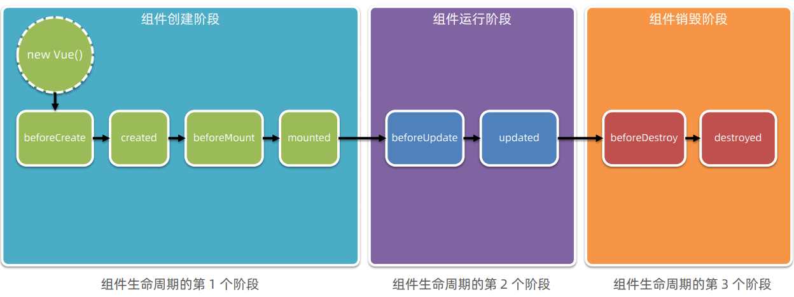
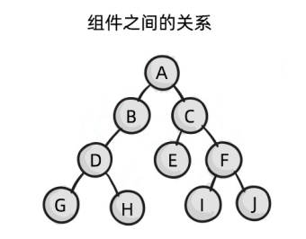
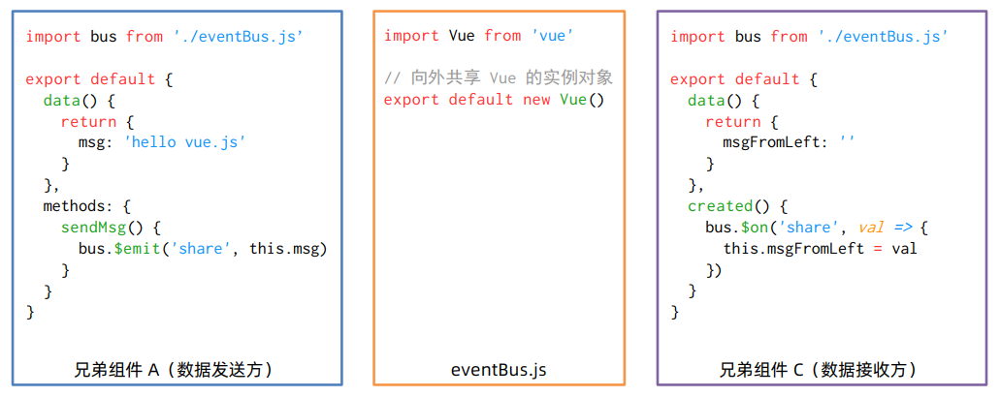
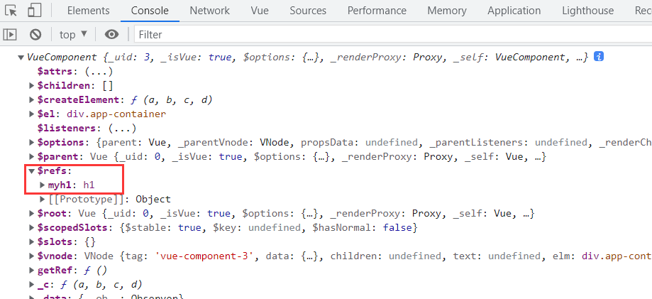
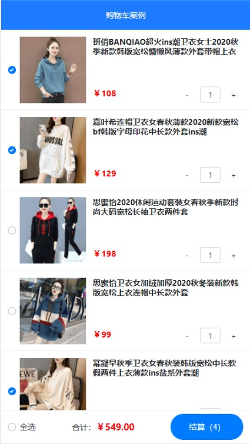

# Vue 的生命周期 、 数据共享  

## 学习目标

- [ ] 掌握组件生命周期的三个阶段
- [ ] 了解8个生命周期函数
- [ ] 掌握组件中父向子、子向父及兄弟组件之间的数据传递与接收
- [ ] 掌握 ref 的作用及应用场景
- [ ] 掌握 $nextTick(cb) 的作用及应用场景

## 一、组件的生命周期  

### 1.1 生命周期 & 生命周期函数  

**生命周期**（Life Cycle）是指一个组件从**创建 -> 运行 -> 销毁**的整个阶段，**强调的是一个时间段**。  

**生命周期函数**是由 vue 框架提供的**内置函数**，会伴随着组件的生命周期，**自动按次序执行**。  

> 注意：生命周期强调的是时间段，生命周期函数强调的是时间点。  

### 1.2 组件生命周期函数的分类  

组件生命周期分为三个阶段：组件创建阶段、组件运行阶段、组件销毁阶段




参考 vue 官方文档给出的“生命周期图示”，进一步理解组件生命周期执行的过程：`https://cn.vuejs.org/v2/guide/instance.html#生命周期图示`  

参考案例文件夹中-生命周期.png

## 二、组件之间的数据共享  

### 2.1 组件之间的关系  

在项目开发中，组件之间的最常见的关系分为如下两种：  

- 父子关系
- 兄弟关系



### 2.2 父子组件之间的数据共享  

父子组件之间的数据共享分为：  

- 父 -> 子共享数据  
- 子 -> 父共享数据  


#### 2.2.1 父组件向子组件共享数据  

父组件向子组件共享数据需要使用**自定义属性**。示例代码如下：  

```vue
// 父组件
<Son :msg="message" :user="userinfo"></Son>
data() {
    return {
      message: "hello vue.js",
      userinfo: { name: "candy", age: 18 },
    };
  }
```

```vue
// 子组件
<template>
    <div>
        <h5>Son 组件</h5> 
        <p>父组件传递过来的msg值是: {{ msg }}</p>
        <p>父组件传递过来的user值是: {{ user }}</p>
    </div>
</template>

props:['msg','user']
```

> 注意：不建议直接修改 props 的值

#### 2.2.2 子组件向父组件共享数据  

子组件向父组件共享数据使用**自定义事件**。示例代码如下：  

```vue
// 子组件
<script>
export default {
  data() {
    return {
      count: 0,
    };
  },
  methods: {
    add() {
        // 子组件的count值自增+1
      this.count += 1;
      // 修改数据时，通过 $emit() 触发自定义事件
      this.$emit("numchange", this.count);
    },
  },
};
</script>
```

```vue
// 父组件
<Right @numchange="getNewCount"></Right>

export default {
  data() {
    return {
      message: "hello vue.js",
      userinfo: { name: "candy", age: 18 },
      countFromSon: 0,
    };
  },
  components: {
    Left,
    Right,
  },
  methods: {
    getNewCount(val) {
      this.countFromSon = val;
    },
  },
};
```

#### 2.2.3 兄弟组件之间的数据共享

在 vue2.x 中，兄弟组件之间数据共享的方案是 EventBus  。



**EventBus 的使用步骤**

- 创建 eventBus.js 模块，并向外共享一个 Vue 的实例对象  
- 在数据发送方，调用 bus.$emit('事件名称', 要发送的数据) 方法触发自定义事件  
- 在数据接收方，调用 bus.$on('事件名称', 事件处理函数) 方法注册一个自定义事件  

代码如下

```vue
// 数据发送方
<button @click="send">向right发送</button>
<script>
import bus from "./EventBus.js";
export default {
  props: ["msg", "user"],
  data() {
    return {
      message: "hello right",
    };
  },
  methods: {
    send() {
      bus.$emit("share", this.message);
    },
  },
};
</script>
```

```js
// EventBus
import Vue from "vue";

export default new Vue();
```

```vue
// 数据接收方
<p>{{ msgFromLeft }}</p>
<script>
import bus from "./EventBus.js";
export default {
  data() {
    return {
      msgFromLeft: "",
    };
  },
  created() {
    bus.$on("share", (val) => {
      this.msgFromLeft = val;
    });
  },
};
</script>
```

## 三、ref 引用  

> 以下内容代码参考 demo-2

### 3.1 什么是 ref 引用  

ref 用来辅助开发者在**不依赖于 jQuery 的情况下**，获取 DOM 元素或组件的引用。  

每个 vue 的组件实例上，都包含一个 **$refs 对象**，里面存储着对应的 DOM 元素或组件的引用。默认情况下，**组件的 $refs 指向一个空对象**。  

```vue
<template>
  <div>
    <h1>Ref 组件</h1>
    <button @click="getRef">获取 $refs 引用</button>
  </div>
</template>
<script>
export default {
  methods: {
    getRef() {
      console.log(this);// this 是当前组件的实例对象，this.$refs 默认指向空对象
    },
  },
};
</script>
```



### 3.2 使用 ref 引用 DOM 元素  

如果想要使用 ref 引用页面上的 DOM 元素，则可以按照如下的方式进行操作：  

```vue
<template>
  <div>
    <h1 ref="myh1">Ref 组件</h1>
    <button @click="getRef">获取 $refs 引用</button>
  </div>
</template>
<script>
export default {
  methods: {
    getRef() {
        // 通过 this.refs.引用的名称，可以获取到 DOM 元素的引用
      console.log(this.$refs.myh1);
        // 操作 DOM 元素，把文本颜色改为红色
      this.$refs.myh1.style.color = "red";
    },
  },
};
</script>
```

### 3.3 使用 ref 引用组件实例  

如果想要使用 ref 引用页面上的组件实例，则可以按照如下的方式进行操作：  

```vue
<!--使用ref 属性，为对应的"组件"添加引用名称-->
<my-counter ref="counterRef"></my-counter>
<button @click="getRef">获取$refs 引用</button>

methods: {
    getRef() {
        // 通过this.$refs.引用的名称可以引用组件的实例
        console.log(this.$refs.counterRef)
        // 引用到组件的实例之后，就可以调用组件上的 methods 方法
        this.$refs.counterRef.add()
    },
}

```

需求：子组件有一个count计数（每次加1）和重置count的功能。在父组件也有一个重置的功能，可以重置子组件的count。

```vue
// 父组件
<template>
  <div class="app-container">
    <h1 ref="myh1">App 根组件</h1>
    <button @click="getRef">获取 $refs 引用</button>
    <button @click="comLeftResetCount">重置Left组件count值为0</button>
    <hr />

    <div class="box">
      <!-- 渲染 Left 组件和 Right 组件 -->
      <Left ref="comLeft"></Left>
    </div>
  </div>
</template>

<script>
import Left from "@/components/Left.vue";
export default {
  methods: {
    getRef() {
      // console.log(this);
      this.$refs.myh1.style.color = "red";
    },
    comLeftResetCount() {
      console.log(this.$refs.comLeft);
      // 引用到组件的实例之后，就可以调用组件上的methods方法
        // 方法一
      this.$refs.comLeft.resetCount();// 此方法在子组件中
        // 方法二
      this.$refs.comLeft.count = 0;
    },
  },
  components: {
    Left,
  },
};
</script>
```

```vue
// 子组件
<template>
  <div class="left-container">
    <h3>Left 组件</h3>
    <p>count 的值是{{ count }}</p>
    <button @click="count += 1">+1</button>
    <button @click="resetCount">重置</button>
  </div>
</template>

<script>
export default {
  data() {
    return {
      count: 0,
    };
  },
  methods: {
    resetCount() {
      this.count = 0;
    },
  },
};
</script>
```

### 3.4 控制文本框和按钮的按需切换  

通过布尔值 inputVisible 来控制组件中的文本框与按钮的按需切换。示例代码如下：  

```vue
<input type="text" v-if="inputVisible" ref="iptRef" />
<button v-else @click="showInput">显示输入框</button>
export default {
  data() {
    return {
      inputVisible: false,
    };
  },
  methods: {
    showInput() {
      this.inputVisible = true;
    },
    showButton() {
      this.inputVisible = false;
    },
  },
```

> 此时可以完成切换，但是输入框无法自动获取焦点

### 3.5 让文本框自动获得焦点  

当文本框展示出来之后，如果希望它立即获得焦点，则可以为其添加 ref 引用，并调用原生 DOM 对象的.focus() 方法即可。示例代码如下：  

```vue
<input type="text" v-if="inputVisible" ref="iptRef" />
<button v-else @click="showInput">显示输入框</button>
export default {
  data() {
    return {
      inputVisible: false,
    };
  },
  methods: {
    showInput() {
      this.inputVisible = true;
      this.$refs.iptRef.focus();
    },
    showButton() {
      this.inputVisible = false;
    },
  },
}
```

> 注意：此时会报错，因为生命周期原因，在更新数据之后立马就获取元素是获取不到的。数据已经更新，但是DOM还是旧的DOM

### 3.6 this.$nextTick(cb) 方法  

组件的 $nextTick(cb) 方法，会把 cb 回调推迟到下一个 DOM 更新周期之后执行。通俗的理解是：等组件的DOM 更新完成之后，再执行 cb 回调函数。从而能保证 cb 回调函数可以操作到最新的 DOM 元素。  

```vue
<input type="text" v-if="inputVisible" ref="iptRef" />
<button v-else @click="showInput">显示输入框</button>
export default {
  data() {
    return {
      inputVisible: false,
    };
  },
  methods: {
    showInput() {
      this.inputVisible = true;
      this.$nextTick(() => {
        this.$refs.iptRef.focus();
      });
    },
}
```

## 四、购物车案例



### 4.1 实现步骤

#### 4.1.1 初始化项目基本结构

- 素材参考资料文件夹中 demo-cart 

#### 4.1.2 Header 组件

- 在App.vue中引入Header组件，并渲染到页面

```vue
// App.vue
<template>
  <div class="app-container">
    <Header></Header>
  </div>
</template>

<script>
// 导入需要的组件
import Header from "@/components/Header/Header.vue";
export default {
  components: {
    Header,
  },
};
</script>


```

#### 4.1.3 Goods 组件

1. 将 Goods 组件导入到 App.vue
2. 安装 axios 包用作 ajax 请求
3. 在 methods 中封装方法 initCartList 获取商品数据，因为需要把获取的数据渲染到页面，所以要把数据绑定到data中的list
4. 在生命周期函数 created 中调用 initCartList （在vm实例化时调用）
5. 使用 v-for 将数据遍历到页面，此时页面需要调整因为所有标题图片都是一样的，参考下一步
6. 使用自定义属性将需要修改的数据（id、商品标题、图片、价格、勾选状态）发送给子组件（Goods.vue）
7. 在Goods.vue中定义props，并将接收到的值放到标签，参考如下代码

```vue
// App.vue
<template>
  <div class="app-container">
      
    <Header></Header>
    <Goods
      v-for="item in list"
      :key="item.id"
      :id="item.id"
      :title="item.goods_name"
      :pic="item.goods_img"
      :price="item.goods_price"
      :state="item.goods_state"
    ></Goods>
  </div>
</template>

<script>
// 导入需要的组件
import Header from "@/components/Header/Header.vue";
import Goods from "@/components/Goods/Goods.vue";

// 导入所需要的包
import axios from "axios";
export default {
  components: {
    Header,
    Goods,
  },
  data() {
    return {
      list: [],
    };
  },
  methods: {
    async initCartList() {
      const { data: res } = await axios.get(
        "/list.json"
      );
      console.log(res);
      if (res.status === 200) {
        this.list = res.list;
      }
    },
  },
  created() {
    // 调用请求数据的接口
    this.initCartList();
  },
};
</script>
```

```vue
// Goods.vue
<template>
  <div class="goods-container">
    <!-- 左侧图片 -->
    <div class="thumb">
      <div class="custom-control custom-checkbox">
        <!-- 复选框 -->
        <input
          type="checkbox"
          class="custom-control-input"
          id="cb1"
          :checked="state"
        />
        <label class="custom-control-label" for="cb1">
          <!-- 商品的缩略图 -->
          
        </label>
      </div>
    </div>
    <!-- 右侧信息区域 -->
    <div class="goods-info">
      <!-- 商品标题 -->
      <h6 class="goods-title">{{ title }}</h6>
      <div class="goods-info-bottom">
        <!-- 商品价格 -->
        <span class="goods-price">￥{{ price }}</span>
        <!-- 商品的数量 -->
      </div>
    </div>
  </div>
</template>

<script>
export default {
  props: {
     // 商品的ID
    // 子组件商品的勾选状态变化之后，需要通过子->父的形式
    // 通知父组件根据 ID 修改对应商品的勾选状态
    id: {
      required: true,
      type: Number,
    },
    // 要渲染的商品图片
    pic: {
      default: "",
      type: String,
    },
    // 要渲染的商品标题
    title: {
      default: "",
      type: String,
    },
    // 要渲染的商品价格
    price: {
      default: 0,
      type: Number,
    },
    // 商品的选中状态
    state: {
      default: true,
      type: Boolean,
    },
  },
};
</script>
```

**修改商品列表选中状态**

1. 子向父传递数据
2. 自定义 state-change 事件，将最新的状态发送给父组件
3. template部分修改input的id和lable的for属性，防止写死

```vue
// Goods组件
<template>
  <div class="goods-container">
    <!-- 左侧图片 -->
    <div class="thumb">
      <div class="custom-control custom-checkbox">
        <!-- 复选框 -->
        <input
          type="checkbox"
          class="custom-control-input"
          :id="'cb' + id"
          :checked="state"
          @change="stateChange"
        />
        <label class="custom-control-label" :for="'cb' + id">
          <!-- 商品的缩略图 -->
          
        </label>
      </div>
    </div>
    <!-- 右侧信息区域 -->
    <div class="goods-info">
      <!-- 商品标题 -->
      <h6 class="goods-title">{{ title }}</h6>
      <div class="goods-info-bottom">
        <!-- 商品价格 -->
        <span class="goods-price">￥{{ price }}</span>
        <!-- 商品的数量 -->
      </div>
    </div>
  </div>
</template>

<script>
export default {
  props: {
    // 商品的ID
    // 子组件商品的勾选状态变化之后，需要通过子->父的形式
    // 通知父组件根据 ID 修改对应商品的勾选状态
    id: {
      required: true,
      type: Number,
    },
    // 要渲染的商品图片
    pic: {
      default: "",
      type: String,
    },
    // 要渲染的商品标题
    title: {
      default: "",
      type: String,
    },
    // 要渲染的商品价格
    price: {
      default: 0,
      type: Number,
    },
    // 商品的选中状态
    state: {
      default: true,
      type: Boolean,
    },
  },
  methods: {
    stateChange(e) {
      // 获取最新的选中状态
      const newState = e.target.checked;
      // 使用自定义事件发送给父组件
      this.$emit("state-change", { id: this.id, value: newState });
    },
  },
};
</script>
```

1. 绑定自定义事件 state-change
2. 在 methods 封装 getNewState 方法，将最新的状态进行修改

```vue
<Goods
  v-for="item in list"
  :key="item.id"
  :id="item.id"
  :title="item.goods_name"
  :pic="item.goods_img"
  :price="item.goods_price"
  :state="item.goods_state"
  @state-change="getNewState"
></Goods>

getNewState(val) {
  this.list.some((item) => {
    if (item.id === val.id) {
      // 修改状态的值
      item.goods_state = val.value;
      // 终止后续循环
      return true;
    }
  });
},
```

#### 4.1.4 Footer 组件

1. 在 App 组件中导入使用 Footer 组件

```vue
<template>
  <div class="app-container">
    <!-- Header 头部区域 -->
    <Header></Header>
    <!-- 循环渲染每一个商品的信息 -->
    <Goods
      v-for="item in list"
      :key="item.id"
      :id="item.id"
      :title="item.goods_name"
      :pic="item.goods_img"
      :price="item.goods_price"
      :state="item.goods_state"
      @state-change="getNewState"
    ></Goods>
    <!-- Footer 区域 -->
    <Footer></Footer>
  </div>
</template>

// 导入 Footer 组件
import Footer from "@/components/Footer/Footer.vue";

// 注册 Footer 组件
components: {
    Header,
    Goods,
    Footer,
},
```

**商品全部选中，全选按钮选中**

> 核心：父向子传递数据。计算属性。

1. 在 App 组件中使用计算属性来动态获取全选状态是 true 还是 false
2. 在 Footer 组件中注册自定义属性来接收全选状态的值
3. 在 App 组件中使用自定义属性将值进行传递

```vue
App.vue
<Footer :isfull="fullState"></Footer>

// 计算属性
computed: {
    // 动态计算出全选的状态 是true 还是 false
    fullState() {
      return this.list.every((item) => item.goods_state);
    },
},
```

```vue
Footer.vue
<!-- 左侧的全选 -->
<div class="custom-control custom-checkbox">
  <input
    type="checkbox"
    class="custom-control-input"
    id="cbFull"
    :checked="isfull"
  />
  <label class="custom-control-label" for="cbFull">全选</label>
</div>

// 注册自定义属性用来接收 父组件传递过来的值
props: {
    isfull: {
      default: true,
      type: Boolean,
    },
},
```

**全选按钮选中，所有商品选中**

> 核心：子向父传递内容。自定义事件

1. 在 Footer 组件中绑定 change 事件，使用自定义事件将最新的全选状态传递到 App 组件
2. 在 App 组件中绑定自定义事件来接收传递过来的值
3. 在 App 组件 methods 中创建事件处理程序来接收传递过来的值并进行修改

```vue
Footer.vue
methods: {
    // 监听全选按钮的变化
    fullChange(e) {
      this.$emit("full-change", e.target.checked);
    },
},

<input
    type="checkbox"
    class="custom-control-input"
    id="cbFull"
    :checked="isfull"
    @change="fullChange"
/>
```

```vue
App.vue
<Footer :isfull="fullState" @full-change="getFullState"></Footer>

// 接收Footer子组件传递过来的全选按钮的状态
getFullState(val) {
  // console.log(val);
  this.list.forEach((item) => (item.goods_state = val));
},
```

**计算总价格**

1. 在 Footer 组件中创建 amount 自定义属性，用来接收父组件传递过来的值
2. 在 App 组件 computed 中创建计算属性 amt 将计算出来的结果传递到 Footer 

```vue
App.vue

<Footer
  :isfull="fullState"
  :amount="amt"
  @full-change="getFullState"
></Footer>

// 动态计算选中商品总价
amt() {
	// 先 filter 将选中商品过滤
    // 再使用 reduce 进行累加
  return this.list
    .filter((item) => item.goods_state)
    .reduce((total, item) => {
      return (total += item.goods_price * item.goods_count);
    }, 0);
},
```

```vue
Footer.vue
<!-- 中间的合计 -->
<div>
  <span>合计：</span>
  <span class="total-price">￥{{ amount.toFixed(2) }}</span>
</div>

props: {
	// 全选的状态
    isfull: {
      default: true,
      type: Boolean,
    },
	// 总价格
    amount: {
      default: 0,
      type: Number,
    },
},
```

#### 4.1.5 Counter 组件

在 Goods 组件中引入 Counter 组件并使用

```vue
Goods.vue

<!-- 商品的数量 -->
<Counter></Counter>

import Counter from "@/components/Counter/Counter.vue";

  components: {
    Counter,
  },
```

**动态渲染购买商品数量**

1. 因为我所需的数据在 App 组件中所以要修改 App 组件，通过自定义属性将商品数量传给 Goods 组件
2. 在 Goods 组件中创建 props 自定义属性 count 来接收 App 组件传递过来的数量值
3. 将 Goods 组件接收到的值通过自定义属性传递给 Counter 组件
4. 在 Counter 组件中定义自定义属性 num 来接收 Goods 组件传递过来的数量
5. 因为 Counter 组件中有加减按钮可以修改商品数量，所以还需要接收ID的值，将来告诉App组件修改的是哪一个商品

```vue
App.vue
<Goods
  v-for="item in list"
  :key="item.id"
  :id="item.id"
  :title="item.goods_name"
  :pic="item.goods_img"
  :price="item.goods_price"
  :state="item.goods_state"
  :count="item.goods_count"
  @state-change="getNewState"
></Goods>
```

```vue
Goods.vue
<!-- 商品的数量 -->
<Counter :num="count" :id="id"></Counter>

// 在 props 中添加以下内容
// 商品的购买数量
count: {
  default: 1,
  type: Number,
},
```

```vue
Counter.vue
<!-- 购买的数量 -->
<span class="number-box">{{ num }}</span>

props: {
	id:{
	  type:Number,
	  required:true
	},
    // 接收到商品的数量 num
    num: {
      default: 1,
      type: Number,
    },
},

```

**修改商品数量**

核心：Counter 组件中的数据最终要发送给App组件，他们的关系是父子孙关系，使用 EventBus 可以不用一层一层将数据传递。

1. 在 components 文件夹中创建 eventBus.js，并在数据发送（Counter）和接收方（App）都导入这个对象

```
eventBus.js

import Vue from "vue";

export default new Vue();
```

```vue
Counter.vue

import bus from "@/components/eventBus.js"
```

```vue
App.vue

import bus from "@/components/eventBus.js"
```

2. 在 Counter 组件中给加号添加点击事件 add，将要修改的商品的id和数量发送给App组件

```vue
Counter.vue
<button type="button" class="btn btn-light btn-sm" @click="add">+</button>

methods: {
    add() {
      // 准备要发送到App的数据 格式为 {id,value}
      const obj = { id: this.id, value: this.num + 1 };
      bus.$emit("share", obj);
    },
},
```

3. 在 App 组件的 声明周期 created 函数中来接收 Counter 组件传递过来的值并做修改

```vue
App.vue

created() {
    // 调用请求数据的接口
    this.initCartList();
    // 接收 Counter 组件中传递过来的商品id及数量
    bus.$on("share", (val) => {
      this.list.some((item) => {
        if (item.id === val.id) {
          item.goods_count = val.value;
          return true;
        }
      });
    });
},
```

> 数量 -1 与 +1 操作类似

#### 4.1.6 计算勾选商品的总数量

1. 在 App 组件中使用计算属性，将计算出来的结果通过自定义属性的方式传递给 Footer 组件

```vue
App.vue
<!-- Footer 区域 -->
<Footer
  :isfull="fullState"
  :amount="amt"
  :all="total"
  @full-change="getFullState"
></Footer>

在 computed 中添加 total 属性
// 计算已勾选商品的总数量
total() {
  return this.list
    .filter((item) => item.goods_state)
    .reduce((total, item) => {
      return (total += item.goods_count);
    }, 0);
},
```

```vue
Footer.vue

<!-- 结算按钮 -->
<button type="button" class="btn btn-primary btn-settle">
  结算（{{ all }}）
</button>

在 props 中定义 all 用来接收 App 组件传递过来的值
all: {
  default: 0,
  type: Number,
},
```


