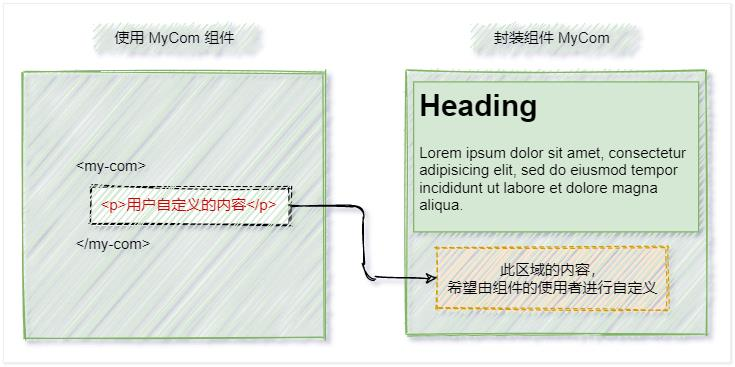

# vue 动态组件 & 插槽 & 自定义指令

## 学习目标

- [ ] 掌握 keep-alive 元素的基本使用
- [ ] 掌握插槽的作用及基本使用
- [ ] 掌握如何定义和使用自定义指令

## 一、动态组件

### 1.1 什么是动态组件  

动态组件指的是**动态切换组件的显示与隐藏**。  

### 1.2 如何实现动态组件渲染  

vue 提供了一个内置的 `<component>` 组件，专门用来实现动态组件的渲染。

`<component>` 标签是 vue 内置的，作用就是做为组件的占位符

is 属性的值是要渲染的组件的名字

示例代码如下：  

```vue
data(){
    // 1.当前要渲染的组件名称
    return { comName: 'Left' }
}

<!-- 2.通过is属性，动态指定要渲染的组件-->
<component :is="comName"></component>

<!-- 3.点击按钮，动态切换组件的名称-->
<button @click="comName = 'Left'"> 展示 Left 组件 </button>
<button @click="comName = 'Right'"> 展示 Right 组件 </button>

```

### 1.3 使用 keep-alive 保持状态  

默认情况下，切换动态组件时无法保持组件的状态。此时可以使用 vue 内置的 `<keep-alive>` 组件保持动态组件的状态。示例代码如下：  

```vue
<keep-alive>
	<component :is="comName"></component>
</keep-alive>
```

keep-alive 可以把内部的组件进行缓存

### 1.4 keep-alive 对应的生命周期函数  

当组件**被缓存**时，会自动触发组件的 `deactivated` 生命周期函数。
当组件**被激活**时，会自动触发组件的 `activated` 生命周期函数。  

```vue
<script>
export default {
  created() {
    console.log("组件被创建了");
  },
  destroyed() {
    console.log("组件被销毁了");
  },
  // 当组件第一被创建的时候，既会执行 created 生命周期函数，也会执行 activated 生命周期
  // 当组件被激活的时候只会触发 activated ，不会触发 created 因为组件没有被重新创建。
  activated() {
    console.log("Left组件被激活了! ");
  },
  deactivated() {
    console.log("Left组件被缓存了! ");
  },
};
</script>
```

### 1.5 keep-alive 的 include 属性  

include 属性用来指定：只有名称匹配的组件会被缓存。多个组件名之间使用英文的逗号分隔：  

```vue
<keep-alive include="Left,Right">
    <component :is="comName"></component>
</keep-alive>
// include 和 exclude 只能选一个，不能同时用，include是用来指定包含被缓存的组件，exclude是用来排除被缓存的组件
<keep-alive exclude="Right">
    <component :is="comName"></component>
</keep-alive>
```

## 二、插槽

### 2.1 什么是插槽  

插槽（Slot）是 vue 为组件的**封装者**提供的能力。允许开发者在封装组件时，把**不确定的、希望由用户指定的部分**定义为插槽。  



> 可以把插槽认为是组件封装期间，为用户预留的内容的占位符。  

### 2.2 插槽的基础用法  

在封装组件时，可以通过 `<slot>` 元素定义插槽，从而为用户预留内容占位符。示例代码如下：  

```vue
// 子组件
<template>
  <div class="left-container">
    <h3>Left 组件</h3>
    <hr />
    <p>子组件的第一个 p 标签</p>
    <!-- 通过 slot 标签，为用户预留内容占位符（插槽） -->
    <slot></slot>
    <p>子组件最后一个 p 标签</p>
  </div>
</template>
// 父组件
<template>
  <div class="app-container">
    <h1>App 根组件</h1>
    <hr />
    <div class="box">
      <!-- 渲染 Left 组件和 Right 组件 -->
      <!-- 在使用组件时，为插槽指定具体的内容 -->
      <Left>
        <p>用户自定义内容</p>
      </Left>
    </div>
  </div>
</template>
```

**v-slot 指令 **

vue 官方规定：每一个 slot 插槽，都要有一个 name 名称，如果省略了 slot 的 name 属性，则有一个默认名称叫做 default。

默认情况下，在使用组件的时候，提供的内容都会被填充到名字为default 的插槽之中

如果要把内容填充到指定名称的插槽中，需要使用`v-slot:`这个指令，`v-slot:`指令后面要跟插槽的名字。

示例代码如下：

```vue
// 父组件
<Left>
    <template v-slot:default>
      <p>用户自定义内容</p>
    </template>
</Left>
// 子组件
<template>
  <div class="left-container">
    <h3>Left 组件</h3>
    <hr />
    <p>子组件的第一个 p 标签</p>
    <!-- 通过 slot 标签，为用户预留内容占位符（插槽） -->
    <slot name="default"></slot>
    <p>子组件最后一个 p 标签</p>
  </div>
</template>
```

> v-slot:指令不能直接用在元素身上，必须用在template 标签上
>
> template这个标签，它是一个虚拟的标签，只起到包裹性质的作用，但是，不会被渲染为任何实质性的html元素

#### 2.2.1 没有预留插槽的内容会被丢弃  

如果在封装组件时没有预留任何 `<slot>` 插槽，则用户提供的任何自定义内容都会被丢弃。示例代码如下：  

```vue
// 子组件
<template>
  <div class="left-container">
    <h3>Left 组件</h3>
    <hr />
    <p>子组件的第一个 p 标签</p>
    <!-- 封装组件时，没有预留任何插槽 -->
    <p>子组件最后一个 p 标签</p>
  </div>
</template>
// 父组件
<template>
  <div class="app-container">
    <h1>App 根组件</h1>
    <hr />
    <div class="box">
	  <!-- 自定义的内容会被丢弃 -->
      <Left>
        <p>用户自定义内容</p>
      </Left>
    </div>
  </div>
</template>
```

#### 2.2.2 后备内容  

封装组件时，可以为预留的 `<slot>` 插槽提供后备内容（默认内容）。如果组件的使用者没有为插槽提供任何内容，则后备内容会生效。示例代码如下：  

```vue
<template>
  <div class="left-container">
    <h3>Left 组件</h3>
    <hr />
    <p>子组件的第一个 p 标签</p>
    <slot>这是后备内容</slot>
    <p>子组件最后一个 p 标签</p>
  </div>
</template>
```

### 2.3 具名插槽

如果在封装组件时需要预留多个插槽节点，则需要为每个 `<slot>` 插槽指定具体的 name 名称。这种带有具体名称的插槽叫做“具名插槽”。示例代码如下：  

```vue
// 子组件
<template>
  <div class="article-container">
    <!-- 文章标题 -->
    <div class="header-box">
      <slot name="title"></slot>
    </div>
    <!-- 文章内容 -->
    <div class="content-box">
      <slot name="content"></slot>
    </div>
    <!-- 文章作者 -->
    <div class="footer-box">
      <slot name="author"></slot>
    </div>
  </div>
</template>
```

#### 2.3.1 为具名插槽提供内容  

在向具名插槽提供内容的时候，我们可以在一个 `<template>` 元素上使用 v-slot 指令，并以 v-slot 的参数的形式提供其名称。示例代码如下：  

```vue
// 父组件
<Article>
  <template #title>
    <h3>静夜思</h3>
  </template>

  <template #content>
    <div>
      <p>床前明月光，</p>
      <p>疑是地上霜。</p>
      <p>举头望明月，</p>
      <p>低头思故乡。</p>
    </div>
  </template>

  <template #author>
    <div>作者：李白</div>
  </template>
</Article>
```

#### 2.3.2 具名插槽的简写形式  

跟 v-on 和 v-bind 一样，v-slot 也有缩写，即把参数之前的所有内容 (v-slot:) 替换为字符 #。例如 `v-slot:header `可以被重写为 `#header`  。

### 2.4 作用域插槽  

在封装组件的过程中，可以为预留的 `<slot>` 插槽绑定 props 数据，这种带有 props 数据的 `<slot>` 叫做“作用域插槽”。示例代码如下：  

```vue
<tbody> 
	<!-- 下面的slot 是一个作用域插槽-->
	<slot v-for="item in list" :user="item"></slot>
</tbody>
```

#### 2.4.1 使用作用域插槽  

可以使用 `v-slot:` 的形式，接收作用域插槽对外提供的数据。示例代码如下：  

```vue
<my-com-3>
    <!-- 1.接收作用域插槽对外提供的数据-->
    <template v-slot:default="scope">
        <tr>
            <!-- 2.使用作用域插槽的数据-->
            <td> {{ scope }}</td>
        </tr>
    </template>
</my-com-3>
```

#### 2.4.2 解构插槽 Prop  

作用域插槽对外提供的数据对象，可以使用解构赋值简化数据的接收过程。示例代码如下：  

```vue
<my-com-3>
    <!-- v-slot: 可以简写成# -->
    <!-- 作用域插槽对外提供的数据对象，可以通过"解构赋值"简化接收的过程-->
    <template #default="{user}">
        <tr>
            <td> {{user.id}}</td>
            <td> {{user.name}}</td>
            <td> {{user.state}}</td>
        </tr>
    </template>
</my-com-3>

```

### 2.5 使用插槽重构购物车案例

> 代码参考demo-cart


## 三、自定义指令

### 3.1 什么是自定义指令  

vue 官方提供了 v-text、v-for、v-model、v-if 等常用的指令。除此之外 vue 还允许开发者自定义指令。  

### 3.2 自定义指令的分类  

vue 中的自定义指令分为两类，分别是：  

- 私有自定义指令  
- 全局自定义指令  

### 3.3 私有自定义指令  

在每个 vue 组件中，可以在 directives 节点下声明私有自定义指令。示例代码如下：  

```js
directives: {
    color: {
        //为绑定到的HTML 元素设置红色的文字
        bind(el) {
            //形参中的el是绑定了此指令的、原生的DOM对象
            el.style.color = 'red'
        }
    }
}
```

### 3.4 使用自定义指令  

在使用自定义指令时，需要加上 v- 前缀。示例代码如下：  

 ```vue
<!-- 声明自定义指令时，指令的名字是 color -->
<!-- 使用自定义指令时，需要加上 v- 指令前缀 -->
<h3 v-color>静夜思</h3>
 ```

### 3.5 为自定义指令动态绑定参数值  

在 template 结构中使用自定义指令时，可以通过等号（=）的方式，为当前指令动态绑定参数值：  

```vue
<p v-color="color">这是一个p标签</p>

data() {
    return {
      color: "blue",
    };
}
```

### 3.6 通过 binding 获取指令的参数值  

在声明自定义指令时，可以通过形参中的第二个参数，来接收指令的参数值：  

```vue
directives: {
    // 定义名为 color 的指令，指向一个配置对象
    color: {
      bind(el, binding) {
        el.style.color = binding.value;
      },
    },
},
```

### 3.7 update 函数  

bind 函数只调用 1 次：当指令第一次绑定到元素时调用，当 DOM 更新时 bind 函数不会被触发。 update 函数会在每次 DOM 更新时被调用。示例代码如下：  

```vue
  directives: {
    // 指令第一次被绑定到元素时被调用
    color: {
      bind(el, binding) {
        el.style.color = binding.value;
      },
    // 每次 DOM 更新时被调用
      update(el, binding) {
        el.style.color = binding.value;
      },
    },
  },
```

### 3.8 函数简写  

如果 insert 和update 函数中的逻辑完全相同，则对象格式的自定义指令可以简写成函数格式：  

```vue
  directives: {
    color(el, binding) {
      el.style.color = binding.value;
    },
  },
```

### 3.9 全局自定义指令  

全局共享的自定义指令需要通过"Vue.directive()"进行声明，示例代码如下：  

```vue
// 参数1 字符串类型，表示全局自定义指令的名字
// 参数2 对象，用来接收指令的参数值
Vue.directive("color", (el, binding) => {
  el.style.color = binding.value;
});
```

