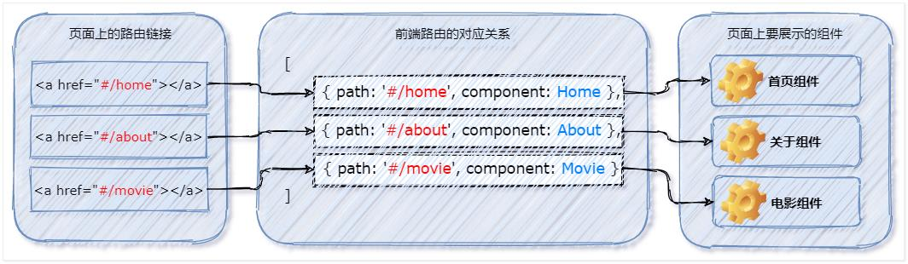
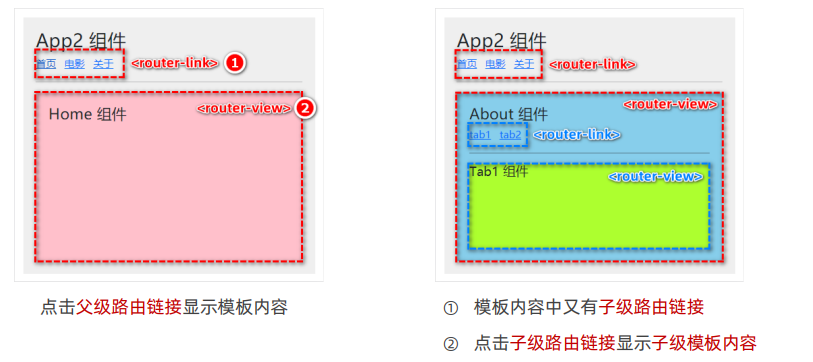
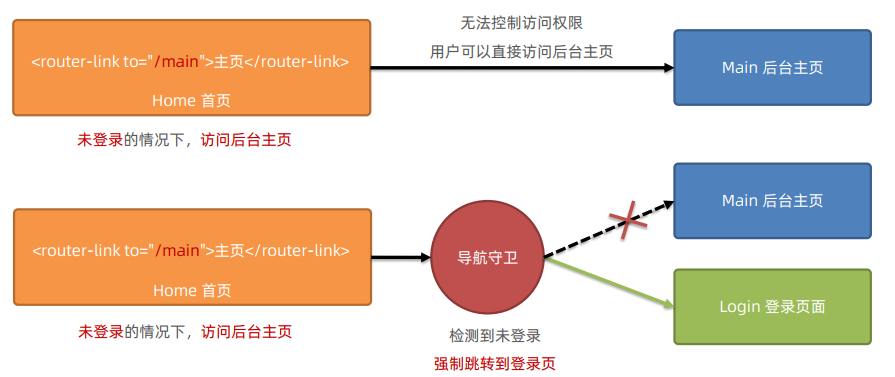
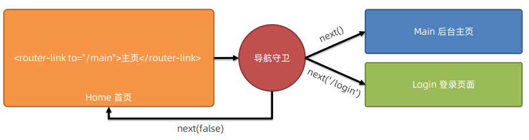

# vue 路由

## 学习目标

- [ ] 了解前端路由的工作方式
- [ ] 掌握vue-router的使用步骤
- [ ] 掌握声明式导航和编程式导航
- [ ] 掌握动态路由匹配及接收参数
- [ ] 掌握嵌套路由的使用
- [ ] 了解导航守卫的作用
- [ ] 掌握导航守卫的使用步骤

## 一、路由

### 1.1 前端路由的概念与原理  

#### 1.1.1 什么是路由  

路由（英文：router）就是对应关系。  

#### 1.1.2 SPA 与前端路由  

SPA 指的是一个 web 网站只有唯一的一个 HTML 页面，所有组件的展示与切换都在这唯一的一个页面内完成。此时，不同组件之间的切换需要通过前端路由来实现。  

结论：在 SPA 项目中，不同功能之间的切换，要依赖于前端路由来完成。

#### 1.1.3 什么是前端路由  

通俗易懂的概念：Hash 地址与组件之间的对应关系。  

#### 1.1.4 前端路由的工作方式  

1. 用户点击了页面上的路由链接  
2. 导致了 URL 地址栏中的 Hash 值发生了变化  
3. 前端路由监听了到 Hash 地址的变化  
4. 前端路由把当前 Hash 地址对应的组件渲染都浏览器中  



结论：前端路由，指的是 Hash 地址与组件之间的对应关系。

#### 1.1.5 实现简易的前端路由

> 打开资料中 router-demo1

步骤1：通过 `<component>` 标签，结合 comName 动态渲染组件。示例代码如下：  

```vue
<!-- 通过 is 属性，指定要展示的组件的名称 -->
<component :is="comName"></component>
```

```js
export default {
  name: 'App',
  data(){
    return {
      // 要展示的组件的名称
      comName:'Home'
    }
  }
}
```

步骤2：在 App.vue 组件中，为 `<a>` 链接添加对应的 hash 值：  

```vue
<a href="#/Home">首页</a>
<a href="#/Movie">电影</a>
<a href="#/About">关于</a>
```

步骤3：在 **created** 生命周期函数中，监听浏览器地址栏中 **hash 地址**的变化，动态切换要展示的组件的名称：  

```js
created() {
    window.onhashchange = () => {
      console.log(location.hash)
      switch (location.hash) {
        case '#/Home': // 点击 首页 的链接
          this.comName = 'Home'
          break
        case '#/Movie': // 点击 电影 的链接
          this.comName = 'Movie'
          break
        case '#/About': // 点击 关于 的链接
          this.comName = 'About'
          break
      }
    }
}

```

### 1.2 vue-router 的基本使用  

#### 1.2.1 什么是 vue-router  

vue-router 是 vue.js 官方给出的**路由解决方案**。它只能结合 vue 项目进行使用，能够轻松的管理 SPA 项目中组件的切换。  

vue-router 的官方文档地址：https://router.vuejs.org/zh/  

#### 1.2.2 vue-router 安装和配置的步骤  

- 安装 vue-router 包
- 创建路由模块
- 导入并挂载路由模块
- 声明路由链接和占位符  

**在项目中安装 vue-router  **

在 vue2 的项目中，安装 vue-router 的命令如下：  

```shell
npm i vue-router@3.5.2 -S
```

**创建路由模块  **

在 src 源代码目录下，新建 router/index.js 路由模块，并初始化如下的代码：  

```js
// 1. 导入 Vue 和 VueRouter 的包
import Vue from 'vue'
import VueRouter from 'vue-router'

// 2. 调用 Vue.use() 函数，把 VueRouter 安装为 Vue 的插件

Vue.use(VueRouter)

// 3. 创建路由的实例对象
const router = new VueRouter()

// 向外共享路由的实例对象
export default router
```

**导入并挂载路由模块**  

在 src/main.js 入口文件中，导入并挂载路由模块。示例代码如下：  

```js
// 导入 路由模块
import router from '@/router/index.js'
new Vue({
  render: (h) => h(App),
  router: router
}).$mount('#app')
```

**声明路由链接和占位符**  

在 src/App.vue 组件中，使用 vue-router 提供的 `<router-link>` 和 `<router-view>` 声明路由链接和占位符：  

```vue
<!-- 定义路由链接 -->
<router-link to="/home">首页</router-link>
<router-link to="/movie">电影</router-link>
<router-link to="/about">关于</router-link>
<!-- 定义路由占位符 -->
<router-view></router-view>
```

**声明路由的匹配规则**  

在 src/router/index.js 路由模块中，通过 routes 数组声明路由的匹配规则。示例代码如下：  

```js
// 导入需要使用路由切换显示的组件
import Home from '@/components/Home.vue'
import Movie from '@/components/Movie.vue'
import About from '@/components/About.vue'

const router = new VueRouter({
  routes: [
    // 在 routes 数组中，声明路由的匹配规则
    // path 表示要匹配的 hash 地址： component 表示要展示的路由组件
    { path: '/home', component: Home },
    { path: '/movie', component: Movie },
    { path: '/about', component: About }
  ]
})
```

### 1.3 vue-router 的常见用法  

#### 1.3.1 路由重定向  

路由重定向指的是：用户在访问地址 A 的时候，强制用户跳转到地址 C ，从而展示特定的组件页面。
通过路由规则的 redirect 属性，指定一个新的路由地址，可以很方便地设置路由的重定向：  

```js
const router = new VueRouter({
  routes: [
    // 当用户访问 / 的时候， 通过 redirect 属性跳转到 /home 对应的路由规则
    { path: '/', redirect: '/home' },
    { path: '/home', component: Home },
    { path: '/movie', component: Movie },
    { path: '/about', component: About }
  ]
})
```

#### 1.3.2 嵌套路由  

通过路由实现组件的嵌套展示，叫做嵌套路由。  



**声明子路由链接和子路由占位符**  

在 About.vue 组件中，声明 tab1 和 tab2 的子路由链接以及子路由占位符。示例代码如下：  

```vue
<template>
  <div class="about-container">
    <h3>About 组件</h3>
    <!-- 在关于页面中，声明两个子路由链接 -->
    <router-link to="/about/tab1">tab1</router-link>
    <router-link to="/about/tab2">tab2</router-link>
    <hr />
    <!-- 在关于页面中，声明子路由的占位符 -->
    <router-view></router-view>
  </div>
</template>
```

**通过 children 属性声明子路由规则**  

在 src/router/index.js 路由模块中，导入需要的组件，并使用 children 属性声明子路由规则：  

```js
import Tab1 from '@/components/tabs/Tab1.vue'
import Tab2 from '@/components/tabs/Tab2.vue'

const router = new VueRouter({
  routes: [
    {
      path: '/about',
      component: About,
      children: [// 通过children属性嵌套声明子级路由规则
        {// 访问 /about/tab1 时 展示 tab1 组件
          path: 'tab1',
          component: Tab1
        },
        {// 访问 /about/tab2 时 展示 tab2 组件
          path: 'tab2',
          component: Tab2
        }
      ]
    }
  ]
})
```

### 1.4 动态路由匹配 

思考：有如下 3 个路由链接：  

```vue
<router-link to="/movie/1">电影1</router-link>
<router-link to="/movie/2">电影2</router-link>
<router-link to="/movie/3">电影3</router-link>
```

定义如下 3 个路由规则，是否可行

```js
{ path: '/movie/1', component: Movie }
{ path: '/movie/2'， component: Movie }
{ path: '/movie/3'， component: Movie }
```

缺点：路由规则的**复用性差**。  

#### 1.4.1 动态路由的概念  

动态路由指的是：把 Hash 地址中**可变的部分**定义为**参数项**，从而**提高路由规则的复用性**。
在 vue-router 中使用英文的冒号（:）来定义路由的参数项。示例代码如下：  

```js
// 路由中的动态参数以 : 进行声明，冒号后面的是动态参数的名称
{ path: ' /movie/:id', component: Movie }
// 将以下 3 个路由规则，合并成了一个，提高了路由规则的复用性
{ path: '/movie/1', component: Movie }
{ path: '/movie/2', component: Movie }
{ path: '/movie/3'，component: Movie }
```

#### 1.4.2 $route.params 参数对象  

在**动态路由**渲染出来的组件中，可以使用 this.**$route.params** 对象访问到**动态匹配的参数值**。  

```vue
<template>
  <div class="movie-container">
    <h3>Movie 组件---- {{ this.$route.params }}</h3>
  </div>
</template>
```

#### 1.4.3 使用 props 接收路由参数  

为了简化路由参数的获取形式，vue-router 允许在**路由规则**中**开启 props 传参**。示例代码如下：  

```js
// 在定义路由规则时，声明 props: true 选项，即可在 Movie 组件中，以 props 的形式接收到参数项
{ path: '/movie/:id', component: Movie, props: true }

export default {
  name: 'Movie',
  props: ['id']
}

<h3>Movie 组件---- {{ id }}</h3>
```

### 1.5 声明式导航 & 编程式导航  

在浏览器中，**点击链接**实现导航的方式，叫做**声明式导航**。例如：  

- 普通网页中点击 `<a>` 链接、vue 项目中点击 `<router-link>` 都属于声明式导航  

在浏览器中，**调用 API 方法**实现导航的方式，叫做**编程式导航**。例如：  

- 普通网页中调用 location.href 跳转到新页面的方式，属于编程式导航  

#### 1.5.1 vue-router 中的编程式导航 API  

vue-router 提供了许多编程式导航的 API，其中最常用的导航 API 分别是：  

1. this.$router.push('hash 地址')  
   + 跳转到指定 hash 地址，并增加一条历史记录  
2. this.$router.replace('hash 地址')  
   + 跳转到指定的 hash 地址，并替换掉当前的历史记录  
3. this.$router.go(数值 n)  
   + 实现导航历史前进、后退  

#### 1.5.2 $router.push  

调用 this.$router.push() 方法，可以跳转到指定的 hash 地址，从而展示对应的组件页面。示例代码如下：  

```vue
<button @click="goToMovie">跳转到 movie</button>

goToMovie() {
  this.$router.push('/movie/1')
}
```

#### 1.5.3 $router.replace  

调用 this.$router.replace() 方法，可以跳转到指定的 hash 地址，从而展示对应的组件页面。  

push 和 replace 的区别：  

- push 会增加一条历史记录  
- replace 不会增加历史记录，而是替换掉当前的历史记录  

#### 1.5.4 $router.go  

调用 this.$router.go() 方法，可以在浏览历史中前进和后退。示例代码如下：  

```vue
<template>
    <h3>MyMovie组件 --- {{id}}</h3>
    <button @click="goBack">后退</button>
</template>
<script>
export default {
    props: ['id']
    methods : {
        goBack() { this.$router.go(-1) } // 后退到之前的组件页面
    }
}
</script>
```

**$router.go 的简化用法**  

在实际开发中，一般只会前进和后退一层页面。因此 vue-router 提供了如下两个便捷方法：  

- $router.back()  
  - 在历史记录中，后退到上一个页面  
- $router.forward()  
  - 在历史记录中，前进到下一个页面  

### 1.6 导航守卫  

导航守卫可以控制路由的访问权限。示意图如下：  



#### 1.6.1 全局前置守卫  

每次发生路由的导航跳转时，都会触发全局前置守卫。因此，在全局前置守卫中，程序员可以对每个路由进行访问权限的控制：  

```js
// 创建路由实例对象
const router = new VueRouter({ ... })
// 调用路由实例对象的 beforeEach 方法，即可声明“全局前置守卫"
// 每次发生路由导航跳转的时候，都会自动触发 fn 这个“回调函数”
router.beforeEach(fn)
```

#### 1.6.2 守卫方法的 3 个形参  

全局前置守卫的回调函数中接收 3 个形参，格式为：  

```js
// 创建路由实例对象
const router = new VueRouter({ ... })
// 全局前置守卫
router.beforeEach((to, from, next) => {
    // to 是将要访问的路由的信息对象
    // from 是将要离开的路由的信息对象
    // next 是一个函数，调用 next() 表示放行，允许这次路由导航
    
})
```

#### 1.6.3 next 函数的 3 种调用方式  

参考示意图，分析 next 函数的 3 种调用方式最终导致的结果：  



- 当前用户拥有后台主页的访问权限，直接放行：next()
- 当前用户没有后台主页的访问权限，强制其跳转到登录页面：next('/login')
- 当前用户没有后台主页的访问权限，不允许跳转到后台主页：next(false)  

#### 1.6.4 控制后台主页的访问权限  

```js
router.beforeEach(function(to, from, next) {
  if (to.path === '/main') {
    if (localStorage.getItem('token')) {
      next()
    } else {
      next('/login')
    }
  } else {
    next()
  }
})
```

## 二、后台管理案例  

> 参考案例中 router-admin 

#### 2.1 案例中的知识点

- 命名路由  
- 路由重定向  
- 导航守卫  
- 嵌套路由  
- 动态路由匹配  
- 编程式导航  

#### 2.2 案例步骤

1. 安装 vue-router 并创建 src/router/index.js
2. 在 main.js 中注册路由
3. 点击登陆按钮完成登陆功能
4. 使用导航守卫来控制访问 home 权限
5. 点击退出登陆完成退出登陆功能
6. 改造 MyAside 组件中的菜单为 router-link 并在 home 组件中添加 router-view
7. 在 src/router/index.js 中添加 home 的子路由规则
8. 渲染MyUsers组件中的用户列表，最后一个单元格设置成详情
9. 在 src/router/index.js 中添加详情路由规则
10. 给详情添加点击事件，点击详情可以跳转到相应的页面

