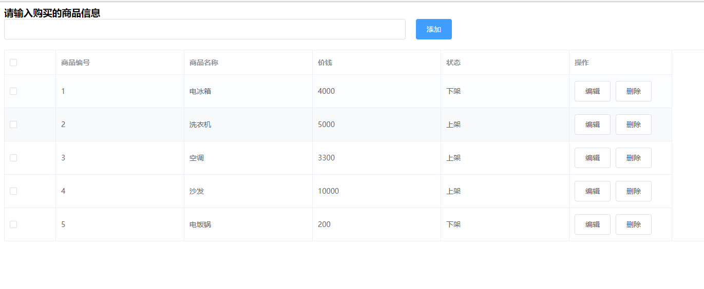
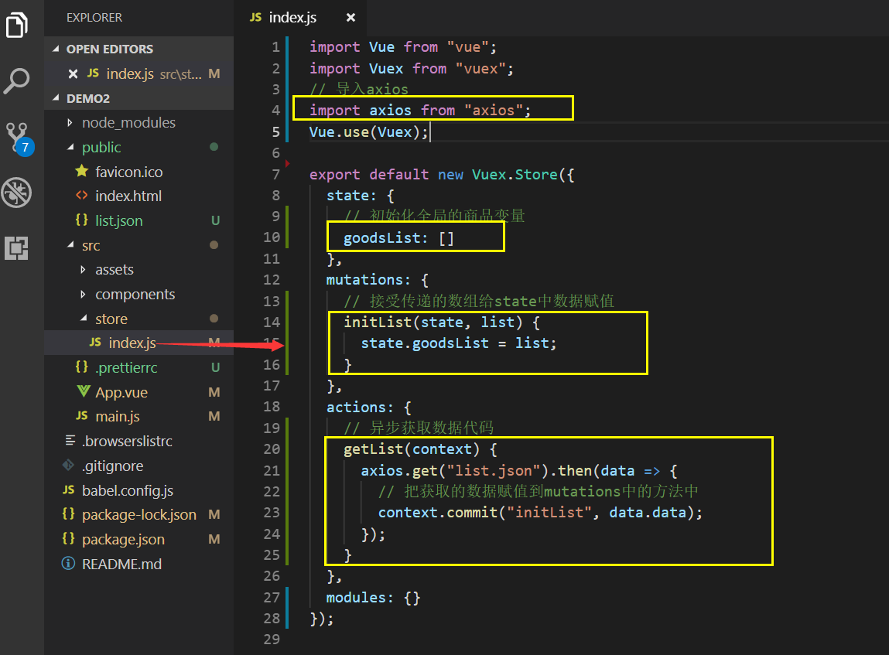
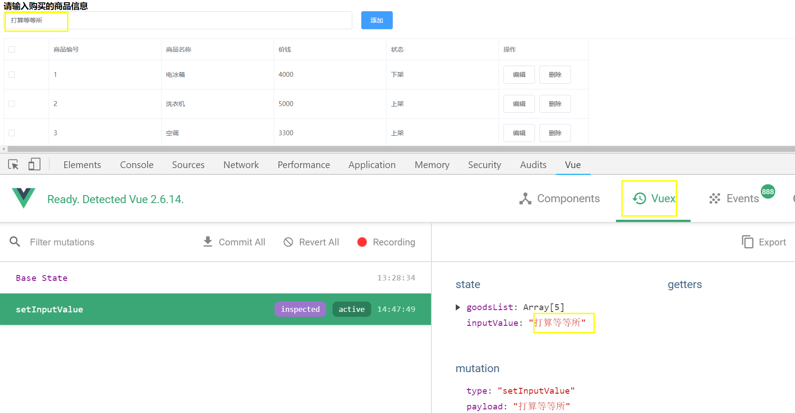
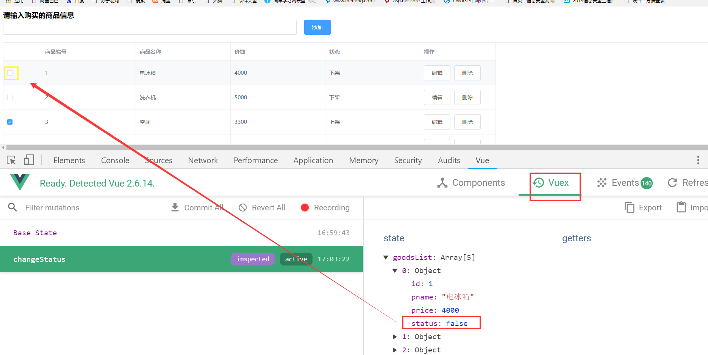

# Vuex 状态管理

## 学习目标

- [ ] 掌握 vuex 的作用及好处
- [ ] 掌握使用 vuex 的步骤
- [ ] 掌握 vuex 的核心概念有哪些，它们的作用分别是什么

## 一、Vuex 概述

### 1.1 组件之间共享数据的方式

- 父向子传值：自定义属性

- 子向父传值：自定义事件

- 兄弟组件之间共享数据：EventBus  全局事件总线
  - 数据发送方使用 $emit
  - 数据接收方使用 $on

以上的方式只能在小范围内进行数据共享，对于大范围以及频繁的数据共享来说，不太实用。

### 1.2 什么是Vuex

Vuex是实现组件全局状态(数据)管理的一种机制，可以方便的实现组件之间数据的共享。


### 1.3 使用 Vuex 统一状态管理的好处

1. 能够在vuex中集中管理共享的数据，易于开发和后期维护
2. 能够高效地实现组件之间的数据共享，提高开发效率
3. 存储在vuex中的数据都是响应式的，能够实时保持数据与页面的同步

### 1.4 什么样的数据适合存储到 Vuex 中

一般情况下，只有组件之间共享的数据，才有必要存储到vuex中；对于组件中的私有数据，依旧存储在组件自身的data中即可。

## 二、Vuex 的基本使用

### 2.1 安装 vuex 依赖包

```shell
npm i vuex@3.6.2 --save
```

### 2.2 导入 vuex 包

```js
import Vuex from 'vuex'
Vuex.use(Vuex)
```

### 2.3 创建 store 对象

```js
const store = new Vuex.store({
    // state 中存放的就是全局共享的数据
    state:{ count:0 }
})
```

### 2.4 将 store 对象挂载到 vue 实例中

```js
new vue ({
    el: '#app',
    render: h => h(app),
    router,
    //将创建的共享数据对象，挂载到 Vue 实例中
    //所有的组件，就可以直接从 store 中获取全局的数据了
    store
})

```

> 创建一个练习项目文件夹，注意配置的时候选择安装vuex即可，它会自动生成store文件夹,里面的index.js就是存储的核心文件。

## 三、Vuex 的核心概念

### 3.1 核心概念概述

Vuex中的主要核心概念如下:

- State
- Mutation
- Action
- Getter

### 3.2 State

State提供唯一的公共数据源， 所有共享的数据都要统-放到Store的State中进行存储。

```js
//创建store数据源，提供唯一公共数据
const store = new Vuex.store({
	state: { count: 0 }
})
```

组件中使用共享数据的第一种方式：

```
this.$store.state.数据变量名
```

组件中使用共享数据的第二种方式：

```
// 1. 从 vuex 中按需导入mapState函数
import { mapState } from 'vuex'  导入mapState函数
```

通过刚才导入的mapState函数，将当前组件需要的全局数据，映射为当前组件的computed计算属性:

```
computed:{
    ...mapState(['变量名'])
}
```

### 3.3 Mutation

Mutation 用于变更Store中的数据。

- vuex只能通过mutation变更Store数据，不可以直接操作Store中的数据。
- 通过这种方式虽然操作起来稍微繁琐一些,但是可以集中监控所有数据的变化。

```js
export default new Vuex.Store({
  state: {
    count: 0
  },
  mutations: { // 定义 mutation
    add(state) {
      state.count++
    }
  }
})
// 组件中使用
  methods: {
    add() {
      // 触发 mutation
      this.$store.commit('add')
    }
  }
```

**可以在触发mutations时传递参数:**

```js
export default new Vuex.Store({
  state: {
    count: 0
  },
  mutations: {
    addN(state, step) {
      // 变更状态
      state.count += step
    }
  }
})
// 组件中使用
  methods: {
    add() {
      // 触发 mutation 时携带参数
        // commit的作用，就是调用某个mutation函數

      this.$store.commit('addN', 3)
    }
  }
```

**mutations第二种使用方式**

this. $store.commit() 是触发mutations的第一种方式，触发mutations的第二种方式:

```
// 1.从vuex 中按需导入 mapMutations 函数
import { mapMutations } from 'vuex'
```

通过刚才导入的mapMutations函数，将需要的mutations函数,映射为当前组件的methods方法:

```
// 2.将指定的mutations 函数，映射为当前组件的 methods 函数
methods: {
    ...mapMutations(['sub'])
}
```

### 3.4 Action

Action用于处理异步任务。

如果通过异步操作变更数据，必须通过Action,而不能使用Mutation，但是在Action中还是要通过触发Mutation的方式间接变更数据。

```js
export default new Vuex.Store({
  state: {
    count: 0
  },
  mutations: {
    add(state) {
      state.count++
    },
    addN(state, step) {
      // 变更状态
      state.count += step
    },
    sub(state) {
      state.count--
    }
  },
  actions: {
    addAsync(context) {
      setTimeout(() => {
        context.commit('add')
      }, 1000)
    }
  },
})
// 组件中使用
  methods: {
    addAsync() {
        // //这里的dispatch 函数，专门用来触发action
      this.$store.dispatch('addAsync')
    }
  }
```

**触发Actions异步任务时携带参数：**

```js
actions: {
    addAsync(context, step) {
      setTimeout(() => {
        context.commit('addN', step)
      }, 1000)
    }
  },
      
// 组件中使用
  methods: {
    addAsync() {
      this.$store.dispatch('addAsync', 5)
    }
  }
```

this. $store.dispatch()是触发actions的第一种方式，触发actions的第二种方式：

```js
// 1.从vuex 中按需导入 mapActions 函数
import { mapActions } from 'vuex'
```

通过刚才导入的mapActions函数，将需要的actions函数,映射为当前组件的methods方法:

```js
  methods: {
    ...mapMutations(['sub']),
    ...mapActions(['subAsync']),
  }
```

### 3.5 Getter 

Getter用于对Store中的数据进行加工处理形成新的数据。

1. Getter可以对Store中已有的数据加工处理之后形成新的数据，类似Vue的计算属性。
2. Store中数据发生变化，Getter 的数据也会跟着变化。

**定义Getter**

```js
export default new Vuex.Store({
  state: {
    count: 0
  },
  getters: {
    showNum(state) {
      return '当前最新的数量是：' + state.count
    }
  }
```

**调用 Getter**

使用getters的第一种方式

```js
this.$store.getters.名称
```

使用getters的第二种方式

```js
import { mapGetters } from 'vuex'

  computed: {
    ...mapGetters(['showNum'])
  }
```


## 四、基于Vuex的案例

### 4.1 创建项目

- 创建项目 demo2
- 选择手动配置，安装babel、less
- 安装axios
- 安装element-ui

### 4.2 App.vue结构改造

- 引入element-ui

main.js中添加下面的代码
```
import ElementUI from 'element-ui';
import 'element-ui/lib/theme-chalk/index.css';

Vue.use(ElementUI);
```
我们用的是全部导入，也可以使用官网示例上的按需导入

### 4.3 动态获取数据

#### 4.3.1 搭建页面结构

- public文件夹下面新建list.json

```
[
  {
    "id": 1,
    "pname": "电冰箱",
    "price": 4000,
    "status": "下架"
  },
  {
    "id": 2,
    "pname": "洗衣机",
    "price": 5000,
    "status": "上架"
  },
  {
    "id": 3,
    "pname": "空调",
    "price": 3300,
    "status": "上架"
  },
  {
    "id": 4,
    "pname": "沙发",
    "price": 10000,
    "status": "上架"
  },
  {
    "id": 5,
    "pname": "电饭锅",
    "price": 200,
    "status": "下架"
  }
]

```
**备注**
可以模拟假数据也可以自己用node做后台从数据表中查询数据

- App.vue中生成页面结构

```vue
<template>
  <div id="app">
    <h3>请输入购买的商品信息</h3>
    <el-row :gutter="20">
      <el-col :span="10">
            <el-input></el-input>
      </el-col>
      <el-col :span="8">
            <el-button type="primary">添加</el-button>
      </el-col>
    </el-row>
    <el-row>
        <el-table
         border
         :data="tableData"
          ref="multipleTable"
          tooltip-effect="dark">
          <el-table-column
            type="selection"
            width="100">
          </el-table-column>
          <el-table-column
            label="商品编号"
            prop="id"
            width="250">
          </el-table-column>
          <el-table-column
            label="商品名称"
            prop="pname"
            width="250">
          </el-table-column>
           <el-table-column
            label="价钱"
            prop="price"
            width="250">
          </el-table-column>
          <el-table-column
            label="状态"
            prop="status"
            width="250">
          </el-table-column>
           <el-table-column
            label="操作"
            width="200">
            <template slot-scope="scope">
              <el-button>编辑</el-button>
              <el-button>删除</el-button>
            </template>
          </el-table-column>
        </el-table>
      </el-row>
    </div>
</template>

<script>
import axios from 'axios'
export default {
  name: "App",
  data() {
    return {
      tableData: [],
      multipleSelection: []
    };
  },
  created(){
    axios.get('list.json').then(data=>{
        this.tableData=data.data
        console.log(data)
    })
  }
};
</script>

<style scoped>
*{
  margin:0;
  padding:0;
}
.el-row{
  margin-bottom:20px!important;
}
</style>

```
显示如下：




#### 4.3.2 改造成vuex管理数据

- store/index.js中代码如下：

我们通过axios异步获取数据的代码应该放在actions中。



App.vue中代码如下：
**注意**
下面的el-table中的data属性绑定的是goodlist,因为已经通过mapState进行映射了,可以直接使用state中的变量了。

```
<template>
  <div id="app">
    。。。。
    <el-row>
        <el-table
         border
         :data="goodsList"
          ref="multipleTable"
          tooltip-effect="dark">
          。。。。。
        </el-table>
      </el-row>
    </div>
</template>

<script>
import {mapState} from 'vuex'
export default {
  name: "App",
  data() {
    return {
      multipleSelection: []
    };
  },
  created(){
  //页面加载的时候触发actions中的异步代码执行
    this.$store.dispatch('getList')
  },
  computed:{
    // 把state中的数据映射到当前的页面
    ...mapState(['goodsList'])
  }
};
</script>

<style scoped>
*{
  margin:0;
  padding:0;
}
.el-row{
  margin-bottom:20px!important;
}
</style>
```
### 4.4 文本框双向数据绑定

#### 4.4.1 state中数据作用域文本框

- store/index.js中state中定义新变量

```
state: {
    // 初始化全局的商品变量
    goodsList: [],
    // 文本框的初识值
    inputValue: "文本框初始值"
  },
```
- App.vue通过mapState把inputValue映射成当前页面数据

```
import {mapState} from 'vuex'

 computed:{
    // 把state中的数据映射到当前的页面
    ...mapState(['goodsList','inputValue'])
  }
```
- 文本框进行数据绑定

```
<el-input v-model="inputValue"></el-input>
```
#### 4.4.2输入框输入内容同步到state

- input绑定数据和监听事件
```
<el-input v-model="con" @change="handleChange"></el-input>
```
- data中初始化数据

```
data() {
    return {
      con:'',
      multipleSelection: []
    };
  },
```
- 处理change事件

```
methods:{
    handleChange:function(e){
      // console.log(e)//获取文本框中的内容
      this.$store.commit('setInputValue',e)//激活store中setInputValue方法，把输入框用户输入的内容同步到
    }
  }
```
- store/index.js中

```js
import Vue from "vue";
import Vuex from "vuex";
// 导入axios
import axios from "axios";
Vue.use(Vuex);

export default new Vuex.Store({
  state: {
    // 初始化全局的商品变量
    goodsList: [],
    // 文本框的初识值
    inputValue: "文本框初始值"
  },
  mutations: {
    // 接受传递的数组给state中数据赋值
    initList(state, list) {
      state.goodsList = list;
    },
    setInputValue(state, val) {
      state.inputValue = val;
    }
  },
  actions: {
    // 异步获取数据代码
    getList(context) {
      axios.get("list.json").then(data => {
        // 把获取的数据赋值到mutations中的方法中
        context.commit("initList", data.data);
      });
    }
  },
  modules: {}
});

```
此时用户输入什么，state中的数据就会同步



### 4.5 实现添加功能

- store/index.js添加方法如下：

```js
 mutations: {
    initList(state, list) {
      。。。
    },
    setInputValue(state, val) {
      。。。
    },
    addItem(state) {
      // 自己定义一条信息对象
      let obj = {
        id: state.nextId,
        pname: state.inputValue,
        price: Math.random() * 1000,
        status: "下架"
      };
      state.goodsList.push(obj);
      state.nextId++;
      state.inputValue = "";
    }
  },
```
- App.vue中调用添加方法

```vue
 <el-button type="primary" @click="addGood">添加</el-button>
 
 methods:{
    handleChange:function(e){
      this.$store.commit('setInputValue',e)
    },
    // 添加信息
    addGood:function(){
      // 调用mutations中的方法
      this.$store.commit('addItem')
    }
  }
```
此时在用户框输入内容可以实现添加功能了。

### 4.6 实现删除功能

思路：App.vue点击删除按钮的时候把id传递给state中，根据id查找到要删除的当前项以后，利用数组。splice方法删除指定的元素即可。

- App.vue定义删除事件

```vue
 <el-button @click="removeGood(scope.row.id)">删除</el-button>
 
  methods:{
    handleChange:function(e){
      this.$store.commit('setInputValue',e)
    },
    addGood:function(){
      this.$store.commit('addItem')
    },
    // 删除元素
    removeGood(id){
      this.$store.commit('removeItem',id)
    }
  }
```
- store/index.js中实现删除功能

```
mutations: {
    。。。。
    removeItem(state, id) {
      // 根据传递的id查询要删除元素的对象索引值
      const index = state.goodsList.findIndex(item => {
        return item.id == id;
      });
      state.goodsList.splice(index, 1);
    }
  },
```

### 4.7 动态绑定复选框
- 修改list.json
list.json中把所有的上架状态改完true，所有的下架状态改为false.

```json
[
  {
    "id": 1,
    "pname": "电冰箱",
    "price": 4000,
    "status": true
  },
  {
    "id": 2,
    "pname": "洗衣机",
    "price": 5000,
    "status": false
  },
  {
    "id": 3,
    "pname": "空调",
    "price": 3300,
    "status": true
  },
  {
    "id": 4,
    "pname": "沙发",
    "price": 10000,
    "status":false
  },
  {
    "id": 5,
    "pname": "电饭锅",
    "price": 200,
    "status": true
  }
]

```
- 列表渲染的时候添加v-if和else指令

```vue
<el-table-column
            label="状态"
            width="250">
    <template slot-scope="scope">
        <p v-if="scope.row.status===true">上架</p>
        <p v-else>下架</p>
    </template>
</el-table-column>
```
- 复选框动态绑定状态

```vue
<el-table-column
            width="100">
    <template slot-scope="scope">
         <el-checkbox :checked="scope.row.status==true"></el-checkbox>
     </template>
</el-table-column>
```
### 4.8 修改复选框的选中状态
- App.vue中定义事件

```
 <el-table-column width="100">
    <template slot-scope="scope">
       <el-checkbox :checked="scope.row.status=='true'" @change="(e)=>{
                 handleStatus(e,scope.row.id)
         }"></el-checkbox>
    </template>
 </el-table-column>
 
 methods:{
    handleChange:function(e){
        this.$store.commit('setInputValue',e)
    },
    addGood:function(){
          this.$store.commit('addItem')
    },
    removeGood(id){
      this.$store.commit('removeItem',id)
    },
    // 修改状态
    handleStatus(e,id){
      // e是复选框更改侯的状态 id是修改的复选框的id
      const param={
        id:id,
        status:e
      }
      this.$store.commit('changeStatus',param)
    }
  }       
```
- store/index.js中代码如下：

```
 mutations: {
    。。。
    // 修改复选框的状态
    changeStatus(state, param) {
      // 先获取修改复选框项的索引号
      const index = state.goodsList.findIndex(item => {
        return (item.id === param.id);
      });
      if (index != -1) {
        state.goodsList[index].status = param.status;
      }
    }
  },
```
此时比如第一项的复选框默认是选中的，我们切换以后就变成非选中的，vuex调试工具中的state中的变量也跟着发生变化了。
