## 任务描述

本章节将完成“众博健康陪诊小程序后台”项目中的环境搭建，在本章节将在使用vue脚手架创建的基础架构中配置项目中的环境变量、网络代理、网络请求、路由等内容。在开发之前将环境中所需的配置创建完毕，将大大提高后续功能开发的效率。

## 任务实施

### 子任务一 配置前端环境

#### 步骤一 初始化项目

全局安装 `vue-cli`脚手架，使用 vue 脚手架创建项目。如已安装，直接跳到创建项目。

```cmd
npm install -g @vue/cli
```

安装完毕后可通过 vue -V 来查看是否安装成功

```shell
vue -V
@vue/cli 5.0.8
```

基于 vue-cli 快速生成工程化的 Vue 项目

```cmd
vue create 项目名称
```

**创建项目**

终端下输入 `vue create 项目的名称` 会提示下图选项

左侧箭头代表目前选中的选项，按上下箭头可调整选项

如果选中带有[Vue 3]的选项会帮你创建出vue3的项目并且会帮你配置好babel和eslint

如果选中带有[Vue 2]的选项会帮你创建出vue2的项目并且会帮你配置好babel和eslint

最后一个选项是手动创建，主动权交给程序员（新手推荐手动创建）

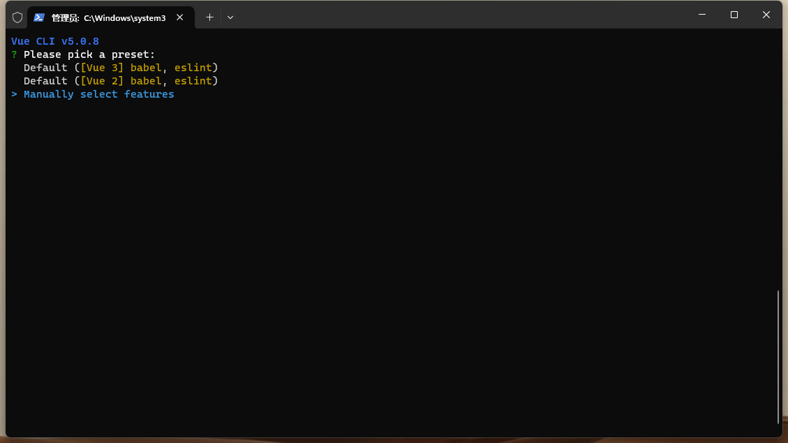

**配置项目**

上下箭头调整选项，空格是否选中，回车确定 下一步

选中Babel和CSS Pre-processors、Router即可

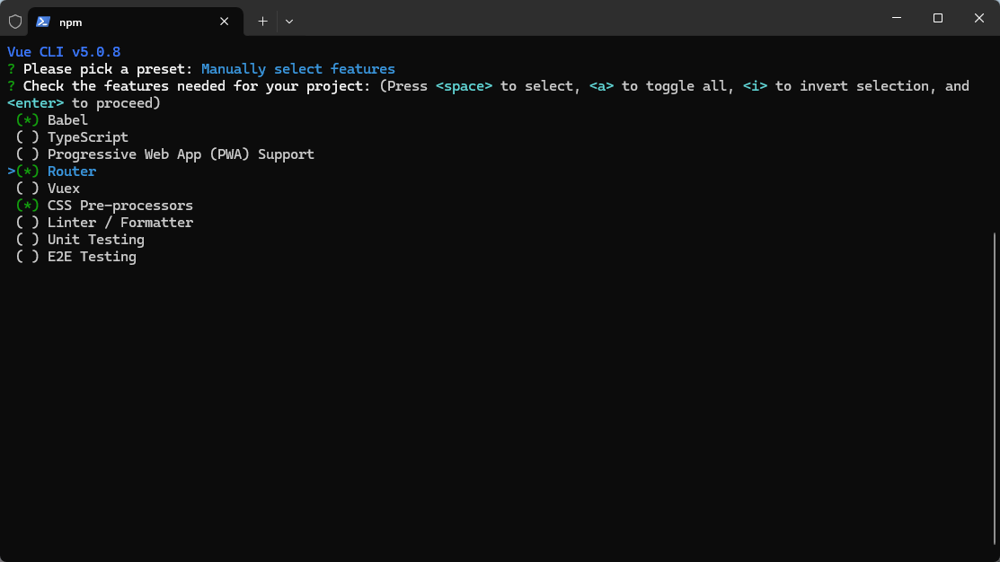

**选择版本**

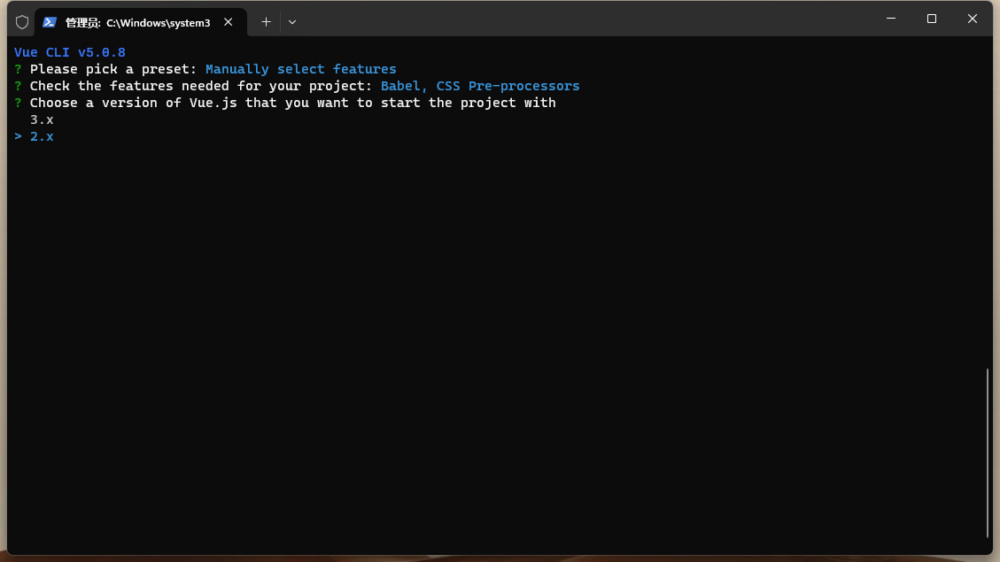

**选择路由模式**

此处选择hash模式

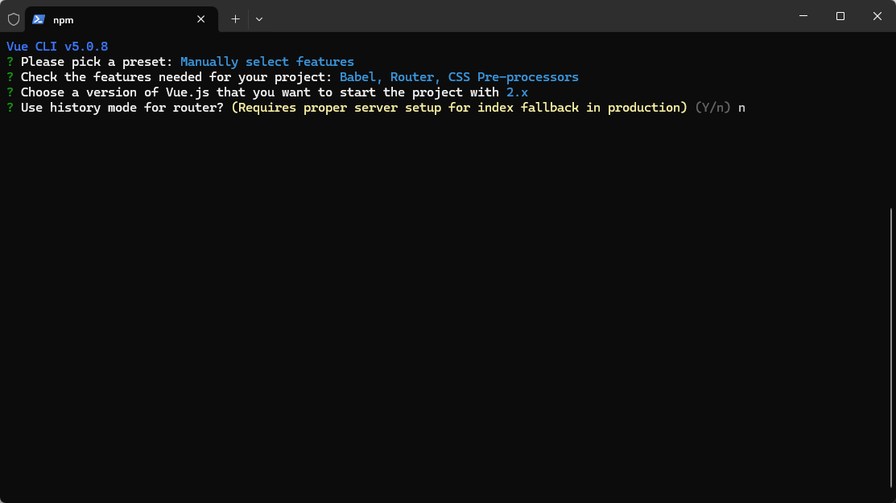

**选择CSS预处理器 sass**

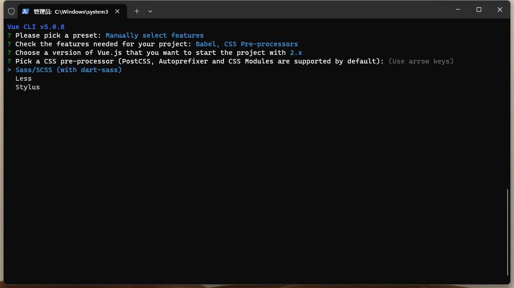

**配置文件处理**

将babel，sass等插件生成单独的配置文件

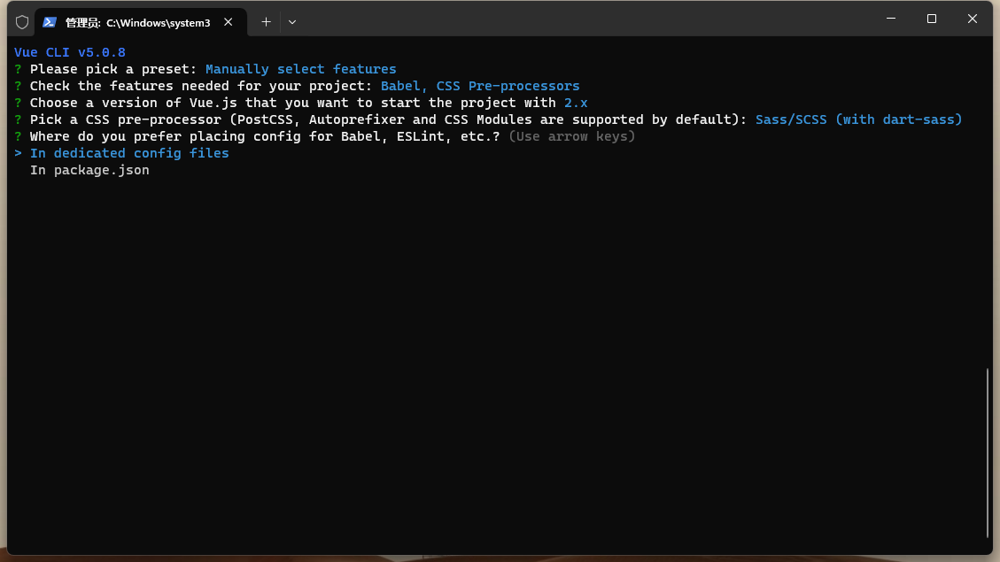

**将刚刚做的所有选项做一个预设，方便下次创建**

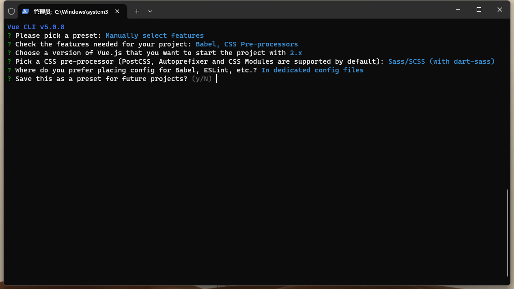

**创建成功**

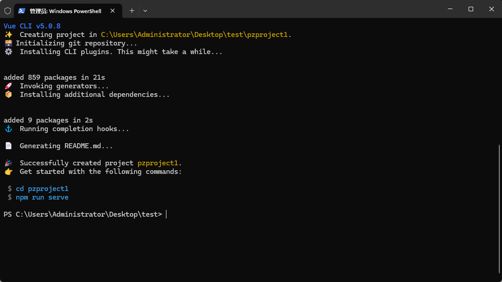

切换到项目目录

```shell
cd pzproject1
```

启动项目

```
npm run serve
```

启动完成会出现访问地址，通过浏览器即可访问。

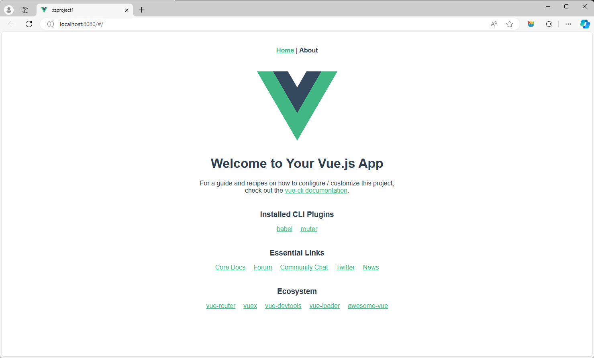

#### 步骤二 安装所需第三方库

##### 1.安装 Element-ui

Element，一套为开发者、设计师和产品经理准备的基于 Vue 2.0 的桌面端组件库。

官方文档：https://element.eleme.cn/#/zh-CN

项目中安装命令如下

```shell
npm install element-ui -S
```

项目配置，引入Element

> 文件路径：src/main.js

```shell
// main.js添加以下代码
import ElementUI from 'element-ui';
import 'element-ui/lib/theme-chalk/index.css';

Vue.use(ElementUI);
```

##### 2.安装Axios

Axios 是一个基于 promise 网络请求库，与XHR类似，在项目根目录终端中执行下方命令进行安装。

```shell
npm install axios -S
```

测试Axios插件

修改App.vue组件，代码如下：

> 文件路径：src/App.vue

```vue
<template>
  <div id="app">
    <nav>
      <router-link to="/">Home</router-link> |
      <router-link to="/about">About</router-link>
    </nav>
    <router-view/>
  </div>
</template>

<script>
import axios from 'axios'
export default {
   created(){
    axios.post('http://10.2.34.13:10003/admin/auth/login',{userAccount:'admin',password:'123456'}).then(res => {
      console.log(res.data)
    })
 }
}
</script>
```

配置完刷新页面，查看开发者调试工具，会出现跨域请求错误。

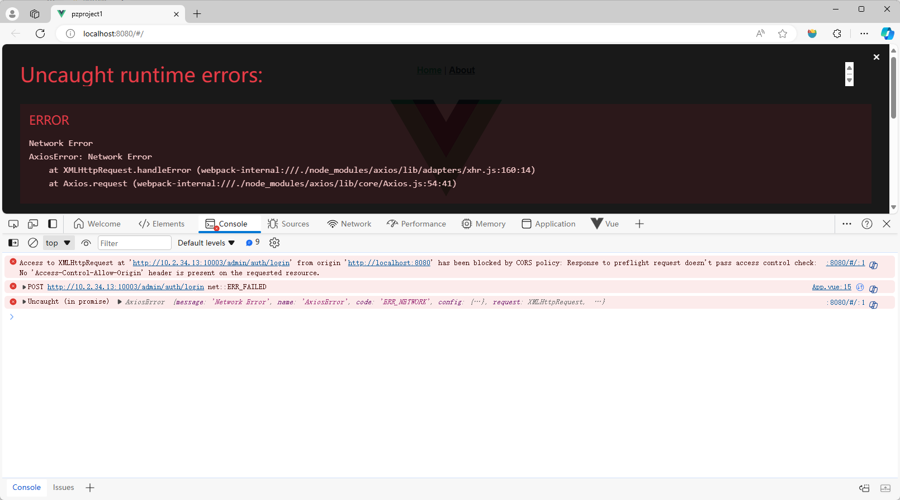

##### 3.解决项目跨域

在上一步中测试Axios出现跨域的情况，需要配置反向代理，解决此问题。

> 文件路径：/vue.config.js

代码如下：

```js
const { defineConfig } = require('@vue/cli-service')
module.exports = defineConfig({
  transpileDependencies: true,
    // 配置开发服务器（Development Server）的选项
    devServer: {
        // 指定开发服务器的主机地址
        host: "0.0.0.0",
        // 指定开发服务器的端口号
        port: "5173",
        // 配置代理，用于将请求代理到后端API服务器
        proxy: {
          // 当请求的路径以/admin开头时，将请求代理到指定的地址
          '/admin': {
            target: 'http://10.2.34.13:10003',
            // 启用跨域
            changeOrigin: true,
            // 将请求路径中的/admin重写为/admin
            pathRewrite: {
              '^/admin': '/admin'
            }
          },
        }
    }
})
```

修改App.vue组件，代码如下：

> 文件路径：src/App.vue

```vue
<template>
  <div id="app">
    <nav>
      <router-link to="/">Home</router-link> |
      <router-link to="/about">About</router-link>
    </nav>
    <router-view/>
  </div>
</template>

<script>
import axios from 'axios'
export default {
   created(){
    axios.post('/admin/auth/login',{userAccount:'admin',password:'123456'}).then(res => {
      console.log(res.data)
    })
 }
}
</script>
```

重启服务，打开浏览器测试，可以看到数据可以正常请求成功

##### 4.配置环境变量

　　配置环境变量的主要原因是为了在不同的开发环境之间管理应用程序的配置和行为。可以根据开发、测试和生产等不同的环境，动态地配置应用程序的一些参数、API地址、调试信息等。

在项目根目录新建 .env.dev 和 .env 文件，这两个文件都是环境变量文件，用于存放项目配置。

- .env.dev 文件用于开发时所做的配置
- .env 用于生产环境时所做的配置

> 文件路径：/.env.dev

代码如下：

```
# 开发模式，自定义环境变量内容需要以 VUE_APP 开头。
VUE_APP_MODE = 'dev'   # 开发模式
VUE_APP_API = 'http://10.2.34.13:10003'  # 后端接口地址
```

在项目中可以通过`process.env.VUE_APP_API`来访问环境变量中内容

**配置 package.json**

配置启动命令，加载环境变量。

> 文件路径：/package.json

配置如下：

```json
"scripts": {
    "serve": "vue-cli-service serve  --mode dev",
    "build": "vue-cli-service build",
  },
```

**配置vue.config.js**

将target代理地址改为`process.env.VUE_APP_API`，当运行项目时，程序会读取.env.dev中的API地址，方便统一管理与后续配置。

修改完成重启服务生效。

### 子任务二 前端页面路由配置

修改前端路由模块src/router/index.js，在文件中添加登录页面和后台首页路由规则，代码如下。

> 文件路径：src/router/index.js

```js
import Vue from "vue";
import VueRouter from "vue-router";
Vue.use(VueRouter);
/* 引入最外层骨架的一级路由组件 */
const routes = [{
    path: "/",
    name: "Layout",
    component: () => import("@/layout/index.vue"),
},
// 登录
{
    path: "/login",
    name: "login",
    component: () =>
        import("@/views/login/index.vue"),
}
];

const router = new VueRouter({
    routes,
});
export default router;
```

**创建后台首页**

在此创建后台首页是为了测试当前路由规则配置。后台首页文件存放到src/layout 目录下，文件名为index.vue。文件创建之后写入基础代码即可。代码如下：

> 文件路径：src/layout/index.vue

```vue
<template>
  <h1>后台首页</h1>
</template>

<script>
export default {
  name:'layout'
}
</script>

<style>

</style>
```

**创建登录页面**

在此创建登录页面是为了测试当前路由规则配置。登录页面文件存放到 src/views/login 目录下，文件名为index.vue。文件创建之后写入基础代码即可。代码如下：

> 文件路径：src/views/login/index.vue

```vue
<template>
  <h1>登录页面</h1>
</template>

<script>
export default {
  name: 'login'
};
</script>

<style>
</style>
```

**配置路由出口**

路由配置好之后，访问路由地址应该显示对应的页面。此时需要配置路由出口，也就是路由对应的组件在什么位置显示。修改App.vue，清空`template`中的内容写入路由出口标签`<router-view>`即可。配置完成之后，当访问页面时候路由会自动在App.vue中动态显示对应的组件。代码如下：

> 文件路径：/App.vue

```vue
<template>
<!-- 配置路由出口 -->
  <router-view></router-view>
</template>

<script>
export default {
  name:'App'
}
</script>

<style>
</style>
```

此时打开浏览器访问地址：`http://localhost:5173/#/`可以看到后台首页字样。访问地址：`http://localhost:5173/#/login`可以看到登录页面字样。

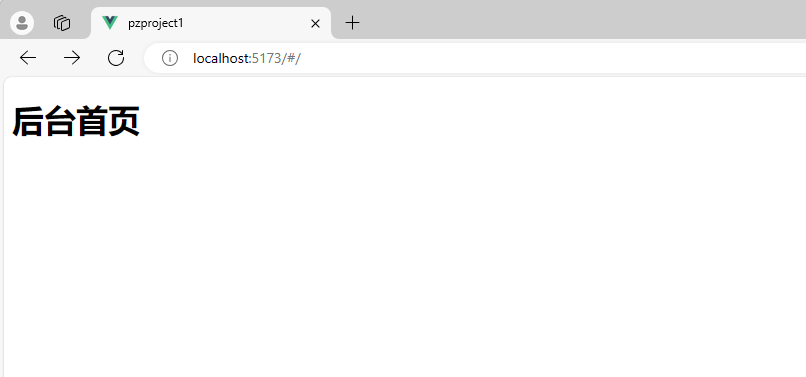

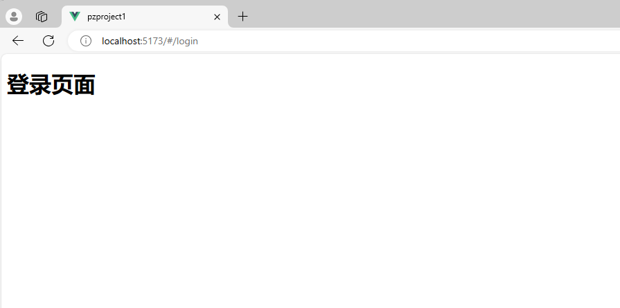


### 子任务三 实现登录功能

#### 任务效果

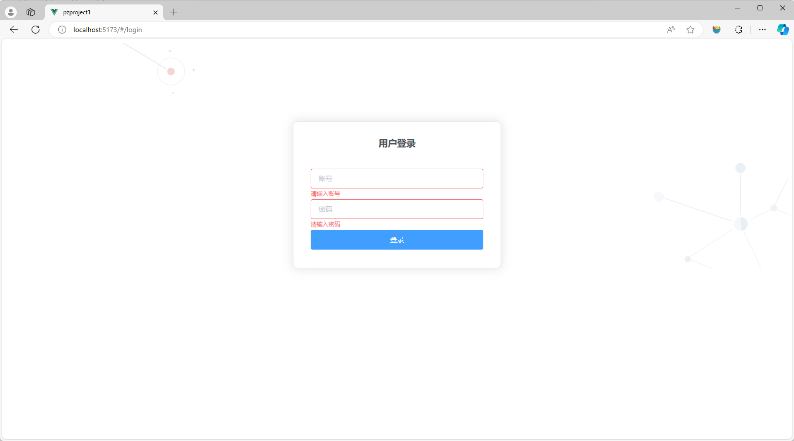

#### 编写登录页面--任务实施

##### 步骤一 分析页面布局

登录页中有一个占满屏幕的背景图，在页面中有一个左右居中，距离顶部`300px`的表单容器，容器中包含"用户登录"标题，标题下方为用户名输入框、密码输入框和登录按钮表单元素，当用户光标离开输入框时，如果输入框内容为空会有对应的提示且边框变红，这些表单元素于表单验证可采用ElementUI实现。

##### 步骤二 编写页面代码

> 文件路径：src/views/login/index.vue

```vue
<template>
  <div class="login-wrap">
    <el-form label-position="left" :model="ruleForm" :rules="rules" ref="ruleForm" label-width="0px" class="demo-ruleForm login-container">
      <h3 class="title">用户登录</h3>
      <el-form-item prop="userAccount">
        <el-input type="text" v-model="ruleForm.userAccount" auto-complete="off" placeholder="账号"></el-input>
      </el-form-item>
      <el-form-item prop="password">
        <el-input type="password" v-model="ruleForm.password" auto-complete="off" placeholder="密码"></el-input>
      </el-form-item>
      <el-form-item style="width: 100%">
        <el-button type="primary" style="width: 100%">登录
        </el-button>
      </el-form-item>
    </el-form>
  </div>
</template>
<script >
export default {
  name: 'login',
  data() {
    return {
      // 记住密码
      // rememberpwd: false,
      ruleForm: {
        //userName和password默认为空
        userAccount: '',
        password: ''
      },
      //rules前端验证
      rules: {
        userAccount: [{ required: true, message: '请输入账号', trigger: 'blur' }],
        password: [{ required: true, message: '请输入密码', trigger: 'blur' }]
      }
    };
  }
};
</script>

<style scoped>
.login-wrap {
  box-sizing: border-box;
  width: 100%;
  height: 100%;
  padding-top: 10%;
  background-image: url('@/assets/images/login-background.svg');
  background-repeat: no-repeat;
  background-position: center right;
  background-size: 100%;
}

.login-container {
  border-radius: 10px;
  margin: 0px auto;
  width: 350px;
  padding: 30px 35px 15px 35px;
  background: #fff;
  border: 1px solid #eaeaea;
  text-align: left;
  box-shadow: 0 0 20px 2px rgba(0, 0, 0, 0.1);
}

.title {
  margin: 0px auto 40px auto;
  text-align: center;
  color: #505458;
}

.remember {
  margin: 0px 0px 35px 0px;
}

.code-box {
  text-align: right;
}

.codeimg {
  height: 40px;
}
</style>

```

#### 编写登录功能--任务实施

##### 步骤一 封装token工具

封装token处理工具的目的是为后续项目中的token做统一管理。

**安装js-cookie库**

使用 js-cookie 库来处理token，将token存储到cookie。

安装命令：`npm i js-cookie@3.0.5 -S`

**配置token**

代码如下：

> 文件路径：src/utils/token.js

```js
/** 统一处理 tokne Cookie */

import Cookies from "js-cookie"
const TOKEN_KEY = "token";
// 获取token
export const getToken = () => {
    return Cookies.get(TOKEN_KEY)
}
// 设置token
export const setToken = (value) => {
    Cookies.set(TOKEN_KEY, value)
}
// 删除token
export const removeToken = () => {
    Cookies.remove(TOKEN_KEY)
}
```

##### 步骤二 封装request请求函数

封装request就是对axios网络请求做一些处理，如设置请求拦截器

```js
import axios from 'axios'
import { getToken } from "@/utils/token.js"

// 直接使用环境变量：
const baseURL = process.env.VUE_APP_MODE === 'dev' ? '' : process.env.VUE_APP_API;
const service = axios.create({
    baseURL: baseURL,
    timeout: 5000 // 设置为5秒，单位是毫秒
})
// // 在Axios实例service的请求拦截器中，处理响应数据
service.interceptors.request.use(
    config => {
        let token = getToken()
        if (token) {
            if (!config.headers) {
                config.headers = {};
            }
            config.headers.Authorization = 'application/json'
            config.headers['token'] = token;
        }
        // 返回请求的配置
        return config;
    },
    error => {
        return Promise.reject(error);
    }
)
// 在Axios实例service的响应拦截器中，处理响应数据
service.interceptors.response.use(function (response) {
    // 返回响应数据的内容部分
    return response.data;
  }, function (error) {
    // 如果请求发生错误，返回一个Promise对象，并传递错误信息
    return Promise.reject(error);
  });


export default service;

```

##### 步骤三 封装login登录接口

接口文档地址：https://console-docs.apipost.cn/preview/8a22ef49c4057771/86a4aa46345b067a

此接口的信息如下：

- url:/admin/auth/login
- methods:POST
- 请求参数示例：`{userAccount:'admin',password:'123456'}`

封装接口代码如下：

> 文件路径：src/api/index.js

```js
import request from "@/utils/request";
const USER_ADMIN = "/admin"
// 登录
export function login(data) {
    return request({
        url: `${USER_ADMIN}/auth/login`,
        method: 'POST',
        data
    })
}
```

##### 步骤四 实现登录功能

> 文件路径：src/views/login/index.vue

```vue
<template>
  <div class="login-wrap">
    <el-form label-position="left" :model="ruleForm" :rules="rules" ref="ruleForm" label-width="0px" class="demo-ruleForm login-container">
      <h3 class="title">用户登录</h3>
      <el-form-item prop="userAccount">
        <el-input type="text" v-model="ruleForm.userAccount" auto-complete="off" placeholder="账号"></el-input>
      </el-form-item>
      <el-form-item prop="password">
        <el-input type="password" v-model="ruleForm.password" auto-complete="off" placeholder="密码"></el-input>
      </el-form-item>
      <el-form-item style="width: 100%">
        <el-button type="primary" style="width: 100%" @click.prevent="submitForm('ruleForm')">登录
        </el-button>
      </el-form-item>
    </el-form>
  </div>
</template>
<script >
import { login } from "@/api/index.js";
import { setToken} from "@/utils/token";
export default {
  name: 'login',
  data() {
    return {
      // 记住密码
      // rememberpwd: false,
      ruleForm: {
        //userName和password默认为空
        userAccount: '',
        password: ''
      },
      //rules前端验证
      rules: {
        userAccount: [{ required: true, message: '请输入账号', trigger: 'blur' }],
        password: [{ required: true, message: '请输入密码', trigger: 'blur' }]
      }
    };
  },
  methods:{
     //获取info列表
    submitForm(formName) {
      this.$refs[formName].validate(async (valid) => {
        if (valid) {
          let res = await login(this.ruleForm);
          if (res.code == 200) {
            const token = res.entity.token;
            if (token) {
              setToken(token);
              this.$router.push({ path: "/" });
              this.$message.success("登录成功");
            }
          }else{
            this.$message.error("登录失败");
          }
        } else {
          return false;
        }
      });
    },
  }
};
</script>
```

浏览器访问登录页面进行测试。