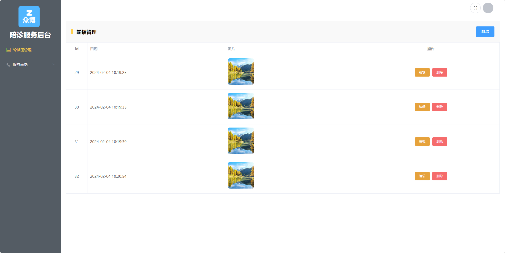

# 任务二 制作后台首页

## 2.1任务描述

本任务将制作“陪诊小程序后台管理”项目中的后台首页。后台首页是当后台管理登录完毕之后显示的页面，表示管理员已经登录成功，可以进行下一步的管理操作。

## 2.2任务效果


## 2.3任务实施

### 2.3.1 页面结构分析与搭建

#### 步骤一 页面布局分析

根据效果图可分析出页面分成左右两个结构，左侧为LOGO及导航栏，右侧为头部区域和内容区域，整体的布局可使用ElementUI组件库中的`Container` 布局容器实现。


#### 步骤二 代码实现

　　使用ElementUI组件库官方文档中有成型的布局代码，可直接复用。复用之后页面高度并不能占满屏幕，可以将容器`.el-container`的高度设置为`100vh`，这样即可占满屏幕高度。

ElementUI文档：https://element.eleme.cn/#/zh-CN/component/container

> 文件路径：src/layout/index.vue

```vue
<template>
  <el-container>
    <!-- 左侧导航栏容器 -->
    <el-aside width="230px">Aside</el-aside>
    <!-- 右侧主体容器 -->
    <el-container>
      <!-- 头部容器 -->
      <el-header>Header</el-header>
      <!-- 组件渲染区域容器 -->
      <el-main>Main</el-main>
    </el-container>
  </el-container>
</template>

<script>
export default {
  name: 'layout'
};
</script>

<style>
  .el-header {
    background-color: #B3C0D1;
    color: #333;
    line-height: 60px;
  }
  
  .el-aside {
    background-color: #D3DCE6;
    color: #333;
    text-align: center;
    line-height: 200px;
  }
  
  .el-main {
    background-color: #E9EEF3;
    color: #333;
    text-align: center;
    line-height: 160px;
  }

  .el-container{
    /* 调整容器高度为100视窗高度 */
    height: 100vh;
  }

</style>
```

编写完代码之后查看效果，可以看到页面有滚动条，并且可以上下滚动。这是因为网页有默认的样式填充距离，在App.vue中设置所有元素的内边距和外边距为0即可消除滚动。代码如下：

> 文件路径：/App.vue

```vue
<style>
*{
  margin: 0;
  padding:0;
}
</style>
```

编写完代码查看效果。


### 2.3.2 封装导航栏组件与头部组件

在上一节中已完成了首页的整体布局，为了提高代码的可读性和可维护性，需要将代码块进行拆分，各组件负责各自的功能，故将导航栏与头部区域单独封装为组件，后续只需在首页文件中引入组件即可。

#### 步骤一 封装导航栏组件

在`src/layout/aside`目录下新建 `index.vue`文件用来编写侧边栏组件内容。代码如下：

> 文件路径：src/layout/aside/index.vue

```vue
<template>
  <div>
    Aside
  </div>
</template>

<script>
export default {
  name:'aside-com'
}
</script>
```

组件创建完毕需要在后台首页`src/layout/index.vue`文件中引入使用。代码如下：

> 文件路径：src/layout/index.vue

```vue
<template>
  <el-container>
    <!-- 左侧导航栏容器 -->
    <el-aside width="230px">
      <Aside></Aside>
    </el-aside>
    <!-- 右侧主体容器 -->
    <el-container>
      <!-- 头部容器 -->
      <el-header>Header</el-header>
      <!-- 组件渲染区域容器 -->
      <el-main>Main</el-main>
    </el-container>
  </el-container>
</template>

<script>
// 导入侧边栏组件
import Aside from './aside/index.vue'
export default {
  name: 'layout',
  components:{
    // 注册侧边栏组件
    Aside
  }
};
</script>
```

在项目首页使用侧边栏组件之后查看效果。


#### 步骤二 编写导航栏组件

在上个步骤中已将侧边栏提取到单独的组件，在本步骤中将实现侧边栏的完整效果，包括LOGO、网站标题、导航栏。根据效果图可知侧边栏整体可以分为上下两个部分，上面部分可以使用div作为容器，放置LOGO和网站标题。下面部分导航栏部分可使用ElementUI组件库中的`NavMenu`导航菜单实现。代码如下：

> 文件路径：src/layout/aside/index.vue

```vue
<template>
  <div class="content">
    <div class="chart">
      
      <h1 class="logo-title">陪诊服务后台</h1>
    </div>
    <el-menu default-active="activeMenu" class="el-menu-vertical-demo" background-color="#545c64" text-color="#fff" router active-text-color="#ffd04b">
      <el-menu-item index="/banner">
        <i class="el-icon-picture-outline"></i>
        <span slot="title">轮播图管理</span>
      </el-menu-item>
      <el-submenu index="">
        <template slot="title">
          <i class="el-icon-phone"></i>
          <span slot="title">服务电话</span>
        </template>
        <el-menu-item index="">
          <i class="el-icon-phone"></i>
          <span slot="title">转诊服务电话</span>
        </el-menu-item>
        <el-menu-item index="">
          <i class="el-icon-phone"></i>
          <span slot="title">住院服务电话</span>
        </el-menu-item>
        <el-menu-item index="">
          <i class="el-icon-phone"></i>
          <span slot="title">客服电话</span>
        </el-menu-item>
      </el-submenu>
    </el-menu>
  </div>
</template>

<script>
export default {
  name: 'aside-com'
};
</script>

<style lang="scss" scoped>
.content {
  width: 100%;
  height: 100%;

  .chart {
    width: 100%;
    height: 10rem;
    display: flex;
    flex-direction: column;
    align-items: center;
    justify-content: center;
    color: #fff;
    background: #545c64;

    .logo {
      width: 80px;
      height: 80px;
      margin: 10px 10px 10px 0;
    }

    .logo-title{
      font-size: 26px;
    }
  }
}

.el-menu {
  height: calc(100% - 10rem);
  border: 0 !important;
}
</style>
```

删除后台首页文件`src/layout/index.vue`中有影响的css代码，保证没有样式冲突。代码如下：

> 文件路径：src/layout/index.vue

```vue
<style scoped>
  .el-header {
    background-color: #fff;
    color: #333;
    line-height: 60px;
  }
  .el-main {
    background-color: #E9EEF3;
    color: #333;
    text-align: center;
    line-height: 160px;
  }

  .el-container{
    /* 调整容器高度为100视窗高度 */
    height: 100vh;
  }

</style>
```

#### 步骤三 封装头部组件

头部组件封装方式与侧边栏一致，头部组件内容较为简单，头部区域中右侧包含一个全屏按钮和头像，可在根容器div中放置两个div，并使用flex布局实现两端对齐，按钮和头部即可在右侧显示。鼠标移动到头像会出现退出登录按钮。在本步骤中将完整实现。代码如下：

> 文件路径：src/layout/header/index.vue

```vue
<template>
    <div class="header-container">
    <div></div>
    <div>
      <el-button class="icon-item" icon="el-icon-full-screen" circle></el-button>
      <el-dropdown class="icon-item">
        <el-avatar></el-avatar>
        <el-dropdown-menu slot="dropdown">
          <el-dropdown-item command="c">退出登录</el-dropdown-item>
        </el-dropdown-menu>
      </el-dropdown>
    </div>
  </div>
</template>

<script>
export default {
  name:'header-com'
}
</script>

<style lang="scss" scoped>
.header-container {
  box-sizing: border-box;
  width: 100%;
  height: 100%;
  display: flex;
  align-items: center;
  justify-content: space-between;
  padding: 0 24px;

  >div {
    display: flex;
    align-items: center;
  }

  .icon-item {
    margin-left: 8px;
    height: 40px;
  }
}
</style>
```

组件编写完毕需要在后台首页`src/layout/index.vue`文件中引入使用，代码如下：

> 文件路径：src/layout/index.vue

```vue
<template>
  <el-container>
    <!-- 左侧导航栏容器 -->
    <el-aside width="230px">
      <Aside></Aside>
    </el-aside>
    <!-- 右侧主体容器 -->
    <el-container>
      <!-- 头部容器 -->
      <el-header>
        <Header></Header>
        </el-header>
      <!-- 组件渲染区域容器 -->
      <el-main>Main</el-main>
    </el-container>
  </el-container>
</template>

<script>
// 导入侧边栏组件
import Aside from './aside/index.vue'
import Header from './header/index.vue'
export default {
  name: 'layout',
  components:{
    // 注册侧边栏组件
    Aside,
    // 注册头部组件
    Header
  }
};
</script>
```

在项目首页使用侧边栏组件之后查看效果。


# 任务三 实现轮播图管理功能

## 3.1任务描述

在前台小程序首页中包含轮播图，本任务将实现轮播图的管理功能，当登录到后台首页默认显示的是轮播图管理，可以实现对轮播图的增删改查操作。操作完毕之后前台首页会根据后台数据发生变化。

## 3.2任务效果


## 3.3任务实施

### 步骤一 配置轮播图路由

当登录到后台后在内容区域默认显示的轮播图页面，点击左侧导航也可以切换到轮播图页面，那么就需要配置路由编写组件与路径的对应关系以及内容区域的路由出口（也就是显示页面组件的占位符）。

轮播图页面是在后台首页中嵌套显示的，所以路由配置需要配置到后台首页的子路由中。

代码如下：

> 文件路径：src/router/index.js

```js
const routes = [
  {
    path: '/',
    name: 'layout',
    // 后台首页的布局组件
    component: ()=>import('@/layout/index.vue'),
    children:[
      // 轮播图管理组件路由
      {path:'banner',component:()=>import('@/views/banner/index.vue')}
    ]
  },
  {
    path: '/login',
    name: 'login',
    component: ()=>import('@/views/login/index.vue')
  }
]
```

在`src/views/banner`目录下创建对应的页面组件。代码如下：

> 文件路径：src/views/banner/index.vue

```vue
<template>
  <h1>轮播图管理</h1>
</template>

<script>
export default {
name:'banner-com'
}
</script>

```

此时在浏览器访问已配置好的banner路径是不能正常访问到页面的，此时需要指定一个路由出口位置（路由占位符），因为页面是在后台首页中嵌套显示，所以在后台首页组件文件`src/layout/index.vue`中添加`<router-view>`占位符。代码如下：

> 文件路径：src/layout/index.vue

```vue
#..... 省略其它代码
<el-main>
	<router-view></router-view>
</el-main>
#..... 省略其它代码
```

此时在地址栏访问路径即可查看到页面，效果图如下：


### 步骤二 编写轮播图组件

根据效果图可知，页面中有标题、新增按钮、列表表格和分页组成，这些内容都可以使用ElementUI组件完成。代码如下：

> 文件路径：src/views/banner/index.vue

```vue
<template>
  <div>
    <div class="col-center">
      <h1>轮播管理</h1>
      <el-button type="primary">新增</el-button>
    </div>
    <div class="list">
      <el-table :data="tableData" border style="width: 100%">
        <el-table-column align="center" width="80" prop="id" label="id
        ">
        </el-table-column>
        <el-table-column prop="createTime" label="日期"> </el-table-column>
        <el-table-column label="图片">
          <template slot-scope="scope">
            <div>
              
            </div>
          </template>
        </el-table-column>
        <el-table-column fixed="right" label="操作" align="center">
          <template slot-scope="scope">
            <el-button type="warning" size="small" >编辑</el-button>
            <el-button type="danger" size="small">删除</el-button>
          </template>
        </el-table-column>
      </el-table>
      <!-- 查看/新增弹窗 -->
    </div>
  </div>
</template>

<script>
export default {
  name: 'banner-com',
  data(){
    return {
      tableData:[
            {
                "id": 29,
                "createTime": "2024-02-04 10:19:25",
                "updateTime": "2024-04-23 16:10:45",
                "picture": "f7e740be-6d6e-4941-a08e-6c5f138e0891.jpg",
                "state": 0
            },
            {
                "id": 30,
                "createTime": "2024-02-04 10:19:33",
                "updateTime": "2024-02-04 10:19:33",
                "picture": "f7e740be-6d6e-4941-a08e-6c5f138e0891.jpg",
                "state": 0
            },
            {
                "id": 31,
                "createTime": "2024-02-04 10:19:39",
                "updateTime": "2024-02-04 10:19:39",
                "picture": "f7e740be-6d6e-4941-a08e-6c5f138e0891.jpg",
                "state": 0
            },
            {
                "id": 32,
                "createTime": "2024-02-04 10:20:54",
                "updateTime": "2024-02-04 10:20:54",
                "picture": "f7e740be-6d6e-4941-a08e-6c5f138e0891.jpg",
                "state": 0
            }
        ],
    }
  }
};
</script>
<style scoped lang="scss">
.col-center {
    position: relative;
    display: flex;
    justify-content: space-between;
    align-items: center;
    background-color: #f9f9f9;
    padding: 20px;

    h1 {
        margin-left: 20px;
    }

    h1:before {
        position: absolute;
        left: 20px;
        top: 50%;
        transform: translateY(-50%);
        content: "";
        display: block;
        width: 6px;
        background: rgb(255, 208, 75);
        height: 18px;
        margin-right: 10px;
    }
}
.list {
  width: 100%;
  .img {
    width: 100px;
    height: 100px;
    border-radius: 8px;
  }
}
.pagination {
    display: flex;
    justify-content: center;
    margin-top: 20px;
}
</style>

```

删除后台首页组件中多余css，代码如下：

> 文件路径：src/layout/index.vue

```vue
<style scoped>
.el-header {
  background-color: #fff;
  color: #333;
  line-height: 60px;
}
.el-container {
  /* 调整容器高度为100视窗高度 */
  height: 100vh;
}
</style>
```

在浏览器中访问路径查看效果。



### 步骤三 实现查询功能

**1. 分析接口**

https://console-docs.apipost.cn/preview/8a22ef49c4057771/86a4aa46345b067a?target_id=f8145699-b102-423d-94a1-3bd677765299

**2.封装接口**

> 文件路径：src/api/banner/index.js

```js
import request from "@/utils/request";
const USER_ADMIN = "/admin"
// 查询轮播图
export function GetBanner(params) {
    return request({
        url: `${USER_ADMIN}/banner`,
        method: 'GET',
        params
    })
}
```

**3.实现查询功能**

> 文件路径：src/views/banner/index.vue

```vue
<template>
		<!-- 修改图片src路径 -->
 		
	<!-- 省略其它代码 -->
    <!-- 分页 -->
        <div class="pagination">
      <el-pagination @size-change="handleSizeChange" @current-change="handleCurrentChange" :current-page="pageInfo.currentPage" :page-size="pageInfo.pageSize" layout="prev, pager, next" :total="total">
      </el-pagination>
    </div>
  </div>
</template>
<script>

import { GetBanner } from '@/api/banner/index'
export default {
  name: 'banner-com',
  data() {
    return {
      tableData: [],
      //分页
      pageInfo: {
        // 当前页数
        currentPage: 1,
        // 每页显示数量
        pageSize: 2
      },
      total: 0,
    };
  },
  methods:{
    async handleGetBanner() {
      let res = await GetBanner({
        currentPage: this.pageInfo.currentPage,
        pageSize: this.pageInfo.pageSize
      });
      if (res.success) {
        this.tableData = res.pageInfo.list;
        this.total = res.pageInfo.total;
      }
    },
    // 分页总数
    handleSizeChange(val) {
      this.pageInfo.pageSize = val;
      this.handleGetBanner();
    },
    //分页当前页
    handleCurrentChange(val) {
      this.pageInfo.currentPage = val;
      this.handleGetBanner();
    }
  },
  created(){
    this.handleGetBanner()
  }
};
</script>
```

修改配置文件vue.config.js，新增以下代理。

```
'/file':{
        target:process.env.VUE_APP_API,
        // 开启跨域
        changeOrigin:true,
      },
```

打开浏览器看效果。


### 步骤四 实现新增轮播图功能

**1. 功能分析**

点击轮播图页面的新增按钮显示出模态窗，在模态窗中有上传图片，图片上传完毕点击确定按钮即可完成添加，添加成功之后重新获取轮播图数据即可看到页面变化。效果图如下：


**2.编写模态窗**

点击新增按钮显示模态窗，可使用ElementUI中的`dialog`对话框实现。

为按钮添加点击事件，当点击时，让模态窗显示，在模态窗中显示图片上传组件，可使用ElementUI中的Upload组件实现。代码如下：

> 文件路径：src/views/banner/index.vue

```vue
#....省略其它代码 
<el-button type="primary" @click="handleAddOrEdit()">新增</el-button>
#....省略其它代码 
</el-table>
      <!-- 查看/新增弹窗 -->
      <el-dialog title="图片管理" :visible.sync="dialogFormVisible" @close="handleClose">
        <el-form :model="form">
          <el-form-item label="图片">
            <template v-if="form.picture">
              
            </template>
            <!-- :file-list="fileList" -->
            <el-upload ref="upload" action="" list-type="picture-card" name="files" :data="{
                userId: 2,
                dir: 'text',
              }" :on-preview="handleOnPreview" :on-success="handleSuccess">
              <i class="el-icon-plus"></i>
            </el-upload>
          </el-form-item>
        </el-form>
        <div slot="footer" class="dialog-footer">
          <el-button @click="dialogFormVisible = false">取 消</el-button>
          <el-button type="primary" @click="handlePutBanner" :disabled="loading" :loading="loading">确 定</el-button>
        </div>
        <!-- 预约订单弹窗 -->
      </el-dialog>
#....省略其它代码 
data(){
	return {
        //省略其它代码
        // 是否显示模态窗
        dialogFormVisible:false,
	}
}
methods:{
// 添加图片/编辑图片
    handleAddOrEdit(){
      this.dialogFormVisible = true;
    }
}
```

此时当点击新增按钮时，会调用`handleAddOrEdit`方法，将`dialogFormVisible`设置为`true`让模态窗显示。

**3.实现新增功能**

当显示模态窗时，点击添加图片按钮可上传图片，图片上传成功会将图片的路径返回到前端，前端点击模态窗确定按钮时即可完成添加，此部分会涉及两个接口，一个是上传图片接口，一个是添加轮播图接口。

（1）实现图片上传

点击模态窗中的加号可选择图片并上传，将上传完成返回的图片路径保存到data中`form.picture`中。代码如下：

```vue
 <el-upload ref="upload" :action="`${baseURL}/file/multipleImageUpload`" list-type="picture-card" name="files" :data="{
                userId: 2,
                dir: 'text',
              }" :on-preview="handleOnPreview" :on-success="handleSuccess">
              <i class="el-icon-plus"></i>
 </el-upload>
```

```js
//data中添加以下代码
data(){
	return {
    // 上传图片之后保存到picture
	form: {
        id: null,
        picture: '',
        state: 0
      },
      // 基础路径
      baseURL: process.env.VUE_APP_MODE === 'dev' ? '' : process.env.VUE_APP_API,
       // 加载状态
      loading: false
}
}
// methods添加以下代码
methods:{
    // 模态窗关闭时，清除已上传的文件
     handleClose() {
      this.$refs.upload.clearFiles();
    },
    // 开始上传时，显示上传加载效果
    handleOnPreview() {
      this.loading = true;
    },
    // 图片上传
    handleSuccess(response) {
      this.form.picture = response.entity.fileUrl;
      this.loading = false;
      this.$refs.upload.clearFiles();
    },
}
```


（2）实现新增轮播图

封装接口：https://console-docs.apipost.cn/preview/8a22ef49c4057771/86a4aa46345b067a?target_id=b1e4317b-1b32-4796-a726-1f3547fba8c2

> 文件路径：src/api/banner/index.js

```js
import request from "@/utils/request";
const USER_ADMIN = "/admin"
// 获取轮播图
export function GetBanner(params) {
    return request({
        url: `${USER_ADMIN}/banner`,
        method: 'GET',
        params
    })
}
// 新增 
export function PostBanner(data) {
    return request({
        url: `${USER_ADMIN}/banner`,
        method: 'POST',
        data
    })
}
```

> src/views/banner/index.vue

```js
methods中新增以下方法
    // 实现新增/编辑
    async handlePutBanner() {
      if (this.form.picture == '') {
        this.$message.error('请上传图片');
        return;
      }
      let res = await PostBanner(this.form);
      if (res.success) {
        this.$message.success(res.message);
        this.dialogFormVisible = false;
        this.handleGetBanner();
      } else {
        this.$message.error(res.message);
      }
    }
  },
```

编写完成即可完成添加功能。

### 步骤五 实现编辑轮播图功能

编辑轮播图与新增轮播图类似，只需要将其改造即可，代码如下：

**1.封装编辑接口**

https://console-docs.apipost.cn/preview/8a22ef49c4057771/86a4aa46345b067a?target_id=ede91b37-95f5-4f5d-aef9-34d990ffbec3

> 文件路径：src/api/banner/index.js

```js
// 修改
export function PutBanner(data) {
    return request({
        url: `${USER_ADMIN}/banner`,
        method: 'PUT',
        data
    })
}
```

**2.改造模板结构**

> 文件路径：src/views/banner/index.vue

```vue
<el-button type="primary" @click="handleAddOrEdit('', 'add')">新增</el-button>

<el-button type="warning" size="small" @click="handleAddOrEdit(scope.row, 'edit')">编辑</el-button>
```

**3.改造处理函数**

> 文件路径：src/views/banner/index.vue

```js
import { GetBanner, PostBanner,PutBanner } from '@/api/banner/index';
// 添加图片/编辑图片
    handleAddOrEdit(scope, type) {
      this.dialogFormVisible = true;
      // 判断点击的是否为编辑
      if (type == 'edit') {
        this.form.picture = scope.picture;
        this.form.id = scope.id;
      } else {
        this.form = {
          id: null,
          picture: '',
          state: 0
        };
      }
    },
    // 实现新增/编辑
    async handlePutBanner() {
      if (this.form.id) {
        let res = await PutBanner(this.form);
        if (res.success) {
          this.$message.success(res.message);
          this.dialogFormVisible = false;
          this.handleGetBanner();
        } else {
          this.$message.error(res.message);
        }
      } else {
        // 调用新增方法
        this.handlePostBanner();
      }
    },
    // 实现新增
    async handlePostBanner() {
      if (this.form.picture == '') {
        this.$message.error('请上传图片');
        return;
      }
      let res = await PostBanner(this.form);
      if (res.success) {
        this.$message.success(res.message);
        this.dialogFormVisible = false;
        this.handleGetBanner();
      } else {
        this.$message.error(res.message);
      }
    }
```

### 步骤六 实现删除轮播图功能

1.封装接口

https://console-docs.apipost.cn/preview/8a22ef49c4057771/86a4aa46345b067a?target_id=ac058ec0-bd28-4b65-a102-0f54c55470b3

2.编写删除方法


