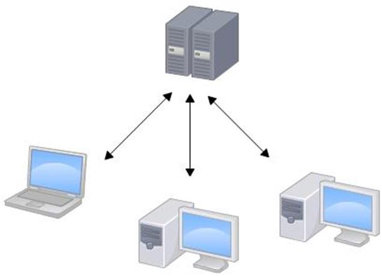
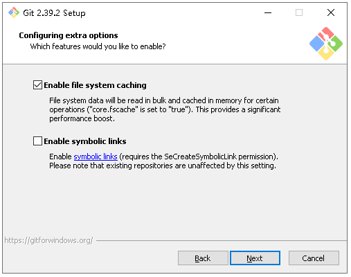
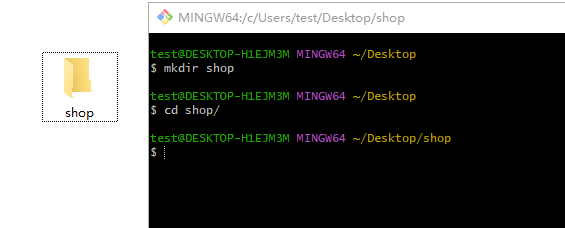
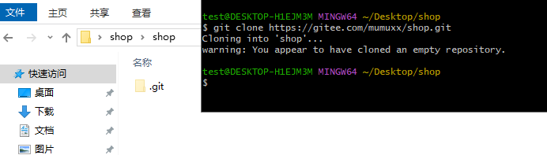

# Git 版本控制

## 学习目标

- [ ] 了解为什么需要版本控制
- [ ] 掌握 git 如何安装
- [ ] 了解git的工作机制
- [ ] 掌握git的常用命令

## 一、Git 介绍

### 1.1 Git 概述

Git 是一个免费的、开源的**分布式版本控制系统**，可以快速高效地处理从小型到大型的各种项目。

Git 易于学习，占地面积小，性能极快。 它具有廉价的本地库，方便的暂存区域和多个工作流分支等特性。其性能优于 Subversion、CVS、Perforce 和 ClearCase 等版本控制工具。

### 1.2 何为版本控制

版本控制是一种记录文件内容变化，以便将来查阅特定版本修订情况的系统。

版本控制其实最重要的是可以记录文件修改历史记录，从而让用户能够查看历史版本，方便版本切换。


### 1.3 为什么需要版本控制

个人开发过渡到团队协作。


### 1.4 版本控制工具  

#### 1.4.1 集中式版本控制工具 

CVS、 **SVN(Subversion)**、 VSS……  

集中化的版本控制系统诸如 CVS、 SVN 等，都有一个单一的集中管理的服务器，保存所有文件的修订版本，而协同工作的人们都通过客户端连到这台服务器，取出最新的文件或者提交更新。多年以来，这已成为版本控制系统的标准做法。

这种做法带来了许多好处，每个人都可以在一定程度上看到项目中的其他人正在做些什么。而管理员也可以轻松掌控每个开发者的权限，并且管理一个集中化的版本控制系统， 要远比在各个客户端上维护本地数据库来得轻松容易。

事分两面，有好有坏。这么做显而易见的缺点是中央服务器的单点故障。如果服务器宕机一小时，那么在这一小时内，谁都无法提交更新，也就无法协同工作。  



#### 1.4.2 分布式版本控制工具  

**Git**、 Mercurial、 Bazaar、 Darcs……  

像 Git 这种分布式版本控制工具，客户端提取的不是最新版本的文件快照，而是把代码仓库完整地镜像下来（本地库）。这样任何一处协同工作用的文件发生故障，事后都可以用其他客户端的本地仓库进行恢复。因为每个客户端的每一次文件提取操作，实际上都是一次对整个文件仓库的完整备份。  

分布式的版本控制系统出现之后，解决了集中式版本控制系统的缺陷：

1. 服务器断网的情况下也可以进行开发（因为版本控制是在本地进行的）  
2. 每个客户端保存的也都是整个完整的项目（包含历史记录， 更加安全）  


### 1.5 Git 简史

   

### 1.6 Git 工作机制


### 1.7 Git 和代码托管中心

代码托管中心是基于网络服务器的远程代码仓库，一般我们简单称为**远程库**。  

- 局域网  
  - GitLab  
- 互联网  
  - GitHub（国外）
  - Gitee 码云 （国内）


## 二、 Git 安装

1. 查看 GNU 协议，可以直接点击下一步。  


2. 选择 Git 安装位置，要求是非中文并且没有空格的目录，然后下一步。  

   

   3. Git 选项配置，推荐默认设置，然后下一步。  

      

   4. Git 安装目录名，不用修改，直接点击下一步。  

      

   5. Git 的默认编辑器，建议使用默认的 Vim 编辑器，然后点击下一步。  

      

   6. 默认分支名设置，选择让 Git 决定，分支名默认为 master，下一步。  

      

   7. 修改 Git 的环境变量，选第二个，可以在Git Bash 、windows命令提示符、windows powerShell 中使用 Git。  

      

   8. 选择后台客户端连接协议，选默认值 OpenSSL，然后下一步。  

      

      

   9. 配置 Git 文件的行末换行符， Windows 使用 CRLF， Linux 使用 LF，选择第一个自动转换，然后继续下一步。  

       

   10. 选择 Git 终端类型，选择默认的 Git Bash 终端，然后继续下一步。  
   
       
   
   11. 选择 Git pull 合并的模式，选择默认，然后下一步。  
   
        
   
   12. 选择 Git 的凭据管理器，选择默认的跨平台的凭据管理器，然后下一步。
   
        
   
   13. 配置额外选项，默认即可
   
        
   
   14. 配置实验选项，默认即可，点击install进行安装
   
        
   
   15. 点击Finsh按钮，Git安装成功
   
        
   
   16. 右键任意位置，在右键菜单里选择 Git Bash Here 即可打开 Git Bash 命令行终端。  
   
        

​    在 Git Bash 终端里输入 `git --version` 查看 git 版本，如图所示，说明 Git 安装成功。  

​       

## 三、 Git 常用命令

| 命令名称                             | 作用           |
| :----------------------------------- | -------------- |
| git config --global user.name 用户名 | 设置用户签名   |
| git config --global user.email 邮箱  | 设置用户签名   |
| git init                             | 初始化本地库   |
| git status                           | 查看本地库状态 |
| git add 文件名                       | 添加到暂存区   |
| git commit -m "日志信息" 文件名      | 提交到本地库   |
| git reflog                           | 查看历史记录   |
| git reset --hard 版本号              | 版本穿梭       |

### 3.1 设置用户签名

签名的作用是区分不同操作者身份。用户的签名信息在每一个版本的提交信息中能够看到，以此确认本次提交是谁做的。 **Git 首次安装必须设置一下用户签名，否则无法提交代码。**  

**基本语法：**

```shell
git config --global user.name 用户名
git config --global user.email 邮箱
```

**案例实操：**

```shell
test@DESKTOP-H1EJM3M MINGW64 /c/project/demo1
$ git config --global user.name LiXiang

test@DESKTOP-H1EJM3M MINGW64 /c/project/demo1
$ git config --global user.email strive_99@163.com

test@DESKTOP-H1EJM3M MINGW64 /c/project/demo1
$ cat ~/.gitconfig
[user]
        name = LiXiang
        email = strive_99@163.com

```

> 这里设置用户签名和将来登录 GitHub（或其他代码托管中心）的账号没有任何关系。  

### 3.2 初始化本地仓库

**基本语法：**

```shell
git init
```

**案例实操：**

```shell
test@DESKTOP-H1EJM3M MINGW64 /c/project/demo1
$ git init
Initialized empty Git repository in C:/project/demo1/.git/

test@DESKTOP-H1EJM3M MINGW64 /c/project/demo1 (master)
$ ll -a
total 4
drwxr-xr-x 1 test 197121 0 Feb 24 17:42 ./
drwxr-xr-x 1 test 197121 0 Feb 24 17:36 ../
drwxr-xr-x 1 test 197121 0 Feb 24 17:42 .git/
```

**查看结果：**


### 3.3 查看本地库状态

**基本语法：**

```shell
git status
```

#### 3.3.1 首次查看（工作区没有任何文件）

**案例实操：**

```shell
test@DESKTOP-H1EJM3M MINGW64 /c/project/demo1 (master)
$ git status
On branch master

No commits yet

nothing to commit (create/copy files and use "git add" to track)
```

#### 3.3.2 新增文件（hello.txt）

```shell
test@DESKTOP-H1EJM3M MINGW64 /c/project/demo1 (master)
$ vim hello.txt
hello git! hello hbsi！
hello git! hello hbsi！
hello git! hello hbsi！
hello git! hello hbsi！
hello git! hello hbsi！
hello git! hello hbsi！
hello git! hello hbsi！
hello git! hello hbsi！
hello git! hello hbsi！
hello git! hello hbsi！
hello git! hello hbsi！
hello git! hello hbsi！
hello git! hello hbsi！
hello git! hello hbsi！
hello git! hello hbsi！
hello git! hello hbsi！
```

#### 3.3.3 再次查看（检测到未追踪的文件）

```shell
test@DESKTOP-H1EJM3M MINGW64 /c/project/demo1 (master)
$ git status
On branch master

No commits yet

Untracked files:
  (use "git add <file>..." to include in what will be committed)
        hello.txt

nothing added to commit but untracked files present (use "git add" to track)
```

### 3.4 添加暂存区

#### 3.4.1 将工作区的文件添加到暂存区

**基本语法：**

```shell
git add 文件名
```

**案例实操：**

```shell
test@DESKTOP-H1EJM3M MINGW64 /c/project/demo1 (master)
$ git add hello.txt
warning: in the working copy of 'hello.txt', LF will be replaced by CRLF the next time Git touches it
```

#### 3.4.2 查看状态（检测到暂存区有新文件）  

```shell
test@DESKTOP-H1EJM3M MINGW64 /c/project/demo1 (master)
$ git status
On branch master

No commits yet

Changes to be committed:
  (use "git rm --cached <file>..." to unstage)
        new file:   hello.txt
```

### 3.5 提交本地库

#### 3.5.1 将暂存区的文件提交到本地库  

**基本语法：**

```shell
git commit -m "日志信息" 文件名
```

**案例实操：**

```shell
test@DESKTOP-H1EJM3M MINGW64 /c/project/demo1 (master)
$ git commit -m "my first commit" hello.txt
warning: in the working copy of 'hello.txt', LF will be replaced by CRLF the next time Git touches it
[master (root-commit) c7f810b] my first commit
 1 file changed, 16 insertions(+)
 create mode 100644 hello.txt

```

####  3.5.2 查看状态（没有文件需要提交）  

```shell
test@DESKTOP-H1EJM3M MINGW64 /c/project/demo1 (master)
$ git status
On branch master
nothing to commit, working tree clean
```

### 3.6 修改文件（hello.txt）  

```shell
test@DESKTOP-H1EJM3M MINGW64 /c/project/demo1 (master)
$ vim hello.txt
hello git! hello hbsi！ byebye
hello git! hello hbsi！
hello git! hello hbsi！
hello git! hello hbsi！
hello git! hello hbsi！
hello git! hello hbsi！
hello git! hello hbsi！
.........
```

#### 3.6.1 查看状态（检测到工作区有文件被修改）  

```shell
test@DESKTOP-H1EJM3M MINGW64 /c/project/demo1 (master)
$ git status
On branch master
Changes not staged for commit:
  (use "git add <file>..." to update what will be committed)
  (use "git restore <file>..." to discard changes in working directory)
        modified:   hello.txt

no changes added to commit (use "git add" and/or "git commit -a")
```

#### 3.6.2 将修改的文件再次添加暂存区  

```shell
test@DESKTOP-H1EJM3M MINGW64 /c/project/demo1 (master)
$ git add hello.txt
warning: in the working copy of 'hello.txt', LF will be replaced by CRLF the next time Git touches it
```

#### 3.6.3 查看状态（工作区的修改添加到了暂存区）  

```shell
test@DESKTOP-H1EJM3M MINGW64 /c/project/demo1 (master)
$ git status
On branch master
Changes to be committed:
  (use "git restore --staged <file>..." to unstage)
        modified:   hello.txt
```

#### 3.6.4 将暂存区的文件提交到本地库  (修改后提交)

```shell
test@DESKTOP-H1EJM3M MINGW64 /c/project/demo1 (master)
$ git commit -m "my second commit" hello.txt
warning: in the working copy of 'hello.txt', LF will be replaced by CRLF the next time Git touches it
[master c10f618] my second commit
 1 file changed, 1 insertion(+), 1 deletion(-)
```


### 3.7 历史版本

#### 3.7.1 查看历史版本

**基本语法：**

```shell
git reflog 查看版本信息
git log 查看版本详细信息
```

**案例实操：**

```shell
test@DESKTOP-H1EJM3M MINGW64 /c/project/demo1 (master)
$ git reflog
c10f618 (HEAD -> master) HEAD@{0}: commit: my second commit
c7f810b HEAD@{1}: commit (initial): my first commit
--------------------------------
test@DESKTOP-H1EJM3M MINGW64 /c/project/demo1 (master)
$ git log
commit c10f618fe6bc0294b0c9fa8378120439d0c337e2 (HEAD -> master)
Author: LiXiang <strive_99@163.com>
Date:   Sat Feb 25 20:19:24 2023 +0800

    my second commit

commit c7f810b637b10b41d901e50b7ec0bb52ef39f29f
Author: LiXiang <strive_99@163.com>
Date:   Sat Feb 25 20:10:51 2023 +0800

    my first commit
```

#### 3.7.2 版本穿梭  

**基本语法：**

```shell
git reset --hard 版本号
```

**案例实操：**

首先查看当前的历史记录， 可以看到当前是在 c10f618 这个版本  

```shell
test@DESKTOP-H1EJM3M MINGW64 /c/project/demo1 (master)
$ git reflog
c10f618 (HEAD -> master) HEAD@{0}: commit: my second commit
c7f810b HEAD@{1}: commit (initial): my first commit
```

切换到 c7f810b 版本，也就是我们第一次提交的版本  

```shell
test@DESKTOP-H1EJM3M MINGW64 /c/project/demo1 (master)
$ git reset --hard c7f810b
HEAD is now at c7f810b my first commit
```

切换完毕之后再查看历史记录，当前成功切换到了 c7f810b 版本  

```shell
test@DESKTOP-H1EJM3M MINGW64 /c/project/demo1 (master)
$ git reflog
c7f810b (HEAD -> master) HEAD@{0}: reset: moving to c7f810b
c10f618 HEAD@{1}: commit: my second commit
c7f810b (HEAD -> master) HEAD@{2}: commit (initial): my first commit
```

查看文件 hello.txt，发现文件内容已经变化

```shell
test@DESKTOP-H1EJM3M MINGW64 /c/project/demo1 (master)
$ cat hello.txt
hello git! hello hbsi！
hello git! hello hbsi！
hello git! hello hbsi！
hello git! hello hbsi！
hello git! hello hbsi！
hello git! hello hbsi！
hello git! hello hbsi！
hello git! hello hbsi！
hello git! hello hbsi！
hello git! hello hbsi！
hello git! hello hbsi！
hello git! hello hbsi！
hello git! hello hbsi！
hello git! hello hbsi！
hello git! hello hbsi！
hello git! hello hbsi！
```

Git 切换版本， 底层其实是移动的 HEAD 指针，具体原理如下图所示。  


## 四、Git 分支操作  


### 4.1 什么是分支  

在版本控制过程中，同时推进多个任务，为每个任务，我们就可以创建每个任务的单独分支。使用分支意味着程序员可以把自己的工作从开发主线上分离开来， 开发自己分支的时候，不会影响主线分支的运行。对于初学者而言，分支可以简单理解为副本，一个分支就是一个单独的副本。（分支底层其实也是指针的引用）  


### 4.2 分支的好处  

同时并行推进多个功能开发，提高开发效率。

各个分支在开发过程中，如果某一个分支开发失败，不会对其他分支有任何影响。失败的分支删除重新开始即可。  

### 4.3 分支的操作  

| 命令名称               | 作用                         |
| ---------------------- | ---------------------------- |
| git branch 分支名      | 创建分支                     |
| git branch -v          | 查看分支                     |
| git checkout 分支名    | 切换分支                     |
| git merge 分支名       | 把指定的分支合并到当前分支上 |
| git checkout -b 分支名 | 新建并切换到分支             |

#### 4.3.1 查看分支

**基本语法：**

```shell
git branch -v
```

**案例实操：**

```shell
test@DESKTOP-H1EJM3M MINGW64 /c/project/demo1 (master)
$ git branch -v
* master c7f810b my first commit
```

#### 4.3.2 创建分支

**基本语法：**

```shell
git branch 分支名
```

**案例实操：**

```shell
test@DESKTOP-H1EJM3M MINGW64 /c/project/demo1 (master)
$ git branch hot-fix

test@DESKTOP-H1EJM3M MINGW64 /c/project/demo1 (master)
$ git branch -v
hot-fix c7f810b my first commit （刚创建的新的分支，并将主分支 master 的内容复制了一份）
  hot-fix c7f810b my first commit
* master  c7f810b my first commit
```

#### 4.3.3 修改分支  

```shell
// 在 maste 分支上做修改
test@DESKTOP-H1EJM3M MINGW64 /c/project/demo1 (master)
$ vim hello.txt

// 添加暂存区
test@DESKTOP-H1EJM3M MINGW64 /c/project/demo1 (master)
$ git add hello.txt

// 提交本地库
test@DESKTOP-H1EJM3M MINGW64 /c/project/demo1 (master)
$ git commit -m "my third commit" hello.txt
[master 75bc666] my third commit
 1 file changed, 1 insertion(+), 1 deletion(-)

// 查看分支
test@DESKTOP-H1EJM3M MINGW64 /c/project/demo1 (master)
$ git branch -v
  hot-fix c7f810b my first commit
* master  75bc666 my third commit

// 查看 master 分支上的文件内容
test@DESKTOP-H1EJM3M MINGW64 /c/project/demo1 (master)
$ cat hello.txt
hello git! hello hbsi！
hello git! hello hbsi！master test
hello git! hello hbsi！
hello git! hello hbsi！
hello git! hello hbsi！
hello git! hello hbsi！
hello git! hello hbsi！
hello git! hello hbsi！
hello git! hello hbsi！
hello git! hello hbsi！
hello git! hello hbsi！
hello git! hello hbsi！
hello git! hello hbsi！
hello git! hello hbsi！
hello git! hello hbsi！
hello git! hello hbsi！
```

#### 4.3.4 切换分支

**基本语法：**

```shell
git checkout 分支名
```

**案例实操：**

```shell
test@DESKTOP-H1EJM3M MINGW64 /c/project/demo1 (master)
$ git checkout hot-fix
Switched to branch 'hot-fix'
// 发现当先分支已由 master 改为 hot-fix
test@DESKTOP-H1EJM3M MINGW64 /c/project/demo1 (hot-fix)
查看 hot-fix 分支上的文件内容发现与 master 分支上的内容不同
$ cat hello.txt
hello git! hello hbsi！
hello git! hello hbsi！
hello git! hello hbsi！
hello git! hello hbsi！
hello git! hello hbsi！
hello git! hello hbsi！
hello git! hello hbsi！
hello git! hello hbsi！
hello git! hello hbsi！
hello git! hello hbsi！

// 在 hot-fix 分支上做修改
test@DESKTOP-H1EJM3M MINGW64 /c/project/demo1 (hot-fix)
$ vim hello.txt
// 添加暂存区
test@DESKTOP-H1EJM3M MINGW64 /c/project/demo1 (hot-fix)
$ git add hello.txt
// 提交本地库
test@DESKTOP-H1EJM3M MINGW64 /c/project/demo1 (hot-fix)
$ git commit -m "hot-fix commit" hello.txt
[hot-fix 1b4752b] hot-fix commit
 1 file changed, 1 insertion(+), 1 deletion(-)

```

#### 4.3.5 合并分支

**基本语法：**

```shell
git merge 分支名
```

**案例实操：**

```
// 在 master 分支上合并 hot-fix 分支
// 切换到 master 分支
test@DESKTOP-H1EJM3M MINGW64 /c/project/demo1 (hot-fix)
$ git checkout master
Switched to branch 'master'
// 合并 hot-fix分 支
test@DESKTOP-H1EJM3M MINGW64 /c/project/demo1 (master)
$ git merge hot-fix
Auto-merging hello.txt
CONFLICT (content): Merge conflict in hello.txt
Automatic merge failed; fix conflicts and then commit the result.
```

#### 4.3.6 产生冲突

冲突产生的表现： 后面状态为 **MERGING**  

```shell
test@DESKTOP-H1EJM3M MINGW64 /c/project/demo1 (master|MERGING)
$ cat hello.txt
hello git! hello hbsi！
<<<<<<< HEAD
hello git! hello hbsi！master test
hello git! hello hbsi！
hello git! hello hbsi！
=======
hello git! hello hbsi！
hello git! hello hbsi！
hello git! hello hbsi！ hot-fix test
>>>>>>> hot-fix
hello git! hello hbsi！
hello git! hello hbsi！
hello git! hello hbsi！
hello git! hello hbsi！
hello git! hello hbsi！
hello git! hello hbsi！
hello git! hello hbsi！
hello git! hello hbsi！
hello git! hello hbsi！
hello git! hello hbsi！
hello git! hello hbsi！
hello git! hello hbsi！

```

冲突产生的原因：  

合并分支时，两个分支在同一个文件的同一个位置有两套完全不同的修改。 Git 无法替我们决定使用哪一个。必须人为决定新代码内容。  

查看状态（检测到有文件有两处修改）  

```shell
test@DESKTOP-H1EJM3M MINGW64 /c/project/demo1 (master|MERGING)
$ git status
On branch master
You have unmerged paths.
  (fix conflicts and run "git commit")
  (use "git merge --abort" to abort the merge)

Unmerged paths:
  (use "git add <file>..." to mark resolution)
        both modified:   hello.txt

no changes added to commit (use "git add" and/or "git commit -a")
```

#### 4.3.7 解决冲突

1） 编辑有冲突的文件，删除特殊符号，决定要使用的内容  

特殊符号： <<<<<<< HEAD 当前分支的代码 ======= 合并过来的代码 >>>>>>> hot-fix

```
test@DESKTOP-H1EJM3M MINGW64 /c/project/demo1 (master|MERGING)
$ vim hello.txt

test@DESKTOP-H1EJM3M MINGW64 /c/project/demo1 (master|MERGING)
$ cat hello.txt
hello git! hello hbsi！
hello git! hello hbsi！master test
hello git! hello hbsi！
hello git! hello hbsi！
hello git! hello hbsi！
hello git! hello hbsi！
hello git! hello hbsi！ hot-fix test
hello git! hello hbsi！
hello git! hello hbsi！
。。。。。。。。

```

2） 添加到暂存区  

```shell
test@DESKTOP-H1EJM3M MINGW64 /c/project/demo1 (master|MERGING)
$ git add hello.txt

```

3） 执行提交（注意： 此时使用 git commit 命令时**不能带文件名**）

```shell
test@DESKTOP-H1EJM3M MINGW64 /c/project/demo1 (master|MERGING)
$ git commit -m "merge hot-fix"
[master 203fbc2] merge hot-fix

test@DESKTOP-H1EJM3M MINGW64 /c/project/demo1 (master)

```

### 4.4 创建分支和切换分支图解


master、 hot-fix 其实都是指向具体版本记录的指针。当前所在的分支，其实是由 HEAD决定的。所以创建分支的本质就是多创建一个指针。

HEAD 如果指向 master，那么我们现在就在 master 分支上。

HEAD 如果执行 hotfix，那么我们现在就在 hotfix 分支上。  

所以切换分支的本质就是移动 HEAD 指针。  

## 五、Git 团队协作机制  

### 5.1 团队协作  


## 六、Git 、 GitHub 、Gitee

GitHub 网址： https://www.github.com/  

Gitee 网址：https://gitee.com/

### 6.1 两者的区别

Git是一个分布式版本控制系统，简单的说其就是一个软件，用于记录一个或若干文件内容变化，以便将来查阅特定版本修订情况的软件。

Github（https://www.github.com）是一个为用户提供Git服务的网站，简单说就是一个可以放代码的地方（不过可以放的当然不仅是代码）。Github除了提供管理Git的web界面外，还提供了订阅、关注、讨论组、在线编辑器等丰富的功能。Github被称之为全球最大的基友网站。

Gitee （https://gitee.com/）Gitee.com(码云) 是 OSCHNA.NET 推出的代码托管平台,支持 Git 和 SVN,提供免费的私有仓库托管。

### 6.2 Gitee 注册


按要求填写即可。

### 6.3 线上仓库创建

打开创建仓库页面：https://gitee.com/projects/new


带星号的是必填项。

> 注意：仓库名要求在当前帐号下唯一。

### 6.4 两种常规使用方式

#### 6.4.1 基于http/https协议

1. 创建空目录，名称为shop

   

2. 使用clone指令克隆线上仓库到本地

语法：

```shell
git clone 线上仓库地址
```


因为是私有仓库，所以需要验证 gitee 的账号才可以克隆，在此处输入gitee的用户名密码即可。



已克隆到本地。


3. 在仓库上做对应的操作（提交暂存区、提交本地仓库、**提交线上仓库、拉取线上仓库**）

提交到线上仓库的指令：

```shell
git push
```

```shell
// 创建文件
test@DESKTOP-H1EJM3M MINGW64 ~/Desktop/shop/shop (master)
$ echo "# shop" >> README.md

// 添加到暂存区
test@DESKTOP-H1EJM3M MINGW64 ~/Desktop/shop/shop (master)
$ git add README.md
warning: in the working copy of 'README.md', LF will be replaced by CRLF the next time Git touches it

// 提交到本地仓库
test@DESKTOP-H1EJM3M MINGW64 ~/Desktop/shop/shop (master)
$ git commit -m "初始化readme文件"
[master (root-commit) cdc8196] 初始化readme文件
 1 file changed, 1 insertion(+)
 create mode 100644 README.md

// 提交到线上仓库
test@DESKTOP-H1EJM3M MINGW64 ~/Desktop/shop/shop (master)
$ git push
Enumerating objects: 3, done.
Counting objects: 100% (3/3), done.
Writing objects: 100% (3/3), 237 bytes | 237.00 KiB/s, done.
Total 3 (delta 0), reused 0 (delta 0), pack-reused 0
remote: Powered by GITEE.COM [GNK-6.4]
To https://gitee.com/mumuxx/shop.git
 * [new branch]      master -> master

```

【验证】此时可以观察浏览器，刷新线上仓库的地址：


拉取线上仓库，进行同步：

```shell
git pull
```

```shell
test@DESKTOP-H1EJM3M MINGW64 ~/Desktop/shop/shop (master)
$ git pull
Already up to date.
```

#### 6.4.2 基于ssh协议（推荐）

该方式与前面https方式相比，只是影响github对于用户的身份鉴权方式，对于git的具体操作（如提交本地、添加注释、提交远程等操作）没有任何影响。

步骤：

1. 生成客户端公私钥文件
2. 将公钥上传到码云


**创建公私玥对文件**

输入 `ssh-keygen -t rsa -C "534529940@qq.com"` 连续按回车即可

```shell
test@DESKTOP-H1EJM3M MINGW64 ~/Desktop/shop/shop (master)
$ ssh-keygen -t rsa -C "534529940@qq.com"
Generating public/private rsa key pair.
Enter file in which to save the key (/c/Users/test/.ssh/id_rsa):
Created directory '/c/Users/test/.ssh'.
Enter passphrase (empty for no passphrase):
Enter same passphrase again:
Your identification has been saved in /c/Users/test/.ssh/id_rsa
Your public key has been saved in /c/Users/test/.ssh/id_rsa.pub
The key fingerprint is:
SHA256:1Kn6MT2yit5HH6bc5RPcY4SuN2ofCoXVHtG8wplSc0E 534529940@qq.com
The key's randomart image is:
+---[RSA 3072]----+
|            .+E. |
|         . oo.+  |
|        . +oo* . |
|       . +..*.o  |
|        S .+.+   |
|       ..oo = +  |
|      .o==o=.o . |
|     o .+*=o=.   |
|   .o ooo.o+.o   |
+----[SHA256]-----+
```

**上传公钥文件内容（id_rsa.pub）**

打开 id_rsa.pub 文件，将内容复制到码云

```shell
test@DESKTOP-H1EJM3M MINGW64 ~/Desktop/shop/shop (master)
$ cat  /c/Users/test/.ssh/id_rsa.pub
ssh-rsa AAAAB3NzaC1yc2EAAAADAQABAAABgQC2NCevdVlTEklzx9S+lbvt56hh679mSoCLhd6NXxt3L0XezWehWHUWDq9hRmyiYtuhYiTique0KFPZvd9U5JspEFWHr5hd07sRiewz3O8/98J3i3njXWBo1vL/xPRU+sGHwe9fPQk1OPWOaTxfTdmSkG3I/ci3FwB7vLtzK1v2XME6/xZQiFif/juO/R7pioU0mGnFxCXEGkp7bTBFtu+VuYD2z9x+HJuGmb6r56eNq7UKGJyD3wP0sU8vBKmOwNi1URidNWzdlUGb1lbM5o9gSdou4pEpQsEaLtEIgjNZN379REJe38HBftxgOtIaMPEi2am/tycCKVFrfl7AOsxv5p7V2VsQHKF8ppUprgg0dHOI7Uw5jQC17hXoIdJVERwUNW2/EF1EL1wSdAL9KCXR79zYDDwopwtcLB7jkbv+DaBcXSheaCkJW/jybielw524B6lwCMA0SPXqd+9yBIiOSLCAtI5a3pACOnU/A4yU8e7rOoGAQNuRZxY1466/D90= 534529940@qq.com

```


执行后续git操作，操作与先前一样

1. clone线上仓库到本地（git clone）

```
git clone git@gitee.com:mumuxx/shop.git
第一次会有提示，输入Yes即可
```


2. 修改文件后添加缓存区、提交本地仓库、提交线上仓库

```shell
test@DESKTOP-H1EJM3M MINGW64 ~/Desktop/shop (master)
$ echo "<?php echo phpinfo();" >> index.php

test@DESKTOP-H1EJM3M MINGW64 ~/Desktop/shop (master)
$ git add index.php
warning: in the working copy of 'index.php', LF will be replaced by CRLF the next time Git touches it

test@DESKTOP-H1EJM3M MINGW64 ~/Desktop/shop (master)
$ git commit -m "创建index.php入口文件"
[master 3ec44da] 创建index.php入口文件
 1 file changed, 1 insertion(+)
 create mode 100644 index.php

test@DESKTOP-H1EJM3M MINGW64 ~/Desktop/shop (master)
$ git push
Enumerating objects: 4, done.
Counting objects: 100% (4/4), done.
Delta compression using up to 4 threads
Compressing objects: 100% (2/2), done.
Writing objects: 100% (3/3), 324 bytes | 324.00 KiB/s, done.
Total 3 (delta 0), reused 0 (delta 0), pack-reused 0
remote: Powered by GITEE.COM [GNK-6.4]
To gitee.com:mumuxx/shop.git
   cdc8196..3ec44da  master -> master
```


### 6.5 忽略文件

应用场景：在项目目录下有很多万年不变的文件目录，例如css、js、images等，或者还有一些目录即便有改动，我们也不想让其提交到远程仓库的文档，此时我们可以使用“忽略文件”机制来实现需求。

忽略文件需要新建一个名为.gitignore的文件，该文件用于声明忽略文件或不忽略文件的规则，规则对当前目录及其子目录生效。

> 该文件因为没有文件名，没办法直接在windows目录下直接创建，可以通过命令行Git Bash来touch创建。

**常见规则写法有如下几种：**

```shell
1）/mtk/               过滤整个文件夹
2）*.zip                过滤所有.zip文件
3）/mtk/do.c           过滤某个具体文件
4) !index.php			   不过滤具体某个文件	
在文件中，以#开头的都是注释。
```

**案例**

先在本地仓库中新建一个js目录以及目录中js文件，依次提交本地与远程仓库

```shell
test@DESKTOP-H1EJM3M MINGW64 ~/Desktop/shop (master)
$ mkdir js

test@DESKTOP-H1EJM3M MINGW64 ~/Desktop/shop (master)
$ cd js

test@DESKTOP-H1EJM3M MINGW64 ~/Desktop/shop/js (master)
$ echo "console.log(123)" >> login.js

test@DESKTOP-H1EJM3M MINGW64 ~/Desktop/shop/js (master)
$ cd ..

test@DESKTOP-H1EJM3M MINGW64 ~/Desktop/shop (master)
$ git add .
warning: in the working copy of 'js/login.js', LF will be replaced by CRLF the next time Git touches it

test@DESKTOP-H1EJM3M MINGW64 ~/Desktop/shop (master)
$ git commit -m "新增js目录"
[master 87da5a2] 新增js目录
 1 file changed, 1 insertion(+)
 create mode 100644 js/login.js

test@DESKTOP-H1EJM3M MINGW64 ~/Desktop/shop (master)
$ git push
Enumerating objects: 5, done.
Counting objects: 100% (5/5), done.
Delta compression using up to 4 threads
Compressing objects: 100% (2/2), done.
Writing objects: 100% (4/4), 386 bytes | 386.00 KiB/s, done.
Total 4 (delta 0), reused 0 (delta 0), pack-reused 0
remote: Powered by GITEE.COM [GNK-6.4]
To gitee.com:mumuxx/shop.git
   3ec44da..87da5a2  master -> master

```

> git add .   是将所有新添加文件夹级文件添加到暂存区

新建 `.gitignore`文件

```shell
test@DESKTOP-H1EJM3M MINGW64 ~/Desktop/shop (master)
$ touch .gitignore
```

编写文件中的规则（根据需要编写）


再次提交到本地与线上仓库

```shell
test@DESKTOP-H1EJM3M MINGW64 ~/Desktop/shop (master)
$ echo "console.log(456)" >> js/index.js

test@DESKTOP-H1EJM3M MINGW64 ~/Desktop/shop (master)
$ git add .

test@DESKTOP-H1EJM3M MINGW64 ~/Desktop/shop (master)
$ git commit -m "新增index.js"
[master 8ac3b44] 新增index.js
 1 file changed, 2 insertions(+)
 create mode 100644 .gitignore

test@DESKTOP-H1EJM3M MINGW64 ~/Desktop/shop (master)
$ git push
Enumerating objects: 4, done.
Counting objects: 100% (4/4), done.
Delta compression using up to 4 threads
Compressing objects: 100% (2/2), done.
Writing objects: 100% (3/3), 372 bytes | 372.00 KiB/s, done.
Total 3 (delta 0), reused 0 (delta 0), pack-reused 0
remote: Powered by GITEE.COM [GNK-6.4]
To gitee.com:mumuxx/shop.git
   87da5a2..8ac3b44  master -> master

```

观察线上仓库js目录中是否有新增index.js文件：


