# 前端工程化与webpack

## 学习目标  

- [ ] 了解什么是前端工程化
- [ ] 能够掌握 webpack 的基本使用
- [ ] 了解常用的 plugin 的基本使用  
- [ ] 了解常用的 loader 的基本使用  
- [ ] 能够掌握 Source Map 的作用  

## 一、前端工程化

### 1.1. 小白眼中的前端开发 vs 实际的前端开发  

**小白眼中的前端开发：**  

- 会写 HTML + CSS + JavaScript 就会前端开发  
- 需要美化页面样式，就拽一个 bootstrap 过来  
- 需要操作 DOM 或发起 Ajax 请求，再拽一个 jQuery 过来  
- 需要快速实现网页布局效果，就拽一个 Layui 过来  

**实际的前端开发：**  

- **模块化**（js 的模块化、css 的模块化、资源的模块化）  
- **组件化**（复用现有的 UI 结构、样式、行为）  
- **规范化**（目录结构的划分、编码规范化、接口规范化、文档规范化、 Git 分支管理）  
- **自动化**（自动化构建、自动部署、自动化测试）  

### 1.2. 什么是前端工程化

**前端工程化指的是：**在企业级的前端项目开发中，把前端开发所需的工具、技术、流程、经验等进行**规范化、标准化**。

企业中的 Vue 项目和 React 项目，都是基于工程化的方式进行开发的。

**好处：**前端开发自成体系，有一套标准的开发方案和流程。  

### 1.3. 前端工程化的解决方案  

**早期的前端工程化解决方案：**  

- grunt（ https://www.gruntjs.net/ ）  
- gulp（ https://www.gulpjs.com.cn/ ）  

**目前主流的前端工程化解决方案：  **

- webpack（ https://www.webpackjs.com/ ）  

- parcel（ https://zh.parceljs.org/ ）  

## 二、 webpack

### 2.1 什么是 webpack  

**概念：**webpack 是前端项目工程化的具体解决方案。

**主要功能：**它提供了友好的前端模块化开发支持，以及代码压缩混淆、处理浏览器端 JavaScript 的兼容性、性
能优化等强大的功能。

**好处：**让程序员把工作的重心放到具体功能的实现上，提高了前端开发效率和项目的可维护性。

**注意：**目前 Vue，React 等前端项目，基本上都是基于 webpack 进行工程化开发的。  

### 2.2 webpack 基本使用

#### 创建列表隔行变色项目  

1. 新建项目空白目录，并运行 npm init –y 命令，初始化包管理配置文件 package.json
2. 新建 src 源代码目录和 src -> index.js 脚本文件
3. 新建 src-> index.html 首页
4. 初始化首页基本的结构
5. 运行 npm install jquery –S 命令，安装 jQuery
6. 通过 ES6 模块化的方式导入 jQuery，实现列表隔行变色效果  

**在项目中安装 webpack**

在终端运行如下的命令，安装 webpack 相关的两个包：

```shell
npm install webpack@5.90.3 webpack-cli@5.1.4 -D
```

**在项目中配置 webpack  **

在项目根目录中，创建名为 webpack.config.js 的 webpack 配置文件，并初始化如下的基本配置：  

```js
module.exports = {
  mode: "development",// mode 用来指定构建模式。可选值有development 和 production
};
```

- development  
  - 开发环境  
  - 不会对打包生成的文件进行代码压缩和性能优化  
  - 打包速度快，适合在开发阶段使用  
- production  
  - 生产环境  
  - 会对打包生成的文件进行代码压缩和性能优化  
  - 打包速度很慢，仅适合在项目发布阶段使用  

在 package.json 的 scripts 节点下，新增 dev 脚本如下：  

```js
  "scripts": {
    "dev": "webpack" // script 节点下的脚本，可以用过 npm run 执行。例如 npm run dev
  },
```

在终端中运行 npm run dev 命令，启动 webpack 进行项目的打包构建  

**webpack.config.js 文件的作用  **

webpack.config.js 是 webpack 的配置文件。webpack 在真正开始打包构建之前，会先读取这个配置文件，从而基于给定的配置，对项目进行打包。  

注意：由于 webpack 是基于 node.js 开发出来的打包工具，因此在它的配置文件中，支持使用 node.js 相关的语法和模块进行 webpack 的个性化配置。  

**webpack 中的默认约定  **

在 webpack 4.x 和 5.x 的版本中，有如下的默认约定：

- 默认的打包入口文件为 src -> index.js
- 默认的输出文件路径为 dist -> main.js  

注意：可以在 webpack.config.js 中修改打包的默认约定  

**自定义打包的入口与出口  **

在 webpack.config.js 配置文件中，通过 entry 节点指定打包的入口。通过 output 节点指定打包的出口。
示例代码如下：  

```js
const path = require("path"); // 导入 node.js 专门操作路径的模块
module.exports = {
  mode: "production",
  entry: path.join(__dirname, "./src/index.js"), // 打包入口文件的路径
  output: {
    path: path.join(__dirname, "./dist"), // 输出文件的存放路径
    filename: "bundle.js", // 输出文件的名称
  },
};
```

### 2.3 webpack 中的插件  

#### webpack 插件的作用

通过安装和配置第三方的插件，可以拓展 webpack 的能力，从而让 webpack 用起来更方便。最常用的webpack 插件有如下两个：  

- webpack-dev-server  
  - 类似于 node.js 阶段用到的 nodemon 工具  
  - 每当修改了源代码，webpack 会自动进行项目的打包和构建  
- html-webpack-plugin  
  - webpack 中的 HTML 插件（类似于一个模板引擎插件）  
  - 可以通过此插件自定制 index.html 页面的内容  

**webpack-dev-server**

webpack-dev-server 可以让 webpack 监听项目源代码的变化，从而进行自动打包构建。  

**安装 webpack-dev-server**

运行如下的命令，即可在项目中安装此插件：  

```js
npm install webpack-dev-server@5.0.2 -D
```

**配置 webpack-dev-server  **

修改 package.json -> scripts 中的 dev 命令如下：  

```js
  "scripts": {
    "dev": "webpack server"
  },
```

再次运行 npm run dev 命令，重新进行项目的打包  

在浏览器中访问 http://localhost:8080 地址，查看自动打包效果  

> 注意：webpack-dev-server 会启动一个实时打包的 http 服务器  

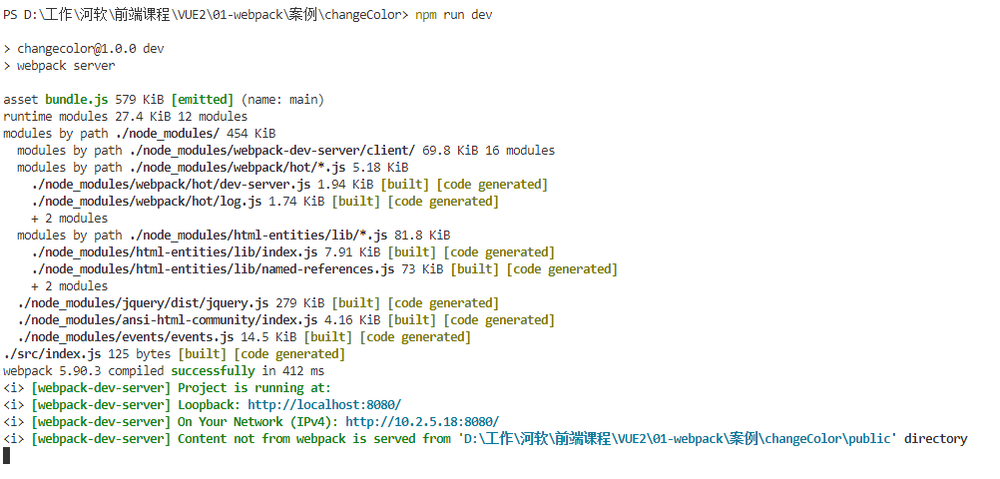

**打包生成的文件哪儿去了？  **

- 不配置 webpack-dev-server 的情况下，webpack 打包生成的文件，会存放到实际的物理磁盘上  
  - 严格遵守开发者在 webpack.config.js 中指定配置  
  - 根据 output 节点指定路径进行存放  
- 配置了 webpack-dev-server 之后，打包生成的文件存放到了内存中  
  - 不再根据 output 节点指定的路径，存放到实际的物理磁盘上  
  - 提高了实时打包输出的性能，因为内存比物理磁盘速度快很多  

**生成到内存中的文件该如何访问？  **

webpack-dev-server 生成到内存中的文件，默认放到了项目的根目录中，而且是**虚拟的、不可见的**。  

- 可以直接用 / 表示项目根目录，后面跟上要访问的文件名称，即可访问内存中的文件  
- 例如 /bundle.js 就表示要访问 webpack-dev-server 生成到内存中的 bundle.js 文件  

**html-webpack-plugin 插件**  

html-webpack-plugin 是 webpack 中的 HTML 插件，可以通过此插件自定制index.html 页面的内容。

需求：通过 html-webpack-plugin 插件，将 src 目录下的 index.html 首页，复制到项目根目录中一份！ 

**安装 html-webpack-plugin**   

运行如下的命令，即可在项目中安装此插件：  

```js
npm install html-webpack-plugin@5.6.0 -D
```

**配置 html-webpack-plugin  **

修改webpack.config.js 配置文件，添加如下代码

```js
// 1. 导入html-webpack-plugin插件，得到插件的构造函数
const HtmlPlugin = require('html-webpack-plugin')

// 2. 创建HTML插件的实例对象
const htmlPlugin = new HtmlPlugin({
	template:'./src/index.html',// 指定源文件的存放路径
	filename:'./index.html' // 指定生成的文件存放路径
})

module.exports = {
  // 3. 通过 plugins 节点，使 htmlPlugin 插件生效。
  plugins:[htmlPlugin] // 插件的数组，将来webpack在运行时，会加载并调用这些插件
};
```

- 通过 HTML 插件复制到项目根目录中的 index.html 页面，也被放到了内存中  
- HTML 插件在生成的 index.html 页面，自动注入了打包的 bundle.js 文件  

### 2.4 devServer 节点  

当每次运行`npm run dev`命令需要点击`localhost:8080`或者在浏览器输入地址才可以看到页面，操作比较繁琐，那如何简化操作呢？

在 webpack.config.js 配置文件中，可以通过 devServer 节点对 webpack-dev-server 插件进行更多的配置，示例代码如下：  

```js
devServer: {
    open: true, // 初次打包完成后，自动打开浏览器
    host: '127.0.0.1', // 实时打包所使用的主机地址
    port: 80 // 实时打包所使用的端口号
}
```

注意：凡是修改了 webpack.config.js 配置文件，或修改了 package.json 配置文件，必须重启实时打包的服务器，否则最新的配置文件无法生效！  

## 三、webpack 中的 loader  

### 3.1 loader  概述

在实际开发过程中，webpack 默认只能打包处理以 .js 后缀名结尾的模块。其他非 .js 后缀名结尾的模块，webpack 默认处理不了，需要调用 loader 加载器才可以正常打包，否则会报错！  

loader 加载器的作用：协助 webpack 打包处理特定的文件模块。比如：  

- css-loader 可以打包处理 .css 相关的文件  
- less-loader 可以打包处理 .less 相关的文件  
- babel-loader 可以打包处理 webpack 无法处理的高级 JS 语法  

### 3.2 loader 的调用过程  

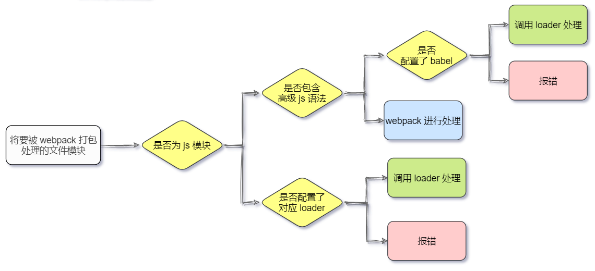

### 3.3 打包处理 css 文件  

- 运行 ` npm i style-loader@3.3.4 css-loader@6.10.0 -D` 命令，安装处理 css 文件的 loader  
- 在src目录下新建index.css，并导入到src/index.js
- 在 webpack.config.js 的 module -> rules 数组中，添加 loader 规则如下：  

```js
module:{
    rules:[
        // 定义了不同模块对应的 loader
        {
            test:/\.css$/,
            use:['style-loader','css-loader']
        }
    ]
}
```

其中，test 表示匹配的文件类型， use 表示对应要调用的 loader  

- use 数组中指定的 loader 顺序是固定的  
- 多个 loader 的调用顺序是：从后往前调用  

webpack 默认只能打包处理.js结尾的文件，处理不了其它后缀的文件。

由于代码中包含了index.css这个文件，webpack默认处理不了。

当webpack发现某个文件处理不了的时候，会查找webpack.config.js这个配置文件，在modules.rules数组中查看是否配置了对应的loader加载器。

webpack 把 index.css这个文件，先转交给最后一个loader进行处理（css-loader）

当 css-loader 处理完毕之后，会把处理的结果转交给下一个loader（style-loader）

当 style-loader处理完毕之后，发现没有下一个loader，就会把处理结果转交给webpack

webpack把style-loader处理的结果，合并到/dist/bundle.js中，最终生成打包好的文件

### 3.4 打包处理 less 文件  

- 运行 ` npm i less-loader@12.2.0 less@4.2.0 -D ` 命令  
- 在 webpack.config.js 的 module -> rules 数组中，添加 loader 规则如下：  

```js
rules:[
    {
        test:/\.less$/,
        use:['style-loader','css-loader','less-loader']
    }
]
```

### 3.5 打包处理样式表中与 url 路径相关的文件  

- 运行 `npm i url-loader@4.1.1 file-loader@6.2.0 -D  ` 命令  
- 在 webpack.config.js 的 module -> rules 数组中，添加 loader 规则如下：  

```js
rules:[
    {
        test:/\.jpg|png|gif$/,
        use:'url-loader?limit=22229'
    }
]
```

其中 ? 之后的是 loader 的参数项：  

- limit 用来指定图片的大小，单位是字节（byte）  
- 只有 ≤ limit 大小的图片，才会被转为 base64 格式的图片  

### 3.6 打包处理 js 文件中的高级语法  

webpack 只能打包处理**一部分**高级的 JavaScript 语法。对于那些 webpack 无法处理的高级 js 语法，需要借助于 babel-loader 进行打包处理。例如 webpack 无法处理下面的 JavaScript 代码：  

```js
// 定义装饰器函数
function info(target){
	// 为目标添加静态属性 info
	target.info = 'Persion info.'
}

// 为 person 类应用 info装饰器
@info
class Person{}// 定义一个普通的类

// 打印 person 的静态属性info
console.log(Person.info)

```

**1. 安装 babel-loader 相关的包**  

运行如下的命令安装对应的依赖包：  

`npm i babel-loader@9.1.3 @babel/core@7.23.9 @babel/plugin-proposal-decorators@7.23.9 -D`

在 webpack.config.js 的 module -> rules 数组中，添加 loader 规则如下：  

```js
module:{
    rules:[
        {
            test:/\.js$/,use:'babel-loader',exclude:/node_modules/
        }
    ]
}
```

**2. 配置 babel-loader**  

在项目根目录下，创建名为 babel.config.js 的配置文件，定义 Babel 的配置项如下：  

```js
module.exports = {
//声明babel可用的插件
	plugins: [['@babel/plugin-proposal-decorators', { legacy: true }]]
}
```

详情请参考 Babel 的官网 https://babeljs.io/docs/en/babel-plugin-proposal-decorators  


## 四、打包发布  

### 4.1 为什么要打包发布  

项目开发完成之后，需要使用 webpack 对项目进行打包发布，主要原因有以下两点：  

- 开发环境下，打包生成的文件存放于内存中，无法获取到最终打包生成的文件  
- 开发环境下，打包生成的文件不会进行代码压缩和性能优化  

为了让项目能够在生产环境中高性能的运行，因此需要对项目进行打包发布。  

### 4.2 配置 webpack 的打包发布  

在 package.json 文件的 scripts 节点下，新增 build 命令如下：  

```js
"scripts": {
    "dev": "webpack serve",
    "build": "webpack --mode production"
},
```

--mode是一个参数项，用来指定 webpack 的运行模式。production 代表生产环境，会对打包生成的文件进行代码压缩和性能优化。  

注意：通过 --mode指定的参数项，会覆盖 webpack.config.js 中的 mode选项 。

### 4.3 把 JavaScript 文件统一生成到 js 目录中  

在 webpack.config.js 配置文件的 output 节点中，进行如下的配置：  

```js
output: {
    path: path.join(__dirname, "./dist"), // 输出文件的存放路径
    filename: "js/bundle.js", // 告诉 webpack 把生成的bundle.js 文件存放到 dist 目录下的js子目录中
},
```

### 4.4 把图片文件统一生成到 image 目录中  

修改 webpack.config.js 中的 url-loader 配置项，新增 outputPath 选项即可指定图片文件的输出路径：  

```js
{
    test:/\.jpg|png|gif$/,
    use:{
        loader:'url-loader',
        options:{
            limit:22228,
            // 指定把打包生成的图片文件 存储到dist目录下的image文件夹中，图片大小大于limit才会打包到image文件夹
            outputPath:'image'
        }
    }

},
```

### 4.5 自动清理 dist 目录下的旧文件  

为了在每次打包发布时自动清理掉 dist 目录中的旧文件，可以安装并配置 clean-webpack-plugin 插件：  

```js
npm install --save-dev clean-webpack-plugin
```

修改 webpack.config.js 

```js
const { CleanWebpackPlugin } = require('clean-webpack-plugin');
plugins: [
        new CleanWebpackPlugin(),
    ],
```

## 五、Source Map  

### 5.1 什么是 Source Map  

Source Map 就是一个信息文件，里面储存着位置信息。也就是说，Source Map 文件中存储着压缩混淆后的代码，所对应的转换前的位置。  

有了它，出错的时候，除错工具将直接显示原始代码，而不是转换后的代码，能够极大的方便后期的调试。  

### 5.2 webpack 开发环境下的 Source Map  

在开发环境下，webpack 默认启用了 Source Map 功能。当程序运行出错时，可以直接在控制台提示错误行的位置，并定位到具体的源代码：  

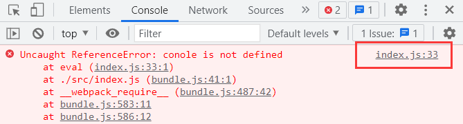

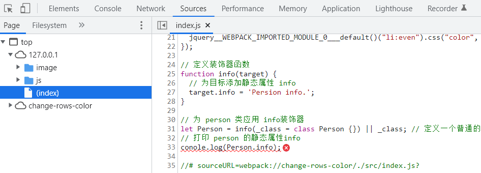

**1. 默认 Source Map 的问题**  

开发环境下默认生成的 Source Map，记录的是生成后的代码的位置。会导致运行时报错的行数与源代码的行数不一致的问题。示意图如下：  


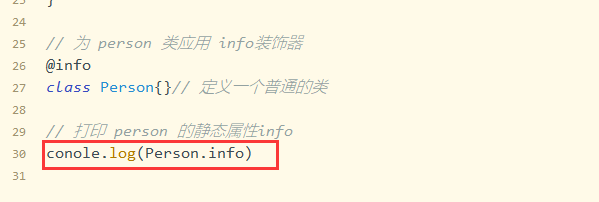

**2. 解决默认 Source Map 的问题**  

开发环境下，推荐在 webpack.config.js 中添加如下的配置，即可保证运行时报错的行数与源代码的行数保持一致：  

```js
module.exports = {
	mode: "development",
	// ........省略其它代码
	// eval-source-map 仅限在"开发模式"下使用，不建议在"生产模式”下使用。
	//此选项生成的Source Map能够保证"运行时报错的行数"与”源代码的行数"保持一致
	devtool:'eval-source-map'
};
```

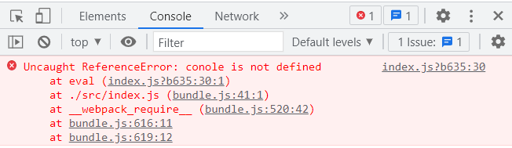

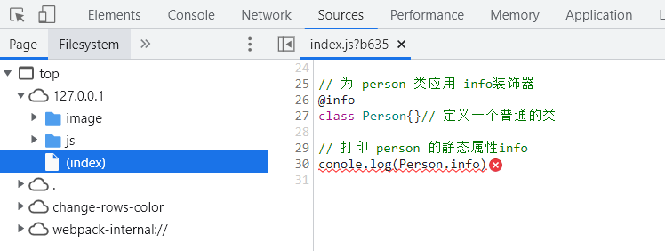

### 5.3 webpack 生产环境下的 Source Map  

在生产环境下，如果省略了 devtool 选项，则最终生成的文件中不包含 Source Map。这能够防止原始代码通过 Source Map 的形式暴露给别有所图之人。  

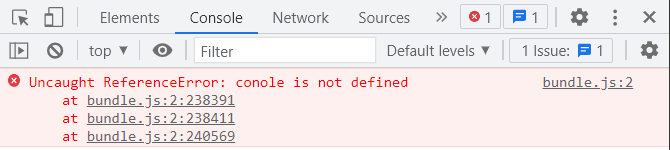

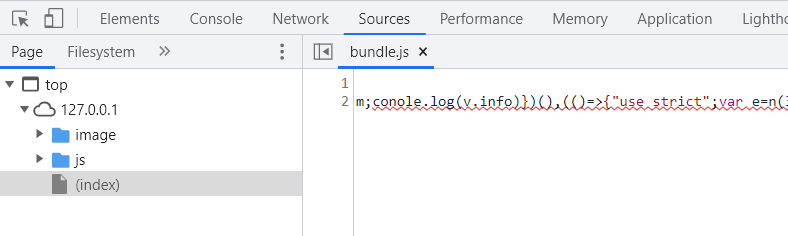

**1. 只定位行数不暴露源码**  

在生产环境下，如果只想定位报错的具体行数，且不想暴露源码。此时可以将 devtool 的值设置为`nosources-source-map`。实际效果如图所示：  

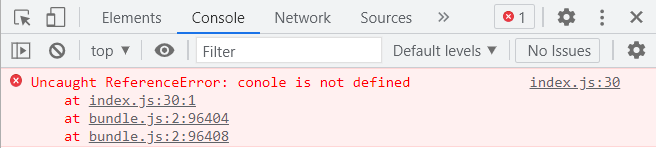

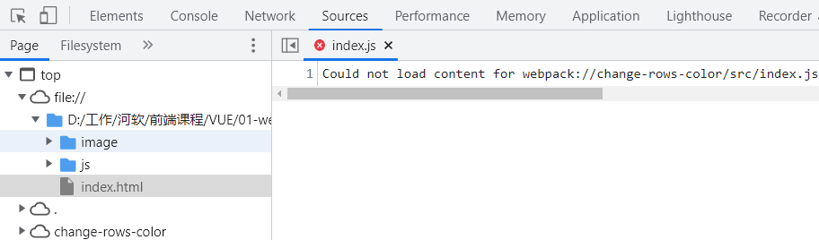

**2. 定位行数且暴露源码**  

在生产环境下，如果想在定位报错行数的同时，展示具体报错的源码。此时可以将 devtool 的值设置为`source-map`。实际效果如图所示：  

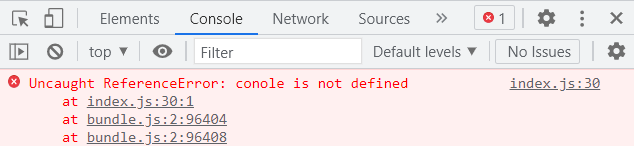

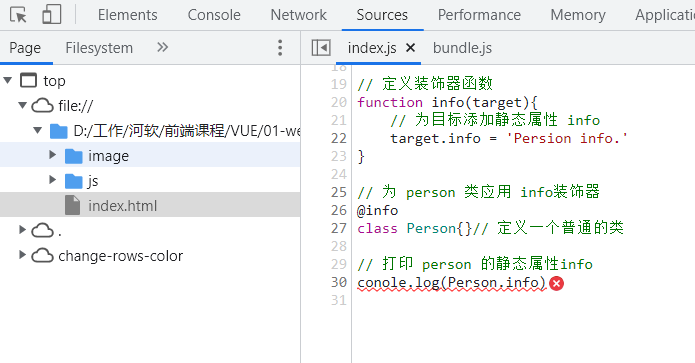

>  采用此选项后：你应该将你的服务器配置为，不允许普通用户访问 source map 文件！  

### 5.4 Source Map 的最佳实践  

开发环境下：  

- 建议把 devtool 的值设置为 eval-source-map  
- 好处：可以精准定位到具体的错误行  

生产环境下：  

- 建议关闭 Source Map 或将 devtool 的值设置为 nosources-source-map  
- 好处：防止源码泄露，提高网站的安全性  