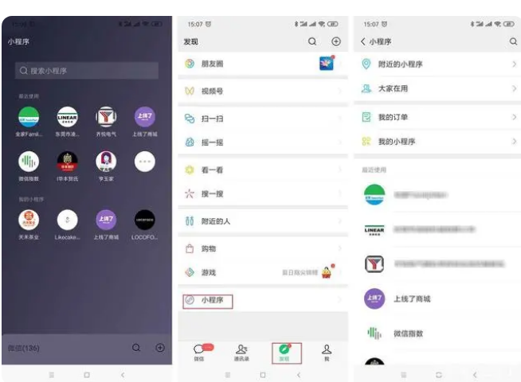

# 认识小程序

### 目标

- [ ] 能够自己手动创建小程序项目

- [ ] 了解小程序项目的基本组成结构

- [ ] 能够知道小程序页面由几部分组成

- [ ] 掌握小程序中常见的组件使用方法

- [ ] 熟悉小程序如何进行协同开发和发布

## 1.小程序简介

### **1.1 什么是微信小程序**

**微信小程序**是一种可以通过扫码或搜索即可进入使用的应用，减少了**下载安装**的环节，实现用户对于应用“触手可及、用完即走”的理想需求。在微信公众平台，小程序是与服务号、订阅号、企业微信并行的体系。

**点开微信“发现-小程序”栏**，你就能看到**近期使用过**的**小程序**；或者下拉微信聊天页面，你也能看到自己用过的小程序。如果你没有用过任何小程序，那么可以扫码进入小程序页面，或者点击好友分享的小程序卡片进入小程序。

### 1.2小程序与普通网页开发的区别

#### 1. 运行环境不同

**网页**运行在**浏览器环境**中

**小程序**运行在**微信环境**中

#### 2. API 不同

由于运行环境的不同，所以小程序中，无法调用 DOM 和 BOM 的 API。

但是，小程序中可以调用微信环境提供的各种 API

例如：地理定位，扫码支付

#### 3. 开发模式不同

**网页**的开发模式：浏览器 + 代码编辑器

**小程序**有自己的一套标准开发模式：

 1.申请小程序开发账号

 2.安装小程序开发者工具

 3.创建和配置小程序项目

### 1.3 体验小程序

可使用手机微信(6.7.2 及以上版本)扫码下方小程序码，体验小程序：

## 2.小程序开发准备 

### 2.1 注册小程序开发帐号

#### 1. 点击注册按钮

使用浏览器打开 https://mp.weixin.qq.com/ 网址，点击右上角的“立即注册”即可进入到小程序开发账号的**注册流程**，主要流程截图如下：

#### 2. 选择注册账号的类型

#### 3. 填写账号信息

#### 4. 提示邮箱激活

#### 5. 点击链接激活账号

#### 6. 选择主体类型

#### 7. 主体信息登记

以上步骤完成之后即可登入网站

#### 8. 获取小程序的 AppID

微信扫码登入

登入之后  开发管理-->开发设置 然后再开发者ID就可以看到自己得AppID 创建微信小程序的时候会需要此ID

### 2.2.安装开发者工具

#### 1. 了解微信开发者工具

**微信开发者工具**是官方推荐使用的**小程序开发工具**，它提供的主要功能如下：

- 快速**创建**小程序项目
- 代码的**查看**和**编辑**
- 对小程序**功能**进行**调试**
- 小程序的**预览**和**发布**

#### 2.下载

推荐下载和安装最新的稳定版（Stable Build）的微信开发者工具，下载页面的链接如下：https://developers.weixin.qq.com/miniprogram/dev/devtools/stable.html

#### 3.安装

点击“完成”按钮，完成对微信开发者工具的安装。

#### 4. 扫码登录

#### 5. 设置外观和代理

### 2.3 创建小程序项目

#### 1.点击“加号”按钮

#### 2. 按要求填写新建项目需求

一定要记得选择javaScript模板

#### 3. 项目创建完成

#### 4. 在模拟器上查看项目效果

#### 5. 在真机上预览项目效果

#### 6. 主界面的 5 个组成部分

## 3. 小程序代码的构成

### 3.1 项目结构

#### 1.了解项目的基本组成结构

1. pages 用来**存放所有小程序**的页面 
2. utils 用来存放**工具性质**的模块（例如：格式化时间的自定义模块） 
3. app.js 小程序项目的**入口文件** 
4. app.json 小程序项目的**全局配置文件** 
5. app.wxss 小程序项目的**全局样式文件** 
6. project.config.json 项目的**配置文件** 
7. sitemap.json 用来**配置小程序及其页面是否允许被微信索引**

#### 2. 小程序页面的组成部分

小程序官方建议把所有小程序的页面，都存放在 pages 目录中，以单独的文件夹存在，如图所示：

其中，每个页面由 4 个基本文件组成，它们分别是：

1.  .js 文件（页面的脚本文件，存放页面的数据、事件处理函数等） 
2. .json 文件（当前页面的配置文件，配置窗口的外观、表现等）
3.  .wxml 文件（页面的模板结构文件）
4.  .wxss 文件（当前页面的样式表文件）

### 3.2 JSON 配置文件

#### 1. JSON 配置文件的作用

**JSON** 是一**种数据格式**，在实际开发中，JSON 总是以**配置文件**的形式出现。小程序项目中也不例外：通过不同的 **.json 配置文件**，可以对小程序项目进行**不同级别的配置**。

小程序项目中有 4 种 json 配置文件，分别是：

1. 项目根目录中的 app.json 配置文件
2. 项目根目录中的 project.config.json 配置文件
3. 项目根目录中的 sitemap.json 配置文件
4. 每个页面文件夹中的 .json 配置文件

#### 2.app.json 文件

**app.json** 是当前小程序的**全局配置**，包括了小程序的所有页面路径、窗口外观、界面表现、底部 tab 等。Demo 项目里边的 app.json 配置内容如下：

简单了解下这 4 个配置项的作用：

1. pages：用来记录当前小程序所有页面的路径
2. window：全局定义小程序所有页面的背景色、文字颜色等
3. style：全局定义小程序组件所使用的样式版本
4. sitemapLocation：用来指明 sitemap.json 的位置

#### 3. project.config.json 文件

project.config.json 是项目配置文件，用来记录我们对小程序开发工具所做的个性化配置，例如：

1. setting 中保存了编译相关的配置 

2. projectname 中保存的是项目名称 

3. appid 中保存的是小程序的账号 ID

   

#### 4. sitemap.json 文件

微信现已开放小程序内**搜索**，效果类似于 PC 网页的 SEO。**sitemap.json** 文件用来**配置小程序页面**是否允许微信索引。

当开发者允许微信索引时，微信会通过**爬虫**的形式，为小程序的页面内容**建立索引**。当用户的搜索关键字和页面的索引匹配成功的时候，小程序的页面将可能展示在搜索结果中。

注意：sitemap 的索引提示是默认开启的，如需要关闭 sitemap 的索引提示，可在小程序项目配置文件 project.config.json 的 setting 中配置字段 checkSiteMap 为 false

#### 5. 页面的 .json 配置文件

小程序中的每一个页面，可以使用 .json 文件来对本页面的窗口外观进行配置，页面中的配置项会覆盖 app.json 的 window 中相同的配置项。例如：

#### 6. 新建小程序页面

只需要在 app.json -> pages 中新增页面的存放路径，保存页面之后，小程序开发者工具即可帮我们自动创建对应的页面文件，

#### 7. 修改项目首页

只需要调整 app.json -> pages 数组中页面路径的前后顺序，即可修改项目的首页。小程序会把排在第一位的页面，当作项目首页进行渲染，如图所示：

### 3.3 WXML 模板

#### 1. 什么是 WXML

**WXML**（WeiXin Markup Language）是小程序框架设计的一套标签语言，用来构建**小程序页面的结构**，其作用类似于网页开发中的 HTML。

#### 2.WXML 和 HTML 的区别

标签名称不同

- HTML （div, span, img, a）
- WXML（view, text, image, navigator）

属性节点不同

- `<a href="#">超链接</a>`
- `<navigator url="/pages/home/home"></navigator>`

提供了类似于 Vue 中的**模板语法**

- 数据绑定
- 列表渲染
- 条件渲染

#### 3.4 WXSS 样式

#### 1. 什么是 WXSS

**WXSS** (WeiXin Style Sheets)是一套**样式语言**，用于描述 WXML 的**组件样式**，类似于网页开发中的 CSS。

#### 2.WXSS 和 CSS 的区别

新增了 **rpx** 尺寸单位

- **CSS** 中需要手动进行像素单位换算，例如 **rem**
- **WXSS** 在底层支持新的尺寸单位 **rpx**，在不同大小的屏幕上小程序会自动进行换算

提供了全局的样式和局部样式

- **项目根目录**中的 **app.wxss** 会作用于**所有**小程序页面
- **局部**页面的 **.wxss** 样式仅对**当前**页面生效

WXSS 仅支持部分 CSS 选择器

- .class 和 #id
- element
- 并集选择器、后代选择器
- ::after 和 ::before 等伪类选择器

### 3.4 .JS 逻辑交互

#### 1. 小程序中的 .js 文件

一个项目仅仅提供界面展示是不够的，在小程序中，我们通过 **.js** 文件来**处理用户的操作**。例如：响应用户的点击、获取用户的位置等等。

#### 2. 小程序中 .js 文件的分类

小程序中的 JS 文件分为三大类，分别是：

app.js

- 是**整个**小程序项目的**入口文件**，通过调用 App() 函数来启动整个小程序

页面的 .js 文件

- 是**页面**的入口文件，通过调用 Page() 函数来创建并运行页面

普通的 .js 文件

- 是**普通**的功能模块文件，用来封装公共的函数或属性供页面使用

## 4.小程序的宿主环境

### 4.1 宿主环境简介

#### 1. 什么是宿主环境

**宿主环境**（host environment）指的是程序运行所必须的依赖环境。例如：**Android** 系统和 **iOS** 系统是两个不同的宿主环境。安卓版的微信 App 是不能在 iOS 环境下运行的，所以，Android 是安卓软件的宿主环境，**脱离了宿主环境的软件是没有任何意义**的！

#### 2. 小程序的宿主环境

手机微信是小程序的宿主环境，如图所示：

小程序借助宿主环境提供的能力，可以完成许多普通网页无法完成的功能，例如：微信扫码、微信支付、微信登录、地理定位、etc…

#### 3.小程序宿主环境包含的内容

1. 通信模型
2. 运行机制
3. 组件
4. API

### 4.2 通信模型

#### 1. 通信的主体

小程序中通信的主体是渲染层和逻辑层，其中：

- WXML 模板和 WXSS 样式工作在渲染层
- JS 脚本工作在逻辑层

#### 2. 小程序的通信模型

小程序中的通信模型分为两部分： 

1.  **渲染层**和**逻辑层**之间的通信

- 由微信客户端进行转发 

2. **逻辑层**和**第三方服务器**之间的通信

- 由微信客户端进行转发

### 4.3 运行机制

#### 1. 小程序启动的过程

1. 把小程序的代码包下载到本地
2. 解析 app.json 全局配置文件
3. 执行 app.js 小程序入口文件，调用 App() 创建小程序实例
4. 渲染小程序首页
5. 小程序启动完成

#### 2. 页面渲染的过程

1. 加载解析页面的 .json 配置文件
2. 加载页面的 .wxml 模板和 .wxss 样式
3. 执行页面的 .js 文件，调用 Page() 创建
4. 页面实例页面渲染完成

### 4.4 组件

#### 1. 小程序中组件的分类

**小程序**中的**组件**也是由**宿主环境**提供的，开发者可以基于组件快速搭建出漂亮的页面结构。官方把小程序的组件分为了 9 大类，分别是：

1. 视图容器
2. 基础内容
3. 表单组件
4. 导航组件
5. 媒体组件
6. map 地图组件
7. canvas 画布组件
8. 开放能力
9. 无障碍访问

#### 2. 常用的视图容器类组件

1. view

- 普通视图区域
- 类似于 HTML 中的 div，是一个块级元素
- 常用来实现页面的布局效果

2. scroll-view

- 可滚动的视图区域

- 常用来实现滚动列表效果

3. swiper 和 swiper-item

- 轮播图容器组件 和 轮播图 item 组件

#### 3. view 组件的基本使用

实现如图的 flex 横向布局效果：

#### 4. scroll-view 组件的基本使用

实现如图的纵向滚动效果：

> scroll-view的内层view元素需要：display: inline-block;
>
> scroll-view的外层元素需要：white-space:nowrap;

#### 5. swiper 和 swiper-item 组件的基本使用

实现如图的轮播图效果：

#### 6. swiper 组件的常用属性

| **属性**               | **类型** | **默认值**        | **说明**             |
| ---------------------- | -------- | ----------------- | -------------------- |
| indicator-dots         | boolean  | false             | 是否显示面板指示点   |
| indicator-color        | color    | rgba(0, 0, 0, .3) | 指示点颜色           |
| indicator-active-color | color    | #000000           | 当前选中的指示点颜色 |
| autoplay               | boolean  | false             | 是否自动切换         |
| interval               | number   | 5000              | 自动切换时间间隔     |
| circular               | boolean  | false             | 是否采用衔接滑动     |

#### 7.常用的基础内容组件

text

- 文本组件
- 类似于 HTML 中的 span 标签，是一个行内元素

rich-text

- 富文本组件
- 支持把 HTML 字符串渲染为 WXML 结构

#### 8.text 组件的基本使用

通过 text 组件的 selectable 属性，实现长按选中文本内容的效果：

#### 9. rich-text 组件的基本使用

通过 rich-text 组件的 nodes 属性节点，把 HTML 字符串渲染为对应的 UI 结构：

#### 10. 其它常用组件

1. button

	- 按钮组件
	- 功能比 HTML 中的 button 按钮丰富
	- 通过 open-type 属性可以调用微信提供的各种功能（客服、转发、获取用户授权、获取用户信息等）

2. image

	- 图片组件
	- image 组件默认宽度约 300px、高度约 240px

3. navigator（后面课程会专门讲解）

	- 面导航组件
	- 类似于 HTML 中的 a 链接

#### 11.button 按钮的基本使用

#### 12. image 组件的基本使用

#### 13. image 组件的 mode 属性

**image** 组件的 mode 属性用来指定图片的裁剪和缩放模式，常用的 mode 属性值如下：

| **mode** **值** | **说明**                                                     |
| --------------- | ------------------------------------------------------------ |
| scaleToFill     | （默认值）缩放模式，不保持纵横比缩放图片，使图片的宽高完全拉伸至填满 image 元素 |
| aspectFit       | 缩放模式，保持纵横比缩放图片，使图片的长边能完全显示出来。也就是说，可以完整地将图片显示出来。 |
| aspectFill      | 缩放模式，保持纵横比缩放图片，只保证图片的短边能完全显示出来。也就是说，图片通常只在水平或垂直方向是完整的，另一个方向将会发生截取。 |
| widthFix        | 缩放模式，宽度不变，高度自动变化，保持原图宽高比不变         |
| heightFix       | 缩放模式，高度不变，宽度自动变化，保持原图宽高比不变         |

### 4.5 API

#### 1. 小程序 API 概述

**小程序**中的 **API** 是由宿主环境提供的，通过这些丰富的小程序 API，开发者可以方便的**调用微信提供的能力**，例如：获取用户信息、本地存储、支付功能等。

#### 2. 小程序 API 的 3 大分类

 小程序官方把 API 分为了如下 3 大类：

1. 事件监听 API

- 特点：以 on 开头，用来监听某些事件的触发
- 举例：wx.onWindowResize(function callback) 监听窗口尺寸变化的事件

2. 同步 API

- 特点1：以 Sync 结尾的 API 都是同步 API
- 特点2：同步 API 的执行结果，可以通过函数返回值直接获取，如果执行出错会抛出异常
- 举例：wx.setStorageSync('key', 'value') 向本地存储中写入内容

3. 异步 API

- 特点：类似于 jQuery 中的 $.ajax(options) 函数，需要通过 success、fail、complete 接收调用的结果
- 举例：wx.request() 发起网络数据请求，通过 success 回调函数接收数据

## 5.协同工作和发布

### 5.1 协同工作

#### 1. 了解权限管理需求

在中大型的公司里，人员的分工非常仔细：同一个小程序项目，一般会有不同岗位、不同角色的员工同时参与设计与开发。

此时出于管理需要，我们迫切需要对不同岗位、不同角色的员工的权限进行边界的划分，使他们能够高效的进行协同工作。

#### 2. 了解项目成员的组织结构

#### 3. 小程序的开发流程

### 5.2 小程序成员管理

#### 1.成员管理的两个方面

小程序成员管理体现在管理员对小程序项目成员及体验成员的管理：

项目成员：

- 表示参与小程序开发、运营的成员
- 可登录小程序管理后台
- 管理员可以添加、删除项目成员，并设置项目成员的角色

体验成员：

- 表示参与小程序内测体验的成员
- 可使用体验版小程序，但不属于项目成员
- 管理员及项目成员均可添加、删除体验成员

#### 2. 不同项目成员对应的权限

|    **权限**    | **运营者** | **开发者** | **数据分析者** |
| :------------: | :--------: | :--------: | :------------: |
|   开发者权限   |            |   **√**    |                |
|   体验者权限   |     √      |   **√**    |       √        |
|      登录      |     √      |   **√**    |       √        |
|    数据分析    |            |            |       √        |
|    微信支付    |     √      |            |                |
|      推广      |     √      |            |                |
|    开发管理    |     √      |            |                |
|    开发设置    |            |   **√**    |                |
|    暂停服务    |     √      |            |                |
| 解除关联公众号 |     √      |            |                |
|   腾讯云管理   |            |   **√**    |                |
|   小程序插件   |     √      |            |                |
|  游戏运营管理  |     √      |            |                |

#### 3. 开发者的权限说明

1.  开发者权限：可使用小程序开发者工具及对小程序的功能进行代码开发 
2. 体验者权限：可使用体验版小程序 
3. 登录权限：可登录小程序管理后台，无需管理员确认 
4. 开发设置：设置小程序服务器域名、消息推送及扫描普通链接二维码打开小程序 
5. 腾讯云管理：云开发相关设置

#### 4. 添加项目成员和体验成员

### 5.3 小程序的版本

#### 1. 软件开发过程中的不同版本

1. 在软件开发过程中，根据时间节点的不同，会产出不同的软件版本，例如：
   开发者编写代码的同时，对项目代码进行自测（开发版本）
2. 直到程序达到一个稳定可体验的状态时，开发者把体验版本给到产品经理和测试人员进行体验测试
3. 最后修复完程序的 Bug 后，发布正式版供外部用户使用

#### 2. 小程序的版本

| **版本阶段** | **说明**                                                     |
| ------------ | ------------------------------------------------------------ |
| 开发版本     | 使用开发者工具，可将代码上传到开发版本中。 开发版本只保留每人最新的一份上传的代码。点击提交审核，可将代码提交审核。开发版本可删除，不影响线上版本和审核中版本的代码。 |
| 体验版本     | 可以选择某个开发版本作为体验版，并且选取一份体验版。         |
| 审核中的版本 | 只能有一份代码处于审核中。有审核结果后可以发布到线上，也可直接重新提交审核，覆盖原审核版本。 |
| 线上版本     | 线上所有用户使用的代码版本，该版本代码在新版本代码发布后被覆盖更新。 |

### 5.4 发布上线

#### 1.小程序发布上线的整体步骤

一个小程序的发布上线，一般要经过上传代码 -> 提交审核 -> 发布这三个步骤。

#### 2. 上传代码

1. 点击开发者工具顶部工具栏中的“上传” 按钮
2. 填写版本号以及项目备注

#### 3. 在后台查看上传之后的版本

登录小程序管理后台 -> 管理 -> 版本管理 -> 开发版本，即可查看刚才提交上传的版本了：

#### 4. 提交审核

- 为什么需要提交审核：为了保证小程序的质量，以及符合相关的规范，小程序的发布是需要经过腾讯官方审核的。
- 提交审核的方式：在开发版本的列表中，点击“提交审核”按钮之后，按照页面提示填写相关的信息，就能把小程序提交到腾讯官方进行审核。

#### 5. 发布

审核通过之后，管理员的微信中会收到小程序通过审核的通知，此时在审核版本的列表中，点击“发布”按钮之后，即可把“审核通过”的版本发布为“线上版本”，供所有小程序用户访问和使用。

#### 6. 基于小程序码进行推广

相对于普通二维码来说，小程序码的优势如下：

1. 在样式上更具辨识度和视觉冲击力
2. 能够更加清晰地树立小程序的品牌形象
3. 可以帮助开发者更好地推广小程序

获取小程序码的 5 个步骤：

登录小程序管理后台 -> 设置 -> 基本设置 -> 基本信息 -> 小程序码及线下物料下载

### 5.5 运营数据

#### 1. 查看小程序运营数据的两种方式

在“小程序后台”查看

1. 登录小程序管理后台
2. 点击侧边栏的“统计”
3. 点击相应的 tab 可以看到相关的数据

使用“小程序数据助手”查看

1. 打开微信
2. 搜索“小程序数据助手”
3. 查看已发布的小程序相关的数据
