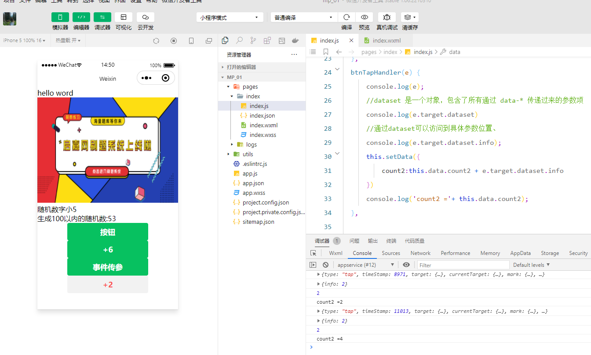
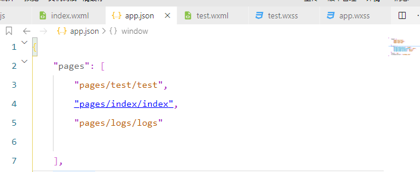
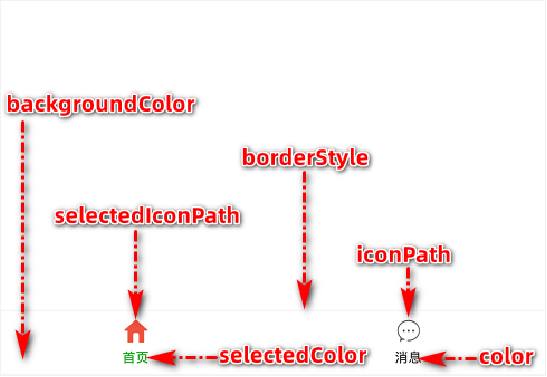

# 小程序 - 模板与配置

## 目标

- [ ] 了解WXML 模板语法渲染页面结构

- [ ] 能够使用 WXSS 样式美化页面结构

- [ ] 掌握如何使用app.json 对小程序进行全局性配置

- [ ] 能够使用 page.json 对小程序页面进行个性化配置

- [ ] 熟练发起网络数据请求技术

## 1. WXML 模板语法

### 1.1 数据绑定

#### 1. 数据绑定的基本原则 

1. 在 data 中定义数据
2. 在 WXML 中使用数据

#### 2. 在 data 中定义页面的数据

1.首先创建一个新项目

2.清空index.js与wxml的代码

index.js 中调用Page函数传递简单配置对象   具体操作（ 打出 Page   选择下图第一个选项）


index.js 初始化之后的源码如下：


index.wxml 初始化之后的源码如下：


index.js的data节点就是来定义对象的初始数据的，在页面对应的 .js 文件中，把数据定义到 data 对象中即可

#### 3. Mustache 语法的格式

​     把data中的数据绑定到页面中渲染，使用 Mustache 语法也称（插值表达式）使用双大括号将变量包起来即可，语法格式为： 

```
<!--index.wxml-->
<view> {{要绑定的数据名称}}</view>
```

#### 4. Mustache 语法的应用场景

Mustache 语法的主要应用场景如下：

-  绑定内容  
-  绑定属性  
-  运算（三元运算、算术运算等）

#### 5. 动态绑定内容

在index.js中，data节点声明页面数据：

```
  /**
   * 页面的初始数据
   */
  data: {
   //  字符串类型数据
    info:'hello word'
  },
```

在index.wxml里写入一下代码，保存查看预览效果

```
<view> {{info}}</view>
```


#### 6. 动态绑定属性

在这里就与vue中的绑定不同了，在vue中如果需要动态绑定属性的值需要v-bind，在微信小程序里不管绑定内容还是绑定属性都需要使用Mustache 语法

页面数据如下：

```
  data: {
    imgSrc:'http://changetm-cdn.oss-cn-beijing.aliyuncs.com/adminupload/2022-02/21/sJW86phpkGYbhk1645431493220221.png
  },
```

页面的结构如下:

```
<image src="{{imgSrc}}" mode=""/>
```

效果：


#### 7. 三元运算

页面的数据如下：

```
 data: {
    info:'hello word',
    randomNum:Math.random()*10 //生成10以内的随机数
  },
```

页面的结构如下：

```
<view>{{randomNumber >=5 ?'随机数大于会等于5':'随机数字小5'}}</view>
```

效果：


#### 8. 算数运算

页面的数据如下：

```
  data: {
    randomNum:Math.random().toFixed(2) //生成一个带两位小数的随机数
  },
```

页面的结构如下：

```
<view>生成100以内的随机数:{{randomNum * 100}}</view>
```

效果：

### 1.2 事件绑定

#### 1. 什么是事件

事件是渲染层到逻辑层的通讯方式。通过事件可以将用户在渲染层产生的行为，反馈到逻辑层进行业务的处理。


#### 2. 小程序中常用的事件

| **类型** | **绑定方式**              | **事件描述**                                    |
| -------- | ------------------------- | ----------------------------------------------- |
| tap      | bindtap 或 bind:tap       | 手指触摸后马上离开，类似于 HTML 中的 click 事件 |
| input    | bindinput 或 bind:input   | 文本框的输入事件                                |
| change   | bindchange 或 bind:change | 状态改变时触发                                  |

#### 3. 事件对象的属性列表

当事件回调触发的时候，会收到一个事件对象 event，它的详细属性如下表所示：

| **属性**       | **类型** | **说明**                                     |
| -------------- | -------- | -------------------------------------------- |
| type           | String   | 事件类型                                     |
| timeStamp      | Integer  | 页面打开到触发事件所经过的毫秒数             |
| target         | Object   | 触发事件的组件的一些属性值集合               |
| currentTarget  | Object   | 当前组件的一些属性值集合                     |
| detail         | Object   | 额外的信息                                   |
| touches        | Array    | 触摸事件，当前停留在屏幕中的触摸点信息的数组 |
| changedTouches | Array    | 触摸事件，当前变化的触摸点信息的数组         |

#### 4. target 和 currentTarget 的区别

target 是触发该事件的源头组件，而 currentTarget 则是当前事件所绑定的组件。举例如下：


点击内部的按钮时，点击事件以冒泡的方式向外扩散，也会触发外层 view 的 tap 事件处理函数。此时，对于外层的 view 来说：

- e.target 指向的是触发事件的源头组件，因此，e.target 是内部的按钮组件
- e.currentTarget 指向的是当前正在触发事件的那个组件，因此，e.currentTarget 是当前的 view 组件

#### 5. bindtap 的语法格式

在小程序中，不存在 HTML 中的 onclick 鼠标点击事件，而是通过 tap 事件来响应用户的触摸行为。

1. 通过 bindtap，可以为组件绑定 tap 触摸事件，语法如下：

```
<button type="primary" bindtap="btnTapHandler">按钮</button>
```

2. 在页面的 .js 文件中定义对应的事件处理函数，事件参数通过形参 event（一般简写成 e） 来接收：

   ```
   Page({
       btnTapHandler(e){//按钮的 tap事件处理函数
           console.log(e) //事件参数对象e
       },
   })
    
   ```

效果：


#### 6. 在事件处理函数中为 data 中的数据赋值

通过调用 this.setData(dataObject) 方法，可以给页面 data 中的数据重新赋值，示例如下：

```
Page({ 
 data: {
    count:0,
  },
  //修改count的值
  changeCount(){
      this.setData({
          count:this.data.count + 1
      })
  }
  })
```

通过 bindtap，可以为组件绑定 tap 触摸事件，语法如下

```
<button type="primary" bindtap="changeCount">+{{count}}</button>
```

效果：


#### 7. 事件传参

小程序中的事件传参比较特殊，不能在绑定事件的同时为事件处理函数传递参数。例如，下面的代码将不能正常工作：

```
//这种传参方式在vue中是没有问题的，但是在小程序中是不可以这样的
<button type="primary" bindtap="btnTapHandler(123)">事件传参</button>
```

因为小程序会把 bindtap 的属性值，统一当作事件名称来处理，相当于要调用一个名称为 btnHandler(123) 的事件处理函数。

可以为组件提供 data-* 自定义属性传参，其中 * 代表的是参数的名字，示例代码如下：

```
<button  bindtap="btnTapHandler" data-info="{{2}}">+2</button>
```

最终： 

- info 会被解析为参数的名字 
- 数值 2 会被解析为参数的值

在事件处理函数中，通过 event.target.dataset.参数名 即可获取到具体参数的值，示例代码如下：

```
   data: {
    count2:0,
  },
  
 
 btnTapHandler(e) {
      console.log(e);
      //dataset 是一个对象，包含了所有通过 data-* 传递过来的参数项
      console.log(e.target.dataset)
      //通过dataset可以访问到具体参数位置、
      console.log(e.target.dataset.info);
      this.setData({
            //
          count2:this.data.count2 + e.target.dataset.info
      })
      console.log('count2 ='+ this.data.count2);
  },
```

点击按钮之后效果：



#### 8. bindinput 的语法格式

在小程序中，通过 input 事件来响应文本框的输入事件，语法格式如下：

1. 通过 bindinput，可以为文本框绑定输入事件：

   ```
   <input bindinput="inputHandler"></input>
   ```

2. 在页面的 .js 文件中定义事件处理函数：

   ```
     inputHandler(e) {
        //e.detail.value 是变化过后，文本框最新的值
         console.log(e.detail.value);
     },
   ```

#### 9. 实现文本框和 data 之间的数据同步

实现步骤：

- 定义数据
- 渲染结构
- 美化样式
- 绑定 input 事件处理函数

1.定义数据：

```
Page({
data: {
    msg:'你好'
  }
  })
```

2.渲染结构：

```
<input value="{{msg}}" bindinput="iptHandler"></input>
```

3.美化样式：

在index.wcss中 写入代码

```
input {
    border:1px solid #eee;
    padding:5px;
    margin:5px;
    border-radius:3px;
}
```

4.绑定 input 事件处理函数：

```
iptHandler(e){
    this.setData({
        //通过e.detail.value 获取到文本框最新的值
        msg:e.detail.value
    })
},
```

效果：


### 1.3 条件渲染

#### 1. wx:if

在小程序中，使用 wx:if="{{condition}}" 来判断是否需要渲染该代码块：

```
<view wx:if="{{condition}}">True</view>
```

也可以用 wx:elif 和 wx:else 来添加 else 判断

```
<!-- 条件渲染 -->
<view wx:if="{{type ===1 }}">男</view>
<view wx:elif="{{type ===2 }}">女</view>
<view wx:else> 保密 </view>
```

定义数据：

```
Page({
data: {
    type:1,
  }
  })
```

效果：


如果在appData里将type值改成：2


#### 2. 结合<block\> 使用 wx:if

如果要一次性控制多个组件的展示与隐藏，可以使用一个` <block></block> `标签将多个组件包装起来，并在`<block>` 标签上使用 wx:if 控制属性，示例如下：

```
<block wx:if="{{true}}">
<view>view1</view>
<view>view2</view>
</block>
```

比较：用view包裹多个节点跟用block包裹多个标签区别


注意： `<block>` 并不是一个组件，它只是一个包裹性质的容器，不会在页面中做任何渲染。使用<block>可以避免渲染不必要的节点

#### 3. hidden

在小程序中，直接使用 hidden="{{ condition }}" 也能控制元素的显示与隐藏：

```
<view hidden="{{condition}}">条件为true的时候隐藏元素,条件为false时显示 </view>
```

定义数据：

```
data {
flag:true
}
```

渲染结构：

```
<view hidden="{{flag}}">条件为true的时候隐藏元素,条件为false时显示 </view>
```


#### 4. wx:if 与 hidden 的对比

1. 运行方式不同

-  wx:if 以动态创建和移除元素的方式，控制元素的展示与隐藏 
- hidden 以切换样式的方式（display: none/block;），控制元素的显示与隐藏

1. 使用建议 

- 频繁切换时，建议使用 hidden 

- 控制条件复杂时，建议使用 wx:if 搭配 wx:elif、wx:else 进行展示与隐藏的切换

  
  


### 1.4 列表渲染

#### 1. wx:for

通过 wx:for 可以根据指定的数组，循环渲染重复的组件结构，语法示例如下：

定义数据：

```
data {
arr1:['小米','苹果','华为']
}
```


```
<view wx:for="{{arr1}}">
索引是：{{index}}当前项是：{{item}}
</view>
```

默认情况下，当前循环项的索引用 index 表示；当前循环项用 item 表示。

效果：


#### 2. 手动指定索引和当前项的变量名

- 使用 wx:for-index 可以指定当前循环项的索引的变量名 
- 使用 wx:for-item 可以指定当前项的变量名

示例代码如下：

```
<view wx:for="{{arr1}}" wx:for-index="idx" wx:for-item="itemName">
索引是：{{index}}当前项是：{{itemName}}
</view>
```


#### 3. wx:key 的使用

类似于 Vue 列表渲染中的 :key，小程序在实现列表渲染时，也建议为渲染出来的列表项指定唯一的 key 值，从而提高渲染的效率，示例代码如下：

定义数据：

```
   data:{
   userList:[
       {id:1,name:'小红'},
       {id:2,name:'小黄'},
       {id:3,name:'小白'}
   ]}
   
```

渲染数据：

```
<view wx:for="{{userList}}" wx:key="id">{{item.name}}</view>
```

效果：


这个时候去console区域，发现调试区出现黄色警告


这是因为我们在前两个循环的时候没有指定key值，提供一个wx:key即可


## 2. WXSS 模板样式

### 2.1 WXSS介绍

#### 1. 什么是 WXSS

WXSS (WeiXin Style Sheets)是一套样式语言，用于美化 WXML 的组件样式，类似于网页开发中的 CSS。

#### 2. WXSS 和 CSS 的关系

WXSS 具有 CSS 大部分特性，同时，WXSS 还对 CSS 进行了扩充以及修改，以适应微信小程序的开发。与 CSS 相比，WXSS 扩展的特性有：

-  rpx 尺寸单位 
- @import 样式导入


### 2.2 rpx

#### 1. 什么是 rpx 尺寸单位

rpx（responsive pixel）是微信小程序独有的，用来解决屏适配的尺寸单位。

#### 2. rpx 的实现原理

rpx 的实现原理非常简单：鉴于不同设备屏幕的大小不同，为了实现屏幕的自动适配，rpx 把所有设备的屏幕，在宽度上等分为 750 份（即：当前屏幕的总宽度为 750rpx）。

- 在较小的设备上，1rpx 所代表的宽度较小
- 在较大的设备上，1rpx 所代表的宽度较大

小程序在不同设备上运行的时候，会自动把 rpx 的样式单位换算成对应的像素单位来渲染，从而实现屏幕适配。

#### 3. rpx 与 px 之间的单位换算

在 iPhone6 上，屏幕宽度为375px，共有 750 个物理像素，等分为 750rpx。则：

- 750rpx = 375px = 750 物理像素    

- 1rpx = 0.5px  = 1物理像素

  | **设备**     | **rpx换算px (屏幕宽度/750)** | **px换算rpx (750/屏幕宽度)** |
  | ------------ | ---------------------------- | ---------------------------- |
  | iPhone5      | 1rpx = 0.42px                | 1px = 2.34rpx                |
  | iPhone6      | **1rpx** **=** **0.5px**     | 1px = 2rpx                   |
  | iPhone6 Plus | 1rpx = 0.552px               | 1px = 1.81rpx                |

官方建议：开发微信小程序时，设计师可以用 iPhone6 作为视觉稿的标准。

开发举例：在 iPhone6 上如果要绘制宽100px，高20px的盒子，换算成rpx单位，宽高分别为 200rpx 和 40rpx

### 2.3- 样式导入

#### 1.什么是样式导入

使用 WXSS 提供的 @import 语法，可以导入外联的样式表。

#### 2.@import 的语法格式

@import 后跟需要导入的外联样式表的相对路径，用 ; 表示语句结束。示例如下：

在根目录下新建一个common文件夹，在common新建一个common.wxss文件

在文件里写如下样式代码：

```
.username{
    color: red;
}
```

然后再index.wxss里导入外联样式表

```
/**index.wxss**/
@import "/common/common.wxss";
```

在index.wxml 写上节点：

```
<view class='.username'>
    测试@import 如果为红色则成功
</view>
```

观察模拟器测试颜色


### 2.4 全局样式和局部样式

#### 1. 全局样式

定义在 app.wxss 中的样式为全局样式，作用于每一个页面。

#### 2. 局部样式

在页面的 .wxss 文件中定义的样式为局部样式，只作用于当前页面。

注意：

- 当局部样式和全局样式冲突时，根据就近原则，局部样式会覆盖全局样式

- 当局部样式的权重大于或等于全局样式的权重时，才会覆盖全局的样式

  在pages里新建一个test文件夹，然后再文件夹里新建page

  在app.json pages节点中修改主页为test

  

  在test.wxml写入：

  ```
  <!--pages/test/test.wxml-->
  <view>在页面的 .wxss 文件中定义的样式为局部样式 </view>
  <view>只作用于当前页面。 </view>
  ```

  在test.wxss写入：

  ```
  /* pages/test/test.wxss */
  view {
      color:white
  }
  ```

  在app.wxss写入：

  ```
  view{
      background-color: lightblue;
  }
  ```

  

然后看模拟器效果：


修改test.wxss 为:

```
view {
    color:white;
    background-color: plum;
}
```

然模拟器渲染变化：


鼠标放在选择器可以查看权重


这时发现全局样式跟，页面样式权重是一样的，如果你想让那个页面的样式生效可以通过权重高的选择器增加他的权重


## 3. 全局配置

### 3.1. 全局配置文件及常用的配置项

小程序根目录下的 app.json 文件是小程序的全局配置文件。常用的配置项如下：

1.  pages

记录当前小程序所有页面的存放路径 

2. window

全局设置小程序窗口的外观

3. tabBar

设置小程序底部的  tabBar 效果 

4. style

是否启用新版的组件样式

### 3.2.window

#### 1. 小程序窗口的组成部分


#### 2. 了解 window 节点常用的配置项

| **属性名**                   | **类型** | **默认值** | **说明**                                       |
| ---------------------------- | -------- | ---------- | ---------------------------------------------- |
| navigationBarTitleText       | String   | 字符串     | 导航栏标题文字内容                             |
| navigationBarBackgroundColor | HexColor | #000000    | 导航栏背景颜色，如 #000000                     |
| navigationBarTextStyle       | String   | white      | 导航栏标题颜色，仅支持 black / white           |
| backgroundColor              | HexColor | #ffffff    | 窗口的背景色                                   |
| backgroundTextStyle          | String   | dark       | 下拉 loading 的样式，仅支持 dark / light       |
| enablePullDownRefresh        | Boolean  | false      | 是否全局开启下拉刷新                           |
| onReachBottomDistance        | Number   | 50         | 页面上拉触底事件触发时距页面底部距离，单位为px |

#### 3. 设置导航栏的标题

设置步骤：app.json -> window -> navigationBarTitleText

需求：把导航栏上的标题，从默认的 “WeChat”修改为“卓越程序员”，效果如图所示：


#### 4. 设置导航栏的背景色

设置步骤：app.json -> window -> navigationBarBackgroundColor

需求：把导航栏标题的背景色，从默认的 #fff 修改为 #2b4b6b ，效果如图所示：


#### 5. 设置导航栏的标题颜色

设置步骤：app.json -> window -> navigationBarTextStyle

需求：把导航栏上的标题颜色，从默认的 black 修改为 white ，效果如图所示：


注意： navigationBarTextStyle 的可选值只有 black 和 white

#### 6. 全局开启下拉刷新功能

概念：下拉刷新是移动端的专有名词，指的是通过手指在屏幕上的下拉滑动操作，从而重新加载页面数据的行为。

设置步骤：app.json -> window -> 把 enablePullDownRefresh 的值设置为 true


注意：在 app.json 中启用下拉刷新功能，会作用于每个小程序页面！

#### 7. 设置下拉刷新时窗口的背景色

当全局开启下拉刷新功能之后，默认的窗口背景为白色。如果自定义下拉刷新窗口背景色，设置步骤为: 

app.json -> window -> 为 backgroundColor 指定16进制的颜色值 #efefef。

效果如下：


#### 8. 设置下拉刷新时 loading 的样式

当全局开启下拉刷新功能之后，默认窗口的 loading 样式为白色，如果要更改 loading 样式的效果，设置步骤为 

app.json -> window -> 为 backgroundTextStyle 指定 dark 值。

效果如下：


注意： backgroundTextStyle 的可选值只有 light 和 dark

#### 9. 设置上拉触底的距离

概念：上拉触底是移动端的专有名词，通过手指在屏幕上的上拉滑动操作，从而加载更多数据的行为。

比如说我们再逛一些购物网站的时候手指在上面滑动，右侧会有滚动条随着我们移动，当滚动条到达页面底部的时候会自动加载下面的内容，那么滚动条距离下面多少的时候会自动加载一下页面那？这个距离就是我们的上拉触底的距离


设置步骤： 

app.json -> window -> 为 onReachBottomDistance 设置新的数值


注意：默认距离为50px，如果没有特殊需求，建议使用默认值即可。

### 3.3 tabBar

#### 1. 什么是 tabBar

tabBar 是移动端应用常见的页面效果，用于实现多页面的快速切换。小程序中通常将其分为：

- 底部 tabBar
- 顶部 tabBar

注意：

- tabBar中只能配置最少 2 个、最多 5 个 tab 页签
- 当渲染顶部 tabBar 时，不显示 icon，只显示文本

#### 2. tabBar 的 6 个组成部分



-  backgroundColor：tabBar 的背景色 
- selectedIconPath：选中时的图片路径
-  borderStyle：tabBar 上边框的颜色 
- iconPath：未选中时的图片路径 
- selectedColor：tab 上的文字选中时的颜色 
- color：tab 上文字的默认（未选中）颜色

#### 3. tabBar 节点的配置项

| **属性**        | **类型** | **必填** | **默认值** | **描述**                                 |
| :-------------- | -------- | -------- | ---------- | ---------------------------------------- |
| position        | String   | 否       | bottom     | tabBar 的位置，仅支持 bottom/top         |
| borderStyle     | String   | 否       | black      | tabBar 上边框的颜色，仅支持 black/white  |
| color           | HexColor | 否       |            | tab 上文字的默认（未选中）颜色           |
| selectedColor   | HexColor | 否       |            | tab 上的文字选中时的颜色                 |
| backgroundColor | HexColor | 否       |            | tabBar 的背景色                          |
| list            | Array    | 是       |            | tab 页签的列表，最少 2 个、最多 5 个 tab |

#### 4. 每个 tab 项的配置选项

| **属性**         | **类型** | **必填** | **描述**                                              |
| ---------------- | -------- | -------- | ----------------------------------------------------- |
| pagePath         | String   | 是       | 页面路径，页面必须在 pages 中预先定义                 |
| text             | String   | 是       | tab 上显示的文字                                      |
| iconPath         | String   | 否       | 未选中时的图标路径；当 postion 为 top 时，不显示 icon |
| selectedIconPath | String   | 否       | 选中时的图标路径；当 postion 为 top 时，不显示 icon   |

### 3.4 案例：配置 tabBar

#### 1. 需求描述

根据资料中提供的小图标、在小程序中配置如图所示的 tabBar 效果：


#### 2. 实现步骤

- 拷贝图标资源
- 新建 3 个对应的 tab 
- 页面配置 tabBar 选项

#### 3.  配置 tabBar

##### 步骤1 - 拷贝图标资源

1. 把资料目录中的 images 文件夹，拷贝到小程序项目根目录中
2. 将需要用到的小图标分为 3 组，每组两个，其中：

- 图片名称中包含 -active 的是选中之后的
- 图标图片名称中不包含 -active 的是默认图标        

截图如下：


##### 步骤2 - 新建 3 个对应的 tab 页面

通过 app.json 文件的 pages 节点，快速新建 3 个对应的 tab 页面，示例代码如下：

**注意：tab项对应的页面必须放到pages节点数组开始的位置**

```

  "pages": [
        "pages/home/home",
        "pages/message/message",
        "pages/contact/contact",
        
    ]  //保存之后自动创建三个page
```

其中，home 是首页，message 是消息页面，contact 是联系我们页面。

##### 步骤3 - 配置 tabBar 选项

1. 打开 app.json 配置文件，和 pages、window 平级，新增
2. tabBar 节点tabBar 节点中，新增 list 数组，这个数组中存放的，是每个 tab 项的配置对象
3. 在 list 数组中，新增每一个 tab 项的配置对象。对象中包含的属性如下：

-  pagePath 指定当前 tab 对应的页面路径【必填】 

- text 指定当前 tab 上按钮的文字【必填】 

- iconPath 指定当前 tab 未选中时候的图片路径【可选】 

- selectedIconPath 指定当前 tab 被选中后高亮的图片路径【可选】

  app.json tabBar节点配置

#### 4. 完整的配置代码

```js
"tabBar": {
        "list": [{
            "pagePath": "pages/home/home",
            "text": "首页",
            "iconPath": "/images/tabs/home.png",
            "selectedIconPath": "/images/tabs/home-active.png"
        },
        {
            "pagePath": "pages/message/message",
            "text": "消息",
            "iconPath": "/images/tabs/message.png",
            "selectedIconPath": "/images/tabs/message-active.png"
        },
        {
            "pagePath": "pages/contact/contact",
            "text": "联系",
            "iconPath": "/images/tabs/contact.png",
            "selectedIconPath": "/images/tabs/contact-active.png"
        }]
    },
```

## 4. 页面配置

### 4.1 页面配置文件的作用

小程序中，每个页面都有自己的 .json 配置文件，用来对当前页面的窗口外观、页面效果等进行配置。


### 4.2 页面配置和全局配置的关系

小程序中，app.json 中的 window 节点，可以全局配置小程序中每个页面的窗口表现。

如果某些小程序页面想要拥有特殊的窗口表现，此时，“页面级别的 .json 配置文件”就可以实现这种需求。


**注意：当页面配置与全局配置冲突时，根据就近原则，最终的效果以页面配置为准。**

### 4.3 页面配置中常用的配置项

| **属性**                     | **类型** | **默认值** | **描述**                                         |
| ---------------------------- | -------- | ---------- | ------------------------------------------------ |
| navigationBarBackgroundColor | HexColor | #000000    | 当前页面导航栏背景颜色，如 #000000               |
| navigationBarTextStyle       | String   | white      | 当前页面导航栏标题颜色，仅支持 black / white     |
| navigationBarTitleText       | String   |            | 当前页面导航栏标题文字内容                       |
| backgroundColor              | HexColor | #ffffff    | 当前页面窗口的背景色                             |
| backgroundTextStyle          | String   | dark       | 当前页面下拉 loading 的样式，仅支持 dark / light |
| enablePullDownRefresh        | Boolean  | false      | 是否为当前页面开启下拉刷新的效果                 |
| onReachBottomDistance        | Number   | 50         | 页面上拉触底事件触发时距页面底部距离，单位为 px  |

## 5. 网络数据请求

### 5.1 小程序中网络数据请求的限制

出于安全性方面的考虑，小程序官方对数据接口的请求做出了如下两个限制：

1. 只能请求 HTTPS 类型的接口
2. 必须将接口的域名添加到信任列表中


### 5.2 配置 request 合法域名

需求描述：假设在自己的微信小程序中，希望请求 https://www.change.tm/ 域名下的接口

配置步骤：登录微信小程序管理后台 -> 开发 -> 开发管理-->开发设置 -> 服务器域名 -> 修改 request 合法域名

注意事项：

- 域名只支持 https 协议
- 域名不能使用 IP 地址或 localhost
- 域名必须经过 ICP 备案
- 服务器域名：一个月内可申请5次修改。
- 业务域名：最多可以添加20个业务域名，一年内可修改50次业务域名。


****

### 5.3. 跳过 request 合法域名校验

如果后端程序员仅仅提供了 http 协议的接口、暂时没有提供 https 协议的接口。

此时为了不耽误开发的进度，我们可以在微信开发者工具中，临时开启「开发环境不校验请求域名、TLS 版本及 HTTPS 证书」选项，跳过 request 合法域名的校验。


注意：跳过 request 合法域名校验的选项，仅限在开发与调试阶段使用

### 5.4 发起 GET 请求

调用微信小程序提供的 wx.request() 方法，可以发起 GET 数据请求，示例代码如下：

在wxml文件里新增一个发送请求按钮写如下代码：

```
<button bindtap="getInfo">发起get请求</button>
```

在js文件里发送请求写如下代码：

```
 getInfo(){
        wx.request({
          url: 'http://127.0.0.1:80/api/get',
          method:'GET',
          data:{
              name:'zs',
              age:20
          },
          success:(res) =>{
              console.log(res);
              console.log(res.data);
          }
        })
    },
```

效果：

### 5.5. 发起 POST 请求

在wxml中新增一个按钮、

```
<button bindtap="postInfo">发起post请求</button>
```

在js文件里发送请求写如下代码：

```
 postInfo(){
        wx.request({
          url: 'http://127.0.0.1:80/api/post',
          method:'POST',
          data:{
              name:'ls',
              age:18
          },
          success:(res) =>{
              console.log(res);
              console.log(res.data);
          }
        })
    },
```

效果：


### 5.6 在页面刚加载时请求数据

在很多情况下，我们需要在页面刚加载的时候，自动请求一些初始化的数据。此时需要在页面的 onLoad 事件中调用获取数据的函数，示例代码如下：

```
    onLoad(options) {
    this.getInfo()
    this.postInfo()
    }
```


效果：


### 5.7 关于跨域和 Ajax 的说明

跨域问题只**存在于**基于浏览器的 Web 开发中。由于**小程序的宿主环境**不是浏览器，而是**微信客户端**，所以**小程序中不存在跨域的问题**。

Ajax 技术的核心是依赖于浏览器中的 XMLHttpRequest 这个对象，由于**小程序的宿主环境是微信客户端**，所以小程序中**不能叫做**“发起 Ajax 请求”，而是叫做“发起网络数据请求”。

