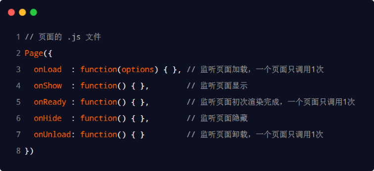
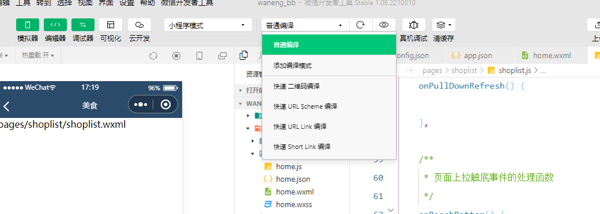

# 小程序 - 视图与逻辑

## 学习目标

- [ ] 掌握页面之间的导航跳转的方法

- [ ] 掌握实现下拉刷新效果的方法

- [ ] 掌握上拉加载更多效果的方法

- [ ] 了解小程序中常用的生命周期函数

## 一、页面导航介绍

### 1.1 什么是页面导航

**页面导航**指的是页面之间的相互跳转。例如，浏览器中实现页面导航的方式有如下两种：

- `<a>` 链接
- `location.href`

### 1.2 小程序中实现页面导航的两种方式   

1.  声明式导航

	+ 在页面上声明一个 `<navigator>` 导航组件
	+ 通过点击 `<navigator>` 组件实现页面跳转 

2. 编程式导航

    + 调用小程序的导航 API，实现页面的跳转

### 1.3 声明式导航

#### 1.3.1 什么是声明导航

在浏览器中，点击链接实现导航的方式，叫做声明式导航。

如：普通网页中点击`<a>`链接，vue中点击`<router-link>`都属于声明式导航。

#### 1.3.2 导航到 tabBar 页面

**tabBar 页面**指的是**被配置为 tabBar 的页面。**

在使用 `<navigator>` 组件跳转到指定的 tabBar 页面时，需要指定

-  url 属性和 open-type 属性，其中：url 表示要跳转的页面的地址，**必须以 / 开头**
- open-type 表示跳转的方式**，必须为 switchTab**

示例代码如下：

```
<navigator url="/pages/message/message" open-type="switchTab">导航到消息页面</navigator>
```

#### 1.3.3 导航到非tabBar 页面

**非 tabBar 页面**指的是没有被配置为 tabBar 的页面。

在使用 `<navigator>` 组件跳转到普通的非 tabBar 页面时，则需要指定 url 属性和 open-type 属性，其中：

- url 表示要跳转的页面的地址，**必须以 / 开头**
- open-type 表示跳转的方式，**必须为 navigate**

```
<navigator url="/pages/info/info" open-type="navigate">导航到info页面</navigator>
```

注意：为了简便，在导航到非 tabBar 页面时，**open-type="navigate" 属性可以省略**。

#### 1.3.4 后退导航

如果要后退到上一页面或多级页面，则需要指定 **open-type** 属性和 **delta** 属性，其中： 

- open-type 的值必须是 navigateBack，表示要进行后退导航
- delta 的值必须是数字，表示要后退的层级

示例代码如下：

```
<navigator open-type="navigateBack" delta="1">后退到上一页</navigator>
```

注意：为了简便，如果只是后退到上一页面，则**可以省略 delta 属性**，因为其**默认值就是 1**。

### 1.4 编程式导航

#### 1.4.1 什么是编程式导航

**编程式导航：**在浏览器中，调用API方法实现导航的方式，叫做编程式导航。

如：普通网页中调用`location.href`跳转到新页面的方式，属于编程式导航。

#### 1.4.2 导航到 tabBar 页面

调用 `wx.switchTab(Object object)` 方法，可以跳转到 tabBar 页面。其中 Object 参数对象的属性列表如下

| **属性** | **类型** | **是否必选** | **说明**                                         |
| -------- | -------- | ------------ | ------------------------------------------------ |
| url      | string   | 是           | 需要跳转的 tabBar 页面的路径，路径后不能带参数   |
| success  | function | 否           | 接口调用成功的回调函数                           |
| fail     | function | 否           | 接口调用失败的回调函数                           |
| complete | function | 否           | 接口调用结束的回调函数（调用成功、失败都会执行） |

示例代码如下：

home.wxml 页面结构：

```
<button bindtap="gotoMessage">跳转到message页面</button>
```

home.js 编程式导航：

```
//通过编程式导航跳转到tabBar页面
    gotoMessage() {
        wx.switchTab({
          url: '/pages/message/message',
        })
    },
```

#### 1.4.3 导航到非 tabBar 页面

调用 wx.navigateTo(Object object) 方法，可以跳转到非 tabBar 的页面。其中 Object 参数对象的属性列表如下：

| **属性** | **类型** | **是否必选** | **说明**                                           |
| -------- | -------- | ------------ | -------------------------------------------------- |
| url      | string   | 是           | 需要跳转到的非 tabBar 页面的路径，路径后可以带参数 |
| success  | function | 否           | 接口调用成功的回调函数                             |
| fail     | function | 否           | 接口调用失败的回调函数                             |
| complete | function | 否           | 接口调用结束的回调函数（调用成功、失败都会执行）   |

示例代码如下：

home.wxml 页面结构:

```
<button bindtap="gotoInfo">跳转到info页面</button>
```

home.js 编程式导航:

```
gotoInfo(){
        wx.navigateTo({
          url: '/pages/info/info',
        })
    },
```

#### 1.4.4 后退导航

调用 **wx.navigateBack(Object object)** 方法，可以返回上一页面或多级页面。其中 Object 参数对象可选的属性列表如下：

| **属性** | **类型** | **默认值** | **是否必选** | **说明**                                              |
| -------- | -------- | ---------- | ------------ | ----------------------------------------------------- |
| delta    | number   | 1          | 否           | 返回的页面数，如果 delta 大于现有页面数，则返回到首页 |
| success  | function |            | 否           | 接口调用成功的回调函数                                |
| fail     | function |            | 否           | 接口调用失败的回调函数                                |
| complete | function |            | 否           | 接口调用结束的回调函数（调用成功、失败都会执行）      |

示例代码如下：

home.wxml 页面结构:

```
<button bindtap="gotoBack">后退</button>
```

home.js 编程式导航:

```
   //编程式导航，后退到上一页面
   gotoBack(){
        wx.navigateBack({
        delta:1   //后退层级数，默认为1层
        })
    },
```

### 1.5 导航传参

#### 1.5.1 声明式导航传参

**navigator** 组件的 **url 属性**用来指定将要跳转到的页面的路径。同时，路径的后面还可以携带参数： 

参数与路径之间使用 ? 分隔 

参数键与参数值用 = 相连 

不同参数用 & 分隔代码示例如下：

```
<navigator url="/pages/info/info?name=zs&age=20">跳转到info页面</navigator>
```

点击切换到info页面效果：

#### 1.5.2  编程式导航传参

调用 **wx.navigateTo(Object object)** 方法跳转页面时，也可以携带参数，代码示例如下：

home.html   页面结构：

```
<button bindtap="gotoInfo2">跳转到info页面</button>
```

home.js 通过编程导航，跳转到info页面

```
   gotoInfo2(){
        wx.navigateTo({
            url:'/pages/info/info?name=zs&age=20'
        })
    },  
```

#### 1.5.3 在 onLoad 中接收导航参数

通过声明式导航传参或编程式导航传参所携带的参数，可以直接在 onLoad 事件中直接、获取到，示例代码如下：

```
/**
     * 生命周期函数--监听页面加载
     */
    onLoad(options) {
    //  options 就是导航传递过来的参数对象
    console.log(options);
    },
```

一般这个**参数**都会转存到**data节点中**，因为这个参数可能会在页面其他的方法中用到 ，因为**函数作用域问题**，**options参数**只能**在onload的函数中访问到，**为了让其他页面也能够放问到，可以把**options挂载到data里面，**供页面去使用

```
data({
//  导航传递过来的参数对象
query:{

}
})
/**
     * 生命周期函数--监听页面加载
     */
    onLoad(options) {
    //  options 就是导航传递过来的参数对象
    console.log(options);
    this.setData({
    query:options
    })
    },
```


## 二、页面事件

### 2.1下拉刷新事件

#### 2.1.1 什么是下拉刷新

**下拉刷新**是移动端的专有名词，指的是通过手指在屏幕上的**下拉滑动操作**，从而**重新加载页面数据**的行为。

#### 2.1.2 启用下拉刷新

启用下拉刷新有两种方式：

1. 全局开启下拉刷新

- 在 app.json 的 window 节点中，将 enablePullDownRefresh 设置为 true

  

2. 局部开启下拉刷新

- 在页面的 .json 配置文件中，将 enablePullDownRefresh 设置为 true

  

在实际开发中，推荐使用第 2 种方式，为需要的页面单独开启下拉刷新的效果。

#### 2.1.3 配置下拉刷新窗口的样式

在全局或页面的 .json 配置文件中，通过 **backgroundColor** 和 **backgroundTextStyle** 来配置下拉刷新窗口的样式，其中： 

- **backgroundColor** 用来配置下拉刷新窗口的背景颜色，仅支持16 进制的颜色值 
- **backgroundTextStyle** 用来配置下拉刷新 loading 的样式，仅支持 dark 和 light

#### 2.1.4 监听页面的下拉刷新事件

在页面的 .js 文件中，通过 **onPullDownRefresh()** 函数即可监听当前页面的下拉刷新事件。例如，在页面的 wxml 中有如下的 UI 结构，点击按钮可以让 count 值自增 +1：

定义页面结构：

```
<!-- 页面结构 -->
<view>count的值为：{{count}}</view>
<button bindtap="countAdd">+1</button>

```

定义事件处理函数：

```
    /**
     * 页面的初始数据
     */
    data: {
        count:1,

    },
// +1按钮的点击事件处理函数
    countAdd() {
        this.setData({
            count:this.data.count+1
        })
    },
```

效果：


在触发页面的下拉刷新事件的时候，如果要把 count 的值重置为 0，示例代码如下：

```
   /**
     * 页面相关事件处理函数--监听用户下拉动作
     */
    onPullDownRefresh() {
        this.setData({
            count:0
        })
    },

```

#### 2.1.5 停止下拉刷新的效果

当处理完下拉刷新后，下拉刷新的 loading 效果会一直显示，**不会主动消失**，所以需要手动**隐藏下拉刷新的 loading** 效果。此时，调用 **wx.stopPullDownRefresh()** 可以停止当前页面的下拉刷新。示例代码如下：

```
    /**
     * 页面相关事件处理函数--监听用户下拉动作
     */
    onPullDownRefresh() {
        this.setData({
            count:0
        })
        // 当数据重置成功之后，调用此函数，关闭下拉刷新效果
       wx.stopPullDownRefresh()
    },
```

### **2.2 上拉触底事件**

#### 2.2.1 什么是上拉触底

上拉触底是移动端的专有名词，通过手指在屏幕上的上拉滑动操作，从而加载更多数据的行为。

#### 2.2.2 监听页面的上拉触底事件

在页面的 .js 文件中，通过 onReachBottom() 函数即可监听当前页面的上拉触底事件。示例代码如下：

```
    /**
     * 页面上拉触底事件的处理函数
     */
    onReachBottom() {
 	 console.log('出发了上拉触底的事件');
    },

```

#### 2.2.3 配置上拉触底距离

上拉触底距离指的是**触发上拉触底事件时，滚动条距离页面底部的距离**。可以在全局或页面的 .json 配置文件中，通过 **onReachBottomDistance** 属性来配置上拉触底的距离。

```
"onReachBottomDistance": 150
```

### 2.3 上拉触底案例

#### 2.3.1 案例效果展示

#### 2.3.2 案例的实现步骤

1. 定义获取随机颜色的方法
2. 在页面加载时获取初始数据
3. 渲染 UI 结构并美化页面效果
4. 在上拉触底时调用获取随机颜色的方法
5. 添加 loading 提示效果
6. 对上拉触底进行节流处理

#### 2.3.3 实现案列

##### 步骤1 - 定义获取随机颜色的方法

```
    /**
     * 页面的初始数据
     */
    data: {
        colorList:[]//随机颜色的列表

    },
  getColors(){ //获取随机颜色的方法
        wx.request({
          url: 'http://127.0.0.1:80/api/color',
          method:'GET',
          success:({data:res})=> {
              console.log(res.data);
              this.setData({
                  colorList:[...this.data.colorList,...res.data]
              })
          },
        })

    },

```

##### 步骤2 - 在页面加载时获取初始数据

```
    /**
     * 生命周期函数--监听页面加载
     */
    onLoad(options) {
       this.getColors()
    },
```

##### 步骤3 - 渲染 UI 结构并美化页面效果

渲染 UI 结构

```
<view wx:for="{{colorList}}" wx:key="index"  class="num-item" style="background-color:{{item}};">{{item}}</view>
```

美化页面效果

```
/* pages/contact/contact.wxss */

.num-item {
    border:1rpx solid #efefef;
    border-radius: 8rpx;
    line-height: 200rpx;
    margin:15rpx;
    text-align:center;
    text-shadow:0rpx 0rpm 5rpx #fff;
    box-shadow:1rpx 1rpx 6rpx #aaa;
}
```

效果：


##### 步骤4 - 上拉触底时获取随机颜色

```
    /**
     * 页面上拉触底事件的处理函数
     */
    onReachBottom() {
    //调用获取随机颜色的方法
    this.getColors()
    },
```

##### 步骤5 - 添加 loading 提示效果

```
/**
     * 页面的初始数据
     */
    data: {
        colorList:[]//随机颜色的列表

    },
    getColors(){ //获取随机颜色的方法
        // 需要展示loading效果
        wx.showLoading({
            title:'数据加载中......'
        })
        wx.request({
          url: 'http://127.0.0.1:80/api/color',
          method:'GET',
          success:({data:res})=> {
            //   console.log(res);
              this.setData({
                  colorList:[...this.data.colorList,...res.data]
              })
          },
          complete: ()=> {
              wx.hideLoading()
          }
        })

    },
```

效果：


##### 步骤6 - 对上拉触底进行节流处理

1. 在 data 中定义 isloading 节流阀

- false 表示当前没有进行任何数据请求
- true 表示当前正在进行数据请求

```
/**
     * 页面的初始数据
     */
    data: {
        colorList:[],//随机颜色的列表
        isloding:false

    },
```


2. 在 getColors() 方法中修改 isloading 节流阀的值

- 在刚调用 getColors 时将节流阀设置 true
- 在网络请求的 complete 回调函数中，将节流阀重置为 false

```
 getColors(){ //获取随机颜色的方法
        this.setData({
            isloding:true
        })
        // 需要展示loading效果
        wx.showLoading({
            title:'数据加载中......'
        })
        wx.request({
          url: 'http://127.0.0.1:80/api/color',
          method:'GET',
          success:({data:res})=> {
            //   console.log(res);
              this.setData({
                  colorList:[...this.data.colorList,...res.data]
              })
          },
          complete: ()=> {
              wx.hideLoading()
              this.setData({
                  isloding:false
              })
          }
        })

    },
```

3. 在 onReachBottom 中判断节流阀的值，从而对数据请求进行节流控制

- 如果节流阀的值为 true，则阻止当前请求
- 如果节流阀的值为 false，则发起数据请求

```
**
     * 页面上拉触底事件的处理函数
     */
    onReachBottom() {
    //如果isloding的值为true就return出去否则就加载下一页
    if(this.data.isloading) return
    //调用获取随机颜色的方法
    this.getColors()
    },

```

效果： 

在上一个页面没加载完时，即使上拉很多次依然不生效，得等页面加载完成之后，在上拉即可刷新页面


#### 2.3.4 扩展

自定义编译模式


## 三、生命周期

### 3.1 什么是生命周期

生命周期（Life Cycle）是指一个对象从创建 -> 运行 -> 销毁的整个阶段，强调的是一个时间段。例如：

张三出生，表示这个人生命周期的开始

张三离世，表示这个人生命周期的结束

中间张三的一生，就是张三的生命周期


我们可以把每个小程序运行的过程，也概括为生命周期：

- 小程序的启动，表示生命周期的开始
- 小程序的关闭，表示生命周期的结束
- 中间小程序运行的过程，就是小程序的生命周期

### 3.2 生命周期的分类

在小程序中，生命周期分为两类，分别是：

1. 应用生命周期
   - 特指小程序从启动 -> 运行 -> 销毁的过程 

2. 页面生命周期
   - 特指小程序中，每个页面的加载 -> 渲染 -> 销毁的过程


### 3.3 什么是生命周期函数

生命周期函数：是由小程序框架提供的内置函数，会伴随着生命周期，自动按次序执行。

生命周期函数的作用：允许程序员在特定的时间点，执行某些特定的操作。

例如，页面刚加载的时候，可以在 onLoad 生命周期函数中初始化页面的数据。

注意：**生命周期强调的是时间段，生命周期函数强调的是时间点。**

### 3.4 生命周期函数的分类

小程序中的生命周期函数分为两类，分别是： 

1. 应用的生命周期函数
   - 特指小程序从启动 -> 运行 -> 销毁期间依次调用的那些函数 

2. 页面的生命周期函数
   - 特指小程序中，每个页面从加载 -> 渲染 -> 销毁期间依次调用的那些函数

### 3.5 应用的生命周期函数

小程序的应用生命周期函数需要在 app.js 中进行声明，把app.js中工具自带的源码删除调用app函数，得到一个空架构，然后在各节点操作，示例代码如下：

```
// app.js
App({

  /**
   * 当小程序初始化完成时，会触发 onLaunch（全局只触发一次）
   */
  onLaunch: function () {
    console.log("onLaunch")
  },

  /**
   * 当小程序启动，或从后台进入前台显示，会触发 onShow
   */
  onShow: function (options) {
    console.log('onShow');
  },

  /**
   * 当小程序从前台进入后台，会触发 onHide
   */
  onHide: function () {
    console.log('onHide');
  },

})


```

### 3.6 页面的生命周期函数

小程序的页面生命周期函数需要在页面的 .js 文件中进行声明，示例代码如下：



## 四、WXS 脚本

### 4.1 WXS 脚本 - 概述

#### 4.1.1 什么是 wxs

**WXS**（WeiXin Script）是**小程序独有的一套脚本语言**，结合 WXML，可以构建出页面的结构。

#### 4.1.2 wxs 的应用场景

**wxml 中无法调用在页面的 .js 中定义的函数**，但是，wxml 中可以调用 wxs 中定义的函数。因此，小程序中 wxs 的**典型应用场景**就是“**过滤器**”。

#### 4.1.3 wxs 和 JavaScript 的关系

虽然 wxs 的语法类似于 JavaScript，但是 wxs 和 JavaScript 是完全不同的两种语言：

1. wxs 有自己的数据类型 
   - number 数值类型、string 字符串类型、boolean 布尔类型、object 对象类型、 function 函数类型、array 数组类型、date 日期类型、 regexp 正则

2. wxs 不支持类似于 ES6 及以上的语法形式 
   - 不支持：let、const、解构赋值、展开运算符、箭头函数、对象属性简写、etc...
   - 支持：var 定义变量、普通 function 函数等类似于 ES5 的语法

3. wxs 遵循 CommonJS 规范
   - module 对象 
   - require() 函数 
   - module.exports 对象

### 4.2 基础语法

#### 4.2.1 内嵌 wxs 脚本

wxs 代码可以编写在 wxml 文件中的 **<wxs\>** 标签内，就像 Javascript 代码可以编写在 html 文件中的 `<script>` 标签内一样。

wxml 文件中的每个` <wxs></wxs>` 标签，**必须提供 module 属性**，用来指定**当前 wxs 的模块名称**，方便在 wxml 中访问模块中的成员：

```
<view>{{m1.toUpper(username)}}</view>
<wxs module="m1">
//将文本转为大写形式正式->ZS
    module.exports.toUpper = function(str){
        return str.toUpperCase()
    }
    
</wxs>
```

在页面.js中定义数据：

```
    /**
     * 页面的初始数据
     */
    data: {
        username:'zs'

    },
```

效果：


#### 4.2.2 定义外联的 wxs 脚本

wxs 代码还可以编写在以 .wxs 为后缀名的文件内，就像 javascript 代码可以编写在以 .js 为后缀名的文件中一样。示例代码如下：

```
//tools.wxs 文件
function toLower(str){
    return str.toLowerCase()
}
module.exorts = {
    toLower:toLower
}
```

#### 4.2.3 使用外联的 wxs 脚本

在 wxml 中引入外联的 wxs 脚本时，必须为 `<wxs>` 标签添加 module 和 src 属性，其中： 

- module 用来指定模块的名称 
- src 用来指定要引入的脚本的路径，且必须是相对路径

示例代码如下：

在message.js中定义一个数据

```
   data: {
        country:'CHINA'

    },
```

在将count的值输出到message.wxml 页面上中

```
<view>{{m2.toLower(country)}}</view>
<wxs src="../../utils/tools.wxs" module="m2"/>
```

效果：

### 4.3 WXS 的特点

#####  1.与 JavaScript 不同

为了降低 wxs（**WeiXin Script**）的学习成本， wxs 语言在设计时借大量鉴了 JavaScript 的语法。但是本质上，wxs 和 JavaScript 是完全不同的两种语言！

##### 2.不能作为组件的事件回调

wxs 典型的应用场景就是**“过滤器”，经常配合 Mustache 语法进行使用**，例如：

```
<view>{{m2.toLower(country)}}</view>
```

但是，在 wxs 中定义的函数不能作为组件的事件回调函数。例如，下面的用法是错误的：

```
<button bindtap="m2.toLower">按钮</button>
```

##### 3. 隔离性

隔离性指的是 wxs 的运行环境和其他 JavaScript 代码是隔离的。体现在如下两方面：

1. wxs 不能调用 js 中定义的函数
2. wxs 不能调用小程序提供的 API

##### 4. 性能好

- 在 iOS 设备上，小程序内的 WXS 会比 JavaScript 代码快 2 ~ 20 倍
- 在 android 设备上，二者的运行效率无差异

## 五、案例 - 本地生活（列表页面）

### 5.1 演示页面效果以及主要功能


- 页面导航并传参
- 上拉触底时加载下一页数据
- 下拉刷新列表数据

### 5.2 列表页面的 API 接口

以分页的形式，加载指定分类下商铺列表的数据：

1. 接口地址
   - http://127.0.0.1:80/categories/:cate_id/shops
   - URL 地址中的 :cate_id 是动态参数，表示分类的 Id

2. 请求方式
   - GET 请求

3. 请求参数
   - `_page` 表示请求第几页的数据
   - ` _limit` 表示每页请求几条数据

### 5.3 判断是否还有下一页数据

如果下面的公式成立，则证明没有下一页数据了：

页码值 * 每页显示多少条数据 >= 总数据条数

page * pageSize >= total

案例1：总共有 77 条数据，如果每页显示 10 条数据，则总共分为 8 页，其中第 8 页只有 7 条数据

page（7）* pageSize（10） >= total（77）

page（8）* pageSize（10） >= total（77）

案例2：总共有 80 条数据，如果每页显示 10 条数据，则总共分为 8 页，其中第 8 页面有 10 条数据

page（7）* pageSize（10） >= total（80）

page（8）* pageSize（10） >= total（80）

### 5.4 实现案列

#### 1. 首先在app.json写入以下代码创建page文件

```
  "pages":[
    "pages/home/home",
    "pages/message/message",
    "pages/contact/contact",
    "pages/shoplist/shoplist"
  ],
```

#### 2. 改造首页的UI结构

home.wxml

```
<!-- 九宫格区域 -->
<view class="grid-list">
<navigator class="grid-item" wx:for="{{gridList}}" wx:key="id" url="/pages/shoplist/shoplist?id={{item.id}}&title={{item.name}}">
 <image src="{{item.icon}}" mode=""/>
 <text>{{item.name}}</text>
</navigator>
</view>
```

效果：实现导航跳转跟传参功能，


#### 3. 设置页面动态标题

```
// pages/shoplist/shoplist.js
Page({

    /**
     * 页面的初始数据
     */
    data: {
        query:{}

    },

    /**
     * 生命周期函数--监听页面加载
     */
    onLoad(options) {
        this.setData({
            query:options
        })

    },

    /**
     * 生命周期函数--监听页面初次渲染完成
     */
    onReady() {
        wx.setNavigationBarTitle({
          title: this.data.query.title,
        })
    },


})
```

效果：


#### 4. 编译模式

为了方便我们开发商铺列表相关的功能，首先我们得创建一个商铺列表的编译模式




这样就成功的创建了编译模式，以后我们重新编译就可以进入到 目录对应的这个界面

也自动传递了两个参数（id=1&title=美食）

#### 5. 定义对应的参数节点

shoplist.js:

```
    /**
     * 页面的初始数据
     */
    data: {
        query:{},
        shopList:[],
        page:1,
        pageSize:10,
        total:0
    },
```

#### 6. 获取商铺列表数据

提供一个获取商铺列表数据的方法

```
/**
     * 生命周期函数--监听页面加载
     */
    onLoad(options) {
        this.setData({
            query:options
        })
        this.getShopList()

    },
    getShopList(){
        wx.request({         			  
        	url:`http://127.0.0.1:80/categories/${this.data.query.id}/shops`,
            method:'GET',
            data:{
                _page:this.data.page,
                _limit:this.data.pageSize
            },
            success:(res) =>{
                // console.log(res);
                this.setData({
                    shopList:[...this.data.shopList,...res.data],
                    total:res.header['X-Total-Count'] - 0
                })
            }
        })
    },
```

#### 7. 渲染页面UI结构

```
<!--pages/shoplist/shoplist.wxml-->
<view class="shop-item" wx:for="{{shopList}}" wx:key="id">
<view class="thumb">
<image src="{{item.images[0]}}"/>
</view>
<view class="info">
<text class="shop-title">{{item.name}}</text>
<text>电话：{{item.phone}}</text>
<text>地址：{{item.address}}</text>
<text>营业时间：{{item.businessHours}}</text>
</view>
</view>
```

#### 8. 美化样式

```
/* pages/shoplist/shoplist.wxss */
.shop-item {
    display: flex;
    padding: 15rpx;
    border: 1px solid #efefef;
    border-radius: 8rpx;
    margin:15rpx;
    box-shadow: 1rpx 1rpx 15rpx #ddd;
}
.thumb image {
    width:250rpx;
    height: 250rpx;
    display: block;
    margin-right: 15rpx;
}
.info {
    display: flex;
    flex-direction: column;
    justify-content: space-around;
    font-size: 24rpx;
}
.shop-title{
    font-weight: bold;
}
```

#### 9. loading效果展示

```
 getShopList(){
        //展示loading效果
        wx.showLoading({
          title: '数据加载中...',
        })
        wx.request({
            url:`http://127.0.0.1:80/categories/${this.data.query.id}/shops`,
            method:'GET',
            data:{
                _page:this.data.page,
                _limit:this.data.pageSize
            },
            success:(res) =>{
                // console.log(res);
                this.setData({
                    shopList:[...this.data.shopList,...res.data],
                    total:res.header['X-Total-Count'] - 0
                })
            },
            complete: () =>{
                //隐藏loading效果
                wx.hideLoading()
        
            }
        })
    },
```

#### 10. 上拉处理，请求下一页效果

1.配置上拉加载的距离 

2.处理事件中，让页码自增加1  

3.调用 getShopList方法

shoplist.json

```
{
    "usingComponents": {},
    "onReachBottomDistance": 200

}
```

shoplist.js

```
 /**
     * 页面上拉触底事件的处理函数
     */
    onReachBottom() {
        // console.log('ok');
        this.setData({
            page:this.data.page + 1
        })

        this.getShopList()
    },
```

#### 11. 节流阀

```
// pages/shoplist/shoplist.js
Page({

    /**
     * 页面的初始数据
     */
    data: {
        query:{},
        shopList:[],
        page:1,
        pageSize:10,
        total:0,
        isloading:false
    },

    
    getShopList(){
        this.setData({
            isloadingL:true
        })
        //展示loading效果
        wx.showLoading({
          title: '数据加载中...',
        })
        wx.request({
            		       url:`http://127.0.0.1:80/categories/${this.data.query.id}/shops`,
            method:'GET',
            data:{
                _page:this.data.page,
                _limit:this.data.pageSize
            },
            success:(res) =>{
                // console.log(res);
                this.setData({
                    shopList:[...this.data.shopList,...res.data],
                    total:res.header['X-Total-Count'] - 0
                })
            },
            complete: () =>{
                //隐藏loading效果
                wx.hideLoading()
                this.setData({isloading:false})
        
            }
        })
    },

   

    /**
     * 页面上拉触底事件的处理函数
     */
    onReachBottom() {
        // console.log('ok');
        if(this.data.isloading) return
        this.setData({
            page:this.data.page + 1
        })

        this.getShopList()
    },


})
```

#### 12.判断是否还有下一页数据

运行以上代码发现即使数据只有三页，但是后面在下拉刷新依然会做额外的请求，这些请求是没有意义的，所以说为了提高我们开发效率，最好拿对数据进行一下判断，当没有数据的时候我们就不发起额外的请求了


代码：

```
onReachBottom() {
        //判断是否还有下一页数据
        if(this.data.page * this.data.pageSize >= this.data.total){
            //证明没有下一页的数据了
            return wx.showToast({
                title:'数据加载完毕！！！',
                icon:'none'

            })
        }
}

```

效果：


#### 13. 实现下拉刷新效果

在app.json中添加配置节点开启下拉刷新，并且美化效果

```
{
    "usingComponents": {},
    "onReachBottomDistance": 200,
    "enablePullDownRefresh": true,
    "backgroundColor": "#efefef",
    "backgroundTextStyle": "dark"

}
```

效果：


重置一些关键性的数据 ，根据重置过后的数据来重新发起第一页的数据请求

```
 /**
     * 页面相关事件处理函数--监听用户下拉动作
     */
    onPullDownRefresh() {
        //需要重置关键的数据
        this.setData({
            page:1,
            shopList:[],
            total:0
        })
        //重新发起数据请求
        this.getShopList()

    },
```

#### 14. 解决下拉刷新窗口不会自动关闭的问题

**使用 wx.stopPullDownRefresh()**

```js
      getShopList(cb){
        this.setData({
            isloadingL:true
        })
        //展示loading效果
        wx.showLoading({
          title: '数据加载中...',
        })
        wx.request({
            url:`http://127.0.0.1:80/categories/${this.data.query.id}/shops`,
            method:'GET',
            data:{
                _page:this.data.page,
                _limit:this.data.pageSize
            },
            success:(res) =>{
                // console.log(res);
                this.setData({
                    shopList:[...this.data.shopList,...res.data],
                    total:res.header['X-Total-Count'] - 0
                })
            },
            complete: () =>{
                //隐藏loading效果
                wx.hideLoading()
                this.setData({isloading:false})
                // wx.stopPullDownRefresh()
                cb && cb()
        
            }
        })
    },

    /**
     * 页面相关事件处理函数--监听用户下拉动作
     */
    onPullDownRefresh() {
        //需要重置关键的数据
        this.setData({
            page:1,
            shopList:[],
            total:0
        })
        //重新发起数据请求
        this.getShopList(()=>{
            wx.stopPullDownRefresh()
        })

    },


})
```

#### 15. 处理店铺手机号

在utils中新建一个tools.wxs文件

```
function splitPhone(str){
    if(str.length !==11 ) return str
    var arr = str.split('')  
    arr.splice(3,0,'-')
    arr.splice(8,0,'-')
    // console.log(arr);
    return arr.join('')
}
module.exports = {
    splitPhone:splitPhone
}
```

在页面中使用wxs脚本导入对应的wxs

```
<!--pages/shoplist/shoplist.wxml-->
<view class="shop-item" wx:for="{{shopList}}" wx:key="id">
<view class="thumb">
<image src="{{item.images[0]}}"/>
</view>
<view class="info">
<text class="shop-title">{{item.name}}</text>
<text>电话：{{tools.splitPhone(item.phone)}}</text>
<text>地址：{{item.address}}</text>
<text>营业时间：{{item.businessHours}}</text>
</view>
</view>

<wxs src="../../utils/tools.wxs" module="tools"/>

```

效果：


