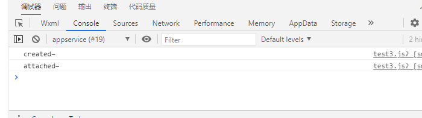
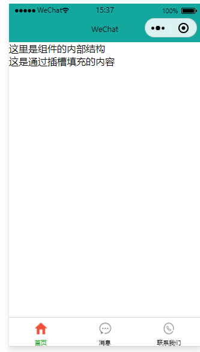
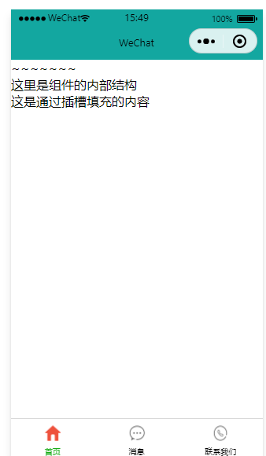

# 小程序 - 自定义组件

## 学习目标

- [ ] 掌握自定义小程序组件的方法
- [ ] 熟悉小程序组件中 behaviors 的作用
- [ ] 掌握如何实现组件的样式隔离
- [ ] 掌握数据监听器的使用

##  一、组件的创建与引用

### 1.1  创建组件

1. 在项目的根目录中，鼠标右键，创建 **components -> test** 文件夹

2. 在新建的 components -> test 文件夹上，鼠标右键，点击“**新建 Component**”

3. 键入组件的名称之后回车，会自动生成组件对应的 4 个文件，后缀名分别为 .js，.json， .wxml 和 .wxss

   注意：为了保证目录结构的清晰，**建议把不同的组件，存放到单独目录中**，例如：


### 1.2 引用组件

组件的引用方式分为“**局部引用**”和“**全局引用”**，顾名思义：

- 局部引用：组件只能在当前被引用的页面内使用
- 全局引用：组件可以在每个小程序页面中使用

### 1.3 局部引用组件

在页面的 .json 配置文件中引用组件的方式，叫做“局部引用”。示例代码如下：

在页面 home.json文件中，引入组件

```
{ 
"usingComponents": {
      "my-test1":"/components/test1/test1"
  }
}
```

在页面的home.wxml文件中，使用组件

```
<view></view>
<my-test1></my-test1>
```

效果：


### 1.4 全局引用组件

在 app.json 全局配置文件中引用组件的方式，叫做“全局引用”。示例代码如下：

```
{
  "pages":[
    "pages/index/index",
    "pages/logs/logs"
  ],
  "window":{
    "backgroundTextStyle":"light",
    "navigationBarBackgroundColor": "#fff",
    "navigationBarTitleText": "Weixin",
    "navigationBarTextStyle":"black"
  },
  "style": "v2",
  "sitemapLocation": "sitemap.json",

  "usingComponents": {
      "my-test1":"/components/test1/test1"
  }
  

}

```

在页面的.wxml文件中，使用组件

```
<my-test1></my-test1>
```

效果：


### 1.5 全局引用 VS 局部引用

根据组件的**使用频率**和**范围**，来选择合适的引用方式：

- 如果某组件**在多个页面中经常被用到**，建议进行“全局引用”
- 如果某组件只**在特定的页面中被用到**，建议进行“局部引用”

### 1.6 组件和页面的区别

从表面来看，组件和页面都是由 .js、.json、.wxml 和 .wxss 这四个文件组成的。但是，组件和页面的 .js 与 .json 文件有明显的不同：

- 组件的 .json 文件中需要声明 "**component": true** 属性
- 组件的 .js 文件中调用的是 **Component()** 函数
- 组件的事件处理函数需要定义到 **methods** 节点中

## 二、样式

### 2.1 组件样式隔离

默认情况下，自定义组件的样式只对当前组件生效，不会影响到组件之外的 UI 结构，如图所示：

- 组件 A 的样式**不会影响**组件 C 的样式
- 组件 A 的样式**不会影响**小程序页面的样式
- 小程序页面的样式**不会影响**组件 A 和 C 的样式

好处：

1. 防止外界的样式影响组件内部的样式
2. 防止组件的样式破坏外界的样式


在app.wxss中定义样式

```
.g-red-text {
    color:red;
}
text{
    font-size: 25rpx;
}
```

在home.wxml中加上此类名查看效果

```
<text class="g-red-text">pages/home/home.wxml</text>
```

效果：


### 2.2 组件样式隔离的注意点

- app.wxss 中的全局样式对组件无效
- 只有 class 选择器会有样式隔离效果，id 选择器、属性选择器、标签选择器不受样式隔离的影响

建议：在**组件**和**引用组件**的页面中建议使用 class 选择器，**不要使用 id、属性、标签选择器！**

### 2.3 修改组件的样式隔离选项

默认情况下，自定义组件的样式隔离特性能够防止组件内外样式互相干扰的问题。但有时，我们希望在外界能够控制组件内部的样式，此时，可以通过 styleIsolation 修改组件的样式隔离选项，用法如下：

**方式一**

```
// 在组件的 .js 文件中新增如下配置
// components/test/test.js
Component({
  options:{
    styleIsolation:"isolated"
  }
})

```

**方式二**

```
在组件的 .json 文件中新增如下配置
{
  "styleIsolation":"isolated"
}
```


### 2.4. styleIsolation 的可选值

| **可选值**   | **默认值** | **描述**                                                     |
| ------------ | ---------- | ------------------------------------------------------------ |
| isolated     | 是         | 表示启用样式隔离，在自定义组件内外，使用 class 指定的样式将不会相互影响 |
| apply-shared | 否         | 表示页面 wxss 样式将影响到自定义组件，但自定义组件 wxss 中指定的样式不会影响页面 |
| shared       | 否         | 表示页面 wxss 样式将影响到自定义组件，自定义组件 wxss 中指定的样式也会影响页面和其他设置了 apply-shared 或 shared 的自定义组件 |

## 三、数据、方法和属性

### 3.1 data 数据

在小程序组件中，用于组件模板渲染的私有数据，需要定义到 data 节点中，示例如下：

```
// components/test/test.js
Component({
    /**
     * 组件的初始数据
     */
    data: {
        count:0

    },
})

```

### 3.2 methods 方法

在小程序组件中，事件处理函数和自定义方法需要定义到 methods 节点中，示例代码如下：

```js
// components/test/test.js
Component({


	/**
	 * 组件的初始数据
	 */
	data: {
		count: 0

	},

	/**
	 * 组件的方法列表
	 */
	methods: { //组件的方法列表【包含事件处理函数和自定义方法】
		addCount() { //事件处理函数
			this.setData({
				count: this.data.count + 1
			})
			this._showCount() //通过this 直接调用自定义方法
		},
        _showCount() { //自定义方法建议以_开头
            wx.showToast({
                title: 'count值为：' + this.data.count,
                icon: 'none'
            })
		}
	},
	
})
```

在页面 .wxml中

```
<view>
    count的值是：{{count}}
</view>
<button bindtap="addCount">+1</button>

```

效果：


### 3.3 properties 属性

在小程序组件中，properties 是组件的对外属性，用来接收外界传递到组件中的数据，示例代码如下

```
// components/test/test.js
Component({
    /**
     * 组件的属性列表
     */
    properties: {
        max: {  // 完整定义属性的方式【当需要指定属性默认值时，建议使用此方式】
            type:Number, //属性值的数据类型
            value:10     //属性默认值
        },
        max:Number //简化定义属性的方式【不需要指定属性默认值时，可以使用简化方式】

}
})

```

在页面 .wxml中

```
<my-test1 max="10"></my-test1>
```

### 3.4 data 和 properties 的区别

在小程序的组件中，properties 属性和 data 数据的用法相同，它们都是可读可写的，只不过：

- data 更倾向于存储组件的私有数据

- properties 更倾向于存储外界传递到组件中的数据

  ```
  // components/test/test.js
  Component({
      showInfo() {
          console.log(this.data); //输出结果： {count:0,max:10}
          console.log(this.properties); //输出结果:{count:0,max:10}
          // 结果为true 证明 data数据和properties属性【在本质上是一样的，都是可读写的】
          console.log(this.data === this.properties);
      }
  }
       
  })
  
  ```

  

效果：


### 3.5 使用 setData 修改 properties 的值

由于 **data 数据**和 **properties 属性**在本质上没有任何区别，因此 properties 属性的值也可以用于页面渲染，或使用 setData 为 properties 中的属性重新赋值，示例代码如下：

在组件的.wxml中使用properties属性的值

```
<view>max属性的值为：{{max}}</view>
```

在组件

```
// components/test/test.js
Component({
    /**
     * 组件的属性列表
     */
    properties: {
        max: {  // 第二种完整定义属性的方式【当需要指定属性默认值时，建议使用此方式】
            type:Number, //属性值的数据类型
            value:10     //属性默认值
        },
        max:Number //第一种，简化定义属性的方式【不需要指定属性默认值时，可以使用简化方式】
    },

    /**
     * 组件的初始数据
     */
    data: {
        count:0

    },

    /**
     * 组件的方法列表
     */
    methods: { //组件的方法列表【包含事件处理函数和自定义方法】
        addCount() {//事件处理函数
        if(this.data.count >=  this.properties.max) return
        this.setData({ 
            count: this.data.count + 1,
            max:this.properties.max +1
        })
        this._showCount() // 通过this 直接调用自定义方法
    },
    _showCount(){  // 自定义方法建议以 _开头
        wx.showToast({
            title:'count值为：' + this.data.count,
            icon:'none'
        })
    },
    showInfo() {
        console.log(this.data);
        console.log(this.properties);
        console.log(this.data === this.properties);
    }
}
     
})

```

效果：


## 四、数据监听器

### 4.1 什么是数据监听器

数据监听器用于**监听和响应任何属性和数据字段的变化，从而执行特定的操作**。它的作用类似于 vue 中的 watch 侦听器。在小程序组件中，在componets中新建一个test2文件夹在文件夹里新建component

在app.json  usingComponents中 添加组件目录：

```
  "usingComponents": {
    "my-test1":"/components/test/test",
    "my-test2":"/components/test2/test2",
},
```

数据监听器的基本语法格式如下：

```
Component({
observers:{
'字段A,字段B': function(字段A的新值,字段B的新值)
  //do something
}
})
```

### 4.2 数据监听器的基本用法

组件的 UI 结构如下：

```
<!--components/test2/test2.wxml-->
<view>{{n1}} + {{n2}} = {{sum}}</view>
<button bindtap="addN1">n1+1</button>
<button bindtap="addN2">n2+1</button>
```

组件的 .js 文件代码如下：

```
// components/test2/test2.js
Component({
    /**
     * 组件的初始数据
     */
    data: {
        n1:0,
        n2:0,
        sum:0

    },

    /**
     * 组件的方法列表
     */
    methods: {
        addN1(){
            this.setData({
                n1:this.data.n1 + 1
            })
        },
        addN2() {
            this.setData({
                n2:this.data.n2 + 1
            })
        }
    },
    // 数据监听节点 
    observers:{
        'n1,n2':function(new1,new2){ //监听 n1 和 n2数据的变化
         this.setData({     // 通过监听器，自动计算sum的值
             sum: new1 + new2        
         })
        }
    }
})

```

效果：


### 4.3 监听对象属性的变化

数据监听器支持监听对象中**单个**或**多个属性**的变化，示例语法如下：

```
Compoent({
observers:{
 '对象.属性A，对象.属性B'：function(属性A的新值，属性B的新值){
 // 触发此监听器的3种情况
 // [为属性A赋值]使用 setData 设置this.data.对象.属性A 时触发
 // [为属性B赋值] 使用 setData 设置 this.data.对象.属性B 时触发
 // [直接为对象赋值] 使用 setData 设置this.data.对象 时触发
 }
}
})
```

## 五、数据监听器 - 案例

#### 5.1 案例效果


在componets中新建一个test3文件夹在文件夹里新建component

在app.json  usingComponents中 添加组件目录：

```
  "usingComponents": {
    "my-test1":"/components/test/test",
    "my-test2":"/components/test2/test2",
    "my-test3":"/components/test3/test3"
}
```

#### 5.2 定义数据

```
// components/test3/test3.js
Component({
    /**
     * 组件的初始数据
     */
    data: {
        rgb:{ // rgb 的颜色值对象
            r:0,
            g:0,
            b:0        
        },
        fullColor: '0, 0, 0' //根据rgb对象的三个属性，动态计算fullColor 的值        
    },
})

```

#### 5.3 渲染 UI 结构

.wxml 结构

```
<!--components/test3/test3.wxml-->
<view style="background-color:rgb({{fullColor}});"class="colorBox">颜色值：{{fullColor}}</view>
    <button size="mini" type="default" bindtap="changeR">R</button>
    <button size="mini" type="primary" bindtap="changeG">G</button>
    <button size="mini" type="warn" bindtap="changeB">B</button>
    <view>{{rgb.r}},{{rgb.g}},{{rgb.b}}</view>


```

.wxss 样式

```
/* components/test3/test3.wxss */
.colorBox {
    line-height: 200rpx;
    font-size:24rpx;
    color:white;
    text-shadow:0rpx 0rpx 2rpx black;
    text-align:center;

}
```

#### 5.4 定义 button 的事件处理函数

```
// components/test3/test3.js
Component({
    /**
     * 组件的方法列表
     */
    methods: {
        changeR(){ //修改 rgb 对象上 r属性的值
            this.setData({
                'rgb.r':this.data.rgb.r + 5 > 255 ? 255 : this.data.rgb.r + 5
            })
        },
        changeG(){ // 修改rgb对象上r属性的值
            this.setData({
                'rgb.g':this.data.rgb.g + 5 >255 ?255 :this.data.rgb.g +5
            })
        },
        changeB(){//修改 rgb对象上b属性的值
            this.setData({
                'rgb.b':this.data.rgb.b + 5 > 255 ? 255 :this.data.rgb.b +5
            })
        }
    }
})

```

效果：


#### 5.5 监听对象中指定属性的变化

```
observers:{
        // 监听rgb 对象上 r,g,b 三个属性的变化
        'rgb.r,rgb.g, rgb.b':function(r,g,b){
            this.setData({
                //为data中的fullColor 重新赋值
                fullColor:`${r},${g},${b}`
            })
        }
    }
```

效果：


#### 5.6 监听对象中所有属性的变化

如果某个对象中需要被监听的属性太多，为了方便，可以使用**通配符 `**` 来**监听**对象**中所有属性的变化，示例代码如下：

```
observers:{
        // 监听rgb 对象上 所有属性的变化
             'rgb.**':function(obj){
            this.setData({
                fullColor:`${obj.r},${obj.g},${obj.b}`
            })
        }
    }
```


## 六、纯数据字段

### 6.1 什么是纯数据字段

概念：**纯数据字段**指的是那些**不用于界面渲染的 data 字段。**

应用场景：例如有些情况下，某些 data 中的字段**既不会展示在界面上，也不会传递给其他组件**，仅仅在当前组件内部使用。带有这种特性的 data 字段适合被设置为纯数据字段。

好处：纯数据字段**有助于提升页面更新的性能。**

### 6.2 使用规则

在 Component 构造器的 options 节点中，指定 **pureDataPattern** 为一个**正则表达式**，字段名符合这个正则表达式的字段将成为纯数据字段，示例代码如下：

```
Component({
	options: {
	// 指定所有 _ 开头的数据字段为纯数据字段
	pureDataPattern:/^_/
	},
	data: {
		a:true, // 普通数据字段
		_b:true, // 纯数据字段
	}
	}
})
```

### 6.3 使用纯数据字段改造数据监听器案例

```
// components/test3/test3.js
Component({
    options:{
    // 指定所有_ 开头的数据字段为纯数据字段
        pureDataPattern:/^_/
    },
    /**
     * 组件的属性列表
     */
    properties: {

    },

    /**
     * 组件的初始数据
     */
    data: {
        _rgb:{ // rgb 的颜色值对象
            r:0,
            g:0,
            b:0        
        },
        fullColor: '0, 0, 0' //根据rgb对象的三个属性，动态计算fullColor 的值
        
    },
    })
```

## 七、组件的生命周期

### 7.1 组件全部的生命周期函数

小程序组件可用的全部生命周期如下表所示：

| **生命周期函数** | **参数**     | **描述说明**                                     |
| ---------------- | ------------ | ------------------------------------------------ |
| created          | 无           | 在组件实例刚刚被创建时执行，不能调用this.setData |
| attached         | 无           | 在组件实例进入页面节点树时执行                   |
| ready            | 无           | 在组件在视图层布局完成后执行                     |
| moved            | 无           | 在组件实例被移动到节点树另一个位置时执行         |
| detached         | 无           | 在组件实例被从页面节点树移除时执行               |
| error            | Object Error | 每当组件方法抛出错误时执行                       |

### 7.2 组件主要的生命周期函数

在小程序组件中，最重要的生命周期函数有 3 个，分别是 **created**、**attached**、**detached**。它们各自的特点如下： 

1. 组件实例**刚被创建**好的时候，created 生命周期函数会被触发

   - 此时还不能调用 setData

   - 通常在这个生命周期函数中，只应该用于给组件的 this 添加一些自定义的属性字段 


2. 在组件**完全初始化完毕、进入页面节点树后**， attached 生命周期函数会被触发

   - 此时， this.data 已被初始化完毕

   - 这个生命周期很有用，绝大多数初始化的工作可以在这个时机进行（例如发请求获取初始数据）


3. 在组件**离开页面节点树后**， detached 生命周期函数会被触发

   - 退出一个页面时，会触发页面内每个自定义组件的 detached 生命周期函数

   - 此时适合做一些清理性质的工作


### 7.3 lifetimes 节点

在小程序组件中，生命周期函数可以直接定义在 Component 构造器的第一级参数中，可以在 lifetimes 字段内进行声明（**这是推荐的方式，其优先级最高**）。示例代码如下：

```
// components/test3/test3.js
Component({
    //旧式的定义方式
    created() {
        console.log('created'); //在组建实例进入页面节点树时执行
    },
    attached(){
        console.log('attached'); //在组件实例被从页面节点树移除时执行
    },
    // 推荐用法
    lifetimes:{
        created() {
            console.log('created~'); //在组建实例进入页面节点树时执行
        },
        attached(){
            console.log('attached~');//在组件实例被从页面节点树移除时执行
        },

    }
})
```

效果：



## 八、组件所在页面的生命周期

### 8.1 什么是组件所在页面的生命周期

有时，**自定义组件的行为依赖于页面状态的变化**，此时就需要用到**组件所在页面的生命周期**。

例如：每当触发页面的 show 生命周期函数的时候，我们希望能够重新生成一个随机的 RGB 颜色值。

在自定义组件中，组件所在页面的生命周期函数有如下 3 个，分别是：

| **生命周期函数** | **参数**    | **描述**                     |
| ---------------- | ----------- | ---------------------------- |
| show             | 无          | 组件所在的页面被展示时执行   |
| hide             | 无          | 组件所在的页面被隐藏时执行   |
| resize           | Object Size | 组件所在的页面尺寸变化时执行 |

### 8.2 pageLifetimes 节点

组件所在页面的生命周期函数，需要定义在 pageLifetimes 节点中，示例代码如下：

```
// components/test3/test3.js
Component({

    pageLifetimes:{
        show(){
            console.log('show');
        },
        hide(){
            console.log('hide');
        },
        resize(){
            console.log('resize');
        }
    }

})

```

效果：从首页切换到消息界面就打印出来了hide


### 8.3  生成随机的 RGB 颜色值

```
// components/test3/test3.js
Component({
    /**
     * 组件的方法列表
     */
    methods: {
        changeR(){ //修改 rgb 对象上 r属性的值
            this.setData({
                '_rgb.r':this.data._rgb.r + 5 > 255 ? 255 : this.data._rgb.r + 5
            })
        },
        changeG(){ // 修改rgb对象上r属性的值
            this.setData({
                '_rgb.g':this.data._rgb.g + 5 >255 ?255 :this.data._rgb.g +5
            })
        },
        changeB(){//修改 rgb对象上b属性的值
            this.setData({
                '_rgb.b':this.data._rgb.b + 5 > 255 ? 255 :this.data._rgb.b +5
            })
        },
        _randomColor() {
            this.setData({
                _rgb:{

                        r: Math.floor(Math.random() * 256),
                        g: Math.floor(Math.random() * 256),
                        b: Math.floor(Math.random() * 256)
                }
            })
        }
    },
    pageLifetimes:{
        show(){
            console.log('show');
            this._randomColor()
        }
    }

})


```

## 九、插槽

### 9.1 什么是插槽

在自定义组件的 wxml 结构中，可以提供一个 **<slot\>** 节点（插槽），用于**承载组件使用者提供的 wxml 结构。**


### 9.2 单个插槽

在小程序中，默认每个自定义组件中只允许使用一个 `<slot>` 进行占位，这种个数上的限制叫做单个插槽。

在components 中新建一个test4文件夹 在文件中新建component

在app.json  usingComponents中 添加组件目录：

```
  "usingComponents": {
    "my-test1":"/components/test/test",
    "my-test2":"/components/test2/test2",
    "my-test3":"/components/test3/test3",
    "my-test4":"/components/test4/test4"
},
```

在组件.wxml中定义结构：

```
<!--components/test4/test4.wxml-->
<view>
    <view>
        这里是组件的内部结构
    </view>
    <slot></slot>
</view>

```

在页面的.wxml定义结构：

```
<!--pages/home/home.wxml-->
<my-test4>
<view>
这是通过插槽填充的内容
</view></my-test4>
```

效果：



### 9.3 启用多个插槽

在小程序的自定义组件中，需要使用多 `<slot>` 插槽时，可以在组件的 .js 文件中，通过如下方式进行启用。

```
// components/test4/test4.js
Component({
    options: {
        multipleSlots: true //在组件定义时选型中启用多slot支持
    },
    properties: {/* ... */},
    data: {/* ... */},
    methods: {/* ... */ }
})

```

### 9.4 定义多个插槽

可以在组件的 .wxml 中使用多个 **<slot\>** 标签，以不同的 **name** 来区分不同的插槽。示例代码如下：

在组件.wxml中 加上一个slot标签 为每个slot标签定义name属性值

```
<!--components/test4/test4.wxml-->
<view>
	<slot name="before"></slot>
    <view> 这里是组件的内部结构 </view>
    <slot name="after"></slot>
</view>

```

### 9.5 使用多个插槽

在home.wxml中使用插槽定义结构：

```
<my-test4>
<!-- 这部分内容将被放置在组件 <slot name="after">的位置上 -->
<view slot="after">这是通过插槽填充的内容</view>
<!-- 这部分内容将被放置在组件 <slot name="before">的位置上 -->
<view slot="before">~~~~~~~</view>
</my-test4>
```

效果：



## 十、父子组件之间的通信

### 10.1 父子组件之间通信的 3 种方式

1. 属性绑定
   - 用于父组件向子组件的指定属性设置数据，仅能设置 JSON 兼容的数据

2. 事件绑定
   - 用于子组件向父组件传递数据，可以传递任意数据

3. 获取组件实例
   - 父组件还可以通过 this.selectComponent() 获取子组件实例对象
   - 可以直接访问子组件的任意数据和方法

### 10.2 属性绑定

属性绑定用于实现父向子传值，而且只能传递普通类型的数据，无法将方法传递给子组件。父组件的示例代码如下：

在home.js中定义数据

```
// 父组件的data节点
data: {
count:0
}
```

在home.js中定义结构

```
// 父组件的.wxml结构
<my-test3 count="{{count}}"> </my-test3>
<view>-----</view>
<view>父组件中,count值为：{{count}}</view>
```

效果：


在components 中新建一个test5文件夹 在文件中新建component

在app.json  usingComponents中 添加组件目录：

```
  "usingComponents": {
    "my-test1":"/components/test/test",
    "my-test2":"/components/test2/test2",
    "my-test3":"/components/test3/test3",
    "my-test4":"/components/test4/test4",
    "my-test5":"/components/test5/test5"
},
```

在home首页中使用一下这个组件

```
<my-test5 count="{{count}}"></my-test5>
<view>~~~~~~~~~~~</view>
<view>父组件中，count值是：{{count}}</view>
```

子组件在 properties 节点中声明对应的属性，并使用实现子组件按钮自增加一的效果。添加示例代码如下：

在test5.js中

```
// components/test5/test5.js
Component({
    /**
     * 组件的属性列表
     */
    properties: {
        count:Number

    },

    /**
     * 组件的初始数据
     */
    data: {

    },

    /**
     * 组件的方法列表
     */
    methods: {
        addCount(){
            this.setData({
                count:this.properties.count + 1
            })
        }
    }
})

```

在test.wxml中定义结构

```
<view>子组件中，count值是：{{count}}</view>
<button bindtap="addCount">+1</button>
```

效果：


### 10.3 事件绑定

**事件绑定**用于实现子**向父传值**，可以传递任何类型的数据。使用步骤如下：

1. 在**父组件**的 js 中，定义一个函数，这个函数**即将**通过自定义事件的形式，传递给子组件
2. 在**父组件**的 wxml 中，通过自定义事件的形式，将步骤 1 中定义的函数引用，传递给子组件
3. 在子组件的 js 中，通过调用 **this.triggerEvent**('自定义事件名称', { /* 参数对象 */ }) ，将数据发送到父组件
4. 在**父组件**的 js 中，通过 **e.detail** 获取到子组件传递过来的数据

步骤1：在父组件的 js 中，定义一个函数，这个函数即将通过自定义事件的形式，传递给子组件。

在父组件中（home.js中）定义一个方法：

```
//在父组件中定义sysncCount方法
// 将来，这个方法会被传递给子组件，供子组件进行调用
Page({
  /**
   * 页面的初始数据
   */
  data: {
      count:0

  },
  sysncCount(){
     console.log('sysncCount'); 
  },
```

步骤2：在**父组件**的 wxml 中（home.wxml），通过**自定义事件**的形式，将步骤 1 中定义的函数引用，传递给子组件。

使用bind:自定义事件名称 （推荐：结构清晰）

```
<my-test5 count="{{count}}" bind:sync="sysncCount"></my-test5>
```

或在bind后面直接写上自定义事件名称

```
<my-test5 count="{{count}}" bindsync="sysncCount"></my-test5>
```

步骤3：在子组件的 js 中，通过调用 this.triggerEvent(‘自定义事件名称’, { /* 参数对象 */ }) ，将数据发送

子组件的.wxml结构（test5.wxml)

```
<view>子组件中，count值是：{{count}}</view>
<button type="primary" bindtap="addCount">+1</button>

```

子组件的js代码

```
// components/test5/test5.js
Component({
    methods: {
        addCount(){
            this.setData({
                count:this.properties.count + 1
            })
            // 触发自定义事件，将数值同步给父组件
            	this.triggerEvent('sync',{value:this.properties.count})
        }
    }
})

```

步骤4：在父组件的 js 中，通过 e.detail 获取到子组件传递过来的数据。

```
sysncCount(e){
    //  console.log('sysncCount'); 
    //  console.log(e); 
    //  console.log(e.detail.value); 
    this.setData({
        count: e.detail.value
    })
  },
```

效果：


### 10.4 获取组件实例

可在父组件里调用 this.selectComponent("id或class选择器") ，获取子组件的实例对象，从而直接访问子组件的任意数据和方法。

调用时需要传入一个选择器，例如 this.selectComponent(".my-component")。

home.wxml定义结构

```

<my-test5 count="{{count}}" bind:sync="sysncCount" class="customA" id='cA'></my-test5>
<view>~~~~~~~~~~~</view>
<view>父组件中，count值是：{{count}}</view>

<button bindtap="getChild">获取子组件的实例对象</button>
```

在hone.js定义一个事件处理函数

```
// pages/home/home.js
Page({
  /**
   * 页面的初始数据
   */
  data: {
      count:0

  },
  sysncCount(e){
    //  console.log('sysncCount'); 
    //  console.log(e); 
    //  console.log(e.detail.value); 
    this.setData({
        count: e.detail.value
    })
  },
    getChild(){
     //切记不能传递标签选择器否自返回的是null
      const child =  this.selectComponent('.customA')
    //   console.log(child);
    // 调用子组件的 setData方法
   // child.setData({
    //    count:child.properties.count +1 //注意此处只能用child不能用this
   // })
    child.addCount()//调用子组件的addCount方法

    },
 
})
```

效果：


## 十一、behaviors

### 11.1 什么是 behaviors

behaviors 是小程序中，**用于实现组件间代码共享的特性**，类似于 Vue.js 中的 “mixins”。


### 11.2 behaviors 的工作方式

每个 behavior 可以包含一组**属性、数据、生命周期函数和方法**。组件引用它时，它的属性、数据和方法**会被合并到组件中**。每个组件可以引用多个 behavior，behavior 也可以引用其它 behavior。

### 11.3 创建 behavior

调用 Behavior(Object object) 方法即可创建一个共享的 behavior 实例对象，供所有的组件使用：

在根目录下新建一个behaviors文件夹在文件夹下创建一个my-behavior.js

```
// 调用 	Behavior() 方法,创建实例对象
// 并使用module.exports 将behavior 实例对象共享出去
module.exports = Behavior({
// 属性节点
properties:{},
// 私有属性节点
    data: {
        username:'zs'
    },
    // 事件处理函数和自定义方法的节点
    methods: {}，
    // 其他节点
})
```

### 11.4 导入并使用 behavior

在组件中，使用 **require()** 方法导入需要的 behavior，**挂载后即可访问 behavior 中的数据或方法**，示例代码如下：

列入我们想要在test5中使用my-behavior

在test5中：

```
// components/test5/test5.js
//1.使用require() 导入需要的自定义behavior模块
const myBehavior = require('../../behaviors/my-behavior')

Component({
    //2. 将导入的behavior 实例对象，挂载到behaviors数组节点中，即可生效
    behaviors:[myBehavior],

})

```

在test5.wxml 使用behavios中定义的数据：

```
<!--components/test5/test5.wxml-->
<view>子组件中，count值是：{{count}}</view>
<button bindtap="addCount">+1</button>
<view>在behavior中定义的用户名是：{{username}}</view>
```

效果：


### 11.5 behavior 中所有可用的节点

| **可用的节点** | **类型**     | **是否必填** | **描述**            |
| -------------- | ------------ | ------------ | ------------------- |
| properties     | Object Map   | 否           | 同组件的属性        |
| data           | Object       | 否           | 同组件的数据        |
| methods        | Object       | 否           | 同自定义组件的方法  |
| behaviors      | String Array | 否           | 引入其它的 behavior |
| created        | Function     | 否           | 生命周期函数        |
| attached       | Function     | 否           | 生命周期函数        |
| ready          | Function     | 否           | 生命周期函数        |
| moved          | Function     | 否           | 生命周期函数        |
| detached       | Function     | 否           | 生命周期函数        |

### 11.6 同名字段的覆盖和组合规则

组件和它引用的 behavior 中**可以包含同名的字段**，此时可以参考如下 3 种同名时的处理规则：

1. 同名的数据字段 (data)
2. 同名的属性 (properties) 或方法 (methods)
3. 同名的生命周期函数

关于详细的覆盖和组合规则，大家可以参考微信小程序官方文档给出的说明：https://developers.weixin.qq.com/miniprogram/dev/framework/custom-component/behaviors.html

## 总结 - 组件

1. 能够创建并引用组件 

- 全局引用、局部引用、usingComponents

2. 能够知道如何修改组件的样式隔离选项 

- options -> styleIsolation（ isolated, apply-shared, shared）

3. 能够知道如何定义和使用数据监听器

-  observers

4. 能够知道如何定义和使用纯数据字段 

- options -> pureDataPattern

5. 能够知道实现组件父子通信有哪3种方式 

- 属性绑定、事件绑定、this.selectComponent(' id或class选择器')

6. 能够知道如何定义和使用behaviors 

- 调用 Behavior() 构造器方法
