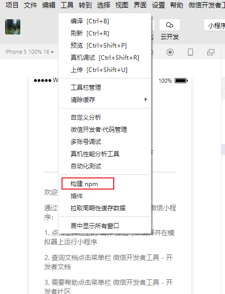

# 小程序-状态管理、分包

## 学习目标

- [ ] 能够知道如何安装和配置 vant-weapp 组件库

- [ ] 能够知道如何使用 MobX 实现全局数据共享

- [ ] 能够知道如何对小程序的 API 进行 Promise 化

- [ ] 能够知道如何实现自定义 tabBar 的效果

## 一、使用 npm 包

**小程序对 npm 的支持与限制**

目前，小程序中已经支持使用 npm 安装第三方包，从而来提高小程序的开发效率。但是，在小程序中使用 npm 包有如下 3 个限制：

1. 不支持依赖于 **Node.js 内置库的包**
2. 不支持依赖于**浏览器内置对象的包**
3. 不支持依赖于 **C++ 插件的包**

总结：虽然 npm 上的包有千千万，但是能供小程序使用的包却“为数不多”。

### 1.1 Vant Weapp

#### 1.1.1 什么是 Vant Weapp

Vant Weapp 是有赞前端团队开源的一套**小程序 UI 组件库**，助力开发者快速搭建小程序应用。它所使用的是 **MIT 开源许可协议**，对商业使用比较友好。

官方文档地址 https://youzan.github.io/vant-weapp

扫描下方的小程序二维码，体验组件库示例：


#### 1.1.2 安装 Vant 组件库

在小程序项目中，安装 Vant 组件库主要分为如下 3 步：

1. 通过 npm 安装（建议指定版本为@1.3.3）
2. 构建 npm 包
3. 修改 app.json

详细的操作步骤，大家可以参考 Vant 官方提供的快速上手教程：https://youzan.github.io/vant-weapp/#/quickstart#an-zhuang

1.在打开的微信小程序文档目录右键选择在外部终端窗口打开


2.初始化一个包管理文件：


3. 复制此命令粘贴到终端 并为其指定版本号

   ```
   npm i @vant/weapp@1.3.3 -S --production
   ```


4. 构建 npm 包

打开微信开发者工具，点击 **工具 -> 构建 npm**，如果使用的**老版本工具**需要勾选 **使用 npm 模块** 选项，构建完成后，即可引入组件。



**目前版本不需要手动选择NPM模块了 只需要npm init 之后在工具中构建即可**

 5.修改 app.json

将 app.json 中的 `"style": "v2"` 去除，小程序的[新版基础组件](https://developers.weixin.qq.com/miniprogram/dev/reference/configuration/app.html#style)强行加上了许多样式，难以覆盖，不关闭将造成部分组件样式混乱。

#### 1.1.3 使用 Vant 组件

安装完 Vant 组件库之后，可以在 **app.json** 的 **usingComponents** 节点中引入需要的组件，即可在 wxml 中直接使用组件。示例代码如下：

在app.json中声明节点引入组件

```
  "usingComponents": {
    "van-button": "@vant/weapp/button/index"
  }
```

// 页面的 .wxml结构

```
<van-button type="primary">主要按钮</van-button>
<van-button type="danger">危险按钮</van-button>
```

如在控制台报错：


解决办法：检查一下自己的page.json文件的页面pages页面的路径是否匹配

如果还是报错可能是因为版本库太高了，但是对于项目运行暂时没影响。忽略即可

#### 1.1.4 定制全局主题样式

Vant Weapp 使用 **CSS 变量**来实现定制主题。 关于 CSS 变量的基本用法，请参考 MDN 文档：https://developer.mozilla.org/zh-CN/docs/Web/CSS/Using_CSS_custom_properties

例子：

定义html:

```
<!DOCTYPE html>
<html lang="en">
  <head>
    <meta charset="UTF-8" />
    <meta name="viewport" content="width=device-width, initial-scale=1.0" />
    <title>Document</title>
    <link rel="stylesheet" href="./01.css" />

  <body>
    <div class="container1">
      <div class="box1">box1</div>
      <div class="box2">box2</div>
      <div class="box3">box3</div>
    </div>

    <div class="container2">
      <div class="box1">box1</div>
      <div class="box2">box2</div>
      <div class="box3">box3</div>
    </div>
  </body>
</html>

```

css渲染:

```
html {
  /* 定义CSS变量 */
  --main-color: #C00000;
}

.box1, .box2 {
  /* background-color: #C00000; */
  background-color: var(--main-color);
}

.box3 {
  /* color: #C00000; */
  color: var(--main-color);
}
body {
  display: flex;
}
.container1,
.container2 {
  flex: 1;
}
div {
  line-height: 120px;
  border: 1px solid #ccc;
  margin: 20px;
  text-align: center;
  border-radius: 4px;
}

```

#### 1.1.5 定制全局主题样式

在 app.wxss 中，写入 CSS 变量，即可对全局生效：

```
// app.wxss
page{
    /* 定制警告按钮的背景颜色和边框颜色 */
    --button-danger-background-color:#C00000;
    --button-danger-border-color:#D60000;
    --button-primary-background-color: #13A7A0;
    --button-primary-border-color:#15B4AA;
    --tabbar-height:100rpx;
}

```

所有可用的颜色变量，请参考 Vant 官方提供的配置文件：https://github.com/youzan/vant-weapp/blob/dev/packages/common/style/var.less


### 1.2 API Promise化

#### 1.2.1 基于回调函数的异步 API 的缺点

默认情况下，小程序官方提供的**异步 API** 都是**基于回调函数**实现的，例如，网络请求的 API 需要按照如下的方式调用：

```
wx.request({
method:'',
url:'',
data:{ },
success:()=>{},//请求成功的回调函数
fail:( )=>{ }, //请求失败的回调函数
complete:()=>{} // 请求完成的回调函数
})
```

缺点：容易造成**回调地狱**的问题，代码的**可读性、维护性**差！

#### 1.2.2 什么是 API Promise 化

**API Promise化**，指的是**通过额外的配置**，将官方提供的、基于回调函数的异步 API，**升级改造为基于 Promise 的异步 API**，从而提高代码的可读性、维护性，避免回调地狱的问题。

#### 1.2.3 实现 API Promise 化

在小程序中，实现 API Promise 化主要依赖于 miniprogram-api-promise 这个第三方的 npm 包。它的安装和使用步骤如下：

在打开的微信小程序文档目录右键选择在外部终端窗口打开

1.下载包

```
npm i --save miniprogram-api-promise@1.0.4
```

注意：我们安装完这个包之后**不能马上使用，**因为小程序比较特殊，咱们安装了一个新包，都需要对这个包进行**构建**。

我们在默认情况下装完一个包，其实会把包装到**node_modules**文件夹下，

但是**小程序**里面无**法直接去读取node_modules这个包**，所以需要去**构建**，

通过构建，把**node_modules**里面的包放到**miniprogram_npm**这个目录下，然后使用miniprogram_npm这个目录下的这些npm包了

每次下包都要去目录里删除miniprogram_npm这个文件然后重新构建，不然容易报错

2.如何使用这个包对微信小程序进行API Promise化

```
//在小程序入口文件中(app.js),只需要调用一次 promisifyAll()方法，
// 即可实现异步API的Promise化
import { promisifyAll } from 'miniprogram-api-promise'
const wxp = wx.p={}
// promisify all wx's api
promisifyAll(wx,wxp)
```

#### 1.2.4 调用 Promise 化之后的异步 API

页面的 .wxml结构：

```
<van-button type="primary" bindtap="getInfo">vant按钮</van-button>
```

在页面的 .js文件中，定义对应的tap 事件处理函数

```
   async getInfo() {
      const {data: res} =  await wx.p.request({
        method: 'GET',
        url: 'http://127.0.0.1/api/get',
        data: {
          name: 'zs',
          age: 20
        }
      })
      console.log(res)
    },
```

## 二、全局数据共享

### 2.1 什么是全局数据共享

**全局数据共享**（又叫做：状态管理）是为了解决**组件之间数据共享**的问题。开发中常用的全局数据共享方案有：Vuex、Redux、MobX 等。


### 2.2 小程序中的全局数据共享方案

在小程序中，可使用 **mobx-miniprogram** 配合 **mobx-miniprogram-bindings** 实现全局数据共享。

其中：

- mobx-miniprogram **用来创建 Store 实例对象**

- mobx-miniprogram-bindings 用来把 **Store 中的共享数据或方法，绑定到组件或页面中使用**

  

### 2.3 MobX

#### 2.3.1 安装 MobX 相关的包

在项目中运行如下的命令，安装 MobX 相关的包

```
npm install --save mobx-miniprogram@4.13.2 mobx-miniprogram-bindings@1.2.1
```

注意：MobX 相关的包安装完毕之后，记得删除 miniprogram_npm 目录后，重新构建 npm

如果报错以下内容：清除所有缓存，重新编译


#### 2.3.2 创建 MobX 的 Store 实例

```
// 在这个 JS 文件中，专门来创建 Store 的实例对象
import { observable, action } from 'mobx-miniprogram'

export const store = observable({
  // 数据字段
  numA: 1,
  numB: 2,
  activeTabBarIndex: 0,
  // 计算属性
  get sum() {
    return this.numA + this.numB
  },
  // actions 函数，专门来修改 store 中数据的值
  updateNum1: action(function (step) {
    this.numA += step
  }),
  updateNum2: action(function (step) {
    this.numB += step
  }),
  updateActiveTabBarIndex: action(function(index) {
    this.activeTabBarIndex = index
  })
})
```

#### 2.3.3 将 Store 中的成员绑定到页面中

```
// pages/message/message.js
import { createStoreBindings} from  'mobx-miniprogram-bindings'
import { store } from '../../store/store'
Page({

  /**
   * 生命周期函数--监听页面加载
   */
  onLoad: function (options) {
     this.storeBindings = createStoreBindings(this,{
         store,
         fields:['numA','numB','sum'],
         actions:['updateNum1']
     })
  },
  /**
   * 生命周期函数--监听页面卸载
   */
  onUnload: function () {
    this.storeBindings.destroyStoreBindings()
  },

})
```

#### 2.3.4 在页面上使用 Store 中的成员

定义页面的.wxml 结构

```
<!--pages/message/message.wxml-->
<view>{{numA}} + {{numB}} ={{sum}}</view>
<van-button type="primary" bindtap="btnHandler1" data-step="{{1}}">numA + 1</van-button>
<van-button type="danger" bindtap="btnHandler1" data-step="{{-1}}"> numA - 1</van-button>
```

定义按钮 tap事件的处理函数

```
 Page({
 btnHandler1 (e){
    // console.log(e);
    this.updateNum1(e.target.dataset.step)
  },
  })
```

#### 2.3.5 将 Store 中的成员绑定到组件中

1.在根目录下创建一个文件夹**components,**在components文件夹下**创建**一个**numbers**文件夹，在numbers文件夹里右键新建component也命名为numbers


2.在**app.json**里，注册一下**numbers**

```
  "usingComponents": {
    "van-button": "@vant/weapp/button/index",
    "my-numbers": "./components/numbers/numbers"
  }

}
```

到此为止就**成功创建**了一个**number组件**

3.接下来我们就可以把这个组件在**message**(消息)页面里进行使用

message.wxml

```
<view>
    ~~~~~~~~~~~~
</view>

<my-numbers></my-numbers>
```

4.在组件的js文件中（numbers.js) 把组件的成员映射过来进行使用

```
// components/numbers/numbers.js
import { storeBindingsBehavior } from "mobx-miniprogram-bindings"
import { store } from '../../store/store'
Component({
    behaviors:[storeBindingsBehavior], //通过storeBindingsBehavior 来实现自动绑定
    storeBindings:{
    // 数据源
    store,  // 指定要绑定的Store
    fields: { // 指定要绑定的字段数据
        numA: () => store.numA, //绑定字段的第一种方式
        numB: (store) => store.numB,//绑定字段的第二种方式
        sum: 'sum'   // 绑定字段的第三种方式（最常用）
    },
    actions: {  //指定要绑定的方法
        updateNum2:'updateNum2'
    },

})

```

#### 2.3.6 在组件中使用 Store 中的成员

组件的 .wxml结构

```
<!--components/numbers/numbers.wxml-->
<view>{{numA}} + {{numB}} ={{sum}}</view>
<van-button type="primary" bindtap="btnHandler2" data-step="{{1}}">numB + 1</van-button>
<van-button type="danger" bindtap="btnHandler2" data-step="{{-1}}"> numB - 1</van-button>
```

组件的方法列表

```
// components/numbers/numbers.js
Component({
    /**
     * 组件的方法列表
     */
    methods: {
        btnHandler2(e) {
            this.updateNum2(e.target.dataset.step)
        }
    }
})
```

效果：


## 三、分包

### 3.1 分包基础概念

#### 3.1.1 什么是分包

分包指的是把一个**完整的小程序项目**，按照需求**划分为不同的子包**，在构建时打包成不同的分包，用户在使用时**按需进行加载**。

#### 3.1.2 分包的好处

对小程序进行分包的好处主要有以下两点：

- 可以优化小程序首次启动的下载时间
- 在多团队共同开发时可以更好的解耦协作

#### 3.1.3 分包前项目的构成

分包前，小程序项目中**所有的页面**和**资源**都被打包到了一起，导致整个项目**体积过大**，影响小程序**首次启动的下载时间。**


#### 3.1.4 分包后项目的构成

分包后，小程序项目由 **1 个主包** + **多个分包**组成：

主包：一般只包含项目的**启动页面**或 **TabBar 页面**、以及所有分包都需要用到的一些**公共资源**

分包：只包含和当前分包有关的页面和私有资源


#### 3.1.5 分包的加载规则

1. 在小程序启动时，默认会下载主包并启动主包内页面

- tabBar 页面需要放到主包中

2. 当用户进入分包内某个页面时，客户端会把对应分包下载下来，下载完成后再进行展示

- 非 tabBar 页面可以按照功能的不同，划分为不同的分包之后，进行按需下载

#### 3.1.6 分包的体积限制

目前，小程序分包的大小有以下两个限制：

- 整个小程序所有分包大小不超过 16M（主包 + 所有分包）
- 单个分包/主包大小不能超过 2M

### 3.2  使用分包

#### 3.2.1 配置方法


##### **例如：**

我们mp_05这个项目里有三个tapBar对应的页面（**home、message、contact**),因此**pages**里面的**页面**就**适合放到主包里面**，如果我们还需要有一些**额外的页面**，那么这些额外页面就可以**放到分包里面**来进行展示

让我们一起来看一下在当前项目里如何添加自己得分包

##### 1.首先打开**app.json（全局配置文件）**添加**分包的配置项**

 我们都知道，如果要**新增一个页面**的话，我们直接**在app.json的page节点这里添加一个页面的路径**，**保存**之后，**微信开发者工具**就会**自动给生成对应的页面**

创建分包也是一样的，我们只需要在app.js里添加分包的配置项，保存之后，微信开发者工具就会自动创建分包对应的目录结构

##### 2.创建分包

在跟pages节点平级新增 一个"subpackages"配置项,指向一个数组，在这个数组里面有几个分包填写几个对象就可以

```
{
  "pages": [
    "pages/home/home",
    "pages/message/message",
    "pages/contact/contact"
  ],
  "subpackages":[{   
  
      "root":"pkgA",
      "pages":[
          "pages/cat/cat",
          "pages/dog/dog"
        ]
  },
 {
     "root":"pkgB",
     "pages": [
         "pages/apple/apple"
     ]
 }

],
}
```

保存之后查看目录结构变化：


##### 3.给分包添加别名

 在root节点平级的位置，添加name属性指定别名即可

```
  "subpackages":[{   
  
      "root":"pkgA",
      "name":"p1",
      "pages":[
          "pages/cat/cat",
          "pages/dog/dog"
        ]
  },
 {
     "root":"pkgB",
     "name":"p2",
     "pages": [
         "pages/apple/apple"
     ]
 }
],
```

##### 4.如何知道每个分包的体积


#### 3.2.2 打包原则

1. 小程序会按 subpackages 的配置进行分包，subpackages 之外的目录将被打包到主包中
2. 主包也可以有自己的 pages（即最外层的 pages 字段）
3. tabBar 页面必须在主包内
4. 分包之间不能互相嵌套

#### 3.2.3 引用原则

1. 主包无法引用分包内的私有资源
2. 分包之间不能相互引用私有资源
3. 分包可以引用主包内的公共资源


### 3.3 独立分包

#### 3.3.1 什么是独立分包

独立分包**本质上也是分包**，只不过它比较特殊，**可以独立于主包和其他分包而单独运行**。


#### 3.3.2 独立分包和普通分包的区别

最主要的区别：**是否依赖于主包才能运行**

- 普通分包必须依赖于主包才能运行
- 独立分包可以在不下载主包的情况下，独立运行

#### 3.3.3 独立分包的应用场景

开发者可以按需，将某些**具有一定功能独立性的页面**配置到**独立分包**中。原因如下：

- 当小程序从普通的分包页面启动时，需要首先下载主包
- 而独立分包**不依赖主包**即可运行，**可以很大程度上提升分包页面的启动速度**

注意：一个小程序中可以有多个独立分包。

#### 3.3.4 独立分包的配置方法


例如我们把之前做的pkgB做成独立分包，在和root平级的地方，加上“independent"此节点就可以了

```
 {
     "root":"pkgB",
     "name":"p2",
     "pages": [
         "pages/apple/apple"
     ],
     "independent": true
 }
```

#### 3.5.5 引用原则

独立分包和普通分包以及主包之间，是**相互隔绝的**，**不能相互引用彼此的资源**！例如：

1. 主包**无法引用**独立分包内的私有资源
2. 独立分包之间，**不能相互引用**私有资源
3. 独立分包和普通分包之间，**不能相互引用**私有资源特
4. **特别注意：独立分包中不能引用主包内的公共资源**

### 3.4 分包预下载

#### 3.4.1 什么是分包预下载

分包预下载指的是：在进入小程序的某个页面时，**由框架自动预下载可能需要的分包**，从而提升进入后续分包页面时的启动速度。

#### 3.4.2 配置分包的预下载

**预下载分包的行为，会在进入指定的页面时触发**。在 app.json 中，使用 **preloadRule** 节点定义分包的预下载规则，示例代码如下：

打开app.json: 

```
{
  "preloadRule": {   // 分包预下载的规则
      "pages/contact/contact":{// 触发分包预下载的页面路径
	      // packages 表示进入页面后，预下载那些分包
	      // 可以通过root 或name 指定下载那些分包
          "packages": ["p1"],
         // network 表示在指定的网络模式下进行预下载
     	 // 可选值为：all(不限制网络)和wifi(仅wifi模式下进行预下载)
     	 // 默认值为：wifi
          "network": "all" 
      }
  }
}
```

注意：**如果"network": "all" 代表不管什么网络都会进行下载**

然后重新编译切换到联系我们页面查看控制台结果：


切换网络模式，发现不管切换成什么网络都能在控制台打印出成功信息


现在我们把"network"属性值改为WiFi

```
{
  "preloadRule": {
      "pages/contact/contact":{
          "packages": ["p1"],
          "network": "all" 
      }
  }
}
```

然后把网络模式，切换成4G


然后重新编译切换到联系我们页面查看控制台结果：

发现**不会进行分包预下载**只有把**网络切换成wifi**的时候才会**预下载**


#### 3.4.3 分包预下载的限制

同一个分包中的页面享有**共同的预下载大小限额 2M**，例如：


## 四、案例 - 自定义 tabBar

### 4.1 案例效果

在消息图标的右上方有一红色的图标数值里面的数值等于相加后的值


在此案例中，用到的主要知识点如下：

- 自定义组件
- Vant 组件库
- MobX 数据共享
- 组件样式隔离
- 组件数据监听器
- 组件的 behaviors
- Vant 样式覆盖

### 4.2 实现步骤

参考文档：

自定义 tabBar 小程序官方给出的文档

https://developers.weixin.qq.com/miniprogram/dev/framework/ability/custom-tabbar.html

vant tabbar标签栏

https://youzan.github.io/vant-weapp/#/tabbar

**自定义 tabBar** 分为 3 大步骤，分别是：

1. 配置信息
2. 添加 tabBar 代码文件
3. 编写 tabBar 代码

#### 4.2.1 配置信息

- 在 `app.json` 中的 `tabBar` 项指定 `custom` 字段，同时其余 `tabBar` 相关配置也补充完整。
- 所有 tab 页的 json 里需声明 `usingComponents` 项，也可以在 `app.json` 全局开启。

```
{ 
  "tabBar": {
      "custom": true,
}
}
```

#### 4.2.2 添加 tabBar 代码文件

在代码根目录下添加文件夹custom-tab-bar，在新创建的文件夹里新建component命名为index


代码全部保存之后查看效果：


#### 4.2.3 编写 tabBar 代码

在`app.json`中引入组件，

```
  "usingComponents": {
    "van-button": "@vant/weapp/button/index",
    "my-numbers": "./components/numbers/numbers",
    "van-tabbar": "@vant/weapp/tabbar/index",
    "van-tabbar-item": "@vant/weapp/tabbar-item/index"
  }

```

在index.wxml中：

```
<van-tabbar active="{{ active }}" bind:change="onChange">
  <van-tabbar-item icon="home-o">标签</van-tabbar-item>
  <van-tabbar-item icon="search">标签</van-tabbar-item>
  <van-tabbar-item icon="friends-o">标签</van-tabbar-item>
  <van-tabbar-item icon="setting-o">标签</van-tabbar-item>
</van-tabbar>
```

在index.js中

```
// custom-tab-bar/index.js
Component({
    /**
     * 组件的初始数据
     */
    data: {
        active: 0,
    },

    /**
     * 组件的方法列表
     */
    methods: {
        onChange(event) {
            // event.detail 的值为当前选中项的索引
            this.setData({ active: event.detail });
          },
    }
})

```

效果：


#### 4.2.4 自定义图标和底部文本

通过app.json里面的list数组在页面上渲染出想要的tapBar效果

```
<!--custom-tab-bar/index.wxml-->
<text>这是自定义的TabBar</text>
<van-tabbar active="{{ active }}" bind:change="onChange">
   <!-- info属性的值就是渲染数字徽标的值 -->
    <van-tabbar-item info="6">
    <!-- 未选中时候的图标 -->
    <image
      slot="icon"
      src="/images/tabs/home.png"
      mode="aspectFit"
      style="width: 30px; height: 18px;"
    />
    <!-- 选中之后的图标 -->
    <image
      slot="icon-active"
      src="/images/tabs/home-active.png "
      mode="aspectFit"
      style="width: 30px; height: 18px;"
    />
    首页
  </van-tabbar-item>
</van-tabbar>
```

效果：


#### 4.2.5 通过循环的形式把所有tabBar item项全部给渲染出来

把index.wxml以下这四项删除掉

```
  <van-tabbar-item icon="home-o">标签</van-tabbar-item>
  <van-tabbar-item icon="search">标签</van-tabbar-item>
  <van-tabbar-item icon="friends-o">标签</van-tabbar-item>
  <van-tabbar-item icon="setting-o">标签</van-tabbar-item>
```

把app.json中的tabBar节点中的list数组复制到index.js中的data节点中

改造index.wxml结构，通过wx:for来循环每个item项，

```
<!--custom-tab-bar/index.wxml-->
<van-tabbar active="{{ active }}" bind:change="onChange">
   <!-- info属性的值就是渲染数字徽标的值 -->
    <van-tabbar-item wx:for="{{list}}" wx:key="index">
    <!-- 未选中时候的图标 -->
    <image
      slot="icon"
      src="{{item.iconPath}}"
      mode="aspectFit"
      style="width: 25px; height: 25px;"
    />
    <!-- 选中之后的图标 -->
    <image
      slot="icon-active"
      src="{{ item.selectedIconPath }}"
      mode="aspectFit"
      style="width: 30px; height: 30px;"
    />
   {{item.text}}
  </van-tabbar-item>
</van-tabbar>
```

效果：


#### 4.2.6 渲染美化tabBar上的数字徽标

**1.添加徽标**

在index.wxml 中给van-tabbar-item选型添加info属性属性值即可

```
<van-tabbar-item wx:for="{{list}}" wx:key="index" info="2">
<-----省略其他代码---->
</van-tabbar>
```

效果：


**2.调整数字徽标位置**

我们看到数字徽标已超出tabbar区域，为了美观，我们对他进行调整

打开调试器，选择小箭头，就可以跟浏览器调试选择一样选择要调试的图标


可以在控制台看到其图标对应的结构与css渲染


用小箭头选中数字徽标


在用小箭头选中tabbar对应的图标


发现图标和文字之间有橘色的阴影，代表margin 查看他的css


我们把这两个对应的margin配置前面选项勾去掉查看效果


发现数字徽标回到了tabbar范围内


接下来我们就来重置他的tabar-item-margin-bottom的值，把其值重置成0


那么如何定义那？

定义css的变量是有作用域范围的，当前我们选中的是以下这个元素


所以我们可以在他的父节点上去定义这个变量，这样只要这个变量存在，我们在内部就可以引用父节点所声明这个变量的值了

注意：在使用vant组件时，如果要进行样式的覆盖，需要在自定义组件中使用 Vant Weapp 组件时，需开启`styleIsolation: 'shared'`选项

在index.js文件里

```
Component({
    options:{
        styleIsolation: 'shared'
    },
    })
```

在index.wxss中去 调整--tabbar-item-margin-bottom的值

```
.van-tabbar-item {
    --tabbar-item-margin-bottom:-4px;
}
```

效果：这个时候在选中图标发现么有黄色的阴影了，没有margin了


**3.按需为item项渲染数字徽标**

当前我们是为每一个item项都加在了一个info属性，因此每一项身上都会有数字的徽标，但其实开发中很多时候是需要为单个的item项添加数字徽标的

这个时候就不应该把info写死了，先把其删除掉，让当前所有item项先没有徽标

然后可以打开对应组件的js文件，找到data节点中的list,list数组里的每一项最终都会被渲染成一个item项，我们在指定每一项的时候，可以为需要渲染徽标的item,加一个额外的属性，叫做info

只在消息页面节点位置添加info位置即可

```
            {
              "pagePath": "../pages/message/message",
              "text": "消息",
              "iconPath": "../images/tabs/message.png",
              "selectedIconPath": "../images/tabs/message-active.png",
               info:2
            },
```

指定了info属性，在实际渲染的时候就可以进行按需判断了

在index.wxml中添加info属性，判断item info这个值是否存在

```
<!--custom-tab-bar/index.wxml-->
<van-tabbar active="{{ active }}" bind:change="onChange">
   <!-- info属性的值就是渲染数字徽标的值 -->
    <van-tabbar-item wx:for="{{list}}" wx:key="index" info="{{item.info ? item.info :''}}">
    <!-- 未选中时候的图标 -->
    <image
      slot="icon"
      src="{{item.iconPath}}"
      mode="aspectFit"
      style="width: 25px; height: 25px;"
    />
    <!-- 选中之后的图标 -->
    <image
      slot="icon-active"
      src="{{ item.selectedIconPath }}"
      mode="aspectFit"
      style="width: 30px; height: 30px;"
    />
   {{item.text}}
  </van-tabbar-item>
</van-tabbar>
```

效果：


**4.把store里面的数据绑定到组件中**

参考文档：https://github.com/wechat-miniprogram/mobx-miniprogram-bindings

找到自定义组件的js文件（index.js)

```
// custom-tab-bar/index.js
// 导入
import { storeBindingsBehavior } from "mobx-miniprogram-bindings";
import { store } from "../store/store";
Component({
    //挂载behaviors
    behaviors: [storeBindingsBehavior],
    //定义一个 storeBindings对象
    storeBindings: {
        store,
        fields: {
          sum: "sum",
        },
        actions: {
        },
      },
      observers:{
          'sum':function(val){
            //   console.log(val);
            this.setData({
                'list[1].info':val
            })
          }
      },

      methods: {
        myMethod() {
          this.data.sum; // 来自于 MobX store 的字段
        },
      },
    options:{
        styleIsolation: 'shared'
    },

    /**
     * 组件的初始数据
     */
    data: {
        active: 0,
        "list": [//省略其他代码 ]
    },

})

```

效果：数字徽标会跟着sum值变化


**5.实现tab页面的切换**

在index.js中，我们为data节点中的list数组中的每个路径加上一个斜杠，让其以斜线跟路径开头

```
 "list": [
            {
              "pagePath": "/pages/home/home",
              "text": "首页",
              "iconPath": "/images/tabs/home.png",
              "selectedIconPath": "/images/tabs/home-active.png"
            },
            {
              "pagePath": "/pages/message/message",
              "text": "消息",
              "iconPath": "/images/tabs/message.png",
              "selectedIconPath": "/images/tabs/message-active.png",
               info:0
            },
            {
              "pagePath": "/pages/contact/contact",
              "text": "联系我们",
              "iconPath": "/images/tabs/contact.png",
              "selectedIconPath": "/images/tabs/contact-active.png"
            }
          ]
```

在methods节点里面，当触发onChange的时候，我们调用wx.switchTab方法

```
methods: {
        onChange(event) {
            // event.detail 的值为当前选中项的索引
            this.setData({ active: event.detail });
            wx.switchTab({
                url:this.data.list[event.detail].pagePath,
            })
          },

    }
```

效果：切换tab实现页面跳转


**6.处理选中项索引问题**

当前虽然能实现tab页面的切换但是索引是有一些问题的。

我们不要把索引选项active定义到data节点里面，最好把索引定义到store里面，这样我们直接在组建里面引用store里面的索引

1.把组件（index.js)里面的active删除掉,在index.wxml里面的active属性也临时删除

2.打开store.js,新增数据字段，提供一个Active方法专门用来修改选中项的索引

```
// 在这个 JS 文件中，专门来创建 Store 的实例对象
import { observable, action } from 'mobx-miniprogram'

export const store = observable({
  // 数据字段
  numA: 1,
  numB: 2,
  activeTabBarIndex:0,
  // 计算属性
  get sum() {
    return this.numA + this.numB
  },
  // actions 函数，专门来修改 store 中数据的值
  updateNum1: action(function (step) {
    this.numA += step
  }),
  updateNum2: action(function (step) {
    this.numB += step
  }),
  updateActiveTabBarIndex: action(function(index) {
    this.activeTabBarIndex = index
  }),
})
```

3.回到组件的.js文件中（index.js) 把数据字段映射过来

```
Component({
    //定义一个 storeBindings对象
    storeBindings: {
        store,
        fields: {
          sum: "sum",
          active: 'activeTabBarIndex' 
        },
        actions: {
        },
      },
      })
```

4.在页面上去使用active

打开index.wxml 在var-tabbar标签里增加active属性，动态绑定active值

```
<van-tabbar  active="{{active}}" bind:change="onChange">
```

5.更新store选中项的索引

用updateActiveTabBarIndex这个方法，把它映射到index.js的actions节点，

在触发onChange事件的时候调用方法

index.js完整代码

```
// custom-tab-bar/index.js
// 导入
import { storeBindingsBehavior } from "mobx-miniprogram-bindings";
import { store } from "../store/store";
Component({
    options:{
        styleIsolation: 'shared'
    },
    //挂载behaviors
    behaviors: [storeBindingsBehavior],
    //定义一个 storeBindings对象
    storeBindings: {
        store,
        fields: {
          sum: 'sum',
          active: 'activeTabBarIndex'
        },
        actions: {
            updateActive: 'updateActiveTabBarIndex'
          },
      },
      observers:{
          'sum':function(val){
            //   console.log(val);
            this.setData({
                'list[1].info':val
            })
          }
      },

  
    /**
     * 组件的属性列表
     */
    properties: {

    },

    /**
     * 组件的初始数据
     */
    data: {
        "list": [
            {
              "pagePath": "/pages/home/home",
              "text": "首页",
              "iconPath": "/images/tabs/home.png",
              "selectedIconPath": "/images/tabs/home-active.png"
            },
            {
              "pagePath": "/pages/message/message",
              "text": "消息",
              "iconPath": "/images/tabs/message.png",
              "selectedIconPath": "/images/tabs/message-active.png",
               info:0
            },
            {
              "pagePath": "/pages/contact/contact",
              "text": "联系我们",
              "iconPath": "/images/tabs/contact.png",
              "selectedIconPath": "/images/tabs/contact-active.png"
            }
          ]
    },

    /**
     * 组件的方法列表
     */
    methods: {
        onChange(event) {
          // event.detail 的值为当前选中项的索引
          // this.setData({ active: event.detail })
          this.updateActive(event.detail)
          wx.switchTab({
            url: this.data.list[event.detail].pagePath,
          })
        },
      }
    })
```

效果：到此为止就解决了选中项出错的问题


#### 4.2.7 修改tabBar选中项文本的颜色值


tabBar选中项文本的颜色默认是淡蓝色的

参考文档：https://youzan.github.io/vant-weapp/#/tabbar

我们通过active-color可以为其设置文本颜色


```
<van-tabbar  active="{{active}}" bind:change="onChange" active-color="#44bd32" inactive-color="#7c461e">
```

效果：

