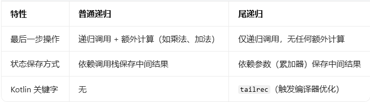

# Kotlin 语言基础

* 数据类型

  * 基础数据类型

    * 字符型 Char 2字节
    * 只能是单双引号引起来的
    * 不能是用隐形转换来进行计算，必须强制转换
    * 数字类型
    * 整形
      * 字节Byte 1字节
      * 短整型Short 2字节
      * 整形 Int 4字节
      * 长整型 Long 8字节 如果用类型推断，默认是int，如果你想要Long，在值的后面加上L
        * 太差的数字值可以用下划线分割
      * 无符号字节UByte
      * 无短整型UShort 2字节
      * 无整形 UInt 4字节
      * 无长整型 ULong 8字节
    * 浮点型 如果用类型推断，默认是Double，如果你想要Float，在值的后面加上F或f
      * 单精度浮点型 Float 4字节 保留6~7位小数
      * 双精度浮点型 Double 8字节 保留15~16位小数
    * 进制表示
      * 十六进制
        * 0x0F
      * 二进制
        * 0b00001011
      * kotlin不支持八进制
    * 布尔值 Boolean 值只能是 true或false

  * 复合数据类型

    * 字符串 String

    * 字符串比较

      ```
      val a = "zhangsan"
      val b = "Zhangsan"
      println(a == b)
      println(a.equals(b,true)) 第二个参数，true是忽略大小写，false是不忽略
      ==和equals的区别，就是equals有忽略大小写
      ```

  * 运算符

    * 算数运算符
      * +
      * -
      * *
      * /
      * %
    * 复合赋值运算符
      * +=
      * -=
      * \*=
      * /=
      * %=
    * 自增自减
      * 前自增自减
        * ++变量
        * --变量
      * 后自增自减
        * 变量++
        * 变量--
      * 区别
        * 前自增自减，先进性自增自减，后进行运算
        * 后自增自减，先进行运算，后进行自增自减
    * 比较运算符
      * \>
      * \<
      * \>=
      * \<=
      * ==
      * ===
        * ==和===的区别
          * ==是比较值
          * ===是比较对象
      * ！=
    * 位运算符
      * 有符号左移 shi
      * 有符号右移 shr
      * 无符号右移 ushr
      * 按位与 and
      * 按位或 or
      * 按位异或 xor
      * 按位取反 inv（）
    * 逻辑运算符
      * 逻辑与 &&
      * 逻辑或 ||
      * 逻辑非 ！

* 模板字符串
  * "$变量名 如果是表达式 ${表达式}"

* 注释
  * 单行注释 //
  * 多行注释 /**/
  * 文档注释/***/
    * 参数
      * @paran 形参
      * @return 返回值
      * @property 描述类的属性（适用于主构造函数参数、类属性）
      * @throws 描述函数可能抛出的异常（Kotlin 无检查异常，仅用于说明）
      * @see 引用其他相关的类 / 函数 / 属性（支持链接：`@see [sum]` 或 `@see java.lang.Math`）
      * @sample 代码示例
      * @author 标注作者
      * @since 标注代码新增的版本

* 变量
  * 声明变量
    * var 变量名：数据类型 = 值

* 常量
  * 声明常量
    * val 常量名 ： 数据类型 = 值

* 流程控制语句

  * if（）{}elseif（）{}else{}

  * 如果代码块中只有一行语句，那么大括号可以省略

  * 流程控制表达式

    * ```kotlin
      val a = 5
      val b = 6
      val text = if（a<b）a else b
      ```

  * when（值）{值->代码块 else->代码块}

* 区间

  * 区间 1 .. 100 默认闭区间
  * 左闭右开 1 until 100
  * 递减区间 5 downTO 1
  * 步长 step 值

* List和Map

  * 定义只读List
    * val 列表名 ： List<数据类型> = ListOf()
  * 定义可变List
    * val 列表名 ： MutableList<数据类型> = mutableListOf()
  * 定义只读Map
    * val 字典名 ： Map<数据类型，数据类型> = MapOf()
  * 定义可变List
    * val 字典名 ： MutableMap<数据类型，数据类型> =  mutableMapOf()

* 循环

  * for（i in 区间）{}
  * while（）{}
  * do {}while()
  * 标签跳转
    * 标签名@ 循环

* 异常处理

  * ```kotlin
    try {
    
    }catch (e : Exception){
    
    }finally {
        
    }
    ```

* 函数
  * 定义函数
    * fun 函数名 （形参： 数据类型 = 默认值）： 返回值类型 {函数体}
  * 调用函数 函数名 （实参）
  * 如果函数体只有一行那么可以省略返回值类型和大括号
    * fun 函数名 （形参： 数据类型 = 默认值） = 函数体
  * 函数表达式
    * val 变量 = {形参：数据类型，形参：数据类型 -> 返回值}

* 递归

  * 正常递归
    * 函数调用本身
  * 尾递归 
    * **函数的最后一步操作就是调用自身，且调用后没有任何额外计算**。
  * 区别
    * 

* 面向对象

  * 封装
    * 隐藏具体实现方法，暴露公共接口
  * 继承
    * 子类可以用父类的公共方法
  * 多态
    * 一个接口，多种实现

* 接口和抽象类？

  * 定义接口

    * ```kotlin
      interface 类名 {
          
      }
      ```

  * 定义抽象类

* 委托？

* 单例模式

  * ```kotlin
    object 类名 {
        
    }
    ```

* 枚举类

  * ```kotlin
    enum class 类名{
        值1,值2
    }
    ```

* 密封类 有限子类

  * ```kotlin
    sealed class 类名 {
        
    }
    ```

* DSL
* gradle 包管理器

